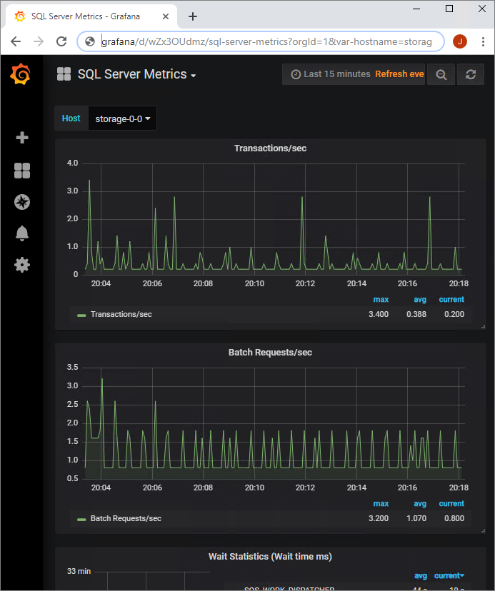

# Monitor cluster with azdata and Grafana Dashboard

This article describes how to monitor an application inside a SQL Server Big Data Cluster.

## Prerequisites

- [SQL Server 2019 big data cluster](deployment-guidance.md)
- [azdata command-line utility](deploy-install-azdata.md)

## Capabilities

In SQL Server 2019 you can create, delete, describe, initialize, list run and update your application. The following table describes the application deployment commands that you can use with **azdata**.

|Command |Description |
|:---|:---|
|`azdata bdc endpoint list` | Lists the endpoints for the Big Data Cluster. |


You can use the following example to list the endpoint of **Grafana dashboard**:

```bash
azdata bdc endpoint list --endpoint-name metricsui 
```

The output will give you the endpoint, which you can use your cluster username and password to log in. 


The `nodeMetricsUrl` and `sqlMetricsUrl` values link to a Grafana dashboard for monitoring Kubernetes node metrics and big data cluster service metrics:





## Next steps

You can check out additional samples at [App Deploy Samples](https://aka.ms/sql-app-deploy).

For more information about [!INCLUDE[big-data-clusters-2019](../includes/ssbigdataclusters-ss-nover.md)], see [What are [!INCLUDE[big-data-clusters-2019](../includes/ssbigdataclusters-ver15.md)]?](big-data-cluster-overview.md).
