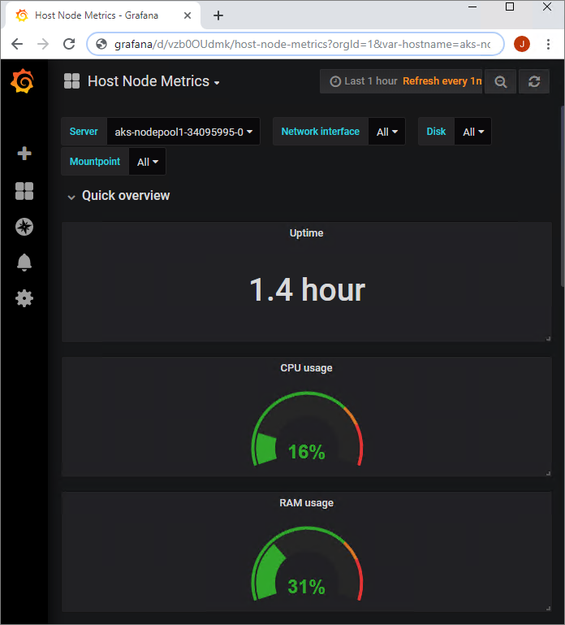

# Monitor cluster with azdata and Grafana Dashboard

This article describes how to monitor an application inside [!INCLUDE[ssbigdataclusters-ss-nover](../includes/ssbigdataclusters-ss-nover.md)]. SQL Server Big Data Cluster exposes Grafana Dashboard for monitoring, those metrics are stored in influxDB. Those metrics are categorized as either: 
- Kubernetes host-related metrics collected by Telegraf, an agent for collecting, processing, aggregating, and writing metrics.
- Workload-related metrics: those metrics related to SQL Server, Spark and HDFS are collected by CollectD, including such as SQL Server DMV metrics and [SQL server extended events (XEvents)](../relational-databases/extended-events/extended-events.md). 

> [!IMPORTANT]
> The Internet Explorer browser and older Microsoft Edge browsers are not compatible with Grafana, you must use a Chromium-based browser including Microsoft Edge. In Grafana, you will see a black page with errors when using an unsupported browser. See [supported browsers for Grafana](https://grafana.com/docs/grafana/latest/installation/requirements/#supported-web-browsers).

## Available metrics 

The following metrics are available in [!INCLUDE[ssbigdataclusters-ss-nover](../includes/ssbigdataclusters-ss-nover.md)]:

|Categories |Description | metrics |
|---|---|---|
|Hosted Node Metrics|Metrics related to Kubernetes host | CPU, RAM usage, Disk IOPS, Load averages, etc.   |
|Pods and Containers Metrics|Metrics related to Kubernetes pods and containers, Grafana  allows filtering those metrics by pods or even specific container. | CPU, RAM, Disk, and network usage.   |
|SQL Server Metrics|Metrics related to SQL Server | Transaction/sec, Batch Requests/sec, Database Activity, SQL Server Activity etc., in particular, when ContainerAG is enabled, you can also monitor the alwaysOn from here.   |
|Spark Metrics |Metrics related to Spark apps. | Executor hdfs writes, JVM GC time, JVM heap usage etc.   |
|Apps Metrics|Metrics related to the [Apps deployed](concept-application-deployment.md) on [!INCLUDE[ssbigdataclusters-ss-nover](../includes/ssbigdataclusters-ss-nover.md)], Grafana allows filtering those metrics by specific app and app version. | CPU, RAM, and HTTP requests status.   |

## Prerequisites

- [SQL Server 2019 Big Data Cluster](deployment-guidance.md)
- [azdata command-line utility](../azdata/install/deploy-install-azdata.md)

## Capabilities

In SQL Server 2019 you can create, delete, describe, initialize, list, run, and update your application. The following table describes the application deployment commands that you can use with **azdata**.

|Command |Description |
|:---|:---|
|`azdata bdc endpoint list` | Lists the endpoints for Big Data Cluster. |


You can use the following example to list the endpoint of **Grafana dashboard**:

```bash
azdata bdc endpoint list --endpoint-name metricsui 
```

The output will give you the endpoint, which you can use your cluster username and password to log in. 


The `nodeMetricsUrl` and `sqlMetricsUrl` values link to a Grafana dashboard for monitoring Kubernetes node metrics and big data cluster service metrics:




## Next steps

For more information about [!INCLUDE[ssbigdataclusters-ss-nover](../includes/ssbigdataclusters-ss-nover.md)], see [What are [!INCLUDE[big-data-clusters-2019](../includes/ssbigdataclusters-ver15.md)]?](big-data-cluster-overview.md).