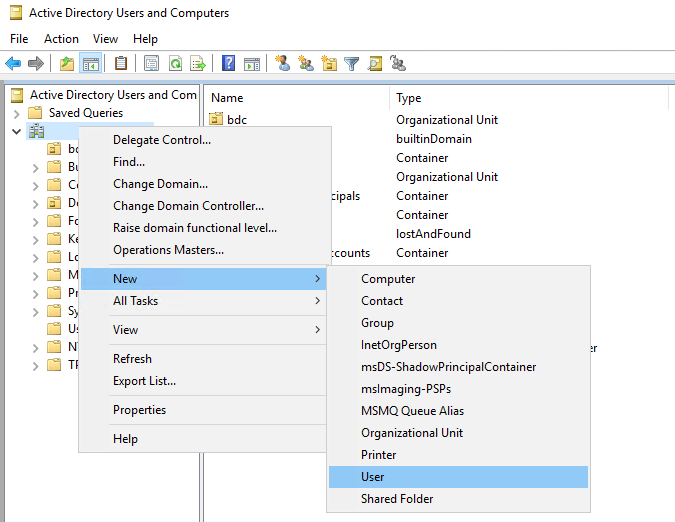
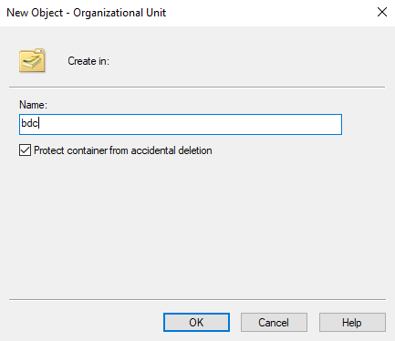
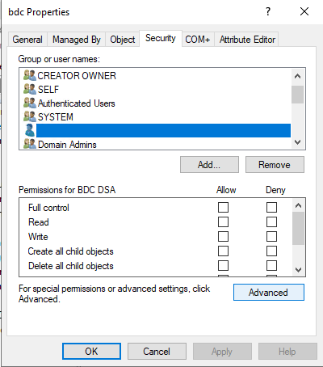
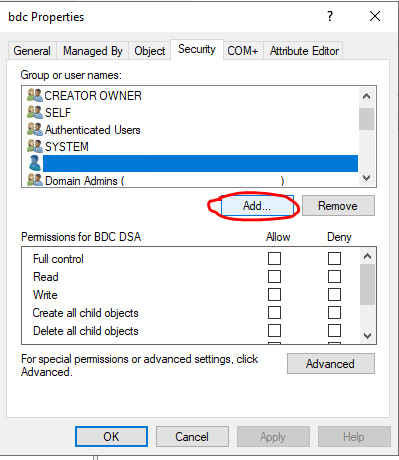
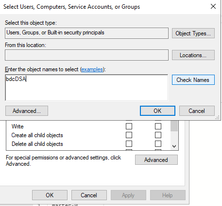
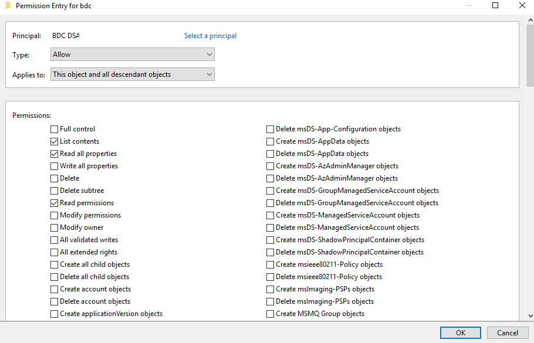
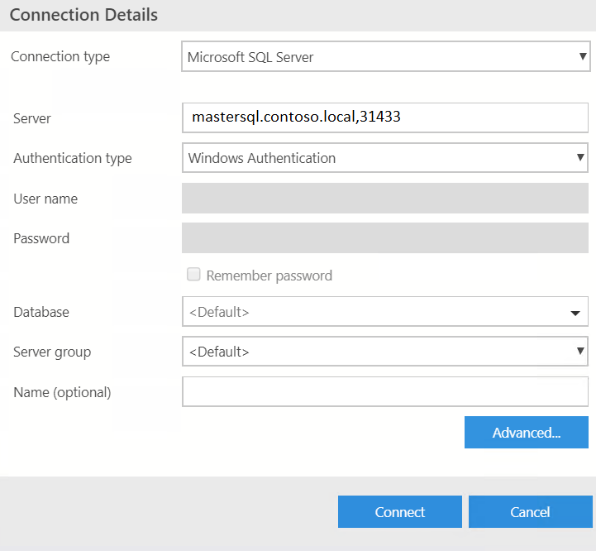

# Deploy [!INCLUDE[big-data-clusters-2019](../includes/ssbigdataclusters-ss-nover.md)] in Active Directory mode

[!INCLUDE[tsql-appliesto-ssver15-xxxx-xxxx-xxx](../includes/tsql-appliesto-ssver15-xxxx-xxxx-xxx.md)]

This document describes Deploy a SQL Server 2019 big data cluster (BDC) in the Active Directory
authentication mode, which will use an existing AD domain for authentication.

>[!Note]
>Before SQL Server 2019 CU5 release, there is a restriction in big data clusters so that only one cluster could be deployed against an Active Directory domain. This restriction is removed with the CU5 release, see [Deploy multiple clusters in a domain](deploy-multiple-active-directory.md) for details on the new capabilities. Examples in this article are adjusted to accommodate both deployment use cases.

## Background

To enable Active Directory (AD) authentication, the BDC automatically creates the users, groups, machine accounts, and service principal names (SPN) that the various services in the cluster need. To provide some containment of these accounts and allow scoping permissions, nominate an organizational unit (OU) during deployment, where all BDC-related AD objects will be created. Create this OU before cluster deployment.

To automatically create all the required objects in Active Directory, the BDC needs an AD account during deployment. This account needs to have permissions to create users, groups, and machine accounts inside the provided OU.

The steps below assume you already have an Active Directory domain controller. If you don't have a domain controller, the following [guide](https://social.technet.microsoft.com/wiki/contents/articles/37528.create-and-configure-active-directory-domain-controller-in-azure-windows-server.aspx) includes steps that can be helpful.

## Create AD objects

Do the following things before you deploy a BDC with AD integration:

1. Create an organizational unit (OU) where all BDC AD objects will be stored. You can also choose to nominate an existing OU upon deployment.
1. Create an AD account for BDC, or use an existing account, and provide this BDC AD account the right permissions.

### Create a user in AD for BDC domain service account

The big data cluster requires an account with specific permissions. Before you proceed, make sure that you have an existing AD account or create a new account, which the big data cluster can use to set up the necessary objects.

To create a new user in AD, you can right-click the domain or the OU and select **New** > **User**:



This user will be referred to as the *BDC domain service account* in this article.

### Creating an OU

On the domain controller, open **Active Directory Users and Computers**. On the left panel, right click the directory under which you want to create your OU and select New -\> **Organizational Unit**, then follow the prompts from the wizard to create the OU. Alternatively, you can create an OU with PowerShell:

```powershell
New-ADOrganizationalUnit -Name "<name>" -Path "<Distinguished name of the directory you wish to create the OU in>"
```

In the examples in this article, we are naming the OU: `bdc`




### Setting permissions the BDC AD account

Whether you have created a new AD user or using an existing AD user, there are certain permissions the user needs to have. This account is the user account that the BDC controller will use when joining the cluster to AD.

The BDC domain service account (DSA) needs to be able to create users, groups, and computer accounts in the OU. In the following steps, we have named the BDC domain service account `bdcDSA`. You can choose any name for this account.

1. On the domain controller, open **Active Directory Users and Computers**

1. In the left panel, navigate to your domain, then the OU which `bdc` will use

1. Right click the OU, and select **Properties**.

1. Go to the Security tab (Make sure that you have selected **Advanced Features** by right-clicking on the OU, and selecting **View**)

    

1. Click **Add...** and add the **bdcDSA** user

    

    

1. Select the **bdcDSA** user and clear all permissions, then click **Advanced**

1. Click **Add**

    

    - Click **Select a Principal**, insert **bdcDSA**, and click Ok

    - Set **Type** to **Allow**

    - Set **Applies To** to **This Object and all descendant objects**

        

    - Scroll down to the bottom, and click **Clear all**

    - Scroll back to the top, and select:
       - **Read all properties**
       - **write all properties**
       - **Create Computer objects**
       - **Delete Computer objects**
       - **Create Group objects**
       - **Delete Group objects**
       - **Create User objects**
       - **Delete User objects**

    - Click **OK**

- Click **Add**

    - Click **Select a Principal**, insert **bdcDSA**, and click Ok

    - Set **Type** to **Allow**

    - Set **Applies To** to **Descendant Computer objects**

    - Scroll down to the bottom, and click **Clear all**

    - Scroll back to the top, and select **Reset password**

    - Click **OK**

- Click **Add**

    - Click **Select a Principal**, insert **bdcDSA**, and click Ok

    - Set **Type** to **Allow**

    - Set **Applies To** to **Descendant User objects**

    - Scroll down to the bottom, and click **Clear all**

    - Scroll back to the top, and select **Reset password**

    - Click **OK**

- Click **OK** twice more to close open dialog boxes

## Prepare deployment

For deployment of BDC with AD integration, there is some additional information that needs to be provided for creating the BDC-related objects in AD.

By using the `kubeadm-prod` profile (or `openshift-prod` starting with CU5 release), you will automatically have the placeholders for the security-related information and endpoint-related information that is required for AD integration.

Furthermore, you need to provide credentials that [!INCLUDE[big-data-clusters](../includes/ssbigdataclusters-nover.md)] will use to create the necessary objects in AD. These credentials are provided as environment variables.

## Set security environment variables

The following environment variables are providing the credentials for the BDC domain service account, which will be used to set up the AD integration. This account is also used by BDC to maintain the BDC-related AD objects going forward.

```bash
export DOMAIN_SERVICE_ACCOUNT_USERNAME=<AD principal account name>
export DOMAIN_SERVICE_ACCOUNT_PASSWORD=<AD principal password>
```

## Provide security and endpoint parameters

In addition to environment variables for credentials, you also need to provide security and endpoint information for AD integration to work. The parameters needed are automatically part of the `kubeadm-prod`/`openshift-prod` [deployment profile](deployment-guidance.md#configfile).

AD integration requires the following parameters. Add these parameters to the `control.json` and `bdc.json` files using `config replace` commands shown further down in this article. All the examples below are using the example domain `contoso.local`.

- `security.activeDirectory.ouDistinguishedName`: distinguished name of an organizational unit (OU) where all AD accounts created by cluster deployment will be added. If the domain is called `contoso.local`, the OU distinguished name is: `OU=BDC,DC=contoso,DC=local`.

- `security.activeDirectory.dnsIpAddresses`: contains the list of domain’s DNS servers IP addresses. 

- `security.activeDirectory.domainControllerFullyQualifiedDns`: List of FQDN of domain controller. The FQDN contains the machine/host name of the domain controller. If you have multiple domain controllers, you can provide a list here. Example: `HOSTNAME.CONTOSO.LOCAL`

- `security.activeDirectory.realm` **Optional parameter**: In the majority of cases, the realm equals domain name. For cases where they are not the same, use this parameter to define name of realm (e.g. `CONTOSO.LOCAL`).

- `security.activeDirectory.domainDnsName`: Name of your domain (e.g. `contoso.local`).

- `security.activeDirectory.clusterAdmins`: This parameter takes one AD group. The AD group scope must be universal or domain global. Members of this group get administrator permissions in the cluster. This means that they have `sysadmin` permissions in SQL Server, superuser permissions in HDFS, and administrators in controller. 

  >[!IMPORTANT]
  >Create this group in AD before deployment begins. If the scope for this AD group is domain local deployment fails.

- `security.activeDirectory.clusterUsers`: List of the AD groups that are regular users (no administrator permissions) in the big data cluster. The list can include AD groups that are scoped as either universal or domain global groups. They can not be domain local groups.

  >[!IMPORTANT]
  >Create these groups in AD before deployment begins. If the scope for any of these AD groups is domain local deployment fails.

- `security.activeDirectory.appOwners` **Optional parameter**: List of AD groups who have permissions to create, delete, and run any application. The list can include AD groups that are scoped as either universal or domain global groups. They can not be domain local groups.

  >[!IMPORTANT]
  >Create these groups in AD before deployment begins. If the scope for any of these AD groups is domain local deployment fails.

- `security.activeDirectory.appReaders` **Optional parameter**: List of the AD groups who have permissions to run any application. The list can include AD groups that are scoped as either universal or domain global groups. They can not be domain local groups.

  >[!IMPORTANT]
  >Create these groups in AD before deployment begins. If the scope for any of these AD groups is domain local deployment fails.

- `security.activeDirectory.subdomain`: **Optional parameter** This parameter is introduced in SQL Server 2019 CU5 release to support deploying multiple big data clusters against the same domain. Using this setting, you can specify different DNS names for each of the big data cluster deployed. See [Deploy multiple clusters in a domain](deploy-multiple-active-directory.md) for more details regarding deploying multiple big data clusters in the same Active Directory domain. If the value of this parameter is not specified in the active directory section of the `control.json` file, by default, the big data cluster name (same as Kubernetes namespace name) will be used to compute the value of subdomain setting. 

  >[!NOTE]
  >The value passed through the subdomain setting is not a new AD domain but only a DNS domain.

  >[!IMPORTANT]
  >You need to install or upgrade latest version of **azdata CLI** as of SQL Server 2019 release to leverage these new capabilties and deploy multiple big data clusters in the same domain.

- `security.activeDirectory.accountPrefix`: **Optional parameter** This parameter is introduced in SQL Server 2019 CU5 release to support deploying multiple big data clusters against the same domain. 
These setting is used to guarantees uniqueness of the account names for various big data clusters services, that must differ between any two clusters. Customizing the account prefix name is optional, by default, the subdomain name is used as the account prefix. If the subdomain name is longer than the 12 characters, the initial 12-character substring of the subdomain name are used as account prefix.  

  >[!NOTE]
  > Active Directory requires the names to be limited to 20 characters. We allocate 2 characters for pod id, 4 characters for the static name in the middle, 2 hyphens – thus leaving us 12 characters as a limit for the account prefix.

[Check AD group scope](https://docs.microsoft.com/powershell/module/activedirectory/get-adgroup?view=winserver2012-ps&viewFallbackFrom=winserver2012r2-ps), to determine if it is DomainLocal.

If you have not already initialized the deployment configuration file, you can run this command to get a copy of the configuration. Examples below use the `kubeadm-prod` profile, same applies to `openshift-prod`.

```bash
azdata bdc config init --source kubeadm-prod  --target custom-prod-kubeadm
```

To set the above parameters in the `control.json` file, use the following `azdata` commands. The commands replace the config and provide your own values before deployment.

 > [!IMPORTANT]
 > In the SQL Server 2019 CU2 release, the structure of the security configuration section in the deployment profile changed sightly and all the Active Directory related settings are in the new *activeDirectory* in the json tree under *security* in the *control.json* file.

The example below is based on using SQL Server 2019 CU2. It shows how to replace the AD-related parameter values in deployment config. The domain details below are example values.

```bash
azdata bdc config replace -c custom-prod-kubeadm/control.json -j "$.security.activeDirectory.ouDistinguishedName=OU\=bdc\,DC\=contoso\,DC\=local"
azdata bdc config replace -c custom-prod-kubeadm/control.json -j "$.security.activeDirectory.dnsIpAddresses=[\"10.100.10.100\"]"
azdata bdc config replace -c custom-prod-kubeadm/control.json -j "$.security.activeDirectory.domainControllerFullyQualifiedDns=[\"HOSTNAME.CONTOSO.LOCAL\"]"
azdata bdc config replace -c custom-prod-kubeadm/control.json -j "$.security.activeDirectory.domainDnsName=contoso.local"
azdata bdc config replace -c custom-prod-kubeadm/control.json -j "$.security.activeDirectory.clusterAdmins=[\"bdcadminsgroup\"]"
azdata bdc config replace -c custom-prod-kubeadm/control.json -j "$.security.activeDirectory.clusterUsers=[\"bdcusersgroup\"]"
#Example for providing multiple clusterUser groups: [\"bdcusergroup1\",\"bdcusergroup2\"]
```

Optionaly, only starting SQL Server 2019 CU5 release, you can override the default values for the `subdomain` and `accountPrefix` settings.

```bash
azdata bdc config replace -c custom-prod-kubeadm/control.json -j "$.security.activeDirectory.subdomain=[\"bdctest\"]"
azdata bdc config replace -c custom-prod-kubeadm/control.json -j "$.security.activeDirectory.accountPrefix=[\"bdctest\"]"
```

Similarly, in releases before SQL Server 2019 CU2, you can run:

```bash
azdata bdc config replace -c custom-prod-kubeadm/control.json -j "$.security.ouDistinguishedName=OU\=bdc\,DC\=contoso\,DC\=local"
azdata bdc config replace -c custom-prod-kubeadm/control.json -j "$.security.dnsIpAddresses=[\"10.100.10.100\"]"
azdata bdc config replace -c custom-prod-kubeadm/control.json -j "$.security.domainControllerFullyQualifiedDns=[\"HOSTNAME.CONTOSO.LOCAL\"]"
azdata bdc config replace -c custom-prod-kubeadm/control.json -j "$.security.domainDnsName=contoso.local"
azdata bdc config replace -c custom-prod-kubeadm/control.json -j "$.security.clusterAdmins=[\"bdcadminsgroup\"]"
azdata bdc config replace -c custom-prod-kubeadm/control.json -j "$.security.clusterUsers=[\"bdcusersgroup\"]"
#Example for providing multiple clusterUser groups: [\"bdcusergroup1\",\"bdcusergroup2\"]
```

In addition to the above information, you also need to provide DNS names for the different cluster endpoints. The DNS entries using your provided DNS names will automatically be created in your DNS Server upon deployment. You will use these names when connecting to the different cluster endpoints. For example, if the DNS name for SQL master instance is `mastersql` and considering the subdomain will use the default value of the cluster name in *control.json*, you will either use `mastersql.contoso.local,31433` or `mastersql.mssql-cluster.contoso.local,31433`  (depending on the values you provided in the deployment configuration files for the endpoint DNS names) to connect to the master instance from the tools. 

```bash
# DNS names for BDC services
azdata bdc config replace -c custom-prod-kubeadm/control.json -j "$.spec.endpoints[0].dnsName=<controller DNS name>.contoso.local"
azdata bdc config replace -c custom-prod-kubeadm/control.json -j "$.spec.endpoints[1].dnsName=<monitoring services DNS name>.<Domain name. e.g. contoso.local>"
azdata bdc config replace -c custom-prod-kubeadm/bdc.json -j "$.spec.resources.master.spec.endpoints[0].dnsName=<SQL Master Primary DNS name>.<Domain name. e.g. contoso.local>"
azdata bdc config replace -c custom-prod-kubeadm/bdc.json -j "$.spec.resources.master.spec.endpoints[1].dnsName=<SQL Master Secondary DNS name>.<Domain name. e.g. contoso.local>"
azdata bdc config replace -c custom-prod-kubeadm/bdc.json -j "$.spec.resources.gateway.spec.endpoints[0].dnsName=<Gateway (Knox) DNS name>.<Domain name. e.g. contoso.local>"
azdata bdc config replace -c custom-prod-kubeadm/bdc.json -j "$.spec.resources.appproxy.spec.endpoints[0].dnsName=<app proxy DNS name>.<Domain name. e.g. contoso.local>"
```

Optionally, you can include the `subdomain` in the DNS name provided for the endpoints configuration. For example:

```bash
# DNS names for BDC services
azdata bdc config replace -c custom-prod-kubeadm/control.json -j "$.spec.endpoints[0].dnsName=<controller DNS name>.<subdomain e.g. mssql-cluster>.contoso.local"
```

> [!IMPORTANT]
> Above example assume you are deploying a big data cluster as of SQL Server CU5 release. If you have an existing cluster deployed before this release or if you are deploying a new cluster with an pre-CU5 Docker image tag, you should not include the `subdomain` portion in the DNS names values provided for each service. E.g.:

```bash
# DNS names for BDC services for a cluster deployed before CU5 release can not include the subdomain value
azdata bdc config replace -c custom-prod-kubeadm/control.json -j "$.spec.endpoints[0].dnsName=<controller DNS name>.contoso.local"
```

You can find an example script here for [deploying a SQL Server big data cluster on single node Kubernetes cluster (kubeadm) with AD integration](https://github.com/microsoft/sql-server-samples/tree/master/samples/features/sql-big-data-cluster/deployment/kubeadm/ubuntu-single-node-vm-ad).

> [!Note]
> There might be scenarios where you can't accommodate the newly introduced `subdomain` parameter. For example you must deploy an a pre-CU5 release and you already upgraded **azdata CLI**, or you are deploying a new cluster using the latest CU5 release, but can't modify an already existing application connection string or the DNS names. This is highly unlikely, but if you need to revert to the pre-CU5 behavior, you can set `useSubdomain` parameter to `false` in the active directory section of `control.json`.  Here is the command to do so:

```bash
azdata bdc config replace -c custom-prod-kubeadm/control.json -j "$.security.activeDirectory.useSubdomain=false"
```

You should now have set all the required parameters for a deployment of BDC with Active Directory integration.

You can now deploy the BDC cluster integrated with Active Directory using the `azdata` command and the kubeadm-prod deployment profile. For full documentation of how to deploy [!INCLUDE[big-data-clusters](../includes/ssbigdataclusters-nover.md)], please visit the [How to deploy SQL Server Big Data Clusters on Kubernetes](deployment-guidance.md).

## Verify reverse DNS entry for domain controller

Make sure that there is a reverse DNS entry (PTR record) for the domain controller itself, registered in the DNS server. You can verify this by running `nslookup` of the domain name on the domain controller, to see that it can be resolved to the domain controller IP address.

## Connect to cluster endpoints in AD mode

Log in to SQL Server master instance with AD Auth.

To verify AD connections to the SQL Server instance, connect to the SQL master instance with `sqlcmd`. Logins are automatically be created for the provided groups upon deployment (`clusterUsers` and `clusterAdmins`).

If you are using Linux, first run `kinit` as the AD user, then run `sqlcmd`. If you are using Windows, simply log in as your desired user from a **domain joined client machine**.

### Connect to master instance from Linux/Mac

```bash
kinit <username>@<domain name>
sqlcmd -S <DNS name for master instance>,31433 -E
```

### Connect to master instance from Windows

```cmd
sqlcmd -S <DNS name for master instance>,31433 -E
```

### Log in to SQL Server master instance using Azure Data Studio or SSMS

From a domain joined client, you can open SSMS or Azure Data Studio and connect to the master instance. This is the same experience as connecting to any SQL Server instance using AD authentication.

From SSMS:


From Azure Data Studio:

}

### Log in to controller with AD authentication

#### Connect to controller with AD authentication from Linux/Mac

You can connect to the controller endpoint using `azdata` and AD authentication.

```bash
kinit <username>@<domain name>
azdata login -e https://<controller DNS name>:30080 --auth ad
```

#### Connect to controller with AD authentication from Windows

```cmd
azdata login -e https://<controller DNS name>:30080 --auth ad
```

### Use AD authentication to Knox gateway (webHDFS)

You can also issue HDFS commands using curl through the Knox gateway endpoint. That requires AD authentication to Knox. The below curl command issues a webHDFS REST call through the Knox gateway to create a directory called `products`

```bash
curl -k -v --negotiate -u : https://<Gateway DNS name>:30443/gateway/default/webhdfs/v1/products?op=MKDIRS -X PUT
```

## Known issues and limitations

**Limitations to be aware of in this release:**

- Currently, the Log Search Dashboard and Metrics Dashboard do not support AD authentication. AD support for this endpoint is planned for a future release. Basic username and password set upon deployment can be used for authentication to these dashboards. All other cluster endpoint support AD authentication.

- The secure AD mode will only work on `kubeadm` and `openshift` deployment environments and not on AKS or ARO right now. The `kubeadm-prod` and `openshift-prod` deployment profiles includes the security sections by default.

- Before SQL Server 2019 CU5 release, only one BDC per domain (Active Directory) is allowed. Enabling multiple BDCs per domain is available starting with CU5 release.

- None of the AD groups specified in security configurations can be DomainLocal scoped. You can check the scope of an AD group by following [these instructions](https://docs.microsoft.com/powershell/module/activedirectory/get-adgroup?view=winserver2012-ps&viewFallbackFrom=winserver2012r2-ps).

- AD account that can be used to login into BDC are allowed from the same domain that was configured for BDC. Enabling logins from other trusted domain is not supported.
