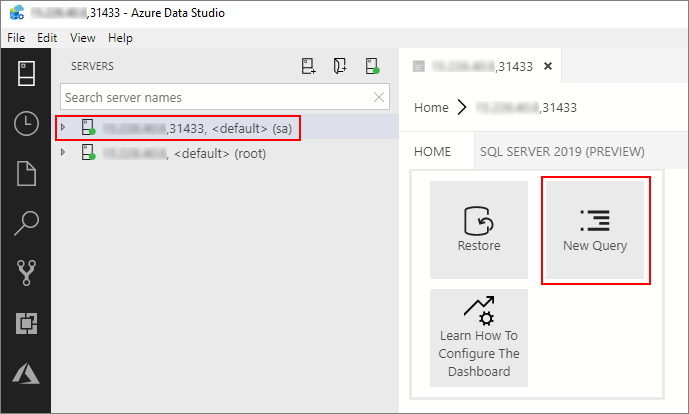

# SQL Server Big Data Clusters transparent data encryption (TDE) at rest usage guide

[!INCLUDE[SQL Server 2019](../includes/applies-to-version/sqlserver2019.md)]

This guide demonstrates how to use encryption at rest capabilities of [!INCLUDE[ssbigdataclusters-ss-nover](../includes/ssbigdataclusters-ss-nover.md)] to encrypt databases.

The configuration experience for the DBA when configuring SQL Server transparent data encryption is the same SQL Server on Linux and [standard TDE documentation](../relational-databases/security/encryption/transparent-data-encryption.md) applies except where noted. In order to monitor status of encryption on master, follow standard DMV query patterns on top of [sys.dm_database_encryption_keys](../relational-databases/system-dynamic-management-views/sys-dm-database-encryption-keys-transact-sql.md) and [sys.certificates](../relational-databases/system-catalog-views/sys-certificates-transact-sql.md).

__Unsupported features:__
* Data pool encryption

## <a id="prereqs"></a> Prerequisites

<<<<<<< HEAD
- [SQL Server 2019 CU8+ Big Data Cluster](release-notes-big-data-cluster.md)
- [Big data tools](deploy-big-data-tools.md), specifically **Azure Data Studio**
- SQL Server login with administrative privileges (a member of the SQL Server sysadmin role on the master instance)
=======
- [SQL Server Big Data Cluster CU8+](release-notes-big-data-cluster.md)
- [Big data tools](deploy-big-data-tools.md)
   - **Azure Data Studio**
- SQL Server user with administrative privileges (sysadmin role).
>>>>>>> 70bd453030a4cd375317418570e27df1ddb5f65b

## Query the installed certificates

1. In Azure Data Studio, connect to the SQL Server master instance of your big data cluster. For more information, see [Connect to the SQL Server master instance](connect-to-big-data-cluster.md#master).

1. Double-click on the connection in the **Servers** window to show the server dashboard for the SQL Server master instance. Select **New Query**.

   

1. Run the following Transact-SQL command to change the context to the `master` database in the master instance.

   ```sql
   USE master;
   GO
   ```

1. Query the installed system-managed certificates. 

   ```sql
    SELECT TOP 1 name FROM sys.certificates WHERE name LIKE 'TDECertificate%' ORDER BY name DESC;
   ```

    Use different query criteria as needed.

    The certificate name will be listed as "TDECertificate{timestamp}". When you see a prefix of TDECertificate and followed by timestamp, this is the certificate provided by the system-managed feature.

## Encrypt a database using the system-managed certificate

In the following examples consider a database named __userdb__ as the target for encryption and a system-managed certificate named __TDECertificate2020_09_15_22_46_27__, per output of previous section.

1. Use the following pattern to generate a database encryption key using the provided system certificate.

   ```sql
    USE userdb; 
    GO
    CREATE DATABASE ENCRYPTION KEY WITH ALGORITHM = AES_256 ENCRYPTION BY SERVER CERTIFICATE TDECertificate2020_09_15_22_46_27;
    GO
   ```

1. Encrypt database __userdb__ with the following command.

   ```sql
    ALTER DATABASE userdb SET ENCRYPTION ON;
    GO
   ```

## Manage database encryption when using external providers

For more information on the way key versions are used on [!INCLUDE[ssbigdataclusters-ss-nover](../includes/ssbigdataclusters-ss-nover.md)] encryption at rest, see [Key Versions in [!INCLUDE[big-data-clusters-2019](../includes/ssbigdataclusters-ss-nover.md)]](big-data-cluster-key-versions.md). The section "Main key rotation for SQL Server" contains an end-to-end example on how to manage database encryption when using external key providers.

## Next steps

Learn about encryption at rest for HDFS:
> [!div class="nextstepaction"]
> [HDFS Encryption Zones](encryption-at-rest-hdfs-encryption-zones.md)
