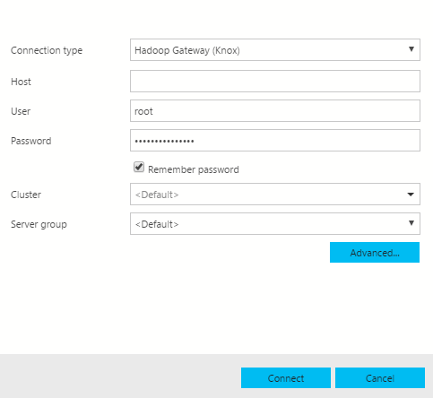
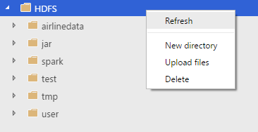

# Quickstart: Run Jupypter Notebooks on SQL Server vNext

This quickstart illustrates how you can launch Jupyter Notebooks on the cluster and start authoring your own Notebooks. It also shows how to submit jobs against the cluster.

## Connect to the Hadoop Gateway Knox end point

You can connect to different end-points in the cluster. You can connect to the Microsoft SQL Server connection type or to the Hadoop Gateway (Knox) end-point in the cluster. The Knox endpoint is exposed through a Kubernetes service called **service-security-lb**.


In [!INCLUDE [SQL Operations Studio](../includes/name-sos-short.md)], press **F1** -> **New Connection** and you can connect to your Hadoop Gateway (Knox) end-point.



> [!TIP]
> For now, the login is **root** and the password is **root-password**.

## Browse HDFS

Once you connect you will be able to browse your HDFS folder. WebHDFS is started when the deployment is completed, and you will be able to **Refresh**, add **New Directory**, **Upload** files and **Delete**.



These simple operations let you bring your own data into HDFS.

> [!IMPORTANT]
> HDFS refresh does not work by default and is something which the user needs to do.
 
## Launch new Notebooks

You can right-click and Manage on the Hadoop Gateway connection and this will launch the dashboard from where you can click on the **New Jupyter Notebook** task.

Please provide a name of your Notebook (Example: Test.ipynb) and click Save.

## Python installation

We are using Jupyter Notebooks and we need a Python environment to install virtualenv and install Jupyter in that virtualenv.

If you have Python installed, please ensure that for Windows machines you don't have anything beyond version 3.6.6 installed (the latest is 3.7.0). On Mac and Linux machines, please use the Python 2.7.0 version and do not use any updated version. We will try to auto detect the Python environment and install virtualenv and Jupyter but if we cannot find your Python installation, please provide the path to your Python binary in the requested potion of the page.

If you do not have Python installed, on Windows machines, you will be prompted to **Download the latest version of Python** link. Please don't download Python version 3.6.6 for your respective OS. Please ensure that you select the **Add Python 3.6.6 to PATH** option during the installations.

> [!NOTE]
> Please note the following known issues:
>
> - Jupyter Notebook is not supported on Linux environments.
> - Please don't click on the Install Jupyter button.
> - Jupyter notebook setup is incompatible with Python 3.7 & pip 10.0.

Once you install Python, please re-start [!INCLUDE [SQL Operations Studio](../includes/name-sos-short.md)] as it will need to set your PATH environment variable. Connect to your Hadoop Gateway (Knox) endpoint and then try to launch **New Jupyter Notebook** task from your dashboard.

> [!IMPORTANT]
> If you decide to uninstall a previous old version of Python and install a new version not exceeding version 3.6.6 then please make sure you restart your machine to re-set the PATH environment variable and then restart Ops Studio.

> [!NOTE]
> If you have closed Ops Studio and you are trying to open your existing Notebook, then we default it to the Local Python Kernel and there is no ability to switch Kernels. This is an item we will be working on.

## Virtual env and Jupyter installation

The "New Jupyter Notebook" task will prompt you for naming your Notebook, provide the name as say "HelloWorld.ipynb" and click Save. This will now Install VirtualEnv and will Install Jupyter and this can take up to few minutes for everything to be installed. Once everything is installed you should be able to Start Notebook by clicking the button as shown in the following screenshot:


This will launch the **HelloWorld.ipynb** Jupyter Notebook.

## Supported kernels and attach to context

In our Jupyter Installation we support the PySpark and Spark, Spark Magic kernels which would allow users to write Python and Scala code using Spark. We also allow users to choose Python for their local development purposes.


When you select one of these kernels we will install that kernel in the virtual environment and you can start writing code in the supported language.

| Kernel         | Description                                                   |
| -------------- | ------------------------------------------------------------- |
| PySpark Kernel | For writing Python code using Spark compute from the cluster. |
| Spark Kernel   | For writing Scala code using Spark compute from the cluster.  |
| Python Kernel  | For writing Python code for local development.                |

The Attach to provides the context for the Kernel to attach. When you are connected to the Hadoop Gateway (Knox) end-point the default Attach to will be that end-point of the cluster.


## Helo world in the different contexts

### Pyspark kernel

Choose the PySpark Kernel and in the cell type in the following code:

```python
print("Hello, World !")
```

Click Run and you should see the Spark Application being started and you will see the following output:

```
Hello, World !.
```

The code should look something similar to the following image.


### Spark kernel

Choose the Spark Kernel in the drop down for the kernels and in the cell type/paste in –

```
object HelloWorld {
  def main(args: Array[String]): Unit = {
    println("Hello, world!")
  }
}
```

Click **Run** and you should see the Spark Application being started and this will create the Sparksession as **spark** and will define the **HelloWorld** object.

The Notebook should look similar to the following image.


Once you define the object then in the next Notebook cell type in the following code:

```
HelloWorld.main(Array())
```

Click **Run** in the Notebook menu and you should see the "Hello, world!" in the output.

### Local python kernel

Choose the local Python Kernel and in the cell type in –

```python
print("Hello, World !")
```

This should simply output `Hello, World !`.

### Manage Packages

One of the things we optimized for local Python development was to include the ability to install packages which customers would need for their scenarios. By default, we include the common packages like pandas, numpy etc., but if you are expecting a package which is not included then write the following code in the Notebook cell

```python
import <package-name>
```

Run this command. You will be getting a Module not Found error. If your package exists, then you will not get this error.

If you find a Module not Found error, then please click on the Manage Packages and this will launch the terminal with the path for your Virtualenv identified and will let you install packages locally. Please use the following command to install the packages -

```
./pip install <package-name>
```

Once the package is installed, you should be able to go in the Notebook cell and type in

```python
import <package-name>
```

and Run the cell and you should no longer get the Module not found error.

If you like to uninstall a package, then please use the following command from your terminal -

```
./pip uninstall <package-name>
```

### Known Issues

- If you are experiencing any issues with the kernels please consider to click the Stop Notebook button and re-start the Notebook.

- Manage Packages only work for Local Python Kernels, it does not work for any other kernels.

## Next steps

For more information about using Notebooks in [!INCLUDE [SQL Operations Studio](../includes/name-sos-short.md)], see [How to use Jupyter notebooks in SQL Server vNext](notebooks-guidance.md).