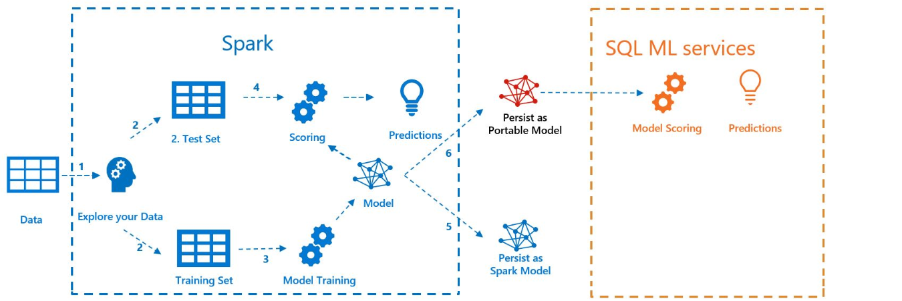
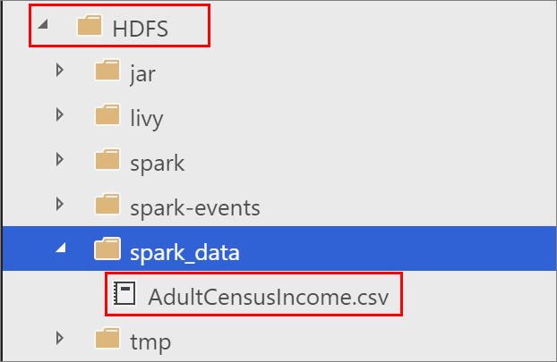

# Create, export, and score Spark machine learning models on SQL Server big data clusters

The following sample shows how to build a model with [Spark ML](https://spark.apache.org/docs/latest/ml-guide.html), export the model to [MLeap](http://mleap-docs.combust.ml/), and score the model in SQL Server with its [Java Language Extension](../language-extensions/language-extensions-overview.md). This is done in the context of a SQL Server 2019 big data cluster.

The following diagram illustrates the work performed in this sample:



## Prerequisites

- A [SQL Server big data cluster](deploy-get-started.md).

- [Azure Data Studio](../azure-data-studio/download.md).

All files for this sample are located at [https://github.com/microsoft/sql-server-samples/tree/master/samples/features/sql-big-data-cluster/spark/sparkml](https://github.com/microsoft/sql-server-samples/tree/master/samples/features/sql-big-data-cluster/spark/sparkml).

## Model training with Spark ML

In this sample code, AdultCensusIncome.csv is used to build a Spark ML pipeline model.  We can [download the dataset from internet](mleap_sql_test/setup.sh#L11) and [put it on HDFS on a SQL BDC cluster](mleap_sql_test/setup.sh#L12) so that it can be accessed by Spark.

The data is first [read into Spark](mleap_sql_test/mleap_pyspark.py#L25) and [split into training and testing datasets](mleap_sql_test/mleap_pyspark.py#L64).  We then [train a pipeline mode with the training data](mleap_sql_test/mleap_pyspark.py#L87) and [export the model to a mleap bundle](mleap_sql_test/mleap_pyspark.py#L204).

An equivalent Jupyter notebook is also included [here](train_score_export_ml_models_with_spark.ipynb) if it is preferred over pure Python code.

## Model scoring with SQL Server

Now that we have the Spark ML pipeline model in a common serialization [MLeap bundle](http://mleap-docs.combust.ml/core-concepts/mleap-bundles.html) format, we can score the model in Java without the presence of Spark.  

In order to score the model in SQL Server with its [Java Language Extension](https://docs.microsoft.com/en-us/sql/language-extensions/language-extensions-overview?view=sqlallproducts-allversions), we need first build a Java application that can load the model into Java and score it.  The [mssql-mleap-app folder](mssql-mleap-app/build.sbt) shows how that can be done.

Then in T-SQL we can [call the Java application and score the model with some database table](mleap_sql_test/mleap_sql_tests.py#L101).

## Create the target database

1. Open Azure Data Studio, and [connect to the SQL Server master instance of your big data cluster](connect-to-big-data-cluster.md).

1. Create a new query, and run the following command to create a sample database named **MyTestDatabase**.

   ```sql
   Create DATABASE MyTestDatabase
   GO
   ```

## Load sample data into HDFS

1. Download [AdultCensusIncome.csv](https://amldockerdatasets.azureedge.net/AdultCensusIncome.csv) to your local machine.

1. In Azure Data Studio, right-click on the HDFS folder in your big data cluster, and select **New directory**. Name the directory **spark_data**.

1. Right click on the **spark_data** directory, and select **Upload files**. Upload the **AdultCensusIncome.csv** file.

   

## Run the sample notebook

To demonstrate the use of the MSSQL Spark Connector with this data, you can download a sample notebook, open it in Azure Data Studio, and run each code block. For more information about working with notebooks, see [How to use notebooks in SQL Server 2019 preview](notebooks-guidance.md).

1. From a PowerShell or bash command line, run the following command to download the **mssql_spark_connector.ipynb** sample notebook:

   ```PowerShell
   curl -o mssql_spark_connector.ipynb "https://raw.githubusercontent.com/Microsoft/sql-server-samples/master/samples/features/sql-big-data-cluster/spark/spark_to_sql/mssql_spark_connector.ipynb"
   ```

1. In Azure Data Studio, open the sample notebook file. Verify that it is connected to your HDFS/Spark Gateway for your big data cluster.

1. Run each code cell in the sample to see usage of MSSQL Spark connector.

## Next steps

For more information about big data clusters, see [How to deploy SQL Server big data clusters on Kubernetes](deployment-guidance.md)