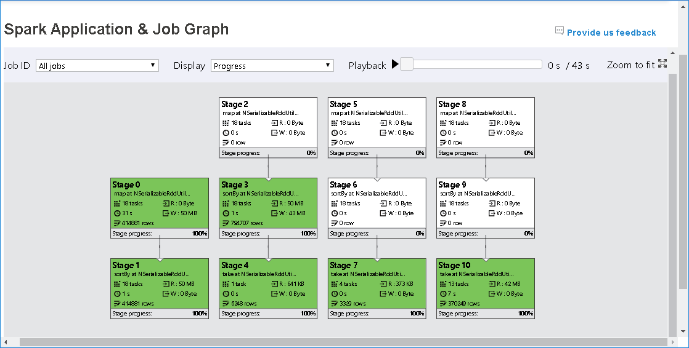
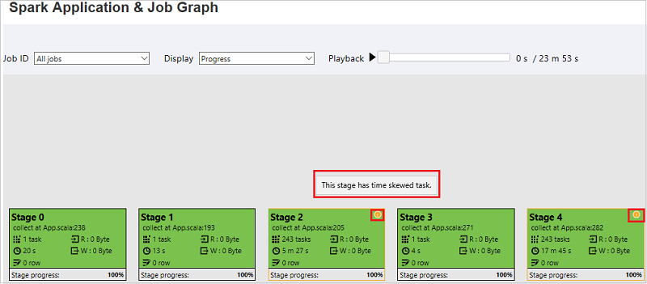
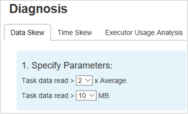
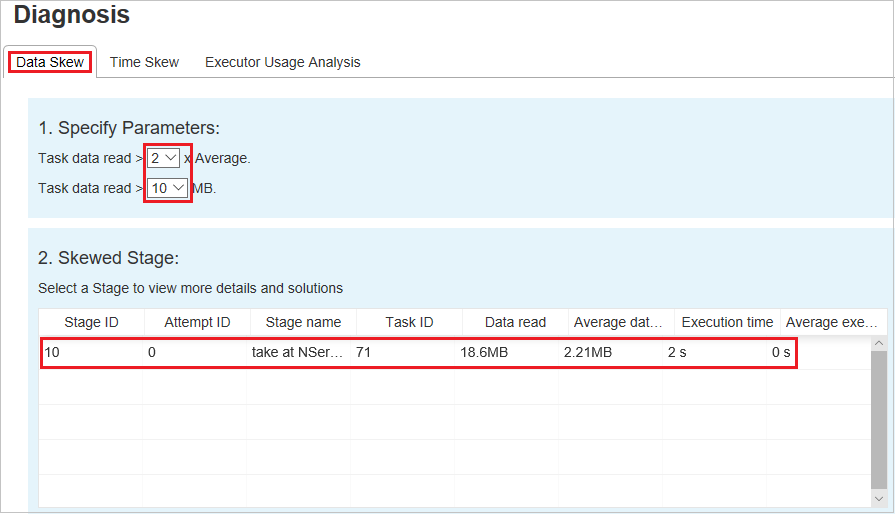

# Debug and Diagnose Spark Applications on [!INCLUDE[big-data-clusters-2019](../includes/ssbigdataclusters-ss-nover.md)] in Spark History Server

[!INCLUDE[SQL Server 2019](../includes/applies-to-version/sqlserver2019.md)]

This article provides guidance on how to use extended Spark History Server to debug and diagnose Spark applications in a SQL Server Big Data Cluster. These debug and diagnosis capabilities are built into Spark History Server and powered by Microsoft. The extension includes data tab and graph tab and diagnosis tab. In data tab, users can check the input and output data of the Spark job. In graph tab, users can check the data flow and replay the job graph. In diagnosis tab, user can refer to Data skew, Time skew, and Executor Usage analysis.

## Get access to Spark History Server

The Spark history server user experience from open source is enhanced with information, which includes job-specific data and interactive visualization of job graph and data flows for big data cluster. 

### Open the Spark History Server Web UI by URL
Open the Spark History Server by browsing to the following URL, replace `<Ipaddress>` and `<Port>` with big data cluster specific information. On clusters deployed prior to SQL Server 2019 CU 5, with basic authentication (username/password) big data cluster setup, you must provide user **root** when prompted to login to gateway (Knox) endpoints. See [Deploy SQL Server big data cluster](quickstart-big-data-cluster-deploy.md). [!INCLUDE [big-data-cluster-root-user](../includes/big-data-cluster-root-user.md)]

```
https://<Ipaddress>:<Port>/gateway/default/sparkhistory
```

The Spark History Server web UI looks like:


## Data tab in Spark History Server
Select job ID then click **Data** on the tool menu to get the data view.

+ Check the **Inputs**, **Outputs**, and **Table Operations** by selecting the tabs separately.

    

+ Copy all rows by clicking button **Copy**.

    

+ Save all data as CSV file by clicking button **csv**.

    

+ Search by entering keywords in field **Search**, the search result will display immediately.

    

+ Click the column header to sort table, click the plus sign to expand a row to show more details, or click the minus sign to collapse a row.

    

+ Download single file by clicking button **Partial Download** that place at the right, then the selected file is downloaded to local place. If the file does not exist any more, it will open a new tab to show the error messages.

    

+ Copy full path or relative path by selecting the **Copy Full Path**, **Copy Relative Path** that expands from download menu. For azure data lake storage files, **Open in Azure Storage Explorer** will launch Azure Storage Explorer. And locate to the exact folder when signing in.

    

+ Click the number below the table to navigate pages when too many rows to display in one page. 

    

+ Hover on the question mark beside Data to show the tooltip, or click the question mark to get more information.

    

+ Send feedback with issues by clicking **Provide us feedback**.

    

## Graph tab in Spark History Server

Select job ID then click **Graph** on the tool menu to get the job graph view.

+ Check overview of your job by the generated job graph. 

+ By default, it will show all jobs, and it could be filtered by **Job ID**.

    

+ We leave **Progress** as default value. User can check  data flow by selecting **Read** or **Written** in the dropdown list of **Display**.

    

    The graph node display in color that shows the heatmap.

    

+ Play back the job by clicking the **Playback** button and stop anytime by clicking the stop button. The task display in color to show different status when playing back:

    + Green for succeeded: The job has completed successfully.
    + Orange for retried: Instances of tasks that failed but do not affect the final result of the job. These tasks had duplicate or retry instances that may succeed later.
    + Blue for running: The task is running.
    + White for waiting or skipped: The task is waiting to run, or the stage has skipped.
    + Red for failed: The task has failed.

    
 
    The skipped stage display in white.
    

    
 
    > [!NOTE]
    > Playback for each job is allowed. For incomplete job, playback is not supported.


+ Mouse scrolls to zoom in/out the job graph, or click **Zoom to fit** to make it fit to screen.
 
    

+ Hover on graph node to see the tooltip when there are failed tasks, and click on stage to open stage page.

    

+ In job graph tab, stages will have tooltip and small icon displayed if they have tasks meet the below conditions:
    + Data skew: data read size > average data read size of all tasks inside this stage * 2 and data read size > 10 MB
    + Time skew: execution time > average execution time of all tasks inside this stage * 2 and execution time > 2 mins

    

+ The job graph node will display the following information of each stage:
    + ID.
    + Name or description.
    + Total task number.
    + Data read: the sums of input size and shuffle read size.
    + Data write: the sums of output size and shuffle write size.
    + Execution time: the time between start time of the first attempt and completion time of the last attempt.
    + Row count: the sum of input records, output records, shuffle read records and shuffle write records.
    + Progress.

    > [!NOTE]
    > By default, the job graph node will display information from last attempt of each stage (except for stage execution time), but during playback graph node will show information of each attempt.

    > [!NOTE]
    > For data size of read and write we use 1MB = 1000 KB = 1000 * 1000 Bytes.

+ Send feedback with issues by clicking **Provide us feedback**.

    


## Diagnosis tab in Spark History Server
Select job ID then click **Diagnosis** on the tool menu to get the job Diagnosis view. The diagnosis tab includes **Data Skew**, **Time Skew**, and **Executor Usage Analysis**.
    
+ Check the **Data Skew**, **Time Skew**, and **Executor Usage Analysis** by selecting the tabs respectively.

    

### Data Skew
Click **Data Skew** tab, the corresponding skewed tasks are displayed based on the specified parameters. 

+ **Specify Parameters** - The first section displays the parameters, which are used to detect Data Skew. The built-in rule is: Task Data Read is greater than three times of the average task data read, and the task data read is more than 10 MB. If you want to define your own rule for skewed tasks, you can choose your parameters, the **Skewed Stage**, and **Skew Char** section will be refreshed accordingly. 

+ **Skewed Stage** - The second section displays stages, which have skewed tasks meeting the criteria specified above. If there is more than one skewed task in a stage, the skewed stage table only displays the most skewed task (for example, the largest data for data skew). 

    

+ **Skew Chart** - When a row in the skew stage table is selected, the skew chart displays more task distributions details based on data read and execution time. The skewed tasks are marked in red and the normal tasks are marked in blue. For performance consideration, the chart only displays up to 100 sample tasks. The task details are displayed in right bottom panel.

    

### Time Skew
The **Time Skew** tab displays skewed tasks based on task execution time. 

+ **Specify Parameters** - The first section displays the parameters, which are used to detect Time Skew. The default criteria to detect time skew is: task execution time is greater than three times of average execution time and task execution time is greater than 30 seconds. You can change the parameters based on your needs. The **Skewed Stage** and **Skew Chart** display the corresponding stages and tasks information just like the **Data Skew** tab above.

+ Click **Time Skew**, then filtered result is displayed in **Skewed Stage** section according to the parameters set in section **Specify Parameters**. Click one item in **Skewed Stage** section, then the corresponding chart is drafted in section3, and the task details are displayed in right bottom panel.

    

### Executor Usage Analysis
The Executor Usage Graph visualizes the Spark job actual executor allocation and running status.  

+ Click **Executor Usage Analysis**, then we draft four types curves about executor usage. They include **Allocated Executors**, **Running Executors**, **idle Executors**, and **Max Executor Instances**. Regarding allocated executors, each "Executor added" or "Executor removed" event will increase or decrease the allocated executors. You can check "Event Timeline" in the "Jobs" tab for more comparison.

    

+ Click the color icon to select or unselect the corresponding content in all drafts.

    
    
## Spark / Yarn Logs
In addition to the Spark History Server, you can find the logs for Spark and Yarn here, respectively:
* Spark Event logs: hdfs:///system/spark-events
* Yarn logs: hdfs:///tmp/logs/root/logs-tfile

Note: Both of these logs have a default retention period of 7 days. If you want to change retention period, see the [Configure Apache Spark and Apache Hadoop](configure-spark-hdfs.md) page. Location **cannot** be changed.

## Known issues
The Spark History Server has the following known issues:

+ Currently, it only works for Spark 3.1 cluster (CU13+) and Spark 2.4 (CU12-).

+ Input/output data using RDD will not be shown in Data tab.

## Next steps

* [Get started with SQL Server Big Data Clusters](./deploy-get-started.md)
* Configure Spark settings
* [Configure Spark settings](/azure/hdinsight/spark/apache-spark-settings/)