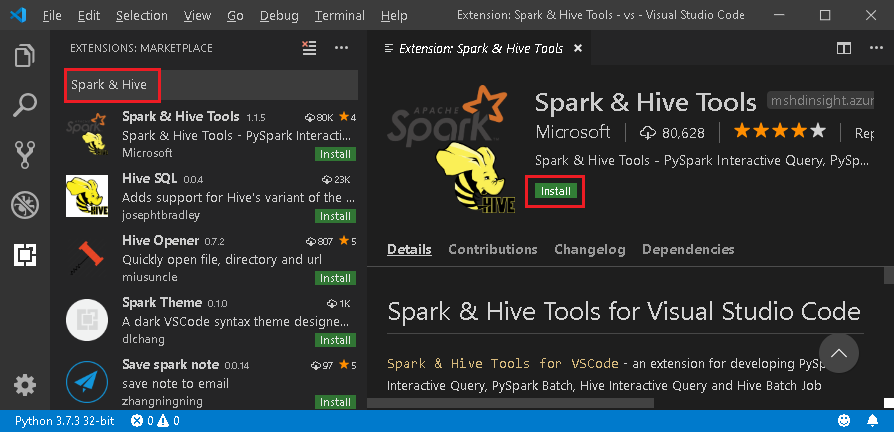
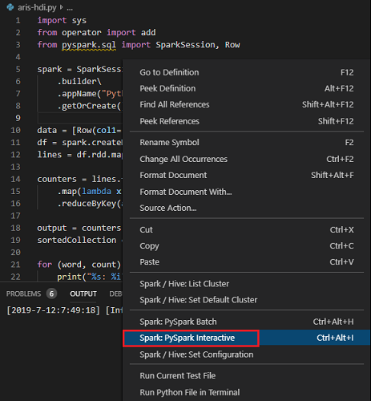
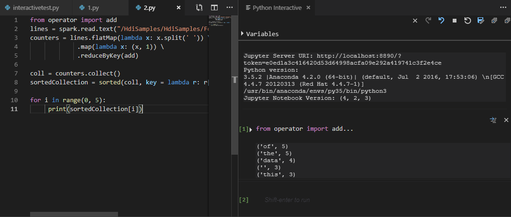
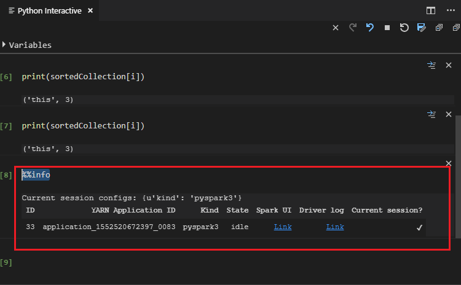
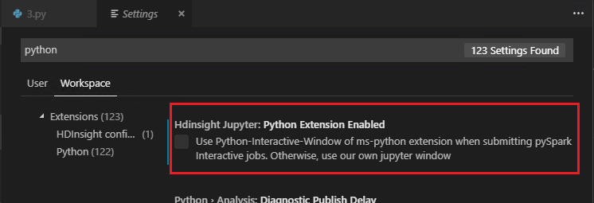

# Submit Spark jobs on SQL Server big data cluster in Visual Studio Code

[!INCLUDE[big-data-clusters-banner-retirement](../includes/bdc-banner-retirement.md)]

Learn how to use Spark & Hive Tools for Visual Studio Code to create and submit PySpark scripts for Apache Spark, first we'll describe how to install the Spark & Hive tools in Visual Studio Code and then we'll walk through how to submit jobs to Spark.  

Spark & Hive Tools can be installed on platforms that are supported by Visual Studio Code, which include Windows, Linux, and macOS. Below you'll find the prerequisites for different platforms.

## Prerequisites

The following items are required for completing the steps in this article:

- A SQL Server big data cluster. See [[!INCLUDE[big-data-clusters-2019](../includes/ssbigdataclusters-ss-nover.md)]](big-data-cluster-overview.md).
- [Visual Studio Code](https://code.visualstudio.com/).
- [Python and the Python extension on Visual Studio Code](https://code.visualstudio.com/docs/languages/python).
- [Mono](https://www.mono-project.com/docs/getting-started/install/). Mono is only required for Linux and macOS.
- [Set up PySpark interactive environment for Visual Studio Code](/azure/hdinsight/set-up-pyspark-interactive-environment).
- A local directory named **SQLBDCexample**.  This article uses **C:\SQLBDC\SQLBDCexample**.

## Install Spark & Hive Tools

After you have completed the prerequisites, you can install  Spark & Hive Tools for Visual Studio Code.  Complete the following steps to install Spark & Hive Tools:

1. Open Visual Studio Code.

2. From the menu bar, navigate to **View** > **Extensions**.

3. In the search box, enter **Spark & Hive**.

4. Select **Spark & Hive Tools**, published by Microsoft, from the search results, and then select **Install**.  

   

5. Reload when needed.

## Open work folder

Complete the following steps to open a work folder, and create a file in Visual Studio Code:

1. From the menu bar, navigate to **File** > **Open Folder...** > **C:\SQLBDC\SQLBDCexample**, then select the **Select Folder** button. The folder appears in the **Explorer** view on the left.

2. From the **Explorer** view, select the folder, **SQLBDCexample**, and then the **New File** icon next to the work folder.

   

3. Name the new file with the `.py` (Spark script) file extension.  This example uses **HelloWorld.py**.
4. Copy and paste the following code into the script file:

   ```python
   import sys
   from operator import add
   from pyspark.sql import SparkSession, Row
    
   spark = SparkSession\
      .builder\
      .appName("PythonWordCount")\
      .getOrCreate()
    
   data = [Row(col1='pyspark and spark', col2=1), Row(col1='pyspark', col2=2), Row(col1='spark vs hadoop', col2=2), Row(col1='spark', col2=2), Row(col1='hadoop', col2=2)]
   df = spark.createDataFrame(data)
   lines = df.rdd.map(lambda r: r[0])

   counters = lines.flatMap(lambda x: x.split(' ')) \
      .map(lambda x: (x, 1)) \
      .reduceByKey(add)
    
   output = counters.collect()
   sortedCollection = sorted(output, key = lambda r: r[1], reverse = True)
    
   for (word, count) in sortedCollection:
      print("%s: %i" % (word, count))
   ```

## Link a SQL Server big data cluster

Before you can submit scripts to your clusters from Visual Studio Code, you need to link a SQL Server big data cluster.

1. From the menu bar navigate to **View** > **Command Palette...**, and enter **Spark / Hive: Link a Cluster**.

   

2. Select linked cluster type **SQL Server Big Data**.

3. Enter SQL Server Big Data endpoint.

4. Enter SQL Server big data cluster user name.

5. Enter password for user admin.

6. Set the display name of the big data cluster (optional).

7. List clusters, review **OUTPUT** view for verification.

## List clusters

1. From the menu bar navigate to **View** > **Command Palette...**, and enter **Spark / Hive: List Cluster**.

2. Review the **OUTPUT** view.  The view will show your linked cluster(s).

    

## Set default cluster

1. Re-Open the folder **SQLBDCexample** created [earlier](#open-work-folder) if closed.  

2. Select the file **HelloWorld.py** created [earlier](#open-work-folder) and it will open in the script editor.

3. Link a cluster if you haven't yet done so.

4. Right-click the script editor, and select **Spark / Hive: Set Default Cluster**.   

5. Select a cluster as the default cluster for the current script file. The tools automatically update the configuration file **.VSCode\settings.json**. 

   

## Submit interactive PySpark queries

You can submit interactive PySpark queries by following the steps below:

1. Reopen the folder **SQLBDCexample** created [earlier](#open-work-folder) if closed.  

2. Select the file **HelloWorld.py** created [earlier](#open-work-folder) and it will open in the script editor.

3. Link a cluster if you haven't yet done so.

4. Choose all the code and right-click the script editor, select **Spark: PySpark Interactive** to submit the query, or use shortcut **Ctrl + Alt + I**.

   

5. Select the cluster if you haven't specified a default cluster. After a few moments, the **Python Interactive** results appear in a new tab. The tools also allow you to submit a block of code instead of the whole script file using the context menu. 

    

6. Enter **"%%info"**, and then press **Shift + Enter** to view job information. (Optional)

   

   > [!NOTE] 
   >
   > When **Python Extension Enabled** is unchecked in the settings (The default setting is checked), the submitted pyspark interaction results will use the old window.
   >
   > 


## Submit PySpark batch job

1. Reopen the folder **SQLBDCexample** created [earlier](#open-work-folder) if closed.  

2. Select the file **HelloWorld.py** created [earlier](#open-work-folder) and it will open in the script editor.

3. Link a cluster if you haven't yet done so.

4. Right-click the script editor, and then select **Spark: PySpark Batch**, or use shortcut **Ctrl + Alt + H**. 

5. Select the cluster if you haven't specified a default cluster. After you submit a Python job, submission logs appear in the **OUTPUT** window in Visual Studio Code. The **Spark UI URL** and **Yarn UI URL** are shown as well. You can open the URL in a web browser to track the job status.

    

## Apache Livy configuration

[Apache Livy](https://livy.incubator.apache.org/) configuration is supported, it can be set at the **.VSCode\settings.json** in the work space folder. Currently, Livy configuration only supports Python script. More details, see [Livy README](https://github.com/cloudera/livy/blob/master/README.rst ).

### <a id="triggerlivyconf"></a>**How to trigger Livy configuration**

#### Method 1

1. From the menu bar, navigate to **File** > **Preferences** > **Settings**.  
2. In the **Search settings** text box enter **HDInsight Job Submission: Livy Conf**.  
3. Select **Edit in settings.json** for the relevant search result.

#### Method 2

Submit a file, notice the `.vscode` folder is added automatically to the work folder. You can find the Livy configuration by selecting `settings.json` under `.vscode`.

The project settings:


>[!NOTE]
>For settings **driverMemory** and **executorMemory**, set the value with unit, for example 1gb or 1024mb. 

### Supported Livy configurations

#### POST /batches

**Request body**

| name | description | type |
| :- | :- | :- |
| file | File containing the application to execute | path (required) |
| proxyUser | User to impersonate when running the job | string |
| className | Application Java/Spark main class | string |
| args | Command line arguments for the application | list of strings |
| jars | jars to be used in this session | List of string |
| pyFiles | Python files to be used in this session | List of string |
| files | files to be used in this session | List of string |
| driverMemory | Amount of memory to use for the driver process | string |
| driverCores | Number of cores to use for the driver process | int |
| executorMemory | Amount of memory to use per executor process | string |
| executorCores | Number of cores to use for each executor | int |
| numExecutors | Number of executors to launch for this session | int |
| archives | Archives to be used in this session | List of string |
| queue | The name of the YARN queue to which submitted | string |
| name | The name of this session | string |
| conf | Spark configuration properties | Map of key=val |
| :- | :- | :- |

#### Response Body

The created batch object.

| name | description | type |
| :- | :- | :- |
| id | The session id | int |
| appId | The application id of this session | String |
| appInfo | The detailed application info | Map of key=val |
| log | The log lines | list of strings |
| state | The batch state | string |
| :- | :- | :- |

>[!NOTE]
>The assigned Livy config will display in output pane when submit script.

## Additional features

Spark & Hive for Visual Studio Code supports the following features:

- **IntelliSense autocomplete**. Suggestions pop up for keyword, methods, variables, and more. Different icons represent different types of objects.

    

- **IntelliSense error marker**. The language service underlines the editing errors for the Hive script.     
- **Syntax highlights**. The language service uses different colors to differentiate variables, keywords, data type, functions, and more. 

    

## Unlink cluster

1. From the menu bar navigate to **View** > **Command Palette...**, and then enter **Spark / Hive: Unlink a Cluster**.  

2. Select cluster to unlink.  

3. Review **OUTPUT** view for verification.  

## Next steps
For more information on SQL Server big data cluster and related scenarios, See [[!INCLUDE[big-data-clusters-2019](../includes/ssbigdataclusters-ss-nover.md)]](big-data-cluster-overview.md).
