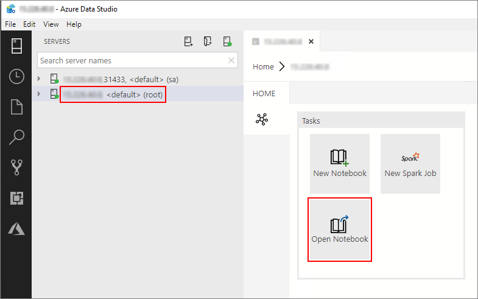
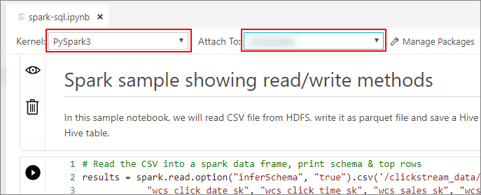

# Tutorial: Run a sample notebook on a SQL Server 2019 big data cluster

This tutorial demonstrates how to load and run a notebook in Azure Data Studio on a SQL Server 2019 big data cluster (preview). This allows data scientists and data engineers to run Python, R, or Scala code against the cluster.

> [!TIP]
> If you prefer, you can download and run a script for the commands in this tutorial. For instructions, see the [Spark samples](https://github.com/Microsoft/sql-server-samples/tree/master/samples/features/sql-big-data-cluster/spark) on GitHub.

## <a id="prereqs"></a> Prerequisites

* [Deploy a big data cluster on Kubernetes](deployment-guidance.md).
* [Install Azure Data Studio and the SQL Server 2019 extension](deploy-big-data-tools.md).
* [Load sample data into the cluster](#sampledata).

[!INCLUDE [Load sample data](../includes/big-data-cluster-load-sample-data.md)]

## Download the sample notebook file

Use the following instructions to load the sample notebook file **spark-sql.ipynb** into Azure Data Studio.

1. Open a Windows PowerShell or bash command prompt. Navigate to a directory where you want to download the sample notebook file to.

1. Run the following **curl** command to download the notebook file from GitHub:

   ```bash
   curl 'https://raw.githubusercontent.com/Microsoft/sql-server-samples/master/samples/features/sql-big-data-cluster/spark/spark-sql.ipynb' -o spark-sql.ipynb
   ```

## Open the notebook

The following steps show how to open the notebook file in Azure Data Studio:

1. In Azure Data Studio, connect to the HDFS/Spark gateway of your big data cluster. For more information, see [Connect to the HDFS/Spark gateway](deploy-big-data-tools.md#hdfs).

1. Double-click on the HDFS/Spark gateway connection in the **Servers** window. Then select **Open Notebook**.

   

1. Wait for the **Kernel** and the target context (**Attach to**) lists to be populated. 

1. Set the **Kernel** to **PySpark3**, and set **Attach to** to the IP address of your big data cluster endpoint.

   

1. 