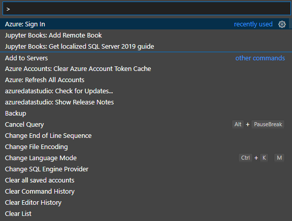
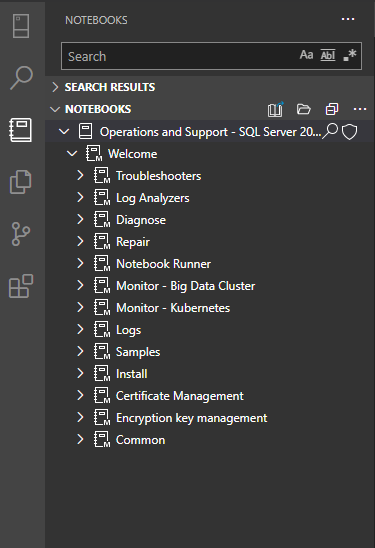

# Administration resources for Big Data Clusters (BDC) 

[!INCLUDE[SQL Server 2019](../includes/applies-to-version/sqlserver2019.md)]

This article describes how to administer a SQL Server Big Data Cluster from outside in.

## Know your architecture

Starting with SQL Server 2019 (15.x), SQL Server Big Data Clusters allow you to deploy scalable clusters of SQL Server, Spark, and HDFS containers running on Kubernetes. The following articles get an overview of big data cluster:
- [What are SQL Server Big Data Clusters](big-data-cluster-overview.md)

SQL Server Big Data Clusters provide coherent and consistent authorization and authentication. The following articles get an overview of big data cluster security:
- [Security concepts for SQL Server Big Data Clusters](concept-security.md)

## Manage and operate with tools

The following articles describe how to manage and operate Big data Cluster in the following ways: 

- [Connect to a SQL Server big data cluster with Azure Data Studio](connect-to-big-data-cluster.md)
- [Manage big data clusters for SQL Server controller dashboard](manage-with-controller-dashboard.md)
- [Manage SQL Server Big Data Clusters with Azure Data Studio notebooks](notebooks-manage-bdc.md)
- [Manage Big Data Clusters (BDC) the cluster with notebooks](cluster-manage-notebooks.md)
- [Run a sample notebook using Spark](notebooks-tutorial-spark.md)

## Monitor with tools

The following articles describe how to monitor Big data Cluster in the following ways: 

- [Monitor BDC Cluster with Azure Data Studio](cluster-monitor-ads.md)
- [Monitor BDC Cluster with Azdata utility](cluster-monitor-cmdlet.md)
- [Monitor BDC Cluster with Grafana Dashboard](cluster-monitor-grafana.md)
- [Monitor BDC Cluster with Juypter notebooks and Azure Data Studio](cluster-monitor-notebooks.md)

## Monitor and inspect logs with notebooks

The following articles list many of the Jupyter notebooks that are available in Azure Data Studio.

- [Monitoring cluster with notebooks](cluster-monitor-notebooks.md)
- [Gathering and analyzing logs in the cluster with notebooks](cluster-logging-notebooks.md)

## Big Data Clusters troubleshooting resources

The following articles describe how to troubleshoot Big data Cluster:

- [Troubleshoot BDC Cluster with kubectl utility](cluster-troubleshooting-commands.md) 
- [Troubleshoot pyspark notebook](troubleshoot-pyspark-notebook.md)
- [Troubleshoot BDC Cluster with Juypter notebooks and Azure Data Studio (ADS)](cluster-troubleshooter-notebooks.md)
- [Restore HDFS permissions](troubleshoot-hdfs-restore-admin.md)

The following articles describe how to troubleshoot Big data Cluster deployed in Active Directory mode:
- [Troubleshoot BDC Cluster in Active Directory Mode](troubleshoot-active-directory.md) 
- [Troubleshoot AD mode login fails](troubleshoot-ad-login-failed-untrusted-domain.md)
- [Troubleshoot BDC AD mode deployment stopped](troubleshoot-ad-reverse-lookup-zone.md)

## Where to find SQL Server Big Data Clusters administration notebooks 

SQL Server Big Data Clusters provides comprehensive administration experience working with Jupter notebooks, the notebooks covers cluster operations, management, monitoring, logging and troubleshoot. 

### Access to local notebooks 

After you managed to connect to a BDC cluster with Azure Data Studio(ADS), you can go to 'SQL Server Big Data Clusters' tab and find the direct link to all the local notebooks, as shown below : 

Also, from Azure Data Studio(ADS), you can use keyboard shortcut 'Ctrl + Shift + P' or from 'View' and click on 'Command Palette', you'll find an option 'Jupyter Books: Get localized SQL Server 2019 guide' and you'll gain access to the notebooks after clicking on it. 

### Add remote notebooks

Add remote notebook allows you to get the version of your choice of notebooks since it's sourced from where the notebooks released. To add remote notebook from Azure Data Studio(ADS), you can use keyboard shortcut 'Ctrl + Shift + P' or from 'View' and click on 'Command Palette',  as shown below : 

You'll find an option 'Jupyter Books: Add Remote Book' and you'll see a panel as the following which allows you to select the notebooks of the version of your choice.

After clicking on 'Add', you'll gain access of all the notebooks of the version of your choice under the 'Notebooks' tab of your local Azure Data Studio as shown below : ]

### How to use these notebooks 

You can find the guide about how to use those notebooks from the following articles : 

- [Monitor BDC Cluster with Juypter notebooks and Azure Data Studio](cluster-monitor-notebooks.md)
- [Gathering and analyzing logs in the cluster with notebooks](cluster-logging-notebooks.md)
- [Troubleshoot pyspark notebook](troubleshoot-pyspark-notebook.md)
- [Troubleshoot BDC Cluster with Juypter notebooks and Azure Data Studio (ADS)](cluster-troubleshooter-notebooks.md)

## Next steps

For more information about big data clusters, see [What are [!INCLUDE[big-data-clusters-2019](../includes/ssbigdataclusters-ss-nover.md)]](big-data-cluster-overview.md).