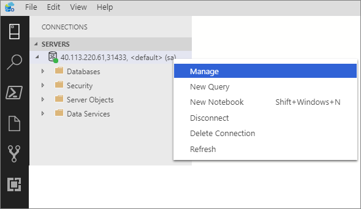
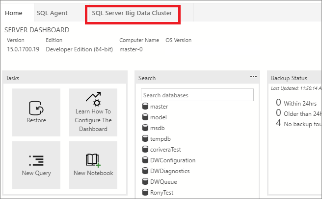
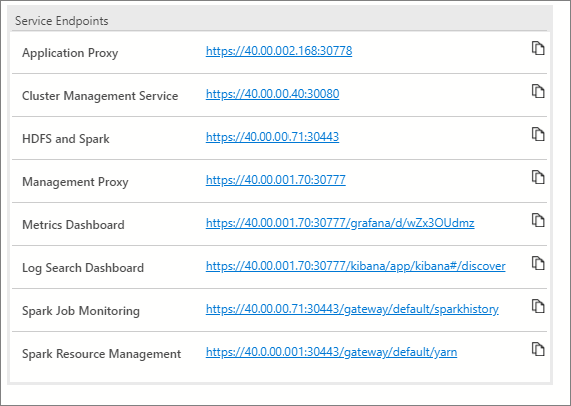

# How to view the status of a big data cluster

[!INCLUDE[tsql-appliesto-ssver15-xxxx-xxxx-xxx](../includes/tsql-appliesto-ssver15-xxxx-xxxx-xxx.md)]

This article describes how to access service endpoints and view cluster status of a SQL Server big data cluster (bdc).

## Access SQL Server big data cluster dashboard

After downloading the latest version of Azure Data Studio, you can view service endpoints and the status of a bdc through the SQL Server big data cluster dashboard. After you make a connection to your master instance endpoint, right-click on your endpoint and click **Manage.** 

Click SQL Server Big Data Cluster tab to access the bdc dashboard.

## View service endpoints

When accessing the bdc, it is important that you can easily access other services within the bdc. This is made possible through the service endpoints table.

You can access dashboards for:
- Metrics (Grafana)
- Logs (Kibana)
- Spark Job Monitoring
- Spark Resource Management

For the links above, you can directly click on the link. You will be asked twice to provide your user name and password before connecting to the service.

For the following services:
- Application Proxy
- Cluster Management Service
- HDFS and Spark
- Management Proxy

These services are listing the endpoints which can be copied and pasted when you need to provide the endpoint to connect to other services. For example, you can click the copy icon to the right of the endpoint, and then paste it in a text window requesting that endpoint. The Cluster Management Service endpoint will be necessary when you run the cluster status notebook.

## View cluster status through notebook

1. You can view cluster status of the bdc by launching the cluster status notebook. To launch the notebook, click the **Cluster Status** task.

    

2. Before you begin, you will need:
    - Big data cluster name
    - Controller username
    - Controller password
    - Controller endpoints

    You can find the controller endpoint from the big data cluster dashboard in the Service Endpoints table. The endpoint is listed as **Cluster Management Service.**

    If you do not know the credentials, ask the admin who deployed your cluster.

3. Click **Run Cells** on the top toolbar.
4. Follow the prompt for your credentials. Press enter after you type each credential (ie. bdc name, controller username, controller password).
    > Note: If you do not have a config file setup with your bdc, you will be asked for the controller endpoint. Type or paste it, then press enter to proceed.
5. If you connected successfully, the rest of the notebook will show the output of each component of the bdc. When you want to re-run a certain code cell, hover over the code cell and click the **Run** icon.

## Next steps

For more information about big data clusters, see [What are SQL Server big data clusters](big-data-cluster-overview.md).
