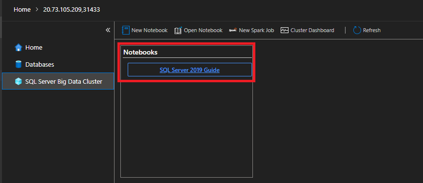
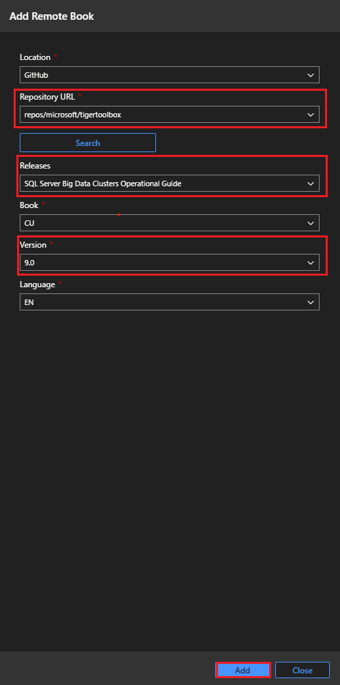

# Administration resources for Big Data Clusters 

[!INCLUDE[SQL Server 2019](../includes/applies-to-version/sqlserver2019.md)]

This article explains how to view the status of a big data cluster by using Azure Data Studio, notebooks, and Azure Data CLI (azdata) commands.

## Know your architecture

Starting with SQL Server 2019 (15.x), [!INCLUDE[big-data-clusters-2019](../includes/ssbigdataclusters-ss-nover.md)] allows you to deploy scalable clusters of SQL Server, Spark, and HDFS containers that run on Kubernetes. For an overview, see [What is SQL Server Big Data Clusters?](big-data-cluster-overview.md).

[!INCLUDE[big-data-clusters-2019](../includes/ssbigdataclusters-ss-nover.md)] provides coherent and consistent authorization and authentication. For an overview of Big Data Cluster security, see [Security concepts for [!INCLUDE[big-data-clusters-2019](../includes/ssbigdataclusters-ss-nover.md)]](concept-security.md).

## Manage and operate with tools

The following articles describe how to manage and operate big data clusters: 

- [Connect to a SQL Server big data cluster with Azure Data Studio](connect-to-big-data-cluster.md)
- [Manage big data clusters for SQL Server controller dashboard](manage-with-controller-dashboard.md)
- [Manage SQL Server Big Data Clusters with Azure Data Studio notebooks](notebooks-manage-bdc.md)
- [Manage Big Data Clusters by using notebooks](cluster-manage-notebooks.md)
- [Run a sample notebook by using Spark](notebooks-tutorial-spark.md)

## Monitor with tools

The following articles describe how to monitor Big Data Clusters: 

- [Monitor Big Data Clusters status by using Azure Data Studio](cluster-monitor-ads.md)
- [Monitor Big Data Clusters by using azdata and kubectl](cluster-monitor-cmdlet.md)
- [Monitor Big Data Clusters by using azdata and Grafana Dashboard](cluster-monitor-grafana.md)
- [Monitor Big Data Clusters by using Juypter Notebooks and Azure Data Studio](cluster-monitor-notebooks.md)

> [!IMPORTANT]
> The Internet Explorer browser and older Microsoft Edge browsers aren't compatible with Grafana or Kibana. Consider the [Chromium-based Microsoft Edge](https://microsoftedgewelcome.microsoft.com/), or see [supported browsers for Grafana](https://grafana.com/docs/grafana/latest/installation/requirements/#supported-web-browsers) or [supported browsers for Kibana](https://www.elastic.co/support/matrix#matrix_browsers).

## Monitor and inspect logs by using notebooks

The following articles list many of the Jupyter Notebooks that are available in Azure Data Studio:

- [Monitoring clusters by using notebooks](cluster-monitor-notebooks.md)
- [Gathering and analyzing logs in a cluster by using notebooks](cluster-logging-notebooks.md)

## Big Data Clusters troubleshooting resources

The following articles describe how to troubleshoot Big Data Clusters:

- [Troubleshoot Big Data Clusters by using the kubectl utility](cluster-troubleshooting-commands.md) 
- [Troubleshoot a pyspark notebook](troubleshoot-pyspark-notebook.md)
- [Troubleshoot Big Data Clusters by using Juypter Notebooks and Azure Data Studio](cluster-troubleshooter-notebooks.md)
- [Restore HDFS permissions](troubleshoot-hdfs-restore-admin.md)

The following articles describe how to troubleshoot big data clusters deployed in Active Directory mode:
- [Troubleshoot SQL Server Big Data Clusters Active Directory integration](troubleshoot-active-directory.md) 
- [Troubleshoot Active Directory mode login failures](troubleshoot-ad-login-failed-untrusted-domain.md)
- [Troubleshoot Big Data Clusters Active Directory mode deployment stopped](troubleshoot-ad-reverse-lookup-zone.md)

## Where to find [!INCLUDE[big-data-clusters-2019](../includes/ssbigdataclusters-ss-nover.md)] administration notebooks 

[!INCLUDE[big-data-clusters-2019](../includes/ssbigdataclusters-ss-nover.md)] provides  a comprehensive administration experience via Jupyter Notebooks. The provided notebooks cover cluster operations, management, monitoring, logging, and troubleshooting. 

### Access to local notebooks 

After you connect to a big data cluster with Azure Data Studio, on the **[!INCLUDE[big-data-clusters-2019](../includes/ssbigdataclusters-ss-nover.md)]** tab, you can find a link to all the local notebooks: 

You can also access the notebooks directly from Azure Data Studio. Use keyboard shortcut Ctrl+Shift+P (or select **View** and then **Command Palette**) to find the option **Jupyter Books: Get localized SQL Server 2019 guide**. 

### Add remote notebooks

Because notebooks are sourced remotely, you can select a notebook for the correct version. To add a remote notebook from Azure Data Studio, you can use keyboard shortcut Ctrl+Shift+P. (Or select **View** and then **Command Palette**.)

Select **Jupyter Books: Add Remote Book**. A window opens that allows you to select a notebook. You can select the version you want:

When you select **Add**, you'll gain access to all the notebooks for your chosen version on the **Notebooks** tab of Azure Data Studio: 

### How to use these notebooks 

To learn how to use the notebooks, see these articles:

- [Monitor Big Data Clusters by using Juypter notebooks and Azure Data Studio](cluster-monitor-notebooks.md)
- [Gathering and analyzing logs in a big data cluster by using notebooks](cluster-logging-notebooks.md)
- [Troubleshoot a pyspark notebook](troubleshoot-pyspark-notebook.md)
- [Troubleshoot Big Data Clusters by using Juypter Notebooks and Azure Data Studio](cluster-troubleshooter-notebooks.md)

## Next steps

For more information, see [What are [!INCLUDE[big-data-clusters-2019](../includes/ssbigdataclusters-ss-nover.md)]?](big-data-cluster-overview.md).
