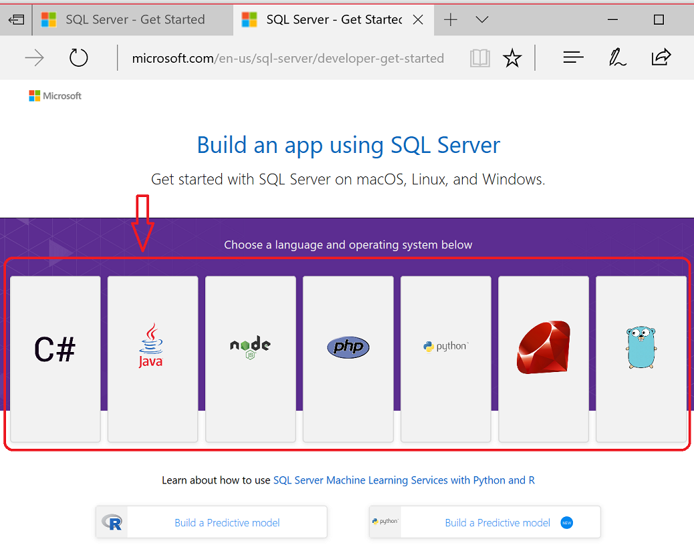
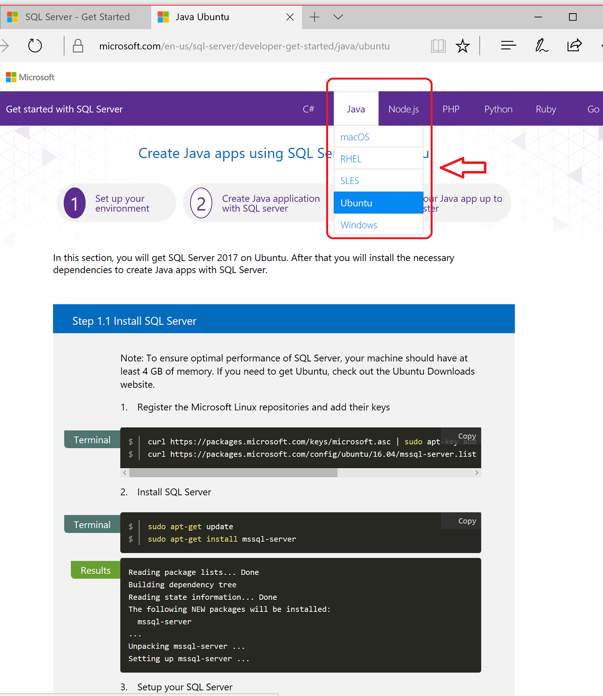

# Connection modules for Microsoft SQL Database

This article provides download links to connection modules or *drivers* that your client programs can use for interacting with [Microsoft SQL Server](../relational-databases/databases/databases.md), and with its twin in the cloud [Azure SQL Database](/azure/sql-database/). Drivers are available for a variety of programming languages, running on the following operating systems:

- Linux
- macOS
- Windows

**OOP-to-relational mismatch:**

*Relational*: Client programs that are written in an object-oriented programming (OOP) language often use SQL drivers, which return queried data in a format that is more relational than object oriented. C# using ADO.NET is one example. The OOP-relational format mismatch sometimes makes the OOP code harder to write and understand.

*ORM*: Other drivers or frameworks return queried data in the OOP format, avoiding the mismatch. These drivers work by expecting that classes have been defined to match the data columns of particular SQL tables. The driver then performs the *object-relational mapping* (ORM) to return queried data as an instance of a class. Microsoft's Entity Framework (EF) for C#, and Hibernate for Java, are two examples.

The present article devotes separate sections to these two kinds of connection drivers.

<a name="anchor-20-drivers-relational-access" />

## Drivers for relational access

| Language | Download the SQL driver |
| :------- | :---------------------- |
| C# | [ADO.NET](https://www.microsoft.com/net/download/) [Microsoft.Data.SqlClient](https://www.nuget.org/packages/Microsoft.Data.SqlClient/) [.NET Core for: Linux-Ubuntu, macOS, Windows](https://dotnet.microsoft.com/download)   [Entity Framework Core](https://www.nuget.org/packages/Microsoft.EntityFrameworkCore)   [Entity Framework](https://www.nuget.org/packages/EntityFramework) |
| C++ | [ODBC](./odbc/download-odbc-driver-for-sql-server.md)  [OLE DB](./oledb/download-oledb-driver-for-sql-server.md) |
| Java | [JDBC](./jdbc/download-microsoft-jdbc-driver-for-sql-server.md) |
| Node.js | [Node.js driver, install instructions](./node-js/step-1-configure-development-environment-for-node-js-development.md) |
| PHP | [PHP](./php/download-drivers-php-sql-server.md) |
| Python | [pyodbc, install instructions](./python/pyodbc/step-1-configure-development-environment-for-pyodbc-python-development.md) [Download ODBC](./odbc/download-odbc-driver-for-sql-server.md) |
| Ruby | [Ruby driver, install instructions](./ruby/step-1-configure-development-environment-for-ruby-development.md) [Ruby download page](https://rubyinstaller.org/downloads/) |

<a name="anchor-40-drivers-orm-access" />

## Drivers for ORM access

The following table lists examples of Object Relational Mapping (ORM) frameworks that client applications use to connect to Microsoft SQL Database.

| Language | ORM driver download |
| :------- | :------------------ |
| C# | [Entity Framework Core](/ef/core/) [Entity Framework (6.x or later)](/ef/) |
| Java | [Hibernate ORM](https://hibernate.org/orm)|
| PHP | [Eloquent ORM, included in Laravel install](https://laravel.com/docs/) |
| Node.js | [Sequelize ORM](https://sequelize.org/) [Prisma](https://www.prisma.io/) |
| Python | [Django](https://www.djangoproject.com/) |
| Ruby | [Ruby on Rails](https://rubyonrails.org/) |

<a name="anchor-60-build-an-app-webpages" />

## Build-an-app webpages

**[https://aka.ms/sqldev](https://aka.ms/sqldev)** takes you to a set of *Build-an-app* webpages. The webpages provide information about numerous combinations of programming language, operating system, and SQL connection driver. Among the information provided by the Build-an-app webpages are the following items:

- Details about how to get started from the very beginning, for each combination of language + operating system + driver.
  - Instructions for installing the latest SQL connection drivers.
- Code examples for each of the following items:
  - Object-relational code examples.
  - ORM code examples.
  - Columnstore index demonstrations for much faster performance.

**First page, of Build-an-app webpages:**  

**Menu for Java - Ubuntu, of Build-an-app webpages**  

&nbsp;

## Related links

- [Code examples for connecting to Azure SQL Database in the cloud, with Java and other languages](/azure/sql-database/sql-database-connect-query-java).

<!--
Image references, **obsolete** markdown syntax alternative:

![Build-an-app webpages, first page screenshot][image-ref-163-buildanapp-webpages-first-page]
![Build-an-app webpages, menu Java Ubuntu][image-ref-167-buildanapp-webpages-menu-java-ubuntu]

[image-ref-163-buildanapp-webpages-first-page]: ./media/homepage-sql-connection-drivers/gm-aka-ms-sqldev-choose-language-g21.png
[image-ref-167-buildanapp-webpages-menu-java-ubuntu]: ./media/homepage-sql-connection-drivers/gm-aka-ms-sqldev-java-ubuntu-c31.png
-->
