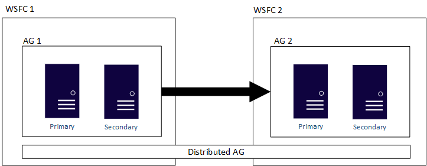
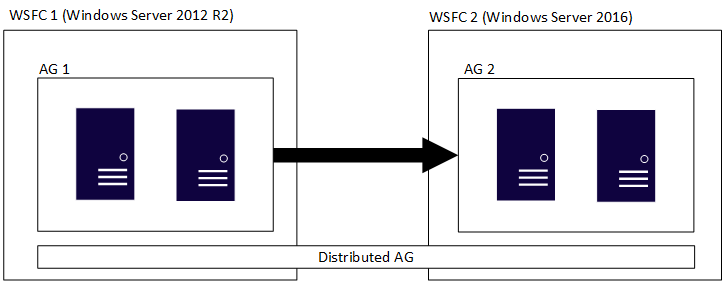
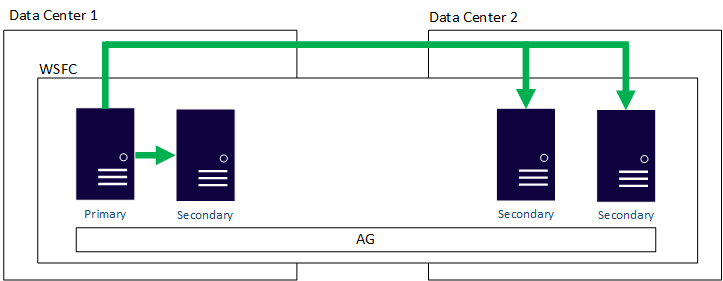
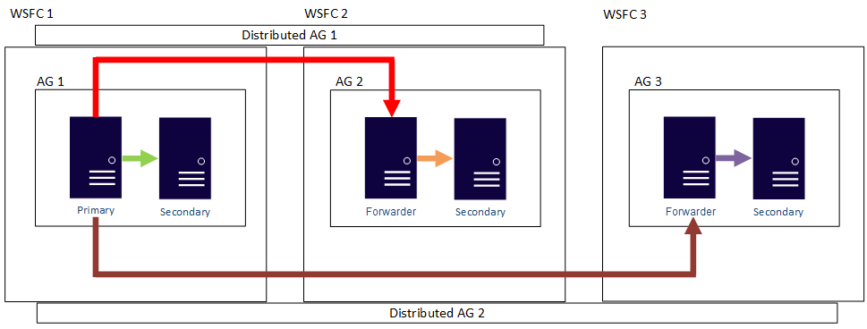
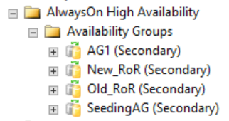
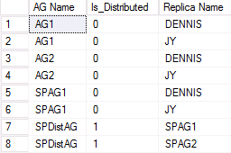
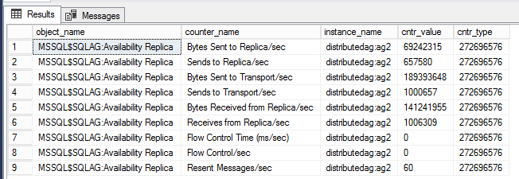

# Distributed availability groups

[!INCLUDE [SQL Server](../../../includes/applies-to-version/sqlserver.md)]

A distributed availability group (AG) is a special type of availability group that spans two separate availability groups. Distributed availability groups are available starting with SQL Server 2016.

This article describes the distributed availability group feature. To configure a distributed availability group, see [Configure distributed availability groups](configure-distributed-availability-groups.md).

## Overview

A distributed availability group is a special type of availability group that spans two separate availability groups. The availability groups that participate in a distributed availability group do not need to be in the same location. They can be physical, virtual, on-premises, in the public cloud, or anywhere that supports an availability group deployment. This includes cross-domain and even cross-platform - such as between an availability group hosted on Linux and one hosted on Windows. As long as two availability groups can communicate, you can configure a distributed availability group with them.

A traditional availability group has resources configured in a Windows Server Failover Cluster (WSFC) or if on Linux, Pacemaker. A distributed availability group does not configure anything in the underlying cluster (WSFC or Pacemaker). Everything about it is maintained within SQL Server. To learn how to view information for a distributed availability group, see [Viewing distributed availability group information](#monitor-distributed-availability-group-health). 

A distributed availability group requires that the underlying availability groups have a listener. Rather than provide the underlying server name for a standalone instance (or in the case of a SQL Server failover cluster instance [FCI], the value associated with the network name resource) as you would with a traditional availability group, you specify the configured listener for the distributed availability group with the parameter ENDPOINT_URL when you create it. Although each underlying availability group of the distributed availability group has a listener, a distributed availability group has no listener.

The following figure shows a high-level view of a distributed availability group that spans two availability groups (AG 1 and AG 2), each configured on its own WSFC. The distributed availability group has a total of four replicas, with two in each availability group. Each availability group can support up to the maximum number of replicas, so a distributed availability can have up to 18 total replicas.




You can configure the data movement in distributed availability groups as synchronous or asynchronous. However, data movement is slightly different within distributed availability groups compared to a traditional availability group. Although each availability group has a primary replica, there is only one copy of the databases participating in a distributed availability group that can accept inserts, updates, and deletions. As shown in the following figure, AG 1 is the primary availability group. Its primary replica sends transactions to both the secondary replicas of AG 1 and the primary replica of AG 2. The primary replica of AG 2 is also known as a *forwarder*. A forwarder is a primary replica in a secondary availability group in a distributed availability group. The forwarder receives transactions from the primary replica in the primary availability group and forwards them to the secondary replicas in its own availability group.  The forwarder then keeps the secondary replicas of AG 2 updated. 


The only way to make AG 2's primary replica accept inserts, updates, and deletions is to manually fail over the distributed availability group from AG 1. In the preceding figure, because AG 1 contains the writeable copy of the database, issuing a failover makes AG 2 the availability group that can handle inserts, updates, and deletions. For information about how to fail over one distributed availability group to another, see [Failover to a secondary availability group](configure-distributed-availability-groups.md#failover).

> [!NOTE]
> Distributed availability groups in SQL Server 2016 support failover only from one availability group to another by using the option FORCE_FAILOVER_ALLOW_DATA_LOSS.

> [!NOTE]
> When using transactional replication with distributed availability groups the forwarder replica can't be configured as a publisher.

## Version and edition requirements

Distributed availability groups in SQL Server 2017 or later can mix major versions of SQL Server in the same distributed availability group. The AG containing read/write primary can be the same version or lower than the other AGs participating in the distributed AG. The other AGs can be the same version or higher. This scenario is targeted to upgrade and migration scenarios. For example, if the AG containing the read/write primary replica is SQL Server 2016, but you want to upgrade/migrate to SQL Server 2017 or later, the other AG participating in the distributed AG can be configured with SQL Server 2017.

Because the distributed availability groups feature did not exist in SQL Server 2012 or 2014, availability groups that were created with these versions cannot participate in distributed availability groups. 

> [!NOTE]
> Distributed availability groups can not be configured with Standard edition or mix of Standard and Enterprise edition.

Because there are two separate availability groups, the process of installing a service pack or cumulative update on a replica that's participating in a distributed availability group is slightly different from that of a traditional availability group:

1. Start by updating the replicas of the second availability group in the distributed availability group.

2. Patch the replicas of the primary availability group in the distributed availability group.

3. As with a standard availability group, fail over the primary availability group to one of its own replicas (not to the primary of the second availability group) and patch it. If there is no replica other than the primary, a manual failover to the second availability group will be necessary.


### Windows Server versions and distributed availability groups

A distributed availability group spans multiple availability groups, each on its own underlying WSFC, and a distributed availability group is a SQL Server-only construct.  This means the WSFCs that house the individual availability groups can have different major versions of Windows Server. The major versions of SQL Server must be the same, as discussed in the previous section. Much like the initial figure, the following figure shows AG 1 and AG 2 participating in a distributed availability group, but each of the WSFCs is a different version of Windows Server.




The individual WSFCs and their corresponding availability groups follow traditional rules. That is, they can be joined to a domain or not joined to a domain (Windows Server 2016 or later). When two different availability groups are combined in a single distributed availability group, there are four scenarios:

* Both WSFCs are joined to the same domain.
* Each WSFC is joined to a different domain.
* One WSFC is joined to a domain, and one WSFC is not joined to a domain.
* Neither WSFC is joined to a domain.

When both WSFCs are joined to the same domain (not trusted domains), you don't need to do anything special when you create the distributed availability group. For availability groups and WSFCs that are not joined to the same domain, use certificates to make the distributed availability group work, much in the way that you might create an availability group for a domain-independent availability group. To see how to configure certificates for a distributed availability group, follow steps 3-13 under [Create a domain-independent availability group](domain-independent-availability-groups.md).

With a distributed availability group, the primary replicas in each underlying availability group must have each other's certificates. If you already have endpoints that are not using certificates, reconfigure those endpoints by using [ALTER ENDPOINT](../../../t-sql/statements/alter-endpoint-transact-sql.md) to reflect the use of certificates.

## Usage scenarios

Here are the three main usage scenarios for a distributed availability group: 

* [Disaster recovery and easier multi-site configurations](#disaster-recovery-and-multi-site-scenarios)
* [Migration to new hardware or configurations, which might include using new hardware or changing the underlying operating systems](#migrate)
* [Increasing the number of readable replicas beyond eight in a single availability group by spanning multiple availability groups](#scale-out-readable-replicas)

### Disaster recovery and multi-site scenarios

A traditional availability group requires that all servers be part of the same WSFC, which can make spanning multiple data centers challenging. The following figure shows what a traditional multi-site availability group architecture looks like, including the data flow. There is one primary replica that sends transactions to all secondary replicas. This configuration is less in some ways than a distributed availability group. For example, you must implement such things as Active Directory (if applicable) and the witness for a quorum in the WSFC. You might also need to take into account other aspects of a WSFC, such as altering node votes.



Distributed availability groups offer a more flexible deployment scenario for availability groups that span multiple data centers. You can even use distributed availability groups where features such as [log shipping](../../../database-engine/log-shipping/about-log-shipping-sql-server.md) were used in the past for scenarios such as disaster recovery. However, unlike log shipping, distributed availability groups cannot have delayed application of transactions. This means that availability groups or distributed availability groups cannot help in the event of human error in which data is incorrectly updated or deleted.

Distributed availability groups are loosely coupled, which in this case means that they don't require a single WSFC and they're maintained by SQL Server. Because the WSFCs are maintained individually and the synchronization is primarily asynchronous between the two availability groups, it's easier to configure disaster recovery at another site. The primary replicas in each availability group synchronize their own secondary replicas.

* Only manual failover is supported for a distributed availability group. In a disaster recovery situation where you are switching data centers, you should not configure automatic failover (with rare exceptions). 
* You most likely will not need to set some of the traditional items or parameters for multi-site or subnet WSFCs, such as CrossSubnetThreshold, but you still need to see about network latency at a different layer for the data transport. The difference is that each WSFC maintains its own availability; the cluster isn't one big entity of four nodes. You have two separate two-node WSFCs as shown in the previous figure.  
* We recommend asynchronous data movement, because this approach would be for disaster-recovery purposes.
* If you configure synchronous data movement between the primary replica and at least one secondary replica of the second availability group, and you configure synchronous movement on the distributed availability group, a distributed availability group will wait until all synchronous copies acknowledge that they have the data.

### Migrate 

Because distributed availability groups support two completely different availability group configurations, they enable not only easier disaster-recovery and multi-site scenarios, but also migration scenarios. Whether you are migrating to new hardware or virtual machines (on-premises or IaaS in the public cloud), configuring a distributed availability group allows a migration to occur where, in the past, you might have used backup, copy, and restore, or log shipping. 

The ability to migrate is especially useful in scenarios where you're changing or upgrading the underlying OS while you keep the same SQL Server version. Although Windows Server 2016 does allow a rolling upgrade from Windows Server 2012 R2 on the same hardware, most users choose to deploy new hardware or virtual machines. 

To complete the migration to the new configuration, at the end of the process, stop all data traffic to the original availability group, and change the distributed availability group to synchronous data movement. This action ensures that the primary replica of the second availability group is fully synchronized, so there would be no data loss. After you've verified the synchronization, fail over the distributed availability group to the secondary availability group. For more information, see [Fail over to a secondary availability group](configure-distributed-availability-groups.md#failover).

Post-migration, where the second availability group is now the new primary availability group, you might need to do either of the following:

* Rename the listener on the secondary availability group (and possibly delete or rename the old one on the original primary availability group), or re-create it with the listener from the original primary availability group, so that applications and users can access the new configuration.
* If a rename or re-creation is not possible, point applications and users to the listener on the second availability group.

#### Migrate to higher SQL Server versions

During a migration scenario, it's possible to configure a distributed AG to migrate your databases to a SQL Server target that is a higher version than the source. However, such a scenario does not support autoseeding. 

When you configure the distributed AG, the seeding mode must be `MANUAL`, the failover mode must be `MANUAL`, and you must manually perform a full backup of the source database to then manually restore it, along with the transaction logs to the secondary AG. To learn more, review the [manual seeding](configure-distributed-availability-groups.md&tabs=manual) steps to configure your distributed AG. 

Assuming the secondary AG (AG2) is the migration target and is a higher version than the primary AG (AG1), consider the following limitations: 

- You will not have read access to any of the replica databases on the secondary AG as long as the primary AG is at a lower version.
- During this time, updates will continue to flow from the Primary AG (AG1) to the Secondary AG (AG2), but the status of the secondary AG will show as Partially Healthy, and databases on secondary replicas of the Secondary AG (AG2) will show as Synchronizing/In Recovery  (even if the AG is in sync Commit).
- Once the distributed AG is failed over to the higher version (AG2), AG2 should become Healthy.
- During this time, fail-back to AG1 will not be possible, as it is at a lower version.
- Because AG1 is at a lower version, updates will not be replicated over to it. 
- From here, if the choice is to decommission the original AG, that can be done, and the process is complete.
- If the choice is to maintain the distributed AG, then at this time, the first AG (AG1) should be upgraded.  At that point, AG1 should become healthy, and catch up, and fail-back becomes possible.  

### Scale out readable replicas

A single distributed availability group can have up to 16 secondary replicas, as needed. So it can have up 18 copies for reading, including the two primary replicas of the different availability groups. This approach means that more than one site can have near-real-time access for reporting to various applications.

Distributed availability groups can help you scale out a read-only farm more than you can with just a single availability group. A distributed availability group can scale out readable replicas in two ways:

* You can use the primary replica of the second availability group in a distributed availability group to create another distributed availability group, even though the database is not in RECOVERY.
* You can also use the primary replica of the first availability group to create another distributed availability group.

In other words, a primary replica can participate in different distributed availability groups. The following figure shows AG 1 and AG 2 both participating in Distributed AG 1, while AG 2 and AG 3 are participating in Distributed AG 2. The primary replica (or forwarder) of AG 2 is both a secondary replica for Distributed AG 1 and a primary replica of Distributed AG 2.


The following figure shows AG 1 as the primary replica for two different distributed availability groups: Distributed AG 1 (composed of AG 1 and AG2) and Distributed AG 2 (composed of AG 1 and AG 3).





In both preceding examples, there can be up to 27 total replicas across the three availability groups, all of which can be used for read-only queries. 

[Read-only routing](../../../database-engine/availability-groups/windows/configure-read-only-routing-for-an-availability-group-sql-server.md) does not completely work with Distributed Availability Groups. More specifically,

1. Read-Only Routing can be configured and will work for the primary availability group of the distributed availability group. 
2. Read-Only Routing can be configured, but will not work for the secondary availability group of the distributed availability group. All queries, if they use the listener to connect to the secondary availability group, go to the primary replica of the secondary availability group. Otherwise, you need to configure each replica to allow all connections as a secondary replica and access them directly. However, read-only routing will work if the secondary availability group becomes primary after a failover. This behavior might be changed in an update to SQL Server 2016 or in a future version of SQL Server.


## Initialize secondary availability groups

Distributed availability groups were designed with [automatic seeding](./automatically-initialize-always-on-availability-group.md) to be the main method used to initialize the primary replica on the second availability group. A full database restore on the primary replica of the second availability group is possible if you do the following:

1. Restore the database backup WITH NORECOVERY.
2. If necessary, restore the proper transaction log backups WITH NORECOVERY.
3. Create the second availability group without specifying a database name and with SEEDING_MODE set to AUTOMATIC.
4. Create the distributed availability group by using automatic seeding.

When you add the second availability group's primary replica to the distributed availability group, the replica is checked against the first availability group's primary databases, and seeding catches the database up to the source. There are a few caveats:

* The output shown in `sys.dm_hadr_automatic_seeding` on the primary replica of the second availability group will display a `current_state` of FAILED with the reason "Seeding Check Message Timeout."

* The current SQL Server log on the primary replica of the second availability group will show that seeding worked and that the [LSNs](../../../relational-databases/sql-server-transaction-log-architecture-and-management-guide.md) were synchronized.

* The output shown in `sys.dm_hadr_automatic_seeding` on the primary replica of the first availability group will show a current_state of COMPLETED. 

* Seeding also has different behavior with distributed availability groups. For seeding to begin on the second replica, you must issue the command `ALTER AVAILABILITY GROUP [AGName] GRANT CREATE ANY DATABASE` command on the replica. Although this condition is still true of any secondary replica that participates in the underlying availability group, the primary replica of the second availability group already has the right permissions to allow seeding to begin after it is added to the distributed availability group. 

## Monitor health

A distributed availability group is a SQL Server-only construct, and it is not seen in the underlying WSFC The following figure shows two different WSFCs (CLUSTER_A and CLUSTER_B), each with its own availability groups. Only AG1 in CLUSTER_A and AG2 in CLUSTER_B are discussed here. 

[Two WSFCs with multiple availability groups through PowerShell Get-ClusterGroup command](./media/distributed-availability-group/dag-07-two-wsfcs-multiple-ags-through-get-clustergroup-command.png)


```
PS C:\> Get-ClusterGroup -Cluster CLUSTER_A

Name                            OwnerNode             State
----                            ---------             -----
AG1                             DENNIS                Online
Available Storage               GLEN                  Offline
Cluster Group                   JY                    Online
New_RoR                         DENNIS                Online
Old_RoR                         DENNIS                Online
SeedingAG                       DENNIS                Online


PS C:\> Get-ClusterGroup -Cluster CLUSTER_B

Name                            OwnerNode             State
----                            ---------             -----
AG2                             TOMMY                 Online
Available Storage               JC                    Offline
Cluster Group                   JC                    Online
```

All detailed information about a distributed availability group is in SQL Server, specifically in the availability-group dynamic management views. Currently, the only information shown in SQL Server Management Studio for a distributed availability group is on the primary replica for the availability groups. As shown in the following figure, under the Availability Groups folder, SQL Server Management Studio shows that there is a distributed availability group. The figure shows AG1 as a primary replica for an individual availability group that's local to that instance, not for a distributed availability group.


However, if you right-click the distributed availability group, no options are available (see the following figure), and the expanded Availability Databases, Availability Group Listeners, and Availability Replicas folders are all empty. SQL Server Management Studio 16 displays this result, but it might change in a future version of SQL Server Management Studio.


As shown in the following figure, secondary replicas show nothing in SQL Server Management Studio related to the distributed availability group. These availability group names map to the roles shown in the previous CLUSTER_A WSFC image.



### DMV to list all availability replica names

The same concepts hold true when you use the dynamic management views. By using the following query, you can see all the availability groups (regular and distributed) and the nodes participating in them. This result is displayed only if you query the primary replica in one of the WSFCs that are participating in the distributed availability group. There is a new column in the dynamic management view `sys.availability_groups` named `is_distributed`, which is 1 when the availability group is a distributed availability group. To see this column:

```sql
-- shows replicas associated with availability groups
SELECT 
   ag.[name] AS [AG Name], 
   ag.Is_Distributed, 
   ar.replica_server_name AS [Replica Name]
FROM sys.availability_groups AS ag 
INNER JOIN sys.availability_replicas AS ar       
   ON ag.group_id = ar.group_id
GO
```

An example of output from the second WSFC that's participating in a distributed availability group is shown in the following figure. SPAG1 is composed of two replicas: DENNIS and JY. However, the distributed availability group named SPDistAG has the names of the two participating availability groups (SPAG1 and SPAG2) rather than the names of the instances, as with a traditional availability group. 



### DMV to list Distributed AG health

In SQL Server Management Studio, any status shown on the Dashboard and other areas are for local synchronization only within that availability group. To display the health of a distributed availability group, query the dynamic management views. The following example query extends and refines the previous query:

```sql
-- shows sync status of distributed AG
SELECT 
   ag.[name] AS [AG Name], 
   ag.is_distributed, 
   ar.replica_server_name AS [Underlying AG], 
   ars.role_desc AS [Role], 
   ars.synchronization_health_desc AS [Sync Status]
FROM  sys.availability_groups AS ag
INNER JOIN sys.availability_replicas AS ar 
   ON  ag.group_id = ar.group_id        
INNER JOIN sys.dm_hadr_availability_replica_states AS ars       
   ON  ar.replica_id = ars.replica_id
WHERE ag.is_distributed = 1
GO
```
       
       


### DMV to view underlying performance

To further extend the previous query, you can also see the underlying performance via the dynamic management views by adding in `sys.dm_hadr_database_replicas_states`. The dynamic management view currently stores information about the second availability group only. The following example query, run on the primary availability group, produces the sample output shown below:

```sql
-- shows underlying performance of distributed AG
SELECT 
   ag.[name] AS [Distributed AG Name], 
   ar.replica_server_name AS [Underlying AG], 
   dbs.[name] AS [Database],
   ars.role_desc AS [Role],
   drs.synchronization_health_desc AS [Sync Status],
   drs.log_send_queue_size,
   drs.log_send_rate, 
   drs.redo_queue_size, 
   drs.redo_rate
FROM sys.databases AS dbs
INNER JOIN sys.dm_hadr_database_replica_states AS drs
   ON dbs.database_id = drs.database_id
INNER JOIN sys.availability_groups AS ag
   ON drs.group_id = ag.group_id
INNER JOIN sys.dm_hadr_availability_replica_states AS ars
   ON ars.replica_id = drs.replica_id
INNER JOIN sys.availability_replicas AS ar
   ON ar.replica_id = ars.replica_id
WHERE ag.is_distributed = 1
GO
```


### DMV to view performance counters for distributed AG
The below query displays performance counters specifically associated with the distributed availability group. 


 ```sql
 -- displays OS performance counters related to the distributed ag named 'distributedag'
 SELECT * FROM sys.dm_os_performance_counters WHERE instance_name LIKE '%distributed%'
 ```

 


 >[!NOTE]
 >The `LIKE` filter should have the name of the distributed availability group. In this example, the name of the distributed availability group is 'distributedag'. Change the `LIKE` modifier to reflect the name of your distributed availability group.  

### DMV to display health of both AG and Distributed AG
The below query displays a wealth of information about the health of both the availability group, and the distributed availability group. [Thanks Tracy Boggiano!](https://tracyboggiano.com/archive/2017/11/distributed-availability-groups-setup-and-monitoring/)

 ```sql
 -- displays sync status, send rate, and redo rate of availability groups, including distributed AG
 SELECT 
        ag.name AS 'AG Name', 
        ag.is_distributed, 
        ar.replica_server_name AS 'AG', 
        dbs.name AS 'Database',
 	ars.role_desc, 
	drs.synchronization_health_desc, 
	drs.log_send_queue_size, 
	drs.log_send_rate, 
	drs.redo_queue_size, 
	drs.redo_rate,
	drs.suspend_reason_desc,
	drs.last_sent_time,
	drs.last_received_time,
	drs.last_hardened_time,
	drs.last_redone_time,
	drs.last_commit_time,
	drs.secondary_lag_seconds
 FROM sys.databases dbs 
 INNER JOIN sys.dm_hadr_database_replica_states drs 
    ON dbs.database_id = drs.database_id
 INNER JOIN sys.availability_groups ag 
    ON drs.group_id = ag.group_id
 INNER JOIN sys.dm_hadr_availability_replica_states ars 
    ON ars.replica_id = drs.replica_id
 INNER JOIN sys.availability_replicas ar 
    ON ar.replica_id =  ars.replica_id
 --WHERE ag.is_distributed = 1
 GO
 ```


### DMVs to view metadata of distributed AG
The below queries will display information about endpoint URLs used by the availability groups, including the distributed availability group.  [Thanks David Barbarin!](https://blog.dbi-services.com/sql-server-2016-alwayson-distributed-availability-groups/)


 ```sql
 -- shows endpoint url and sync state for ag, and dag
 SELECT
    ag.name AS group_name,
    ag.is_distributed,
    ar.replica_server_name AS replica_name,
    ar.endpoint_url,
    ar.availability_mode_desc,
    ar.failover_mode_desc,
    ar.primary_role_allow_connections_desc AS allow_connections_primary,
    ar.secondary_role_allow_connections_desc AS allow_connections_secondary,
    ar.seeding_mode_desc AS seeding_mode
 FROM sys.availability_replicas AS ar
 JOIN sys.availability_groups AS ag
    ON ar.group_id = ag.group_id
 GO
 ```


### DMV to show current state of seeding
The below query displays information about the current state of seeding. This is useful for troubleshooting synchronization errors between replicas. [Thanks again David Barbarin!](https://blog.dbi-services.com/sql-server-2016-alwayson-distributed-availability-groups/)

 ```sql
 -- shows current_state of seeding 
 SELECT
    ag.name AS aag_name,
    ar.replica_server_name,
    d.name AS database_name,
    has.current_state,
    has.failure_state_desc AS failure_state,
    has.error_code,
    has.performed_seeding,
    has.start_time,
    has.completion_time,
    has.number_of_attempts
 FROM sys.dm_hadr_automatic_seeding AS has
 JOIN sys.availability_groups AS ag
    ON ag.group_id = has.ag_id
 JOIN sys.availability_replicas AS ar
    ON ar.replica_id = has.ag_remote_replica_id
 JOIN sys.databases AS d
    ON d.group_database_id = has.ag_db_id
 GO
 ```


### Next steps 

* [Use the availability group wizard (SQL Server Management Studio)](use-the-availability-group-wizard-sql-server-management-studio.md)

* [Use the new availability group dialog box (SQL Server Management Studio)](use-the-new-availability-group-dialog-box-sql-server-management-studio.md)
 
* [Create an availability group with Transact-SQL](create-an-availability-group-transact-sql.md)
