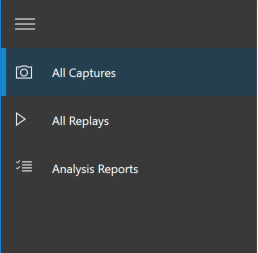
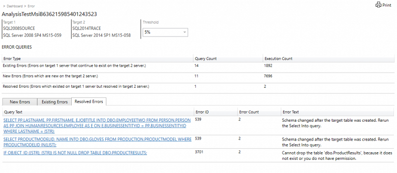
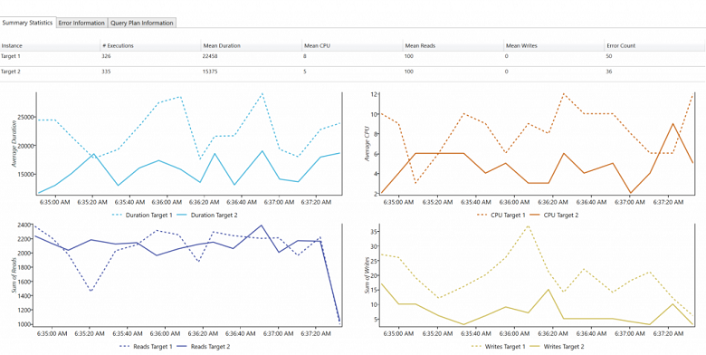

# Get started with Database Experimentation Assistant

The Database Experimentation Assistant (DEA) is an A/B testing solution for changes in SQL Server environments, such as upgrades or new indexes. DEA assists in evaluating how the workload on your source server (current environment) will perform against your new environment. DEA guides you through running an A/B test through three steps: 

- Capture
- Replay
- Analysis

This article walks you through these steps.

## Capture

The first step of SQL Server A/B testing is capturing a trace on your source server, which is typically the production server. Trace files capture the entire query workload on that server including their timestamps. Later, this trace is replayed on your target servers to be used for analysis. The analysis report provides insights on the difference in performance of the workload between your two target servers.

Notes:

- Before starting your trace capture, make sure you back up the databases from which you're capturing trace.
- A DEA user must be configured to connect to the database using Windows authentication.
- A SQL Server service account requires access to the source trace file path.

Follow these steps to capture a trace on your source server:

1. In DEA, go to **All Captures** by selecting the camera icon on the left navigation.

   

1. Provide necessary inputs to begin capture.

   - **Trace name:** the file name for the new trace file you're creating. Avoid using a trace name with the rollover file naming convention, for example, 'CaptureName\_NNN'.
   - **Duration:** duration for the capture.
   - **SQL Server instance name:** server instance from which you would like to capture trace.
   - **Database name:** name of the database on the SQL Server to capture trace. If left blank, trace will be captured from all databases on the server.
   - **Path to store source trace file on SQL Server machine:** folder path where you would like to save the trace file.

1. After you provide all the necessary inputs, make the target database(s) are backed up and select the check box.
1. Choose **Start** to start the capture.

You can view the progress of your capture, including start time, duration, and time remaining. You can start a new capture while waiting for this capture to finish. Once your capture is completed, use the output trace file to start the second phase: replaying the trace file on your target servers.

Check out [this FAQ page](https://blogs.msdn.microsoft.com/datamigration/2017/03/24/dea-2-0-capture-trace-faq/) for commonly asked questions about Capture.

## Replay

The second step of SQL Server A/B testing is to replay the trace file captured in the first step to your target servers, and collect extensive traces from the replays for analysis. You replay on two target servers: one mimicking your source server (Target 1), and one mimicking your proposed change (Target 2). Target 1 and Target 2 should be as similar as possible in hardware configurations so that SQL Server can accurately analyze the performance impact of your proposed changes.

Notes:

- To run replay, your machines must be set up to run Distributed Replay (DReplay) traces. [Read the blog on how to set up Distributed Replay controller and clients](https://blogs.msdn.microsoft.com/datamigration/distributed-replay-controller-and-client-setup/).
- Make sure to restore the database(s) on your target servers using the backup from the source server.
- Query caching in SQL can affect evaluation results. We recommend restarting the SQL Server service (MSSQLSERVER) in the services application to improve consistency in evaluation results.

Follow these steps to replay the trace file:

1. In DEA, go to **All Replays** by selecting the play icon on the left navigation. Similar to the **All Captures** page, you see the list of past replays run during the session, if any. To start a new replay, choose **New Replay**.

1. Provide all necessary inputs:

   - **Replay name:** the file name for the replay trace.
   - **Controller machine name:** name of the distributed replay controller machine.
   - **Path to source trace file on controller:** file path for source trace file from [Capture](#Capture).
   - **SQL Server instance name:** target SQL Server to replay source trace.
   - **Path to store target trace file on SQL Server machine:** folder path for the resulting replay trace file.

1. After you enter all necessary inputs, select the check box to restore the backup from the first step.

1. Choose **Start** to start the replay. 

Similar to a new capture, you can view the status of your replay. After replaying the source trace on both of your target servers, you're ready to generate an analysis report.

Check out [this FAQ page](https://blogs.msdn.microsoft.com/datamigration/2017/03/24/dea-2-0-replay-faq/) for commonly asked questions about Replay.

## Analysis

The final step is to generate an analysis report, using the replay traces, to gain insights on performance implications of the proposed change.

Notes:

- If one or more components are missing, a prerequisites page with links for download appears when you try to generate a new analysis report (internet connection required).
- To view a report generated in the previous version of the tool, you must update the schema first.

Follow these steps to generate an analysis report:

1. Go to **Analysis Reports** on the left navigation. Connect to the SQL Server where you'll store your report databases. You'll see the list of all reports in the server. To create a new report, choose **New Report**.

1. Provide the necessary inputs to generate a report:

   - **Report name:** name of the analysis report to be created.
   - **Trace for Target 1 SQL Server:** path for the trace file from replaying on Target 1.
   - **Trace for Target 2 SQL Server:** path for the trace file from replaying on Target 2.

1. After you enter these inputs, select **Start** to generate the report. Your newly generated report appears at the top of the list, and the icon next to it becomes a green checkmark when completed.

Now view the analysis report to gain insights provided by your A/B test.

Check out [this FAQ page](https://blogs.msdn.microsoft.com/datamigration/2017/03/24/dea-2-0-analysis-faq/) for commonly asked questions about Analysis.

### Analysis Report

On the first page of your report, you see the version and build information for the target servers on which the experiment was run. Threshold lets you adjust the sensitivity or tolerance of your A/B Test analysis. By default, it's set at 5%. Any improvement in performance that is >= 5% is categorized as ‘Improved’.  The dropdown lets you evaluate the report with different performance thresholds.

Two pie charts demonstrate the performance implications of the difference between the two target servers for your workload. The left one is based on execution count and the right one is based on distinct queries. There are five possible categories:

- **Improved:** statistically, the query ran better on Target 2 than on Target 1.
- **Degraded:** statistically, the query ran worse on Target 2 than on Target 1.
- **Same:** there's no statistical difference for the query between Target 1 and Target 2.
- **Cannot Evaluate:** the sample size for the query is too small for statistical analysis. For A/B testing analysis, DEA requires the same queries to have at least 30 executions on each target.
- **Error:** the query errored out at least once on one of the targets.

Selecting a slice lets you drill down into a particular category and get performance metrics, even **Cannot Evaluate**.

On the drill-down page for a performance change category, you see a list of queries in that category. On the **Error** page, you see three different tabs:

- **New Errors:** errors that appeared on Target 2 but not on Target 1
- **Existing Errors:** errors that appeared on both Target 1 and Target 2
- **Resolved Errors:** errors that appeared on Target 1 but not on Target 2

   

Selecting a query takes you to a **Comparison Summary** page for that query.

On the **Comparison Summary** page, you see summary statistics for that query, such as the number of executions, mean duration, mean CPU, mean reads/writes, and error count.

If the query is an error query, the **Error Information** tab shows more information about the error. On the **Query Plan Information** tab, you see information about the query plans used for the query on Target 1 and Target 2.

On any page of the analysis report, select the **Print** button on the top right to print everything that is visible on the UI at that moment.

## Next steps

- [Capture trace](database-experimentation-assistant-capture-trace.md) shows you how to produce a trace file that contains a log of events that occur on a server.

- For a 19-minute introduction and demonstration of DEA, watch the following video:

  > [!VIDEO https://channel9.msdn.com/Shows/Data-Exposed/Introducing-the-Database-Experimentation-Assistant/player]
