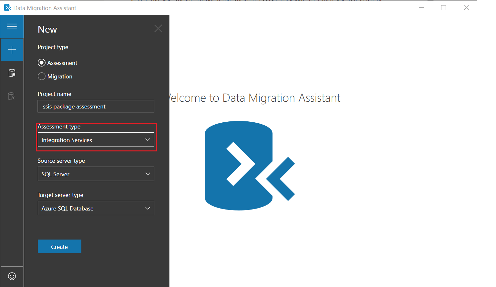
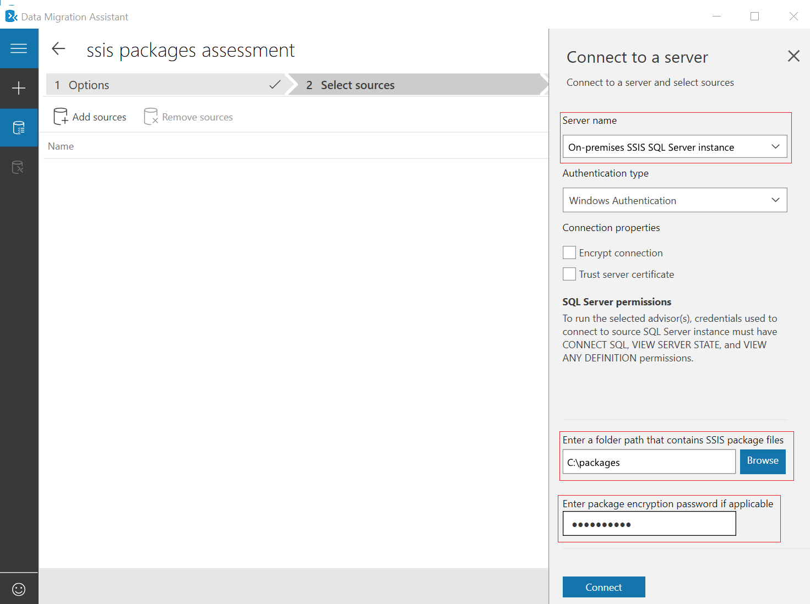
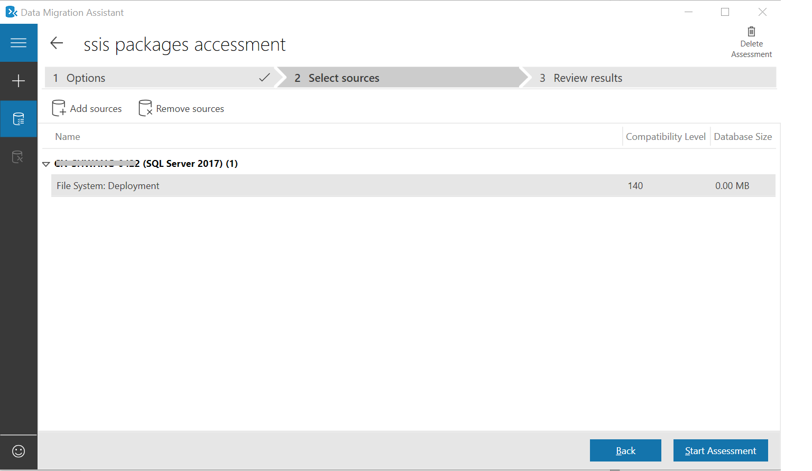
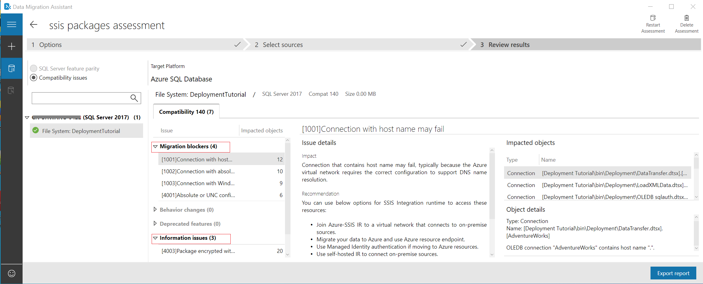

# Perform a SQL Server Integration Service migration assessment with Data Migration Assistant

The following step-by-step instructions help you perform your first assessment for migrating SQL Server Integration Service (SSIS) packages to Azure SQL Database or Azure SQL Database managed instance, by using Data Migration Assistant.

## Create an assessment

1. Select the **New** (+) icon, and then select the **Assessment** project type as **Integration Service**.

1. Set the source and target server type.

    Select the source as **SQL Server**, and set the target server type as **Azure SQL Database** or **Azure SQL Database managed instance**.

1. Click **Create**.

    

## Add sources to assess

1. Follow the default option, and click **Next** towards **Select sources**.

1. Enter the SQL server instance name, choose the Authentication type, set the correct connection properties.
1. Enter a folder path that contains SSIS packages
1. Enter package encryption password if applicable, then **Connect**.
1. Select the File system to assess, and then select **Add**.
  
1. Select **Add Sources** to open the connection flyout menu, if need assess multiple folder.
1. Click **Start Assessment**.
  

## View results

The Compatibility issues category provides partially supported or unsupported features that block migrating on-premises SSIS packages to Azure-SSIS Integration Runtime. It then provides recommendations to help you address those issues.

## Next steps

- [Migrate SQL Server Integration Services packages to an Azure SQL Database managed instance](https://docs.microsoft.com/en-us/azure/dms/how-to-migrate-ssis-packages-managed-instance)
- [Redeploy SQL Server Integration Services packages to Azure SQL Database](https://docs.microsoft.com/en-us/azure/dms/how-to-migrate-ssis-packages)
