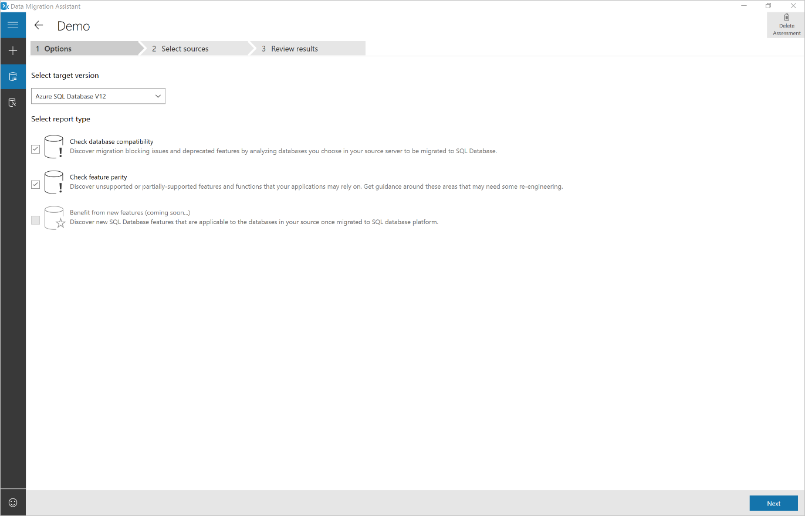
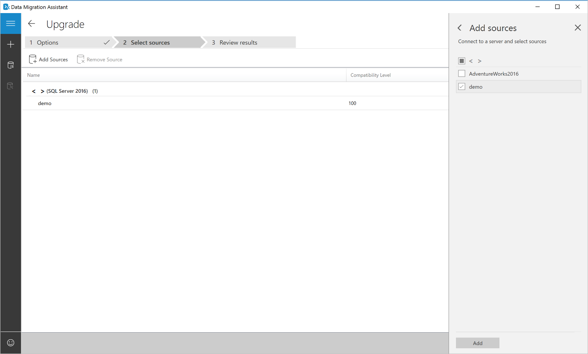
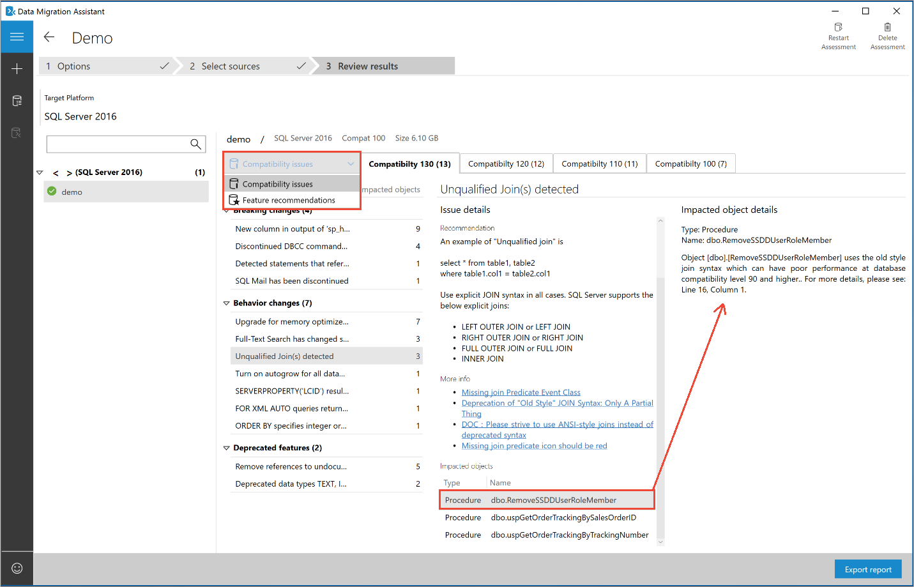

# Performing a SQL Server migration assessment
The following step-by-step instructions help you to perform your first assessment for migrating to either on-premises SQL Server or SQL Server running on Azure VM, or to Azure SQL Server database, by using Data Migration Assistant.

## Create new assessment

1.  Click on the New (+) icon, and then select “Assessment” project
    type.

2.  Set the source and target server type.

    If you are upgrading your on-premises SQL Server to a modern
    on-premises SQL Server or to SQL Server hosted on Azure VM, set the
    source and target server type to **SQL Server**. If you are migrating
    to Azure SQL Database, instead set the target server type to **Azure
    SQL Database**.

3.  Click **Create**.

    

### Choose assessment options

1.  Select the target SQL Server version that you plan to migrate to,
    and run an assessment.

2.  When you are assessing your source SQL Server migrating to
    on-premises SQL Server or to SQL Server hosted on Azure VM targets,
    you can choose one or both of the following assessment report types:

    -   Compatibility Issues

    -   New features’ recommendation

       

3.  When you are assessing your source SQL Server migrating to Azure SQL
    Database, you can choose one or both of the following
    assessment report types:

    -   Check database compatibility

    -   Check feature parity

       

### Add databases to assess

1.  Click on **Add Sources** to open the connection fly-out.

2.  Enter the SQL server instance name, choose the Authentication type, set
    the correct connection properties, and then click **Connect**.

3.  Select the databases to assess, and then click **Add**.

    > [!NOTE] 
    > You can remove databases after adding them by selecting
    > multiple databases while holding the "shift" or "Ctrl" key, and then
    > clicking **Remove Sources**. You can also add databases from multiple
    > SQL Server instances by using the **Add Sources** button.

4.  Click **Next** to start the assessment.

    

### View results

The duration of the assessment depends on the number of databases added and the schema size of each database. Results are displayed per database as soon as they are available.

1.  Select the database that has completed assessment, and then switch
    between **Compatibility issues** and **Feature recommendations**
    using the switcher.

2.  Review the compatibility issues across all compatibility levels
    supported by the target SQL Server version selected on the "Options"
    screen.

Compatibility issues can be reviewed by analyzing the impacted object and its details for every issue identified under “Breaking changes”, “Behavior changes” and “Deprecated features.”

Similarly, you can review feature recommendation across **Performance**, **Storage**, and **Security** areas.

Feature recommendations cover a variety of features such as In-Memory OLTP and Columnstore, Stretch Database, Always Encrypted (AE), Dynamic Data Masking (DDM), and Transparent Data Encryption (TDE).

For Azure SQL Database, the assessments provide migration blocking issues and feature parity issues.  Review the results for both categories by selecting the specific options.

- The **SQL Server feature parity** category provides a comprehensive set of recommendations, alternative approaches available in Azure, and mitigating steps so that you can plan this effort into your migration projects.

  

- The **Compatibility issues** category provides partially or unsupported features that are the compatibility issues that block migrating on-premises SQL Server database(s) to Azure SQL Database(s. It then provides recommendations to help you address those issues.

  

### Export results

After all databases finish assessment, click **Export report** to export the results to either a JSON or a CSV file for analyzing the data at your own convenience.

You can run multiple assessments concurrently and view the state of the assessments by navigating to the **All Assessments** screen.
