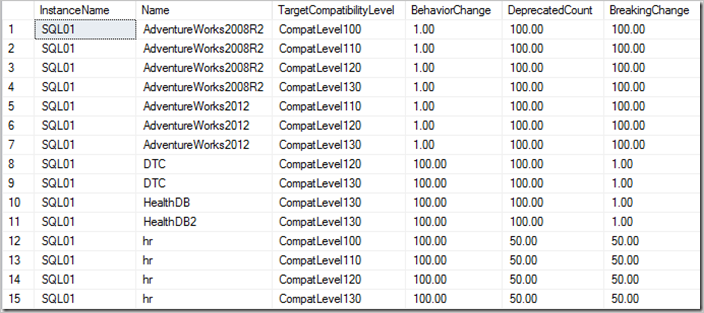
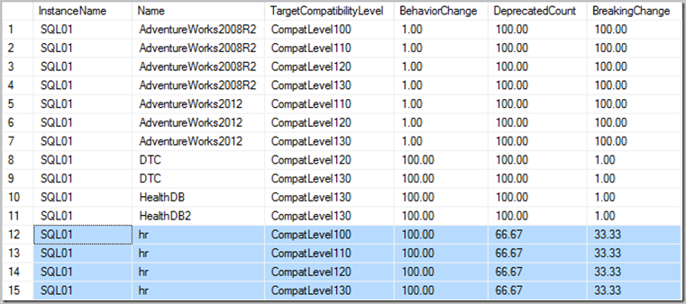
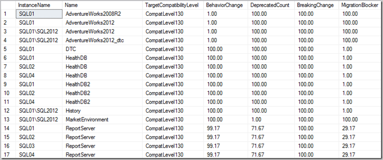

# Consolidate assessment reports (Data Migration Assistant)

You can use the command line to perform migration assessments in unattended mode, starting with Data Migration Assistant v2.1. This feature helps you to run the assessments at scale. The assessment results in the form of a JSON or CSV file.

You can assess multiple databases in a single instantiation of the Data Migration Assistant command-line utility and export all the assessments results into a single JSON file. Or, you can assess one database at time and later consolidate the results from these multiple JSON files into a SQL database.

For information on how to run Data Migration Assistant from the command line, see [Run Data Migration Assistant from Command Line](../dma/dma-commandline.md). 


## Import assessment results into a SQL Server database

Use the PowerShell script available in this [Github repository](https://github.com/Microsoft/sql-server-samples/tree/master/samples/features/data-migration-assistant) to import the assessment results from JSON files into a SQL Server database.

> [!NOTE]
> PowerShell v5 or higher is required.

When you execute the script, you need to provide the following information: 

- **serverName**: SQL Server instance name that you want to import the assessment results from JSON files.

- **databaseName**: The database name that the results get imported to.

- **jsonDirectory**: The folder that the assessment results saved to, in one or more JSON files.

- **processTo**: SQLServer

Add the preceding values in the
"EXECUTE FUNCTIONS" section, as follows.

```
dmaProcessor -serverName localhost \`\
-databaseName DMAReporting \`\
-jsonDirectory "C:\\temp\\DMACmd\\output\\" \`\
-processTo SQLServer
```

The PowerShell script creates the following objects in the SQL instance you have specified, if the objects don’t already exist:

- **Database** – The name provided in the PowerShell parameters

  - Main repository

- **Table** – ReportData

  - Data for reporting

- **Table** - BreakingChangeWeighting

  - Reference table for all breaking changes. Here you can define your own weighting values to influence a more accurate percentage (%) upgrade success ranking.

- **View** – UpgradeSuccessRanking\_OnPrem

  - View displaying a success factor for each database to be migrated on-premises.

- **View** – UpgradeSuccessRanking\_Azure

  - View displaying a success factor for each database to be migrated on-premises.

- **Stored Procedure** – JSONResults\_Insert

  - Used to import data from a JSON file into SQL Server.

- **Stored Procedure** – AzureFeatureParityResults\_Insert

  - Used to import Azure feature parity results from a JSON file into SQL Server.

- **Table Type** – JSONResults

  - Used to hold the JSON results for on-premises assessments and pass to the JSONResults\_Insert stored procedure

- **Table Type** – AzureFeatureParityResults

  - Used to hold the Azure feature parity results for azure assessments and pass to the AzureFeatureParityResults\_Insert stored procedure

The PowerShell script creates a **Processed** directory inside the directory you provided that contains the JSON files that are to be processed.

After the script completes, the results are imported into the table, ReportData.

### Viewing the results in SQL Server

After the data has been loaded, connect to your SQL Server instance. Your screen should appear as shown in the following graphic:


The dbo.ReportData table contains the contents of the JSON file in its raw form.

## On-premises upgrade success ranking

To see a list of databases and their percentage (%) success rank, select the dbo.UpgradeSuccessRanking_OnPrem view:



Here you can see for a given database what is the upgrade success chance for different compatibility levels. So, for example, the HR database was assessed against compatibility levels 100, 110, 120 and 130. This assessment helps you visually see how much effort is involved in migrating to a later version of SQL Server from the current version that the database is currently on.

Usually the metric you care about is how many breaking changes there are for a given database. In the preceding example, you can see that the HR database has a 50% upgrade success factor for compatibility levels 100, 110, 120 and 130.

This metric can be influenced by altering the weighting values in the dbo.BreakingChangeWeighting table.

In the following example, the effort involved in fixing the syntax issue in the HR database is considered high so a value of 3 is assigned to **Effort**. Because it wouldn’t take long to fix the syntax issue, a value of 1 is assigned to **FixTime**. Because there would be some cost involved in making the change, a value of 2 is assigned to **Cost**. Using this value changes the blended Changerank to 2.

> [!NOTE]
> The scoring is on a scale of 1-5.  1 being low and 5 being high. Also, the ChangeRank is a computed column.


Now in this example when you query the dbo.UpgradeSuccessRanking_OnPrem view, the upgrade success factor for the HR database for breaking changes has dropped.



## Azure upgrade success ranking

To see a list of databases to migrate to Azure SQL DB and their percentage success rank, select the dbo.UpgradeSuccessRanking_Azure view.



Here you are interested in the MigrationBlocker value. 100.00 means that there is a 100% success rank for moving a database to Azure SQL Database v12.

The difference with this view is that there is currently no override for changing the weighting for migration blocker rules.

For information on reporting on this data using Power BI, see [Report on your consolidated Assessments with PowerBI](../dma/dma-powerbiassesreport.md).
