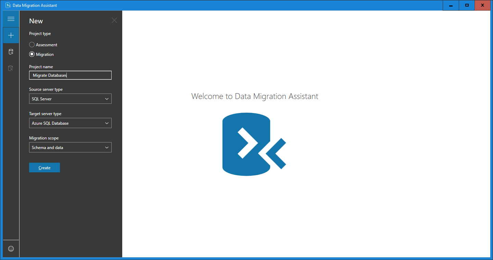
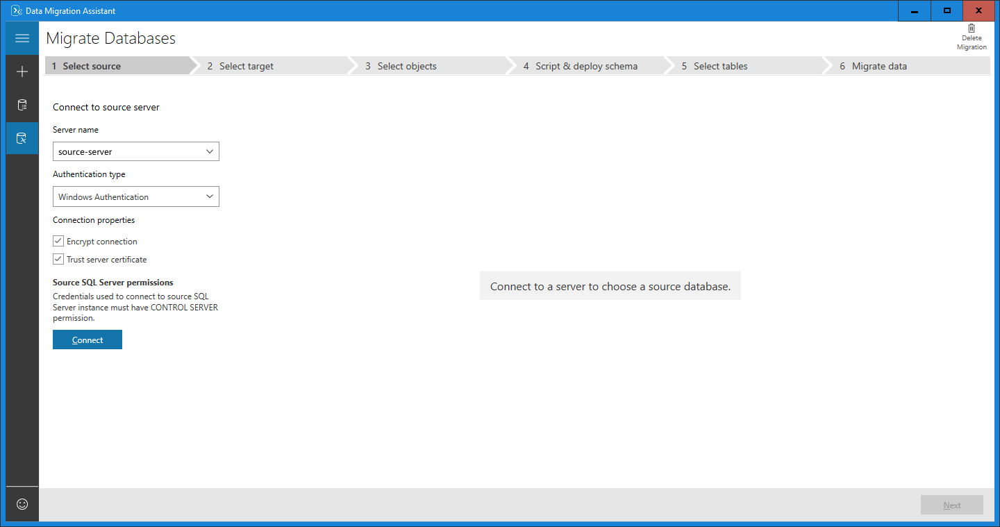
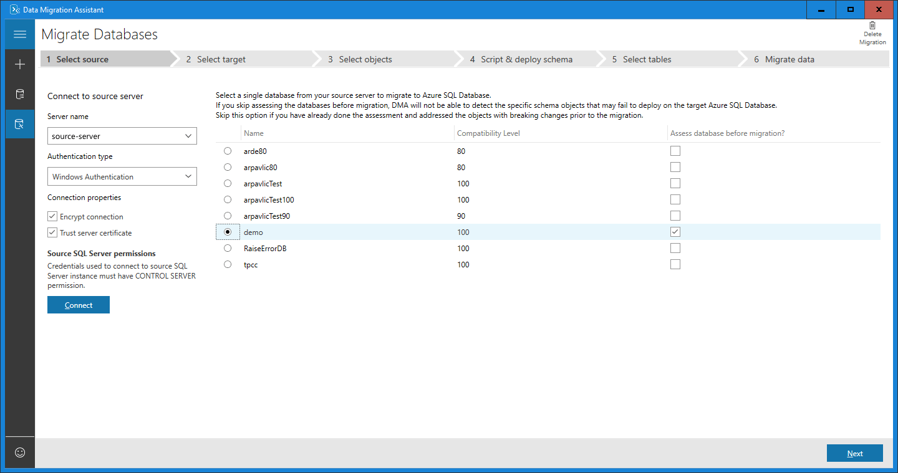
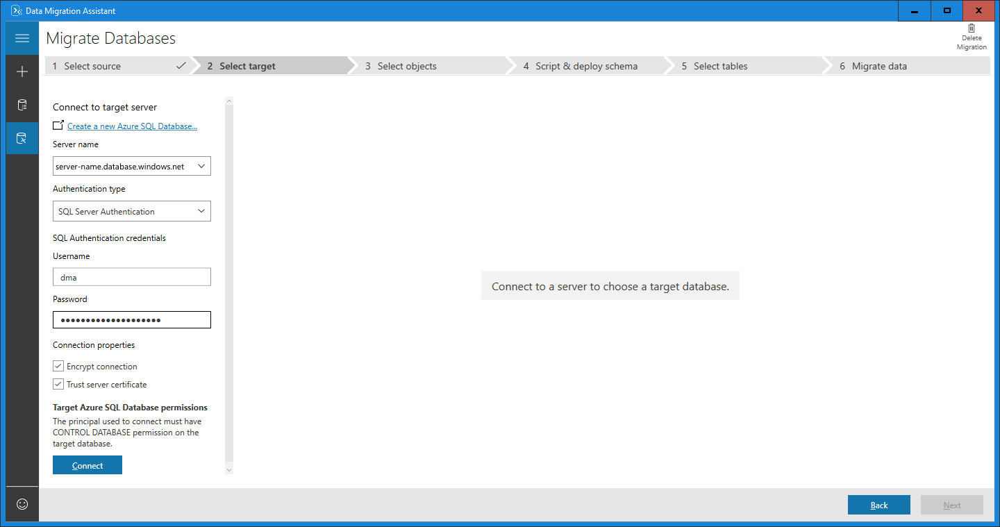
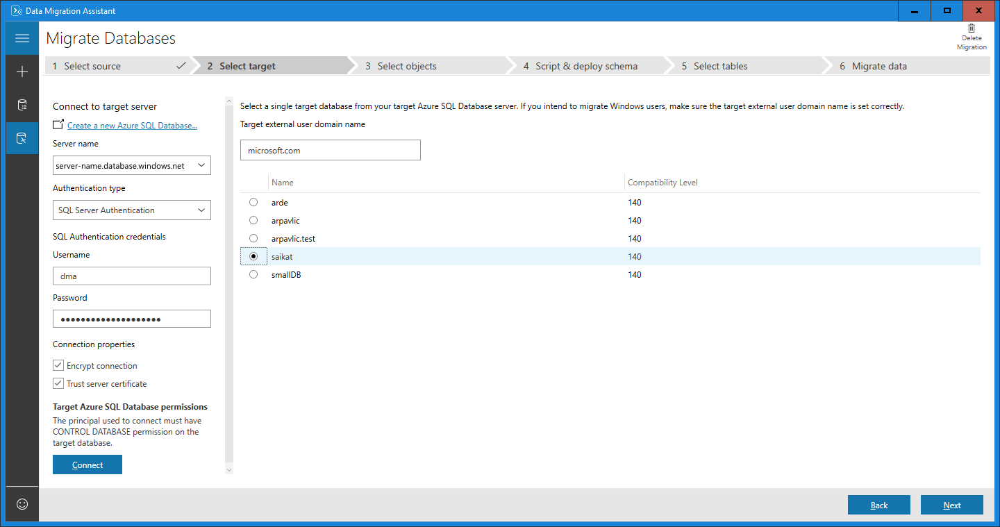
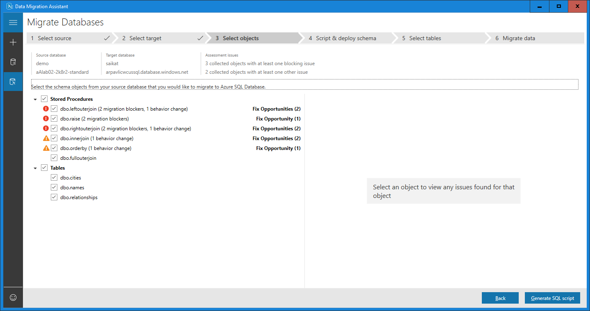
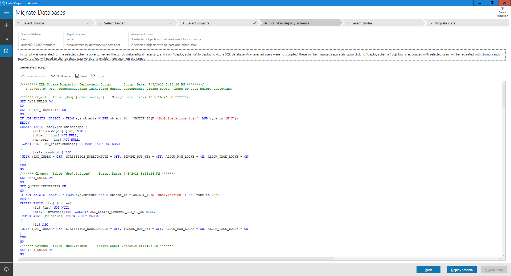
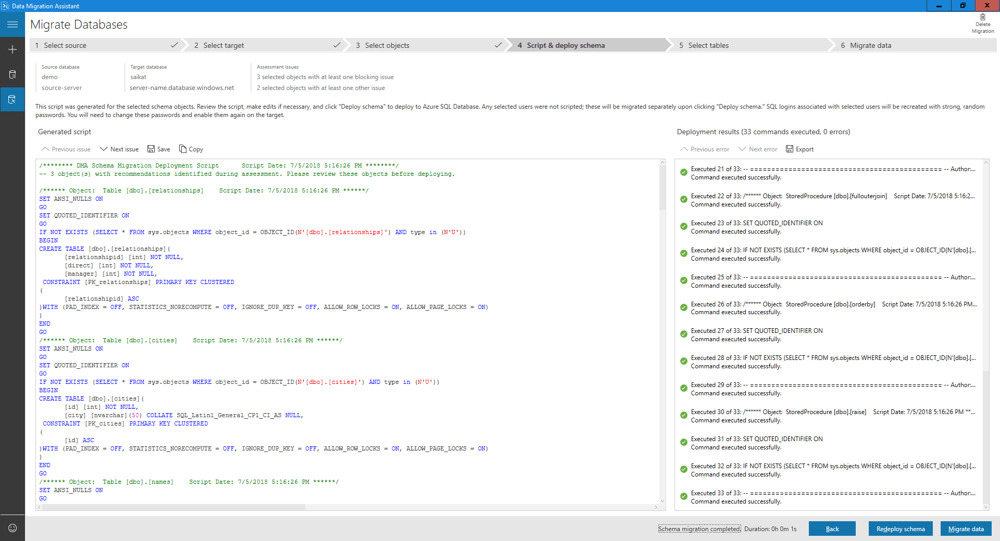
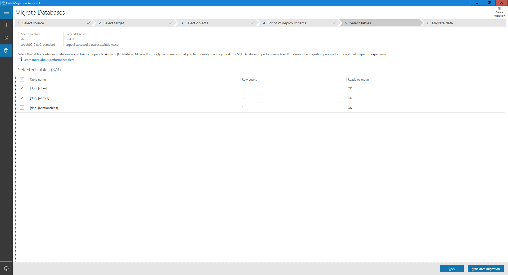
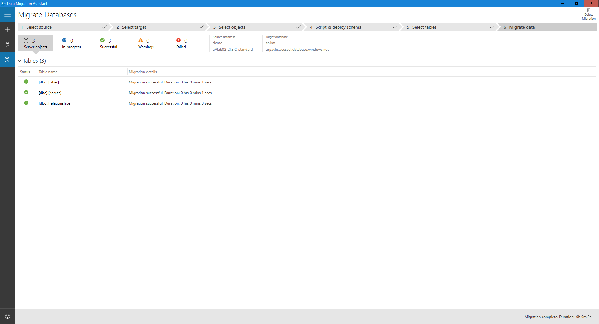

# Migrate on-premises SQL Server to SQL Server or SQL Server on Azure VMs using the Data Migration Assistant

The Data Migration Assistant provides seamless assessments of SQL Server on-premises and upgrades to later versions of SQL Server or migrations to SQL Server on Azure VMs or Azure SQL Database.

This article provides step-by-step instructions for migrating SQL Server on-premises to Azure SQL Database by using the Data Migration Assistant.   

## Create a new migration project

1. On the left pane, select **New** (+), and then select the **Migration** project type.

2. Set the source type to **SQL Server** and the target server type to **Azure SQL Database**.

3. Select **Create**.

   

## Specify the source server and database

1. For the source, under **Connect to source server**, in the **Server name** text box, enter the name of the source SQL Server instance.

2. Select the **Authentication type** supported by the source SQL Server instance.

   > [!NOTE]
   > It is recommedned that you encrypt the connection by selecting the **Encrypt connection** check box under **Connection poperties**.

    

3. Select **Connect**.

4. Select a single source database to migrate to Azure SQL Database.

   > [!NOTE]
   > If you would like to assess the database and view and apply recommended fixes before migration, select the **Assess database before migration?** check box.

    

5. Select **Next**.

## Specify the target server and database

1. For the target, under **Connect to target server**, in the **Server name** text box, enter the name of the Azure SQL Database instance. 

2. Select the **Authentication type** supported by the target Azure SQL Database instance.

   > [!NOTE]
   > It is recommedned that you encrypt the connection by selecting the **Encrypt connection** check box under **Connection poperties**.

     

3. Select **Connect**.

4. Select a single target database to which to migrate.

   > [!NOTE]
   > If you intend to migrate Windows users, in the **Target external user domain name** text box, make sure that the tartget external user domain name is specified correctly.

    

5. Select **Next**.

## Select schema objects

1.	Select the schema objects from the source database that you want to migrate to Azure SQL Database.

    

       > [!NOTE]
       > Some of the objects that cannot be converted as-is are presented with automatic fix opportunities. Clicking these objects on the left pane displays the suggested fixes on the right pane. Review the fixes and choose to either apply or ignore all changes, object by object. Note that applying or ignoring all changes for one object does not affect changes to other database objects. Statements that cannot be converted or automatically fixed are reproduced to the target database and commented.

    

2. Select **General SQL script**.
 
3. Review the generated script.

    

## Deploy schema

1. Select **Deploy schema**.

2. Review the results of the schema deployment.
 
    

3. Select **Migrate data** to initiate the data migration process.
 
4. Select the tables with the data you want to migrate.

     

5. Select **Start data migration**.
 
The final screen shows the overall status.

     

## See also

- [Data Migration Assistant (DMA)](../dma/dma-overview.md)
- [Data Migration Assistant: Configuration settings](../dma/dma-configurationsettings.md)
- [Data Migration Assistant: Best Practices](../dma/dma-bestpractices.md)
