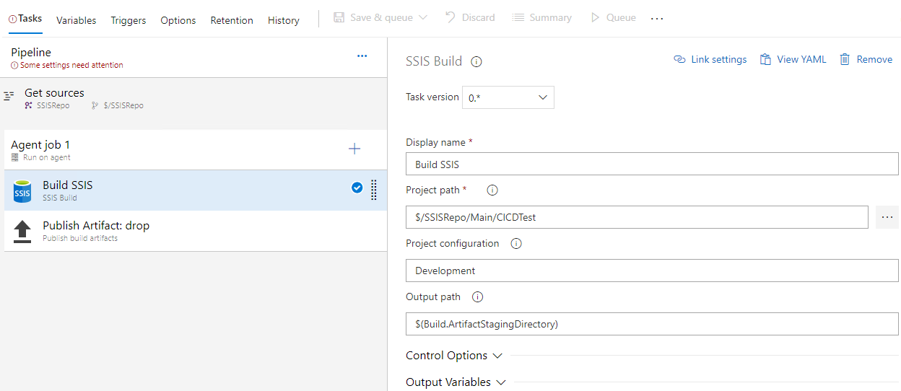
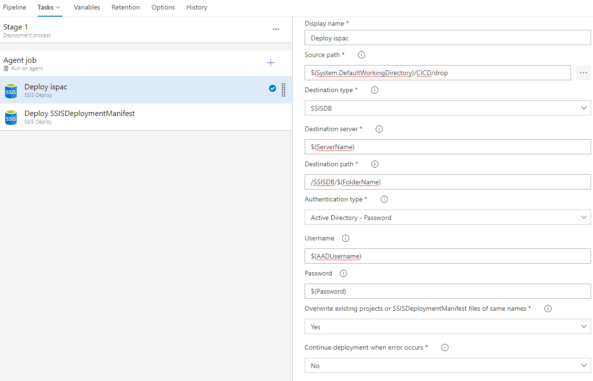

# SQL Server Integration Services (SSIS) DevOps Tools (Preview)

[SSIS DevOps Tools](https://marketplace.visualstudio.com/items?itemName=SSIS.ssis-devops-tools) extension is available in **Azure DevOps** marketplace.

If you do not have an **Azure DevOps** organization, firstly sign up for [Azure Pipelines](https://docs.microsoft.com/azure/devops/pipelines/get-started/pipelines-sign-up?view=azure-devops), then add **SSIS DevOps Tools** extension following [the steps](https://docs.microsoft.com/azure/devops/marketplace/overview?view=azure-devops&tabs=browser#add-an-extension).

**SSIS DevOps Tools** includes **SSIS Build** task and **SSIS Deploy** release task.

- **SSIS Build** task supports building dtproj files in project deployment model or package deployment model.

- **SSIS Deploy** task supports deploying single or multiple ispac files to on-premises SSIS catalog and Azure-SSIS IR, or SSISDeploymentManifest files and their associated files to on-premises or Azure file share.

## SSIS Build task

### Properties

#### Project path

Path of the project folder or file to be built. If a folder path is specified, SSIS Build task will search all dtproj files recursively under this folder and build them all.

#### Project configuration

Name of the project configuration to be used for build. If not supplied, it defaults to the first defined project configuration in each dtproj file.

#### Output path

Path of a separate folder to save build results, which can be published as build artifact via [publish build artifacts task](https://docs.microsoft.com/azure/devops/pipelines/tasks/utility/publish-build-artifacts?view=azure-devops).

### Limitations and known issues

- SSIS Build task relies on Visual Studio and SSIS designer, which is mandatory on build agents. Thus, to run SSIS Build task in the pipeline, you must choose **vs2017-win2016** for Microsoft-hosted agents, or install Visual Studio and SSIS designer (either VS2017 + SSDT2017, or VS2019 + SSIS Projects extension) on self-hosted agents.

- To build SSIS projects using any out-of-box components (including SSIS Azure feature pack, and other third-party components), those out-of-box components must be installed on the machine where the pipeline agent is running.  For Microsoft-hosted agent, user can add a [PowerShell Script task](https://docs.microsoft.com/azure/devops/pipelines/tasks/utility/powershell?view=azure-devops) or [Command Line Script task](https://docs.microsoft.com/azure/devops/pipelines/tasks/utility/command-line?view=azure-devops) to download and install the components before SSIS Build task  is executed.

- Protection level **EncryptSensitiveWithPassword** and **EncryptAllWithPassword** are not supported in SSIS Build task. Please make sure all SSIS projects in codebase are not using these two protection levels, or SSIS Build task will hang and timeout during execution.

## SSIS Deploy task

### Properties

#### Source path

Path of source ISPAC or SSISDeploymentManifest files you want to deploy. This path could be a folder path or a file path.

#### Destination type

Type of the destination. Currently SSIS Deploy task supports two types:

- *File System*: Deploy SSISDeploymentManifest files and their associated files to a specified file system. Both on-premises and Azure file share are supported.
- *SSISDB*: Deploy ISPAC files to a specified SSIS catalog, which can be hosted on on-premises SQL Server or Azure-SSIS Integration Runtime.

#### Destination server

Name of destination SQL server. It can be the name of an on-premises SQL Server, Azure SQL Database, or Azure SQL Database managed instance. This property is only visible when destination type is SSISDB.

#### Destination path

Path of the destination folder where the source file will be deployed to. For example:

- /SSISDB/\<folderName\>
- \\\\\<machineName\>\\\<shareFolderName\>\\\<optionalSubfolderName\>

SSIS Deploy task will create the folder and sub-folder if they don’t exist.

#### Authentication type

Authentication type to access the specified destination server. This property is only visible when Destination type is SSISDB. In general SSIS Deploy task supports four types:

- Windows Authentication
- SQL Server Authentication
- Active Directory - Password
- Active Directory - Integrated

But whether the specific authentication type is supported depends on destination server type and agent type. Detail support matrix is listed in below table.

| |Microsoft-hosted agent|Self-hosted agent|
|---------|---------|---------|
|SQL server on-premises or VM |N/A|Windows Authentication|
|Azure SQL|SQL Server Authentication   Active Directory - Password|SQL Server Authentication   Active Directory - Password   Active Directory - Integrated|

#### Domain name

Domain name to access the specified file system. This property is only visible when Destination type is File System.
You can leave it empty when the user account to run the self-hosted agent has been granted read/write access to the specified destination path.

#### Username

Username to access the specified file system or SSISDB. This property is visible when Destination type is File System or Authentication type is SQL Server Authentication or Active Directory - Password.
You can leave it empty when the destination type is file system, and the user account to run the self-hosted agent has been granted read/write access to the specified destination path.

#### Password

Password to access the specified file system or SSISDB. This property is visible when destination type is file system or authentication type is SQL Server authentication or Active Directory - password.
You can leave it empty when destination type is file system, and the user account to run the self-hosted agent has been granted read/write access to the specified destination path.

#### Overwrite existing projects or SSISDeploymentManifest files of the same names

Specify whether overwrite the existing projects or SSISDeploymentManifest files of the same names. If 'No', SSIS Deploy task will skip deploying those projects or files.

#### Continue deployment when error occurs

Specify whether tp continue deployment for remaining projects or files when an error occurs. If 'No', SSIS Deploy task will stop immediately when error occurs.

### Limitations and known issues

SSIS Deploy Task doesn’t support the following scenarios currently:

- Configure environment in SSIS catalog.
- Deploy ispac to Azure SQL Server or Azure SQL Managed Instance which only allows multi-factor authentication (MFA).
- Deploy packages to MSDB or SSIS Package Store.

## Release notes

### Version 0.1.3 Preview

Release Date: January 19, 2020

- Fixed an issue that ispac cannot be deployed if its original file name is changed.

### Version 0.1.2 Preview

Release Date: January 13, 2020

- Added more detailed exception information in the SSIS Deploy task log when the destination type is SSISDB.
- Fixed the example destination path in the help text of the property Destination path of SSIS Deploy task.

### Version 0.1.1 Preview

Release Date: January 6, 2020

- Added a restriction of minimal agent version requirement. Currently the minimal agent version of this product is 2.144.0.
- Fixed some incorrect display text for SSIS Deploy task.
- Refined some error messages.

### Version 0.1.0 Preview

Release Date: December 5, 2019

Initial release of SSIS DevOps Tools. This is a preview release.

## Next steps

- Get [SSIS DevOps extension](https://marketplace.visualstudio.com/items?itemName=SSIS.ssis-devops-tools)
