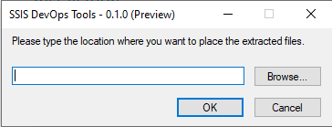
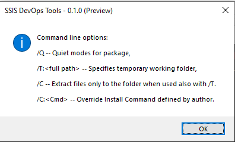

# Standalone SQL Server Integration Service (SSIS) DevOps Tools

Standalone **SSIS DevOps Tools** provide a set of executables to do SSIS CICD tasks. Without the dependency on the installation of Visual Studio or SSIS runtime, these executables can be easily integrated with any CICD platform. The executables provided are:

- SSISBuild.exe: build SSIS projects in project deployment model or package deployment model.
- SSISDeploy.exe: deploy ISPAC files to SSIS catalog, or DTSX files and their dependencies to file system.

## Installation

.NET framework 4.6.2 or higher is required.

Download the latest installer from [download center](https://aka.ms/AA9xp65), then install via wizard or command line:

- Install via wizard

Double-click the .exe file to install, then specify a folder to extract the executables and dependency files.



- Install via command line

```
SSISDevOpsTools.exe /Q /C /T:<full path>
```




## SSISBuild.exe

**Syntax**

```
SSISBuild.exe -project|-p:<dtproj file path> [-configuration|-c:<configuration name>] [-projectPassword|-pp:<project password>] [-stripSensitive|-ss] [-output|-o:<output path>] [-log|-l:<log level>[;<log path>]] [-quiet|-q] [-help|-h|-?]
```

**Parameters**

|Parameter|Description|
|---------|---------|
|-project \|-p:\<dtproj file path>|File path of the dtproj file to be built.|
|-configuration\|-c:\<configuration name>|Name of the project configuration to be used for build. If not supplied, it defaults to the first defined project configuration in the dtproj file.|
|-projectPassword\|-pp:\<project password>|Password of the SSIS project and its packages. This argument is only valid when the protection level of the SSIS project and packages is EncryptSensitiveWithPassword or EncryptAllWithPassword. For package deployment model, all packages must share the same password specified by this argument.|
|-stripSensitive\|-ss|Convert the protection level of the SSIS project to DontSaveSensitve. When protection level is EncryptSensitiveWithPassword or EncryptAllWithPassword, the argument -projectPassword must be correctly set. This option is only valid for project deployment model.|
|-output\|-o:\<output path>|Output path of the build artifact. The value of this argument will overwrite the default output path in the project configuration.|
|-log\|-l:\<log level>[;\<log path>]|Log related settings. <li>log level: Only logs with equal or higher logging level will be written to the log file. There are four logging levels (from low to high): DIAG, INFO, WRN, ERR. The default logging level is INFO if it's not specified. <li> log path: Path of the file to persist logs. Log file will not be generated if the path is not specified.|
|-quiet\|-q|Do not display any logs to the standard output.|
|-help\|-h\|-?|Show detailed usage information of this command-line utility.|

**Examples**

- Build a dtproj with the first defined project configuration, not encrypted with password:    
    ```
    SSISBuild.exe -p:"C:\projects\demo\demo.dtproj"
    ```

- Build a dtproj with configuration "DevConfiguration", encrypted with password, and output the build artifacts to a specific folder:
    ```
    SSISBuild.exe -p:C:\projects\demo\demo.dtproj -c:DevConfiguration -pp:encryptionpassword -o:D:\folder
    ```

- Build a dtproj with configuration "DevConfiguration", encrypted with password, striping its sensitive data, and log level DIAG:
    ```
    SSISBuild.exe -p:C:\projects\demo\demo.dtproj -c:DevConfiguration -pp:encryptionpassword -ss -l:diag
    ```

## SSISDeploy.exe

**Syntax**

```
SSISDeploy.exe -source|-s:<source path> -destination|-d:<type>;<path>[;server] [-authType|-at:<auth type name>] [-connectionStringSuffix|-css:<connection string suffix>] [-projectPassword|-pp:<project password>] [-username|-u:<username>] [-password|-p:<password>] [-log|-l:<log level>[;<log path>]] [-quiet|-q] [-help|-h|-?]
```

**Parameters**

|Parameter|Description|
|---------|---------|
|-source\|-s:\<source path>|Local file path of artifacts to be deployed. ISPAC, DTSX, path of folder for DTSX, SSISDeploymentManfiest are allowed.|
|-destination\|-d:\<type>;\<path>[;server]|Destination type, path of the destination folder, and server name of the SSIS catalog where the source file will be deployed to. Currently we support following two destination types: <li> *CATALOG*: deploy single or multiple ISPAC files to the specified SSIS catalog. The path of CATALOG destination should be in such format: <br> /SSISDB/\<folder name>[/\<project name>] <br> The optional \<project name\> is only valid when the source specifies a single ISPAC file path. Server name must be specified for CATALOG destination. <li> *FILE*: deploy SSIS packages or files specified in a single or multiple SSISDeploymentManifest files to the specified path of the file system. The path of FILE destination can be a local folder path or a network folder path in such format: <br>\\\\\<machine name>\\\<folder name>[\\\<sub folder name>\...]|
|-authType\|-at:\<auth type name>|Authentication type to access SQL Server. Mandatory for CATALOG destination. Following types are supported: <li> WIN:  Windows Authentication <li> SQL:  SQL Server Authentication <li> ADPWD:  Active Directory - Password <li> ADINT:  Active Directory - Integrated|
|-connectionStringSuffix\|-css:\<connection string suffix> |Suffix of the connection string, which is used to connect to the SSIS catalog.|
|-projectPassword\|-pp:\<project password> |Password to decrypt the ISPAC or DTSX files.|
|-username\|-u:\<username>	|Username to access the specified SSIS catalog or file system. Prefix with domain name is allowed for file system access.|
|-password\|-p:\<password>	|Password to access the specified SSIS catalog or file system.|
|-log\|-l:\<log level>[;\<log path>] |Log related settings for running this utility. <li> log level: Only logs with equal or higher logging level will be written to the log file. There are four logging levels (from low to high): DIAG, INFO, WRN, ERR. The default logging level is INFO if it's not specified. <li> log path: Path of the file to persist logs. Log file will not be generated if the path is not specified.|
|-quiet\|-q |Do not display logs to the standard output.|
|-help\|-h\|-?	|Show detailed usage information of this command-line utility.|

**Examples**

- Deploy a single ISPAC not encrypted with password to SSIS catalog with Windows authentication.
    ```
    SSISDeploy.exe -s:D:\myfolder\demo.ispac -d:catalog;/SSISDB/destfolder;myssisserver -at:win
    ```

- Deploy a single ISPAC encrypted with password to SSIS catalog with SQL authentication, and rename the project name.
    ```
    SSISDeploy.exe -s:D:\myfolder\test.ispac -d:catalog;/SSISDB/folder/testproj;myssisserver -at:sql -u:sqlusername -p:sqlpassword -pp:encryptionpassword
    ```

- Deploy a single SSISDeploymentManifest and its associated files to Azure file share.
    ```
    SSISDeploy.exe -s:D:\myfolder\mypackage.SSISDeploymentManifest -d:file;\\myssisshare.file.core.windows.net\destfolder -u:Azure\myssisshare -p:storagekey
    ```

- Deploy a folder of DTSX files to on-premises file system.
    ```
    SSISDeploy.exe -s:D:\myfolder -d:file;\\myssisshare\destfolder
    ```

## Release notes
### Version 1.0.0.0

Release Date: September 1, 2021

- General Availability(GA) release.
    
### Version 0.1.3.1 Preview

Release Date: June 10, 2021

- Fixed an issue that SSISDeploy.exe failed to deploy SSIS projects with error "Unhandled Exception: System.IO.FileLoadException: Could not load file or assembly 'Microsoft.SqlServer.IntegrationServices.ProjectDeployment, Version=1.0.0.0, Culture=neutral, PublicKeyToken=31bf3856ad364e35' or one of its dependencies. Strong name validation failed. (Exception from HRESULT: 0x8013141A) ---> System.Security.SecurityException: Strong name validation failed. (Exception from HRESULT: 0x8013141A)".
    
### Version 0.1.3 Preview

Release Date: June 2, 2021

- Fixed an issue that SSISBuild.exe failed to build projects with error "Project consistency check failed. The following inconsistencies were detected" when the package name in the project contains special characters. 
- Fixed an issue that SSISBUild.exe failed to build projects when there's mismatch between the name in dtproj and the filename. 
- Fixed an issue that SSISBuild.exe failed to build projects with protection level encryptSenstiveWithPassword/EncryptAllWithPassword when the project targets SQL Server 2016.

### Version 0.1.2 Preview

Release Date: January 14, 2021

- Fixed an issue that SSISBuild.exe fails to build project with NullReference exception when package parameter metadata in SSIS project file and SSIS package mismatches.
- Fixed an issue that package fails to be executed with error starting with “Failed to decrypt protected XML node” though the package is deployed to SSISDB successfully with SSISDeploy.exe, when the SSIS project containing the package is encrypted with EncryptSensitiveWithUserKey and the package contains CM with sensitive data.

### Version 0.1.1 Preview

Release Date: November 11, 2020

- Fixed an issue that SSISDeploy.exe fails to load an assembly when deploying ispac to SSIS catalog.

### Version 0.1.0 Preview

Release Date: October 16, 2020

Initial preview release of standalone SSIS DevOps Tools.

## Next steps

- Get [standalone SSIS DevOps Tools](https://aka.ms/AA9xp65)
- If you have questions, visit [Q&A](https://marketplace.visualstudio.com/items?itemName=SSIS.ssis-devops-tools&ssr=false#qna)
