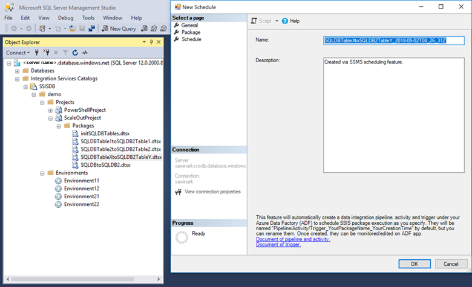
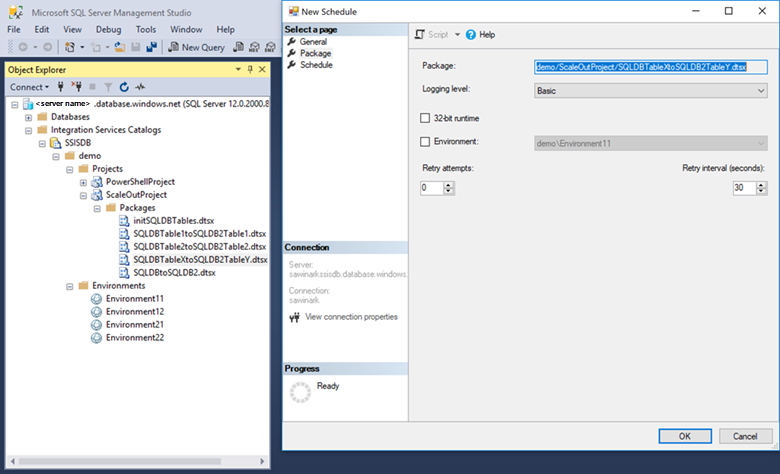
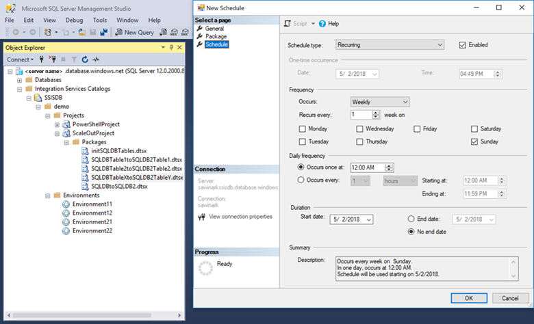
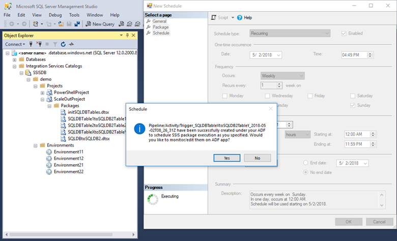
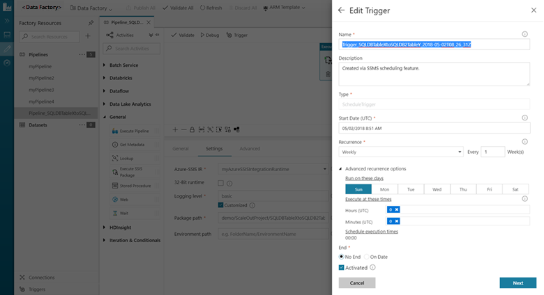

# Schedule the execution of SSIS packages deployed in Azure with SQL Server Management Studio (SSMS)

You can use SQL Server Management Studio (SSMS) to schedule SSIS packages deployed to Azure SQL Database. SQL Server on premises and SQL Database Managed Instance have SQL Server Agent and Managed Instance Agent respectively as a first-class SSIS job scheduler. SQL Database, on the other hand, does not have a built-in first-class SSIS job scheduler. The SSMS feature described in this article provides a familiar user interface that's similar to SQL Server Agent for scheduling packages deployed to SQL Database.

If you're using SQL Database to host the SSIS catalog, `SSISDB`, you can use this SSMS feature to generate the Data Factory pipelines, activities, and triggers required to schedule SSIS packages. Later you can optionally edit and extend these objects in Data Factory.

When you use SSMS to schedule a package, SSIS automatically creates three new Data Factory objects, with names based on the name of the selected package and the timestamp. For example, if the name of the SSIS package is **MyPackage**, SSMS creates new Data Factory objects similar to the following:

| Object | Name |
|---|---|
| Pipeline | **Pipeline_MyPackage_2018-05-08T09_00_00Z** |
| Execute SSIS Package activity | **Activity_MyPackage_2018-05-08T09_00_00Z** |
| Trigger | **Trigger_MyPackage_2018-05-08T09_00_00Z** |
|||

## Prerequisites

The feature described in this article requires SQL Server Management Studio version 17.7 or higher. To get the latest version of SSMS, see [Download SQL Server Management Studio (SSMS)](../../ssms/download-sql-server-management-studio-ssms.md).

## Schedule a package in SSMS

1. In SSMS, in Object Explorer, select the SSISDB database, select a folder, select a project, and then select a package. Right-click on the package and select **Schedule**.

    

2. The **New Schedule** dialog box opens. On the **General** page of the **New Schedule** dialog box, provide a name and description for the new scheduled job.

    

3. On the **Package** page of the **New Schedule** dialog box, select optional run-time settings and a run-time environment.

    

4. On the **Schedule** page of the **New Schedule** dialog box, provide the schedule settings such as frequency, time of day, and duration.

    

5. After you finish creating the job in the **New Schedule** dialog box, a confirmation appears to remind you about the new Data Factory objects that SSMS is going to create. If you select **Yes** in confirmation dialog box, the new Data Factory pipeline opens in the Azure portal for you to review and customize.

    

6. To customize the scheduling trigger, select **New/Edit** from the **Trigger** menu.

    

    The **Edit Trigger** blade opens for you to customize the scheduling options.

    

## Next steps

To learn about other methods for scheduling an SSIS package, see [Schedule the execution of an SSIS package on Azure](ssis-azure-schedule-packages.md).

To learn more about Azure Data Factory pipelines, activities, and triggers, see the following articles:
-   [Pipelines and activities in Azure Data Factory](https://docs.microsoft.com/azure/data-factory/concepts-pipelines-activities)
-   [Pipeline execution and triggers in Azure Data Factory](https://docs.microsoft.com/azure/data-factory/concepts-pipeline-execution-triggers)
