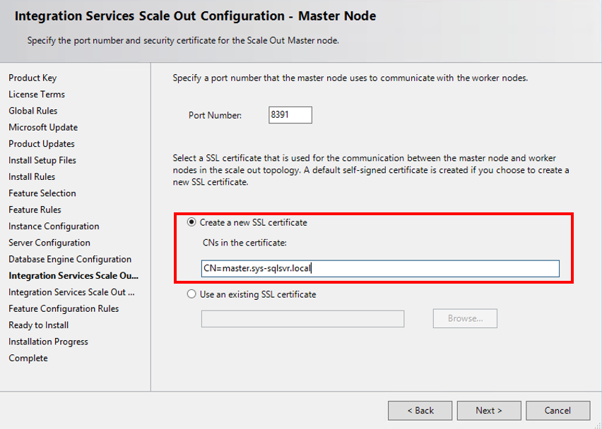
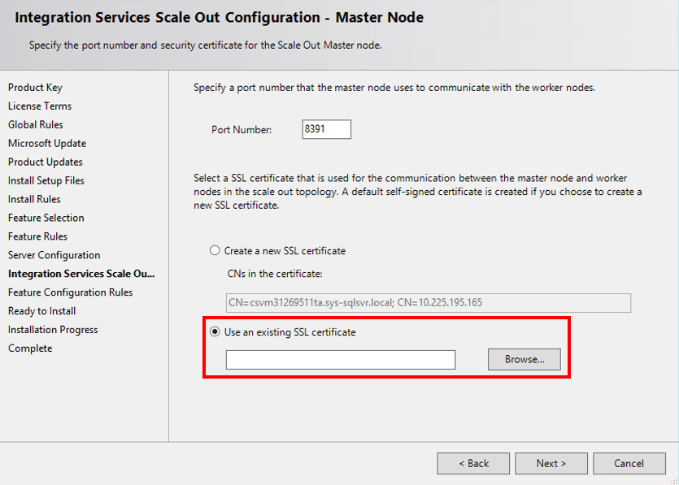
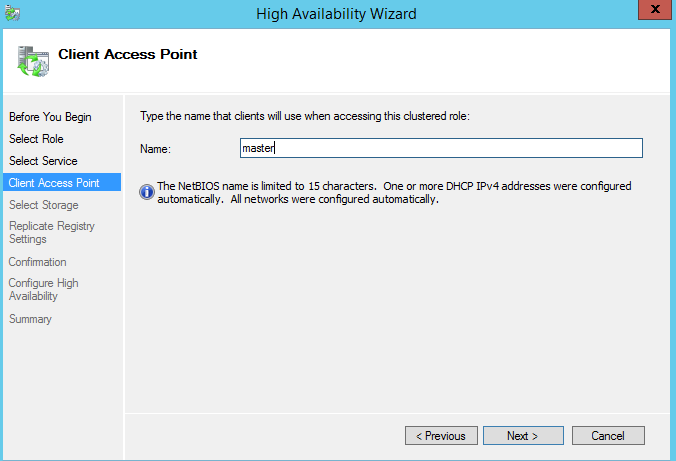

# Scale Out support for high availability

In SSIS Scale Out, worker-side high availability is provided through executing packages with multiple Scale Out Workers.
Master-side high availability is achieved with [Always On for SSIS Catalog](../service/ssis-catalog.md#always-on-for-ssis-catalog-ssisdb) and Windows failover cluster. Multiple instances of Scale Out Master are hosted in a Windows failover cluster. When the Scale Out Master service or SSISDB is down on primary node, the service or SSISDB on secondary node will continue to accept user requests and communicate with Scale Out Workers. 

To set up the master-side high availability, follow the steps below.

## 1. Prerequisites
Set up a Windows failover cluster. See [Installing the Failover Cluster Feature and Tools for Windows Server 2012](http://blogs.msdn.com/b/clustering/archive/2012/04/06/10291601.aspx) blog post for instructions. You should install the feature and tools on all cluster nodes.

## 2. Install Scale Out Master on primary node
Install Database Engine Services, Integration Services and Scale Out Master on the primary node for Scale Out Master. 

During the installation, you should 
### 2.1 Set the account running Scale Out Master service to a domain account.
This account should be able to access SSISDB on the secondary node in Windows failover cluster in the future. As Scale Out Master service and SSISDB can failover seperately, they may not be on the same node.

### 2.2 Include Scale Out Master service DNS host name in the CNs of Scale Out Master certificate.

This host name will be used in Scale Out Master endpoint. 

## 3. Install Scale Out Master on secondary node
Install Database Engine Services, Integration Services and Scale Out Master on the secondary node for Scale Out Master. 

You should use the same Scale Out Master certificate with primary node. Export the Scale Out Master SSL certificate on primary node with private key and install it to the Root certificate store of loacl machine on the secondary node. Select this certificate when installing Scale Out Master.

> [!Note]
> You can set up multiple backup Scale Out Masters by repeating the operations for secondary Scale Out Master.

## 4. Set up SSISDB always on

The instructions to set up always on for SSISDB can be seen at [Always On for SSIS Catalog (SSISDB)](../service/ssis-catalog.md#always-on-for-ssis-catalog-ssisdb).

In addition, you need to create an availability gourp listener for the availability group SSISDB added to. See [Create or Configure an Availability Group Listener](../../database-engine/availability-groups/windows/create-or-configure-an-availability-group-listener-sql-server.md).

## 5. Update Scale Out Master service configuration file
Update  Scale Out Master service configuration file, \<driver\>:\Program Files\Microsoft SQL Server\140\DTS\Binn\MasterSettings.config, on primary and secondary nodes. Update **SqlServerName** to *[Availability Group Listener DNS name],[Port]*.

## 6. Enable package execution logging

Logging in SSISDB is done by the login **##MS_SSISLogDBWorkerAgentLogin##**, whose password is auto generated. To make logging works for all replicas of SSISDB, do the followings.

### 6.1 Change the password of **##MS_SSISLogDBWorkerAgentLogin##** on primary Sql Server.
### 6.2 Add the login to secondary Sql Server.
### 6.3 Update connection string of logging.
Call stored procedure [catalog].[update_logdb_info] with 

@server_name = '*[Availability Group Listener DNS name],[Port]*' 

and @connection_string = 'Data Source=*[Availability Group Listener DNS name]*,*[Port]*;Initial Catalog=SSISDB;User Id=##MS_SSISLogDBWorkerAgentLogin##;Password=*[Password]*];'.

## 7. Congifure Scale Out Master service role of Windows failover cluster

In failover cluster Manager, connect to the cluster for Scale Out. Select the cluster and click **Action** in menu and then **Configure Role...**.

In the popped up **High Availability Wizard**, select **Generic Service** 
in **Select Role** page and choose SQL Server Integration Services Scale Out Master 14.0 in **Select Service** page.

In the **Client Access Point** page, enter the Scale Out Master service DNS host name.

Finish the wizard.

## 8. Update Master address in SSISDB

On the primary SQL Server, execute stored procedure [SSIS].[catalog].[update_master_address] with parameter @MasterAddress = N'https://[Scale Out Master service DNS host name]:[Master Port]'. 

## 9. Add Scale Out Worker

Now, you can add Scale Out Workers with the help of [Scale Out Manager](integration-services-ssis-scale-out-manager.md). Enter *[SQL Server Availability Group Listener DNS name]*,*[Port]* in the connection page.

