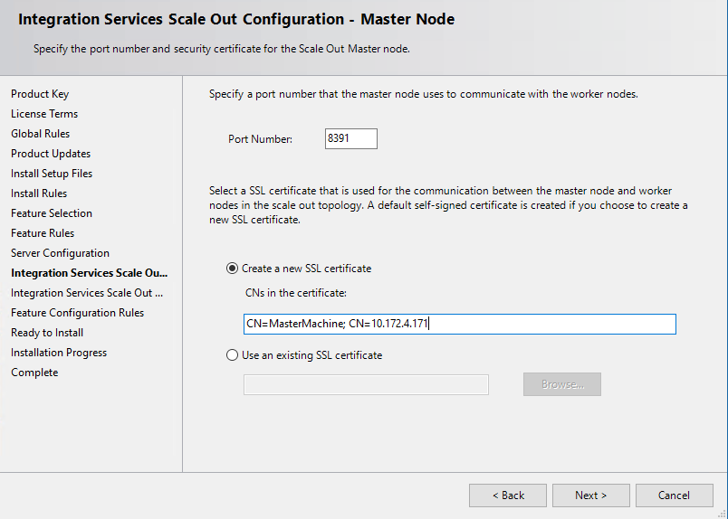
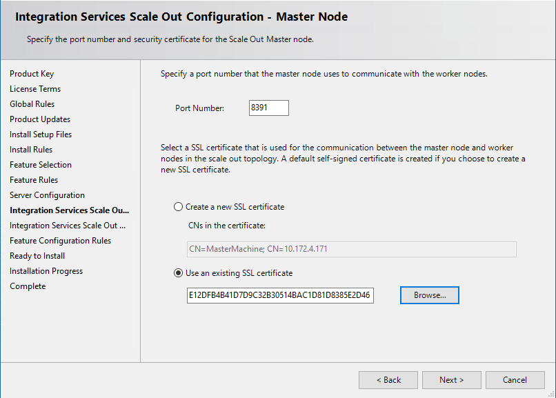
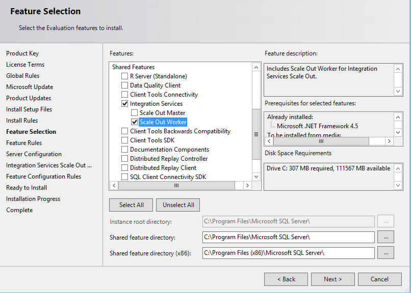
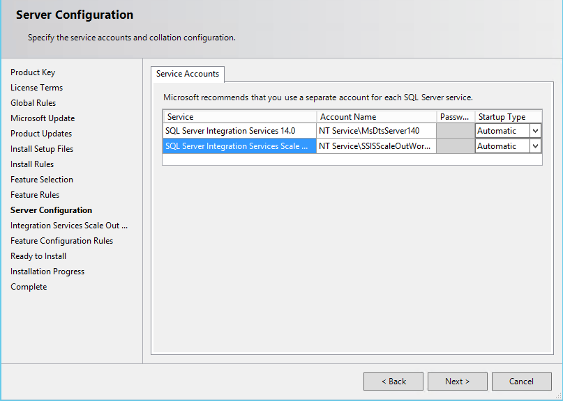
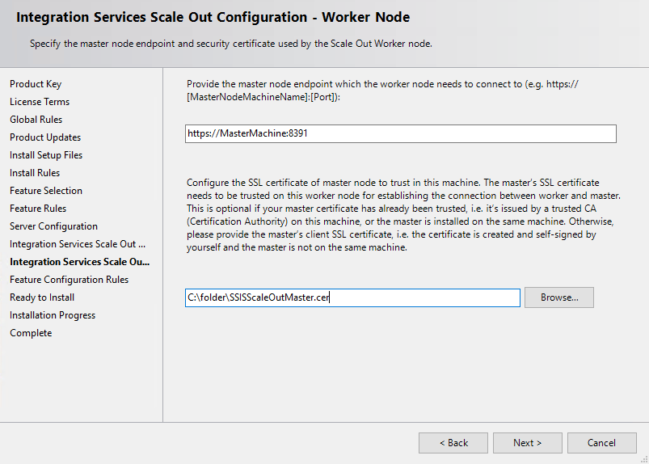

# Walkthrough: Set up Integration Services Scale Out
Set up [!INCLUDE[ssISnoversion_md](../../includes/ssisnoversion-md.md)] Scale Out by completing the following tasks. 

> [!NOTE]
> If you are installing Scale Out on one computer, install the Scale Out Master and Scale Out Worker features at the same time. When you install the features at the same time, the endpoint is automatically generated to connect to Scale Out Master. 

* [Install Scale Out Master](#InstallMaster)

* [Install Scale Out Worker](#InstallWorker)

* [Install Scale Out Worker client certificate](#InstallCert)

* [Open firewall port](#Firewall)

* [Start SQL Server Scale Out Master and Worker service](#Start)

* [Enable Scale Out Master](#EnableMaster)

* [Enable SQL Server Authentication mode](#EnableAuth)

* [Enable Scale Out Worker](#EnableWorker)

## <a name="InstallMaster"></a> Install Scale Out Master

To enable the functionality of Scale Out Master, you must install Database Engine Services, [!INCLUDE[ssISnoversion_md](../../includes/ssisnoversion-md.md)], and its Scale Out Master feature when you set up [!INCLUDE[ssNoVersion_md](../../includes/ssnoversion-md.md)]. 

For information on setting up Database Engine Services and [!INCLUDE[ssISnoversion_md](../../includes/ssisnoversion-md.md)], see [Install SQL Server Database Engine](../../database-engine/install-windows/install-sql-server-database-engine.md), and [Install Integration Services](../install-windows/install-integration-services.md).
> [!NOTE]
> During Database Engine installation, select Mixed Mode for Authentication mode on the Database Engine Configuration page. 

**To install the Scale Out Master feature, use the [!INCLUDE[ssNoVersion_md](../../includes/ssnoversion-md.md)] installation wizard or the command prompt.**

- Steps for the [!INCLUDE[ssNoVersion_md](../../includes/ssnoversion-md.md)] installation wizard
  1.  On the **Feature Selection** page, select **Scale Out Master**, which is listed under [!INCLUDE[ssISnoversion](../../includes/ssisnoversion-md.md)].   
  
  
  2.  On the **Server Configuration** page, select the account to run **SQL Server Integration Services Scale Out Master service** and select the **Startup Type**.  
  
  3.  On the **Integration Services Scale Out Master Configuration** page, specify the port number that Scale Out Master uses to communicate with Scale Out Worker. The default port number is 8391.  
  
  4.  Specify the SSL certificate used to protect the communication between Scale Out Master and Scale Out Worker by doing one of the following.
    * Let the setup process create a default, self-signed SSL certificate by clicking **Create a new SSL certificate**.  The default certificate is installed under Trusted Root Certification Authorities, Local Computer. You can specify the CNs in this certificate. The host name of master endpoint should be included in CNs. By default, the machine name and ip of Master Node are included.
    * Select an existing SSL Certicate on the local computer by clicking **Use an existing SSL certificate** and then clicking **Browse** to select a certificate. The thumbprint of the certificate appears in the text box. Clicking **Browse** displays certificates that are stored in Trusted Root Certification Authorities, Local Computer. The certificate you select must be stored here.       

  5.  Finish the [!INCLUDE[ssNoVersion_md](../../includes/ssnoversion-md.md)] installation wizard.
- Steps for the command prompt

    Follow the instructions in [Install SQL Server from the Command Prompt](../../database-engine/install-windows/install-sql-server-2016-from-the-command-prompt.md). Set the Scale Out Master related parameters by doing the following.
  1.  Add IS_Master to the parameter /FEATURES
  2.  Configure Scale Out Master by specifying the following parameters and their values: /ISMASTERSVCACCOUNT, /ISMASTERSVCPASSWORD, /ISMASTERSVCSTARTUPTYPE, /ISMASTERSVCPORT, /ISMasterSVCSSLCertCN(optional), /ISMASTERSVCTHUMBPRINT(optional).

> [!Note]
> If Scale Out Master is not installed together with Database Engine and the Database Engine is a named instance, you need to configure SqlServerName in Scale Out Master service configuration file after installation. See [Scale Out Master](integration-services-ssis-scale-out-master.md) for details.

## <a name="InstallWorker"></a> Install Scale Out Worker
 
To enable the functionality of Scale Out Worker, you must install [!INCLUDE[ssISnoversion_md](../../includes/ssisnoversion-md.md)] and its Scale Out Worker feature in [!INCLUDE[ssNoVersion_md](../../includes/ssnoversion-md.md)] setup.

**To install the Scale Out Worker feature, use the [!INCLUDE[ssNoVersion_md](../../includes/ssnoversion-md.md)] installation wizard or the command prompt.**

- Steps for the [!INCLUDE[ssNoVersion_md](../../includes/ssnoversion-md.md)] installation wizard
  1.  On the **Feature Selection** page, select **Scale Out Worker**, which is listed under [!INCLUDE[ssISnoversion](../../includes/ssisnoversion-md.md)].   
  
  2. On the **Server Configuration** page, select the account to run **SQL Server Integration Services Scale Out Worker service** and select the **Startup Type**.    
  
  3. On the **Integration Services Scale Out Worker Configuration** page, specify the endpoint to connect to Scale Out Master. 
      > [!Note]
      > You can skip Worker Node configuration (step 3&4) here and associate the Scale Out Worker to Scale Out Master with [Scale Out Manager](integration-services-ssis-scale-out-manager.md) after installation.

    - For a **one computer** environment, the endpoint is automatically generated when Scale Out Master and Scale Out Worker are installed at the same time. 
    - For a **multiple computers** environment, the endpoint consists of the name or IP of the computer with Scale Out Master installed and the port number specified during the Scale Out Master installation.    
       

  4. For a **multiple computers** environment, specify the client SSL certificate that is used to validate Scale Out Master. For a **one computer** environment, there's no need to specify the client SSL certificate. 
  
     > [!NOTE]
     > When the SSL certificate used by Scale Out Master is self-signed, a corresponding client SSL certificate is required to be installed on the computer with Scale Out Worker. If you provide the file path for the client SSL Certificate on the **Integration Services Scale Out Worker Configuration** page, the certificate will be installed automatically; otherwise, you have to install the certificate manually later. 
     
     Click **Browse** to find the certificate file (*.cer). To use the default SSL certificate, select the SSISScaleOutMaster.cer file located under \<drive\>:\Program Files\Microsoft SQL Server\140\DTS\Binn on the computer on which Scale Out Master is installed.   
   
  5. Finish the [!INCLUDE[ssNoVersion_md](../../includes/ssnoversion-md.md)] installation wizard.
- Steps for the command prompt

    Follow the instructions in [Install SQL Server from the Command Prompt](../../database-engine/install-windows/install-sql-server-2016-from-the-command-prompt.md). Set the Scale Out Worker related parameters by doing the following.
    1.  Add IS_Worker to the parameter /FEATURES
    2. Configure Scale Out Worker specifying the following parameters and their values: /ISWORKERSVCACCOUNT, /ISWORKERSVCPASSWORD, /ISWORKERSVCSTARTUPTYPE, /ISWORKERSVCMASTER(optional), /ISWORKERSVCCERT(optional).

 
## <a name="InstallCert"></a> Install Scale Out Worker client certificate

During the installation of Scale Out Worker, a worker certificate will be automatically created and installed on the computer. Also, a corresponding client certificate, SSISScaleOutWorker.cer, is installed under \<driver\>:\Program Files\Microsoft SQL Server\140\DTS\Binn. For Scale Out Master to authenticate the Scale Out Worker, you must add this client certificate to the Root store of the local computer with Scale Out Master.
  
To add the client certificate to the Root store, double click the .cer file and then click **Install Certificate** in the Certificate dialog box. The **Certificate Import Wizard** displays.  

## <a name="Firewall"></a> Open firewall port

Open the port specified during the Scale Out Master installation and the port of SQL Server (1433, by default), using Windows Firewall on the Scale Out Master computer.
    
## <a name="Start"></a> Start SQL Server Scale Out Master and Worker services

If the startup type of the services is not set to Automatic during installation, start the services: SQL Server Integration Services Scale Out Master 14.0 (SSISScaleOutMaster140) and SQL Server Integration Services Scale Out Worker 14.0 (SSISScaleOutWorker140). 

> [!Note]
> After you open the firewall port, you also need to restart the Scale Out Worker service.
   
## <a name="EnableMaster"></a> Enable Scale Out Master

Click **Enable this server as SSIS scale out master** in the **Create Catalog** dialog when you create the SSISDB catalog in [!INCLUDE[ssNoVersion_md](../../includes/ssnoversion-md.md)] [!INCLUDE[ssManStudio_md](../../includes/ssmanstudio-md.md)]. Alternatively, Scale Out Master can be enabled with [Scale Out Manager](integration-services-ssis-scale-out-manager.md) after catalog is created.

## <a name="EnableAuth"></a> Enable SQL Server Authentication mode
If [!INCLUDE[ssNoVersion_md](../../includes/ssnoversion-md.md)] authentication is not enabled during the Database Engine installation, enable SQL Server authentication mode on the [!INCLUDE[ssNoVersion_md](../../includes/ssnoversion-md.md)] instance that hosts the SSISDB catalog. 

Package execution is not blocked when SQL Server authentication is disabled. However, the execution log will not be able to write to SSISDB.

## <a name="EnableWorker"></a> Enable Scale Out Worker

Scale Out Worker can be enabled through [Scale Out Manager](integration-services-ssis-scale-out-manager.md), which provides GUI; or enabled through stored procedure, see below.

To enable a Scale Out Worker, execute the *[catalog].[enable_worker_agent]* stored procedure with **WorkerAgentId** as the parameter. 

You get the **WorkerAgentId** value from the *[catalog].[worker_agents]* database view in SSISDB, after Scale Out Worker registers with Scale Out Master. Registration takes several minutes once the the Scale Out Master and Worker services are started.

#### Example
This example enables the Scale Out Worker on computerA.
```tsql
SELECT WorkerAgentId, MachineName FROM [catalog].[worker_agents]
GO
-- Result: --
-- WorkerAgentId                           MachineName  --
-- 6583054A-E915-4C2A-80E4-C765E79EF61D    computerA    --

EXEC [catalog].[enable_worker_agent] '6583054A-E915-4C2A-80E4-C765E79EF61D'
GO 
```
## Next steps
The set up of the Scale Out feature is finished. You can now run packages in Scale Out. For more information, see [Execute Packages in Integration Services (SSIS) Scale Out](run-packages-in-integration-services-ssis-scale-out.md).