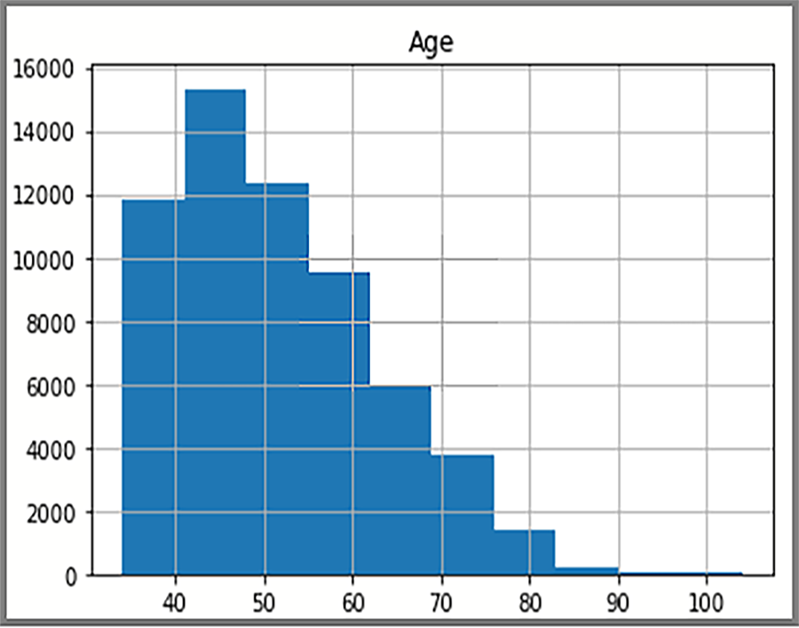

# Plot histograms in Python 
[!INCLUDE[appliesto-ss-asdbmi-xxxx-xxx-md](../../includes/appliesto-ss-asdbmi-xxxx-xxx-md.md)]

This article describes how to plot data using the Python package [Matplotlib](https://matplotlib.org/). A histogram displays data intervals that have consecutive, non-overlapping values.

## Prerequisites:

::: moniker range=">=sql-server-2017||>=sql-server-linux-ver15||=sqlallproducts-allversions"
* SQL Server. For how to install, see [SQL Server for Windows](../../database-engine/install-windows/install-sql-server.md) or [for Linux](../../linux/sql-server-linux-overview.md).
::: moniker-end
::: moniker range="=azuresqldb-current||=sqlallproducts-allversions"
* Azure SQL Database. For how to sign up, see [Azure SQL Database](https://docs.microsoft.com/azure/sql-database/sql-database-get-started-portal)
::: moniker-end
::: moniker range="=azuresqldb-mi-current||=sqlallproducts-allversions"
* Azure SQL Managed Instance. For how to sign up, see [Azure SQL Managed Instance](https://docs.microsoft.com/azure/azure-sql/managed-instance/instance-create-quickstart).
* [SQL Server Management Studio](../../ssms/download-sql-server-management-studio-ssms.md) for restoring the sample database to Azure SQL Managed Instance.
::: moniker-end

* Azure Data Studio. For how to install, see [Azure Data Studio](../../azure-data-studio/what-is.md).

## Restore the sample database

The sample database used in this article has been saved to a **.bak** database backup file for you to download and use.

::: moniker range=">=sql-server-ver15||>=sql-server-linux-ver15||=azuresqldb-current||=sqlallproducts-allversions"
1. Follow the instructions in [AdventureWorks sample databases](../../samples/adventureworks-install-configure.md#download-bak-files) to download the correct DW version of the AdventureWorks file and restore it as a database. This database will be used as a datasource.

1. Follow the directions in [Restore a database from a backup file](../../azure-data-studio/tutorial-backup-restore-sql-server.md#restore-a-database-from-a-backup-file) in Azure Data Studio, using these details:
::: moniker-end   
::: moniker range="=azuresqldb-mi-current||=sqlallproducts-allversions"
1. Follow the instructions in [AdventureWorks sample databases](../../samples/adventureworks-install-configure.md#download-bak-files) to download the correct DW version of the AdventureWorks file and restore it as a database. This database will be used as a datasource.

1. Follow the directions in [Restore a database to a Managed Instance](/azure/sql-database/sql-database-managed-instance-get-started-restore) in SQL Server Management Studio, using these details:
::: moniker-end 

  * Import from the **AdventureWorks.bak** file you downloaded
  * Name the target database "AdventureWorks"

3. You can verify that the restored database exists by querying the **dbo.DimCurrency** table:

```sql
USE AdventureWorksDW;
SELECT * FROM dbo.DimCurrency;
```
  
## Install Python packages

Install the following Python packages using [Azure Data Studio notebook with a Python kernel](../../azure-data-studio/notebooks-tutorial-python-kernel.md).

  * pyodbc
  * pandas
  * matplotlib

To install these packages:
1. In your Azure Data Studio notebook, select **Manage Packages**.
2. In the **Manage Packages** pane, select the **Add new** tab.
3. For each of the following packages, enter the package name, click **Search**, then click **Install**.

As an alternative, you can open a **Command Prompt**, change to the installation path for the version of Python you use in Azure Data Studio (for example, `cd %LocalAppData%\Programs\Python\Python37-32`), then run `pip install` for each package.

## Plot histogram 

The distributed data displayed in the histogram is based on a SQL query from AdventureWorksDW. The histogram visualizes data and the frequency of data values. 
   
To create a new notebook:
1. In Azure Data Studio, select **File**, select **New Notebook**.
2. In the notebook, select kernel **Python3**, select the **+code**.
3. Paste code in notebook, select **Run All**.

```python
import pyodbc 
import pandas
import pandas as pd
import matplotlib
import matplotlib.pyplot as plt
# Some other example server values are
# server = 'localhost\sqlexpress' # for a named instance
# server = 'myserver,port' # to specify an alternate port
server = 'servername' 
database = 'AdventureWorks' 
username = 'yourusername' 
password = 'databasename'  
cnxn = pyodbc.connect('DRIVER={SQL Server};SERVER='+server+';DATABASE='+database+';UID='+username+';PWD='+ password)
cursor = cnxn.cursor()
sql = "SELECT DATEDIFF(year, c.BirthDate, GETDATE()) AS Age FROM [dbo].[FactInternetSales] s INNER JOIN dbo.DimCustomer c ON s.CustomerKey = c.CustomerKey"
df = pd.read_sql(sql, cnxn)
df.hist(bins=10)
```

The display shows the age distribution of customers in the FactInternetSales table.




