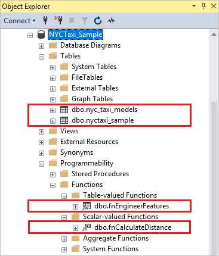
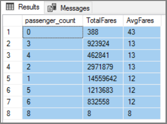

# NYC Taxi demo data for SQL Server Python and R tutorials
[!INCLUDE [SQL Server 2016 SQL MI](../../includes/applies-to-version/sqlserver2016-asdbmi.md)]

This article explains how to set up a sample database consisting of public data from the [New York City Taxi and Limousine Commission](http://www.nyc.gov/html/tlc/html/about/trip_record_data.shtml). This data is used in several R and Python tutorials for in-database analytics on SQL Server. To make the sample code run quicker, we created a representative 1% sampling of the data. On your system, the database backup file is slightly over 90 MB, providing 1.7 million rows in the primary data table.

To complete this exercise, you should have [SQL Server Management Studio](../../ssms/download-sql-server-management-studio-ssms.md?view=sql-server-2017) or another tool that can restore a database backup file and run T-SQL queries.

Tutorials and quickstarts using this data set include the following:

+ [Learn in-database analytics using R in SQL Server](r-taxi-classification-introduction.md)
+ [Learn in-database analytics using Python in SQL Server](python-taxi-classification-introduction.md)

## Download files

The sample database is a SQL Server 2016 BAK file hosted by Microsoft. You can restore it on SQL Server 2016 and later. File download begins immediately when you click the link. 

File size is approximately 90 MB.

::: moniker range=">=sql-server-ver15||>=sql-server-linux-ver15||=sqlallproducts-allversions"
>[!NOTE]
>To restore the sample database on [SQL Server Big Data Clusters](../../big-data-cluster/big-data-cluster-overview.md), download [NYCTaxi_Sample.bak](https://sqlmldoccontent.blob.core.windows.net/sqlml/NYCTaxi_Sample.bak) and follow the directions in [Restore a database into the SQL Server big data cluster master instance](../../big-data-cluster/data-ingestion-restore-database.md).
::: moniker-end

::: moniker range=">=azuresqldb-mi-current||=sqlallproducts-allversions"
>[!NOTE]
>To restore the sample database on [Machine Learning Services in Azure SQL Managed Instance](/azure/azure-sql/managed-instance/machine-learning-services-overview), follow the instructions in [Quickstart: Restore a database to Azure SQL Managed Instance](/azure/azure-sql/managed-instance/restore-sample-database-quickstart) using the NYC Taxi demo database .bak file: [https://sqlmldoccontent.blob.core.windows.net/sqlml/NYCTaxi_Sample.bak](https://sqlmldoccontent.blob.core.windows.net/sqlml/NYCTaxi_Sample.bak).
::: moniker-end

1. Click [NYCTaxi_Sample.bak](https://sqlmldoccontent.blob.core.windows.net/sqlml/NYCTaxi_Sample.bak) to download the database backup file.

2. Copy the file to C:\Program files\Microsoft SQL Server\MSSQL-instance-name\MSSQL\Backup folder.

3. In Management Studio, right-click **Databases** and select **Restore Files and File Groups**.

4. Enter *NYCTaxi_Sample* as the database name.

5. Click **From device** and then open the file selection page to select the backup file. Click **Add** to select NYCTaxi_Sample.bak.

6. Select the **Restore** checkbox and click **OK** to restore the database.

## Review database objects
   
Confirm the database objects exist on the [!INCLUDE[ssNoVersion](../../includes/ssnoversion-md.md)] instance using [!INCLUDE[ssManStudioFull](../../includes/ssmanstudiofull-md.md)]. You should see the database, tables, functions, and stored procedures.
  
   

### Objects in NYCTaxi_Sample database

The following table summarizes the objects created in the NYC Taxi demo database.

|**Object name**|**Object type**|**Description**|
|----------|------------------------|---------------|
|**NYCTaxi_Sample** | database | Creates a database and two tables:<br /><br />dbo.nyctaxi_sample table: Contains the main NYC Taxi dataset. A clustered columnstore index is added to the table to improve storage and query performance. The 1% sample of the NYC Taxi dataset is inserted into this table.<br /><br />dbo.nyc_taxi_models table: Used to persist the trained advanced analytics model.|
|**fnCalculateDistance** |scalar-valued function | Calculates the direct distance between pickup and dropoff locations. This function is used in [Create data features](r-taxi-classification-create-features.md), [Train and save a model](r-taxi-classification-train-model.md)  and [Operationalize the R model](r-taxi-classification-deploy-model.md).|
|**fnEngineerFeatures** |table-valued function | Creates new data features for model training. This function is used in [Create data features](r-taxi-classification-create-features.md) and [Operationalize the R model](r-taxi-classification-deploy-model.md).|


Stored procedures are created using R and Python script found in various tutorials. The following table summarizes the stored procedures that you can optionally add to the NYC Taxi demo database when you run script from various lessons.

|**Stored procedure**|**Language**|**Description**|
|-------------------------|------------|---------------|
|**RxPlotHistogram** |R | Calls the RevoScaleR rxHistogram function to plot the histogram of a variable and then returns the plot as a binary object. This stored procedure is used in [Explore and visualize data](r-taxi-classification-explore-data.md).|
|**RPlotRHist** |R| Creates a graphic using the Hist function and saves the output as a local PDF file. This stored procedure is used in [Explore and visualize data](r-taxi-classification-explore-data.md).|
|**RxTrainLogitModel**  |R| Trains a logistic regression model by calling an R package. The model predicts the value of the  tipped column, and is trained using a randomly selected 70% of the data. The output of the stored procedure is the trained model, which is saved in the table nyc_taxi_models. This stored procedure is used in [Train and save a model](r-taxi-classification-train-model.md).|
|**RxPredictBatchOutput**  |R | Calls the trained model to create predictions using the model. The stored procedure accepts a query as its input parameter and returns a column of numeric values containing the scores for the input rows. This stored procedure is used in [Predict potential outcomes](r-taxi-classification-deploy-model.md).|
|**RxPredictSingleRow**  |R| Calls the trained model to create predictions using the model. This stored procedure accepts a new observation as input, with individual feature values passed as in-line parameters, and returns a value that predicts the outcome for the new observation. This stored procedure is used in [Predict potential outcomes](r-taxi-classification-deploy-model.md).|

## Query the data

As a validation step, run a query to confirm the data was uploaded.

1. In Object Explorer, under Databases, right-click the **NYCTaxi_Sample** database, and start a new query.

2. Run some simple queries:

    ```sql
    SELECT TOP(10) * FROM dbo.nyctaxi_sample;
    SELECT COUNT(*) FROM dbo.nyctaxi_sample;
    ```
The database contains 1.7 million rows.

3. Within the database is a **nyctaxi_sample** table that contains the data set. The table has been optimized for set-based calculations with the addition of a [columnstore index](../../relational-databases/indexes/columnstore-indexes-overview.md). Run this statement to generate a quick summary on the table.

    ```sql
    SELECT DISTINCT [passenger_count]
        , ROUND (SUM ([fare_amount]),0) as TotalFares
        , ROUND (AVG ([fare_amount]),0) as AvgFares
    FROM [dbo].[nyctaxi_sample]
    GROUP BY [passenger_count]
    ORDER BY  AvgFares DESC
    ````
Results should be similar to those showing in the following screenshot.

  

## Next steps

NYC Taxi sample data is now available for hands-on learning.

+ [Learn in-database analytics using R in SQL Server](r-taxi-classification-introduction.md)
+ [Learn in-database analytics using Python in SQL Server](python-taxi-classification-introduction.md)