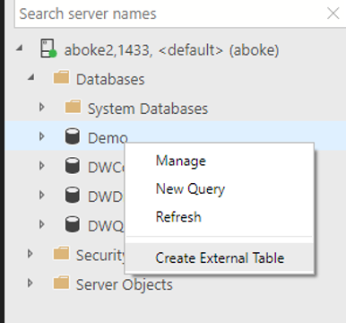
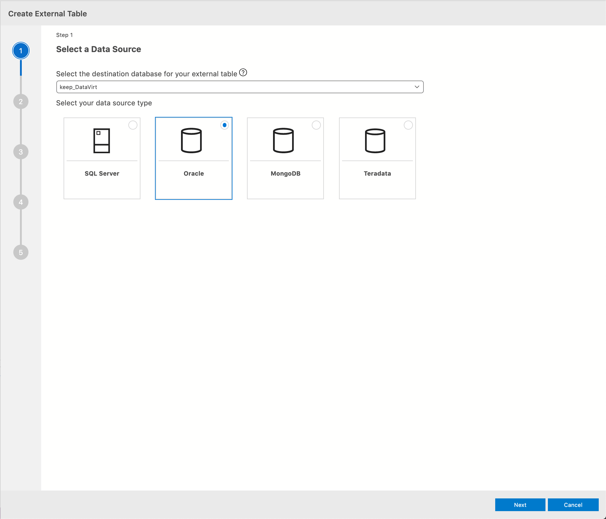
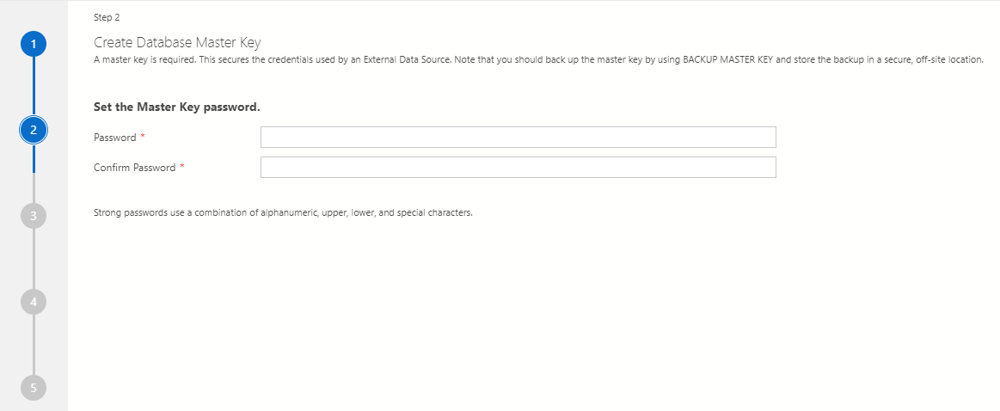
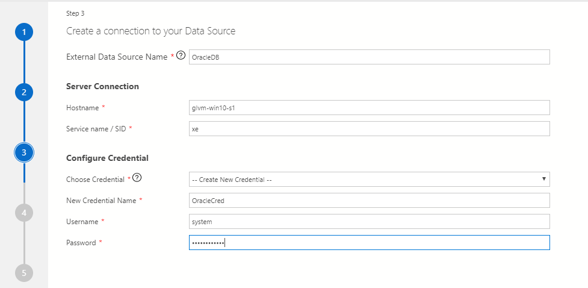
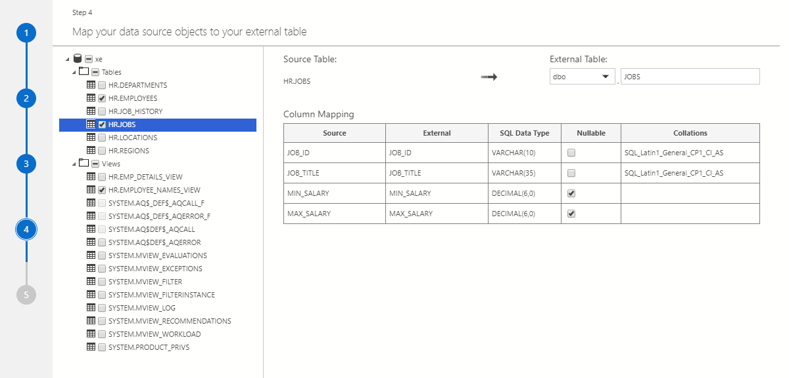

# Use the Data External Table Wizard with external tables

One of the key scenarios for SQL Server 2019 CTP 2.0 is the ability to virtualize data.  This process allows the data to stay in its original location, however you can **virtualize** the data in a SQL Server instance so that it can be queried there like any other table in SQL Server. This will minimize the need for ETL processes. This is possible with the use of Polybase connectors. For more information on Data Virtualization please refer to our [Get started with PolyBase](polybase-guide.md) Document.

## Launch the External Table wizard

Connect to the master instance using the IP address / port number (31433) obtained at the end of the deployment script. Expand your **Databases** node in the Object Explorer. Then select one of the databases where you would like to virtualize the data into from an existing SQL Server instance. Right-click on the Database and select **Create External Table** from the context menu. This launches the Virtualize Data wizard. You can also launch the Virtualize Data wizard from the command palette by typing Ctrl+Shift+P (in Windows) and Cmd+Shift+P (in Mac).

## Select a data source

if you launched the wizard from one of the databases you can see that the destination dropdown is auto-filled. You also have the option of entering or changing the Destination Database on this screen. The External Data Source Types which is supported by the wizard are SQL Server and Oracle.

> [!NOTE]
>SQL Server is Highlighted by Default

Click Next to proceed to the next step in the wizard which sets the Database Master Key.

## Create database master key

In this step, you will be asked to create a database master key. Creating the master key is required, as this secures the credentials used by an External Data Source. Please choose a strong password for your Master Key. You should also backup the master key by using BACKUP MASTER KEY and store the backup in a secure off-site location.

> [!IMPORTANT]
> If you already have a database master key the input fields will be restricted and you may bypass this step.You can just click "Next" to proceed to the next page in the wizard.

> [!NOTE]
> If you don’t choose a strong password, then the wizard will in the last step. This is a known issue which we will fix in upcoming release so that it is more intuitive.

## Enter the external data source credentials

In this step, please enter your external data source and the credential details. This step creates an external data source object and then uses the credentials for the database object to connect to the data source. Provide a name of the External Data Source (example: Test) and provide the external data source SQL Server Connection details - the Server Name and the Database name where you want your external data source to be created on that server.

The next step is to Configure Credential, so provide a Credential Name, this is the name of the Database scoped credential used to securely store the sign-in information for the External Data Source you are creating (example: TestCred) and provide the username and password to connect to the data source.

## External Data Table Mapping

In the next window, you will be able to select the tables you want to create external views of. Selecting the Parent databases will include all child tables as well. When the tables are selected, a mapping table can be seen on the right-hand side. Here you can make any 'type' changes or change the name of the selected external table itself.

> [!NOTE]
>Double clicking another selected table will change the mapping view.

> [!IMPORTANT]
>Photo type is not yet supported by the External Table tool. Creating an external view with a photo type in it will throw an error after creation of table. The table will still be created though.

## Summary

This step provides a summary of your selections. It provides the name of the Database scoped credential and the External Data Source objects that will be created in the destination database. In this step, you have the option to **"Generate Script"** which will script out in T-SQL the syntax to create the external data source or **Create** which will create the External Data Source object.

If you click "Create" you will be able to see the External Data Source object created in the Destination database.

If you click, **Generate Script** you will see the T-SQL query being generated for creating the External Data Source object.

> [!NOTE]
> Generate Script should be only visible in the last page of the wizard. Currently it shows in all pages.

## Next steps

For more information on SQL Server Big Data Cluster and related scenarios, see [What is SQL Server Big Data Cluster?](../../big-data-cluster/big-data-cluster-overview.md).