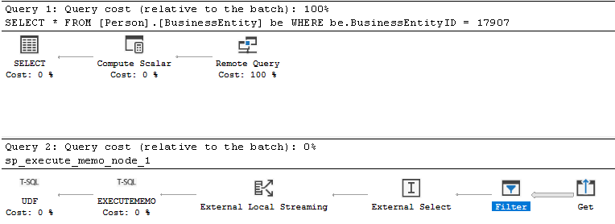
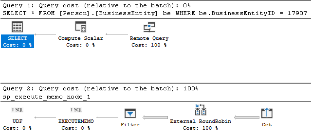
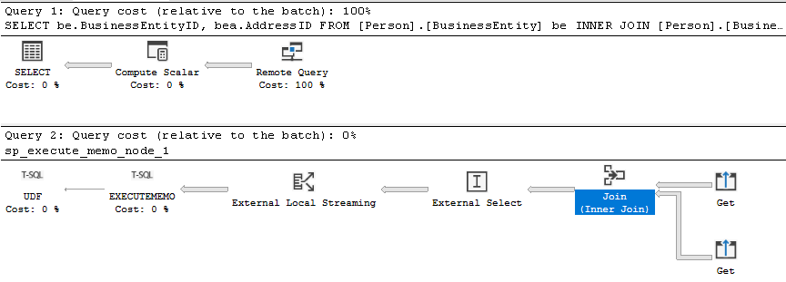
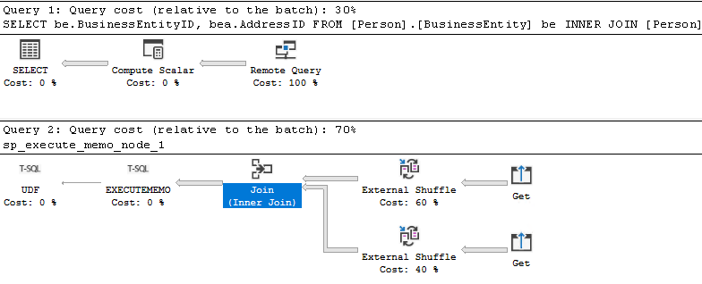

# How to tell if external pushdown occurred

## Is my query benefitting from external pushdown?

Pushdown computation improves the performance of queries on external data sources. Certain computation tasks are delegated to the external data source instead of being brought to the SQL Server. Especially in the cases of filtering and join pushdown, this can greatly reduce the workload on the SQL Server instance and can significantly improve performance of the query. For more information on external pushdown, see [Pushdown computations in PolyBase](./polybase-pushdown-computation.md).

If a PolyBase query is performing slowly, you should determine if pushdown of your PolyBase query is occurring.

There are three different scenarios where pushdown can be observed in the execution plan:

1. Filter predicate pushdown
2. Join pushdown
3. Aggregation pushdown

There are limitations on what can be pushed down to external data sources. Some T-SQL functions can prevent pushdown, for more information see [PolyBase features and limitations](./polybase-versioned-feature-summary.md#syntax-that-prevents-pushdown). For a list of T-SQL functions that can otherwise be pushed down, see [Pushdown computations in PolyBase](./polybase-pushdown-computation.md#pushdown-for-basic-expressions-and-operators).

## How to tell if external pushdown occurred

There are two ways to determine if a PolyBase query is being pushed down to the external data source:

1. View the Estimated Execution Plan with trace flag 6408
2. View the read_command in [sys.dm_exec_external_work](../system-dynamic-management-views/sys-dm-exec-external-work-transact-sql.md)

This article will provide details on how to use each of these two use cases.

## Estimated Execution Plan with trace flag 6408

By default, the estimated execution plan will not expose the Remote Query Plan. You will simply see the Remote Query operator:

###  Plan from SQL Server Management Studio


### Plan from Azure Data Studio


Starting in SQL Server 2019, you can enable a new trace flag 6408 globally using DBCC TRACEON](/sql/t-sql/database-console-commands/dbcc-traceon-transact-sql.md). This trace flag only works with estimated execution plans and has no effect on actual execution plans. This trace flag exposes information about the Remote Query operator that will show what is happening during the Remote Query phase.

[Execution plans](../performance/execution-plans.md) are read from right-to-left. This is demonstrated by the direction the arrows point. If an operator is to the right of another operator, it is said to be “before” it. If an operator is to the left of another operator, it is said to be “after” it.

In SQL Server Management Studio (SSMS), highlight the query and click on Display Estimated Execution Plan (Ctrl + L). In Azure Data Studio, highlight the query and click on “Explain”. Then consider the following scenarios below to determine whether pushdown occurred.

## Pushdown of filter predicate

Consider the following query which uses a filter predicate in the WHERE clause:

```tsql
SELECT *
FROM [Person].[BusinessEntity] be
WHERE be.BusinessEntityID = 17907;
```

If pushdown of the filter predicate is occurring, the filter operator will be before the external operator. This indicates the filtering occurred before getting selected back from the external data source, indicating the filter predicate was pushed down.

### With pushdown of filter predicate (execution plan)

With the Trace Flag 6408 enabled, you now see additional information in the execution plan output.

#### Plan from SQL Server Management Studio

In SQL Server Management Studio, the remote query plan is displayed in Query 2 (sp_execute_memo_node_1) and corresponds to the Remote Query operator in Query 1.



#### Plan from Azure Data Studio

In Azure Data Studio, the remote query execution is represented as a single query plan.


### Without pushdown of filter predicate (execution plan)

If pushdown of the filter predicate is not occurring the filter will be after the external operator.

#### Plan from SQL Server Management Studio



#### Plan from Azure Data Studio


## Pushdown of JOIN

Consider the following query that utilizes the JOIN operator:

```tsql
SELECT be.BusinessEntityID, bea.AddressID
FROM [Person].[BusinessEntity] be
INNER JOIN [Person].[BusinessEntityAddress] bea ON be.BusinessEntityID = bea.BusinessEntityID;
```

If the JOIN is pushed down to the external data source, the Join operator will be before the external operator.

### With pushdown of join (execution plan)

#### Plan from SQL Server Management Studio



#### Plan from Azure Data Studio


### Without pushdown of join (execution plan)

If the JOIN is not pushed down to the external data source, the Join operator will be after the external operator. In SQL Server Management Studio, the external operator is in the query plan for sp_execute_memo_node, which is in the Remote Query operator in Query 1. In Azure Data Studio, the Join operator is after the external operator(s).

#### Plan from SQL Server Management Studio



#### Plan from Azure Data Studio


## Pushdown of aggregation 

Consider the following query which uses an aggregate function:

```tsql
SELECT SUM (Quantity)
FROM [Production].[ProductInventory]
```

### With pushdown of aggregation (execution plan)

If pushdown of the aggregation is occurring, the aggregation operator will be before the external operator. This indicates the aggregation occurred before getting selected back from the external data source, indicating the aggregation was pushed down.

#### Plan from SQL Server Management Studio


#### Plan from Azure Data Studio


### Without pushdown of aggregation (execution plan)

If pushdown of the aggregation is not occurring the aggregation operator will be after the external operator.

#### Plan from SQL Server Management Studio


#### Plan from Azure Data Studio


# sys.dm_exec_external_work (DMV)

The [sys.dm_exec_external_work](../system-dynamic-management-views/sys-dm-exec-external-work-transact-sql.md) DMV will show the query that is sent to the external data source. You can examine the **read_command** column to identify the query that was sent to the external data source. This will allow you determine if pushdown is occurring.

#### DMV query

You can execute the following query and use the start_time/end_time and read_command to identify the query being investigated:

```tsql
SELECT execution_id, start_time, end_time, read_command
FROM sys.dm_exec_external_work
ORDER BY execution_id desc;
```

## Pushdown of filter predicate

Consider the query used in the previous filter predicate example:


```tsql
SELECT *
FROM [Person].[BusinessEntity] be
WHERE be.BusinessEntityID = 17907;
```

#### With pushdown of filter (DMV)

If pushdown of the filter predicate is occurring, you will be able to tell by checking the read_command in the DMV. You will see something like:

```tsql
SELECT [T1_1].[BusinessEntityID] AS [BusinessEntityID], [T1_1].[rowguid] AS [rowguid], 
  [T1_1].[ModifiedDate] AS [ModifiedDate] FROM 
  (SELECT [T2_1].[BusinessEntityID] AS [BusinessEntityID], [T2_1].[rowguid] AS [rowguid], 
    [T2_1].[ModifiedDate] AS [ModifiedDate] 
FROM [AdventureWorks2017].[Person].[BusinessEntity] AS T2_1 
WHERE ([T2_1].[BusinessEntityID] = CAST ((17907) AS INT))) AS T1_1
```

The WHERE clause is in the command sent to the external data source which means the filter predicate is being evaluated at the external data source. Filtering on the dataset occurred at the external data source, and only the filtered dataset was retrieved by PolyBase.

#### Without pushdown of filter (DMV)

If pushdown is not occurring, you'll see something like:

```tsql
SELECT "BusinessEntityID","rowguid","ModifiedDate" FROM "AdventureWorks2017"."Person"."BusinessEntity"
```

There is no WHERE clause in the command sent to the external data source, so the filter predicate is not pushed down. Filtering on the entire dataset occurred on the SQL Server side, after the dataset was retrieved by PolyBase.

## Pushdown of JOIN

Consider the query used in the previous JOIN example:

```tsql
SELECT be.BusinessEntityID, bea.AddressID
FROM [Person].[BusinessEntity] be
INNER JOIN [Person].[BusinessEntityAddress] bea ON be.BusinessEntityID = bea.BusinessEntityID;
```

### With pushdown of join (DMV)

If the JOIN is pushed down to the external data source, you will see something like:

```tsql
SELECT [T1_1].[BusinessEntityID] AS [BusinessEntityID], [T1_1].[AddressID] AS [AddressID] 
FROM (SELECT [T2_2].[BusinessEntityID] AS [BusinessEntityID], [T2_1].[AddressID] AS [AddressID] 
FROM [AdventureWorks2017].[Person].[BusinessEntityAddress] AS T2_1 
INNER JOIN  [AdventureWorks2017].[Person].[BusinessEntity] AS T2_2  
ON ([T2_1].[BusinessEntityID] = [T2_2].[BusinessEntityID])) AS T1_1
```

The JOIN clause is in the command sent to the external data source, so the JOIN is pushed down. The join on the dataset occurred at the external data source, and only the dataset that matches the join condition was retrieved by PolyBase.

### Without pushdown of join (DMV)

If the pushdown of the join is not occurring, you'll see there are two different queries executed against the external data source:

```tsql
SELECT [T1_1].[BusinessEntityID] AS [BusinessEntityID], [T1_1].[AddressID] AS [AddressID] 
FROM [AdventureWorks2017].[Person].[BusinessEntityAddress] AS T1_1

SELECT [T1_1].[BusinessEntityID] AS [BusinessEntityID] FROM [AdventureWorks2017].[Person].[BusinessEntity] AS T1_1
```

The joining the two datasets occurred on the SQL Server side, after both datasets were retrieved by PolyBase.

## Pushdown of aggregation

### With Pushdown of aggregation (DMV)

If pushdown of the aggregation is occurring, you’ll see the aggregation function in the read_command. For example:

```tsql
SELECT [T1_1].[col] AS [col] FROM (SELECT SUM([T2_1].[Quantity]) AS [col] 
FROM [AdventureWorks2017].[Production].[ProductInventory] AS T2_1) AS T1_1
```

The aggregation function is in the command sent to the external data source, so the aggregation is pushed down. The aggregation occurred at the external data source, and only the dataset that has been aggregated was retrieved by PolyBase.

### Without pushdown of aggregation (DMV)

If the pushdown of the aggregation isn’t occurring, you won’t see the aggregation function in the read_command.

```tsql
SELECT "Quantity" FROM "AdventureWorks2017"."Production"."ProductInventory"
```

The aggregation was performed on the SQL Server side after the un-aggregated dataset was retrieved by PolyBase.

> [!NOTE]
> One limitation of the [sys.dm_exec_external_work](../system-dynamic-management-views/sys-dm-exec-external-work-transact-sql.md) method is that the read_command field in the DMV is limited to 4000 characters. If the query is sufficiently long, the read_command may be truncated before you'd see the WHERE/JOIN/aggregation function in the read_command.

## See also

[Pushdown computations in PolyBase](./polybase-pushdown-computation.md)
