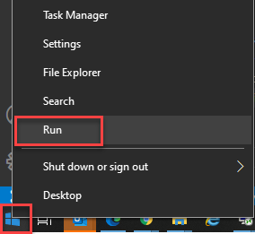
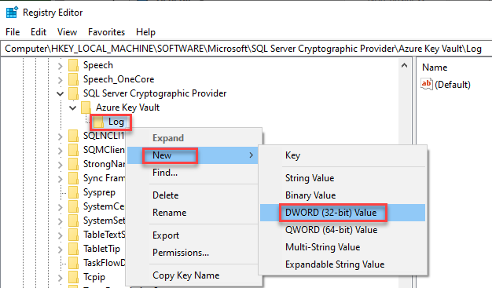

# SQL Connector error and information logging

This article describes the modifying registry entires to enable SQL Connector error and information logging.

## SQL Server Connector for Microsoft Azure Key Vault

The SQL Server Connector for Microsoft Azure Key Vault enables SQL Server encryption to use the Microsoft Azure Key Vault as an extensible key management (EKM) provider to protect its encryption keys.

An organization can use SQL Server encryption to protect sensitive data. SQL Server encryption includes Transparent Data Encryption (TDE), Column Level Encryption (CLE), and Backup Encryption. In all of these cases the data is encrypted using a symmetric data encryption key. The symmetric data encryption key is further protected by wrapping (encrypting) it with an asymmetric key. The EKM provider architecture lets Microsoft SQL Server leverage the security of the Azure Key Vault as an external cryptographic provider to store and manage the asymmetric keys and perform data encryption key wrapping and unwrapping functions.

Azure Key Vault helps safeguard cryptographic keys and secrets used by cloud applications and services. By using Azure Key Vault, you can encrypt keys and secrets (such as authentication keys, storage account keys, data encryption keys, .PFX files, and passwords) by using keys that are protected by hardware security modules (HSMs). For added assurance, you can import or generate keys in HSMs (keys never leave the HSM boundary). HSMs are certified to FIPS 140-2 level 2.

The download consists of the SQL Server Connector as well as Sample Scripts to enable a SQL Server Administrator learn how to configure the Connector and enable SQL Server Encryption scenarios. For more information, review the topic [Extensible key management using Key Vault (SQL Server)](http://go.microsoft.com/fwlink/p/?LinkId=521690)

Use the [Azure Key Vault forum](https://social.msdn.microsoft.com/Forums/en-US/AzureKeyVault) to ask questions, share insights and discuss the SQL Server Connector.

> [!NOTE]
> - Versions 1.0.0.440 and older have been replaced and are no longer supported in production environments and using the instructions on the [SQL Server Connector Maintenance & Troubleshooting](../../../relational-databases/security/encryption/sql-server-connector-maintenance-troubleshooting.md) page under "Upgrade of SQL Server Connector."
> - Starting with version 1.0.3.0, the SQL Server Connector reports relevant error messages to the Windows event logs for troubleshooting.
> - Starting with version 1.0.4.0, there is support for private Azure clouds, including Azure China, Azure Germany, and Azure Government.
> - There is a breaking change in 1.0.5.0 version, in terms of the thumbprint algorithm. You may experience database restore failure after upgrading to 1.0.5.0 version. Please refer KB article . [447099](https://support.microsoft.com/help/4470999/db-backup-problems-to-sql-server-connector-for-azure-1-0-5-0)

> [!NOTE]
> **Starting with version 1.0.7.0, the SQL Server Connector supports filtering messages and network request retry logic.**

**System Requirements:** The SQL Server versions supported are:

- SQL Server 2019 RTM Enterprise 64-bit
- SQL Server 2017 RTM Enterprise 64-bit
- SQL Server 2016 RTM Enterprise 64-bit
- SQL Server 2014 RTM Enterprise 64-bit
- SQL Server 2012 SP2 Enterprise 64-bit
- SQL Server 2012 SP1 CU6 Enterprise 64-bit
- SQL Server 2008 R2 SP2 CU8 Enterprise 64-bit

On SQL Server 2008 and 2012 versions lower than the ones listed above, the patch specified in the following kb article needs to be installed:  [http://support2.microsoft.com/kb/2859713](http://support2.microsoft.com/kb/2859713)

The SQL Server Connector for Microsoft Azure Key Vault also requires .NET Version 4.5.1 on the Microsoft SQL Server Virtual Machine on Azure. This library should be installed before you install the SQL Connector.

Have the appropriate version of the Visual Studio C++ redistributable installed based on the version of SQL Server that you're running:

- for SQL Server versions 2008, 2008 R2, 2012, and 2014, install the 2013 Visual C++ Redistributable
- for SQL Server 2016, install the 2015 Visual C++ Redistributable.

## Non-Administrator Installation

Installing SQL Server Connector needs **Local Administrator** privileges otherwise manual configuration is required in the Windows Registry. Modifying the registry is only required if the SQL Server Connector (version **1.0.7.0**) was installed using a non-administrator login.

## Modify Windows registry steps

Modify registry entries to enable SQL Server Connector logging error and information events in the Windows Application Event Log.

> [!CAUTION]
> Follow the steps in this section carefully. Serious problems might occur if you modify the registry incorrectly. Before you modify it, [back up the registry for restoration](https://support.microsoft.com/help/322756) in case problems occur.

1. There are two ways to open Registry Editor in Windows 10:
    - In the search box on the taskbar, type regedit. Then, select the top result for Registry Editor (Desktop app).

    
    - Press and hold or right-click the Start  button, then select Run. Enter regedit in the Open: box and select OK.

   

1. Navigate to this registry key:

    **HKLM\SOFTWARE\Microsoft\SQL Server Cryptographic Provider\Azure Key Vault\\**

      

1. Add a new Key under "Azure Key Vault" named: Log:

    **HKLM\SOFTWARE\Microsoft\SQL Server Cryptographic Provider\Azure Key Vault\\Log\\**

      

1. Below the "Log" key add a DWORD (32-bit) Value named "Level":

    **HKLM\SOFTWARE\Microsoft\SQL Server Cryptographic Provider\Azure Key Vault\\Log\\**

      

1. Set the value of the DWORD as appropriate LogLevel (0,1,2):
   1. 0 (Info) - **Default**
   1. 1 (Error)
   1. 2 (No Log)

     

The registry entries described in this article are found under this key:

```console
\Computer
    \HKEY_LOCAL_MACHINE
       \SOFTWARE
          \Microsoft
             \SQL Server Cryptographic Provider
                \Azure Key Vault
                   \Log\
                      <Level>
```

## Related articles

- For additional sample scripts, see the blog at [SQL Server Transparent Data Encryption and Extensible Key Management with Azure Key Vault](https://techcommunity.microsoft.com/t5/sql-server/intro-sql-server-transparent-data-encryption-and-extensible-key/ba-p/1427549)
- [Extensible Key Management (EKM)](extensible-key-management-ekm.md)  
- [Extensible Key Management using Azure Key Vault](extensible-key-management-using-azure-key-vault-sql-server.md)
