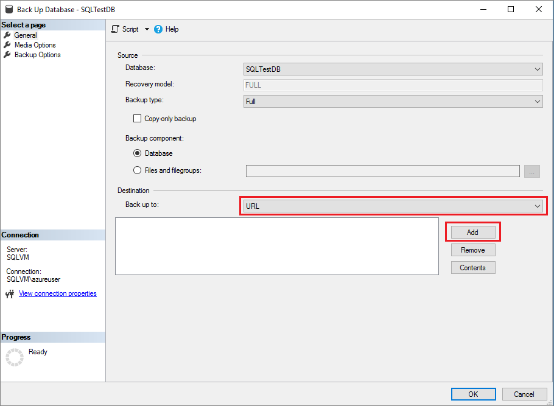
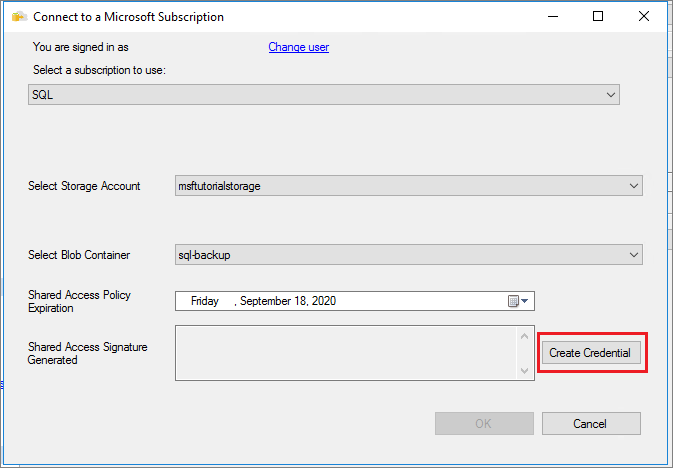
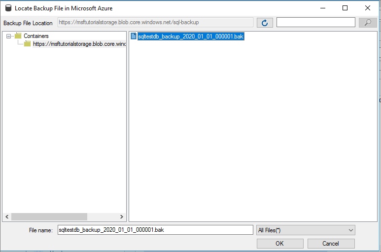

# Tutorial: SQL Server Backup and Restore to Azure Blob Storage Service
[!INCLUDE[tsql-appliesto-ss2008-asdbmi-xxxx-xxx-md.md](../includes/tsql-appliesto-ss2008-asdbmi-xxxx-xxx-md.md)]
This tutorial helps you understand how to write backups to and restore from the Azure Blob Storage Service.  The article explains how to create an Azure Blob Container, write a backup to the blob service, and then perfor a simple restore.
  
## Prerequisites  
To complete this tutorial, you must be familiar with [!INCLUDE[ssNoVersion](../includes/ssnoversion-md.md)] backup and restore concepts and T-SQL syntax.  The prerequisites for this tutorial vary if you're running your workload on-premises, or within an Azure SQL Database managed instance. 

### On-premises
To use this tutorial, you need an Azure storage account, SQL Server Management Studio (SSMS), and access to a server that's running SQL Server. Additionally, the account used to issue the BACKUP and RESTORE commands should be in the **db_backupoperator** database role with **alter any credential** permissions. 

- Get a free [Azure Account](https://azure.microsoft.com/offers/ms-azr-0044p/).
- Create an [Azure storage account](https://docs.microsoft.com/azure/storage/common/storage-quickstart-create-account?tabs=portal).
- Install [SQL Server Management Studio](https://docs.microsoft.com/sql/ssms/download-sql-server-management-studio-ssms).
- Install [SQL Server 2017 Developer Edition](https://www.microsoft.com/sql-server/sql-server-downloads).
- Assign the user account to the role of [db_backupoperator](https://docs.microsoft.com/sql/relational-databases/security/authentication-access/database-level-roles) and grant [alter any credential](https://docs.microsoft.com/sql/t-sql/statements/alter-credential-transact-sql) permissions. 

[!INCLUDE[freshInclude](../includes/paragraph-content/fresh-note-steps-feedback.md)]

### Managed instance 
To use this tutorial, you need an Azure storage account, an Azure SQL Database managed instance, and SQL Server Management Studio configured to connect to the managed instance. Additionally, the account used to issue the BACKUP and RESTORE commands should be in the **db_backupoperator** database role with **alter any credential** permissions. 

- Get a free [Azure Account](https://azure.microsoft.com/offers/ms-azr-0044p/).
- Create an [Azure storage account](https://docs.microsoft.com/azure/storage/common/storage-quickstart-create-account?tabs=portal).
- Create a [managed instance](/azure/sql-database/sql-database-managed-instance-get-started). 
- Configure connectivity to your managed instance by either [creating an Azure SQL virtual machine](/azure/sql-database/sql-database-managed-instance-configure-vm) or establishing a [point-to-site connection](/azure/sql-database/sql-database-managed-instance-configure-p2s). 


## Create Azure Blob Container
A container provides a grouping of a set of blobs. All blobs must be in a container. A storage account can contain an unlimited number of containers, but must have at least one container. A container can store an unlimited number of blobs. 

To create a Container, follow these steps:

1. Open the Azure portal. 
1. Navigate to your Storage Account. 
1. Select the storage account, scroll down to **Blob Services**.
1. Select **Blobs** and then select  **+ Container** to add a new container. 
1. Enter the name for the container and make note of the container name you specified. This information is used in the URL (path to backup file) in the T-SQL statements later in this quickstart. 
1. Select **OK**. 
    
    

  > [!NOTE]
  > Authentication to the storage account is required for SQL Server backup and restore even if you choose to create a public container. You can also create a container programatically using REST APIs. For more information, see [Create container](https://docs.microsoft.com/rest/api/storageservices/Create-Container)

## Create a test database 
In this step, you create a test database using SQL Server Management Studio (SSMS). 

1. Launch [SQL Server Management Studio (SSMS)](../ssms/download-sql-server-management-studio-ssms.md) and connect to your SQL Server instance.
1. Open a **New Query** window. 
1. Run the following Transact-SQL (T-SQL) code to create your test database. Refresh the **Databases** node in **Object Explorer** to see your new database. 

```sql
USE [master]
GO

CREATE DATABASE [SQLTestDB]
GO

USE [SQLTestDB]
GO
CREATE TABLE SQLTest (
	ID INT NOT NULL PRIMARY KEY,
	c1 VARCHAR(100) NOT NULL,
	dt1 DATETIME NOT NULL DEFAULT getdate()
)
GO


USE [SQLTestDB]
GO

INSERT INTO SQLTest (ID, c1) VALUES (1, 'test1')
INSERT INTO SQLTest (ID, c1) VALUES (2, 'test2')
INSERT INTO SQLTest (ID, c1) VALUES (3, 'test3')
INSERT INTO SQLTest (ID, c1) VALUES (4, 'test4')
INSERT INTO SQLTest (ID, c1) VALUES (5, 'test5')
GO

SELECT * FROM SQLTest
GO
```

### Managed instance
All new databases created on a managed instance have TDE automatically enabled. Creating a copy-only backup of an encrypted database is not currently supported. As such, for the purpose of this tutorial, disable TDE encryption for the newly created database. This is not recommended against a production database where TDE encryption is a requirement.

To disable TDE, run the following Transact-SQL command: 

```sql
USE master;
GO
ALTER DATABASE SQLTestDB SET ENCRYPTION OFF;
GO
```

## Back up database
In this step, you will backup the database `SQLTest` to your Azure Blob storage account using either the GUI within SQL Server Management Studio, or Transact-SQL (T-SQL). 

# [SSMS](#tab/SSMS)

1. Expand the **Databases** node within **Object Explorer** of [SQL Server Management Studio(SSMS)](./ssms/download-sql-server-management-studio-ssms.md).
1. Right-click your new `SQLTest` database, hover over **Tasks** and then select **Back up...** to launch the **Back Up Database** wizard. 
1. Select **URL** from the **Back up to** drop-down, and then select **Add** to launch the **Select Backup Destination** dialog box. 

   

1. Select **New container** on the **Select Backup Destination** dialog box to launch the **Connect to a Microsoft Subscription** window. If this step was done previously, then instead of creating a new container, select the existing container from the drop down and skip to step 10. 

   

1. Sign in to the Azure portal by selecting **Sign In...** and then proceed through the sign in process. 
1. Select your **subscription** from the drop-drown. 
1. Select your **storage account** from the drop-down. 
1. Select the container you created previously from the drop down. 
1. Select **Create Credential** to generate your *Shared Access Signature (SAS)*. Save this value as you will need it for the restore. 

   

1. Select **OK** to close the **Connect to a Microsoft Subscription** window. This populates the *Azure storage container* value on the **Select Backup Destination** dialog box. Select **OK** to choose the selected storage container, and close the dialog box. 
1. Select **OK** on the **Back Up Database** wizard to back up your database. 
1. Select **OK** once your database is backed up successfully to close all backup related windows. 

   > [!TIP]
   > You can script out the Transact-SQL behind this command by selecting **Script** at the top of the **Back Up Database** wizard: 
   > 


# [Transact-SQL](#tab/tsql)
The backup command will differ between an on-premises instance  and a managed instance, since managed instances only support copy-only ad hoc back ups. 


### On-premises

To back up your on-premises database to Azure blob storage, modify the following Transact-SQL command to use your own storage account and then run it within a new query window: 

```sql
USE [master]

BACKUP DATABASE [SQLTestDB] 
TO  URL = N'https://msftutorialstorage.blob.core.windows.net/sql-backup/sqltestdb_backup_2019_09_19_225116.bak' 
WITH NOFORMAT, NOINIT,  NAME = N'SQLTestDB-Full Database Backup', 
NOSKIP, NOREWIND, NOUNLOAD,  STATS = 10
GO
```

### Managed instance

To back up your managed instance database to Azure blob storage, modify the following Transact-SQL command to use your own storage account and then run it within a new query window: 

```sql
USE [master]

BACKUP DATABASE [SQLTestDB] 
TO  URL = N'https://msftutorialstorage.blob.core.windows.net/sql-backup/sqltestdb_backup_2019_09_19_223259.bak' 
WITH  BLOCKSIZE = 65536,  MAXTRANSFERSIZE = 4194304,  
COPY_ONLY, NOFORMAT, NOINIT,  
NAME = N'SQLTestDB-Full Database Backup', 
NOSKIP, NOREWIND, NOUNLOAD,  STATS = 10
GO
```

---

## Restore database 
In this step, you will restore the database using either the GUI in SQL Server Management Studio, or with Transact-SQL. 

# [SSMS](#tab/SSMS)

1. Right-click the **Databases** node in **Object Explorer** within SQL Server Management Studio and select **Restore Database**. 
1. Select **Device** and then select the ellipses (...) to choose the device. 

   

1. Select **URL** from the **Backup media type** drop-down and select **Add** to add your device. 

   

1. Select the container from the drop-down and then paste in the Shared Access Signature you saved when creating the credential. 
1. Select **OK** to select the backup file location. 
1. Expand **Containers** and select the container where your backup file exists. 
1. Select the backup file you want to restore and then select **OK**. If no files are visible, then you may be using the wrong SAS key. You can regenerate the SAS key again by following the same steps as before to add the container. 

   

1. Select **OK** to close the **Select backup devices** dialog box. 
1. Select **OK** to restore your database. 


# [Transact-SQL](#tab/tsql)
The restore command will differ between an on-premises instance  and a managed instance since on-premises requires a tail-log backup. 

### On-premises

To restore your on-premises database from Azure Blob storage, modify the following Transact-SQL command to use your own storage account and then run it within a new query window: 

```sql
USE [master]

BACKUP LOG [SQLTestDB] 
TO  URL = N'https://msftutorialstorage.blob.core.windows.net/sql-backup/SQLTestDB_LogBackup_2019-09-20_01-49-46.bak' 
WITH NOFORMAT, NOINIT,  
NAME = N'SQLTestDB_LogBackup_2019-09-20_01-49-46', 
NOSKIP, NOREWIND, NOUNLOAD,  NORECOVERY ,  STATS = 5
RESTORE DATABASE [SQLTestDB] 
FROM  URL = N'https://msftutorialstorage.blob.core.windows.net/sql-backup/sqltestdb_backup_2019_09_19_221153.bak'
WITH  FILE = 1,  NOUNLOAD,  STATS = 5

GO
```

### Managed instance
To restore your managed instance database from Azure blob storage, modify the following Transact-SQL command to use your own storage account and then run it within a new query window: 

```sql
USE [master]
RESTORE DATABASE [SQLTestDB] FROM 
URL = N'https://msftutorialstorage.blob.core.windows.net/sql-backup/sqltestdb_backup_2019_09_20_012223.bak'

GO
```

Once your database has been restored, you can reenable TDE encryption by running the following Transact-SQL command:

```sql
USE master;
GO
ALTER DATABASE SQLTestDB SET ENCRYPTION ON;
GO
```

---

### Managed instance

Once your database has been restored, you can re-enable TDE encryption by running the following Transact-SQL command:

```sql
USE master;
GO
ALTER DATABASE SQLTestDB SET ENCRYPTION ON;
GO
```

## See also 
Following is some recommended reading to understand the concepts and best practices when using Azure Blob storage service for [!INCLUDE[ssNoVersion](../includes/ssnoversion-md.md)] backups.  
  
-   [SQL Server Backup and Restore with Microsoft Azure Blob Storage Service](../relational-databases/backup-restore/sql-server-backup-and-restore-with-microsoft-azure-blob-storage-service.md)   
-   [SQL Server Backup to URL Best Practices and Troubleshooting](../relational-databases/backup-restore/sql-server-backup-to-url-best-practices-and-troubleshooting.md)  
  
