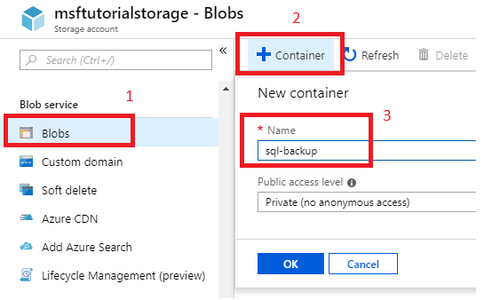
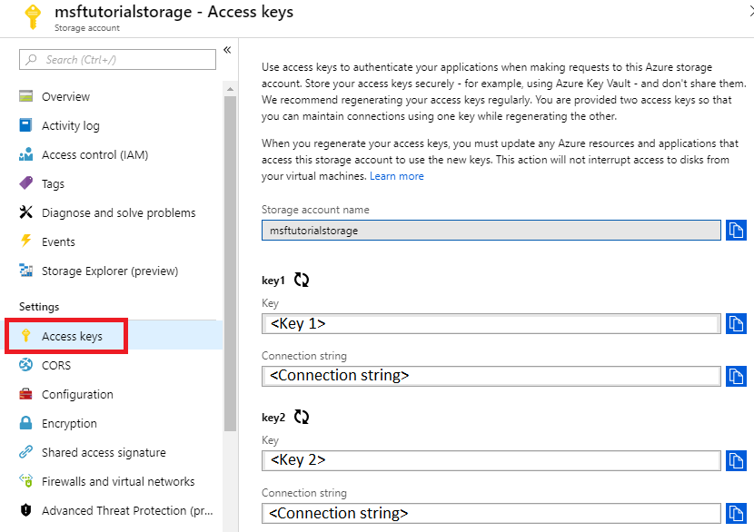

# Tutorial: SQL Server Backup and Restore to Azure Blob Storage Service
[!INCLUDE[appliesto-ss-xxxx-xxxx-xxx-md](../includes/appliesto-ss-xxxx-xxxx-xxx-md.md)]
This tutorial helps you understand how to write backups to and restore from the Azure Blob Storage Service.  The tutorial explains how to create an Azure Blob Container, credentials for accessing the storage account, writing a backup to the blob service, and then performing a simple restore.
  
### Prerequisites  
To complete this tutorial, you must be familiar with [!INCLUDE[ssNoVersion](../includes/ssnoversion-md.md)] backup and restore concepts and T-SQL syntax. 
To use this tutorial, you need an Azure storage account, SQL Server Management Studio (SSMS), access to a server that's running SQL Server, and an AdventureWorks database. Additionally, the account used to issue the BACKUP and RESTORE commands should be in the **db_backupoperator** database role with **alter any credential** permissions. 

- Get a free [Azure Account](https://azure.microsoft.com/offers/ms-azr-0044p/).
- Create an [Azure storage account](https://docs.microsoft.com/en-us/azure/storage/common/storage-quickstart-create-account?tabs=portal).
- Install [SQL Server Management Studio](https://docs.microsoft.com/sql/ssms/download-sql-server-management-studio-ssms).
- Install [SQL Server 2017 Developer Edition](https://www.microsoft.com/sql-server/sql-server-downloads).
- Download [AdventureWorks2016 sample databases](https://docs.microsoft.com/sql/samples/adventureworks-install-configure).
- Assign the user account to the role of [db_backupoperator](https://docs.microsoft.com/sql/relational-databases/security/authentication-access/database-level-roles) and grant [alter any credential](https://docs.microsoft.com/sql/t-sql/statements/alter-credential-transact-sql) permissions. 


## Create Azure Blob Container
A container provides a grouping of a set of blobs. All blobs must be in a container. An account can contain an unlimited number of containers, but must have at least one container. A container can store an unlimited number of blobs. 

To create a Container, follow these steps:

1. Open the Azure Portal. 
1. Navigate to your Storage Account. 
   1. Select the storage account, scroll down to **Blob Services**.
   1. Select **Blobs** and then select  +**Container** to add a new container. 
   1. Enter the name for the container and make note of the container name you specified. This information is used in the URL (path to backup file) in the T-SQL statements later in this tutorial. 
   1. Select **OK**. 
    
    


  >[!NOTE]
  >Authentication to the storage account is required for SQL Server backup and restore even if you choose to create a public container. You can also create a container programatically using REST APIs. For more information, see [Create container](https://docs.microsoft.com/rest/api/storageservices/Create-Container)


## Create a SQL Server Credential
A SQL Server credential is an object that is used to store authentication information required to connect to a resource outside of SQL Server. Here, SQL Server backup and restore processes use credentials to authenticate with the Windows Azure Blob storage service. The Credential stores the name of the storage account and the storage account **access key** values. Once the credential is created, it must be specified in the WITH CREDENTIAL option when issuing the BACKUP/RESTORE statements. For more information about credentials, see [Credentials](https://docs.microsoft.com/sql/relational-databases/security/authentication-access/credentials-database-engine). 

  >[!IMPORTANT]
  >The requirements for creating a SQL Server credential described below are specific to SQL Server backup processes ([SQL Server Backup to URL](backup-restore/sql-server-backup-to-url.md), and [SQL Server Managed Backup to Microsoft Azure](backup-restore/sql-server-managed-backup-to-microsoft-azure.md)). SQL Server uses the storage account name and access key information when accessing Azure storage to write or read backups.

### Access keys
Since the Azure Portal is still open, save the access keys necessary for creating the credential. 

1. Navigate to the **Storage Account** in the Azure Portal. 
1. Scroll down to **Settings** and select **Access Keys**. 
1. Save both the key and connection string to use later in this tutorial. 

   

### Create a SQL Server credential
Using the access key you saved, create the SQL Server credential following the steps below. 

1. Connect to your SQL Server using SQL Server Management Studio. 
1. Select the **AdventureWorks2016** database and open a **New Query** window. 
1. Copy, paste, and execute the following example into the query window, modifying as needed: 

  ```sql
  CREATE CREDENTIAL mycredential   
  WITH IDENTITY= 'mystorageaccount', -- this is the name of the storage account you specified when creating a storage account   
  SECRET = '<storage account access key>' -- this should be either the Primary or Secondary Access Key for the storage account 
  ```
1. Execute the statement to create the credential. 

## Backup database to the Windows Azure Blob Storage Service
In this section, you will use a T-SQL statement to perform a full database backup to the Windows Azure Blob Storage service. 

1. Connect to your SQL Server using SQL Server Management Studio. 
1. Select the **AdventureWorks2016** database and open a **New Query** window. 
1. Copy and paste the following example into the query window, modifying as needed: 

 ```sql
 BACKUP DATABASE[AdventureWorks2016] 
 TO URL = 'https://mystorageaccount.blob.core.windows.net/privatecontainertest/AdventureWorks2016.bak' 
 /* URL includes the endpoint for the BLOB service, followed by the container name, and the name of the backup file*/ 
 WITH CREDENTIAL = 'mycredential';
 /* name of the credential you created in the previous step */ 
 GO
 ```
1. Execute the statement to back up your AdventureWorks2016 database to URL. 

 
## Restore database from Windows Azure Blob Storage Service
In this section, you will use a T-SQL statement to restore the full database backup. 

1. Connect to your SQL Server using SQL Server Management Studio. 
1. Open a **New Query** window. 
1. Copy and paste the following example into the query window, modifying as needed: 

 ```sql
 RESTORE DATABASE AdventureWorks2016 
 FROM URL = 'https://mystorageaccount.blob.core.windows.net/privatecontainertest/AdventureWorks2012.bak' 
 WITH CREDENTIAL = 'mycredential',
 STATS = 5 -- use this to see monitor the progress
 GO
 ``` 

## See also 
Following is some recommended reading to understand the concepts and best practices when using Azure Blob storage service for [!INCLUDE[ssNoVersion](../includes/ssnoversion-md.md)] backups.  
  
-   [SQL Server Backup and Restore with Microsoft Azure Blob Storage Service](../relational-databases/backup-restore/sql-server-backup-and-restore-with-microsoft-azure-blob-storage-service.md)   
-   [SQL Server Backup to URL Best Practices and Troubleshooting](../relational-databases/backup-restore/sql-server-backup-to-url-best-practices-and-troubleshooting.md)  
  
