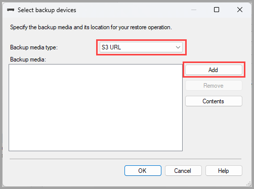
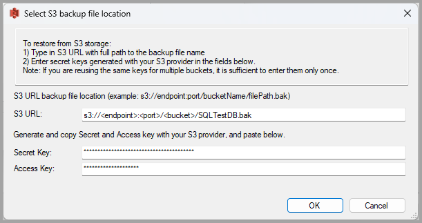

# Quickstart: SQL backup and restore to S3-Compatible Object Storage

[!INCLUDE [sqlserver2022](../includes/applies-to-version/sqlserver2022.md)]

This quickstart helps you understand how to write backups to and restore from S3-compatible object storage. The article explains how to write a backup to S3-compatible object storage, and then perform a restore.

> [!NOTE]
> SQL Server 2022 introduced support for backup to, and restore from, S3-compatible object storage.  SQL Server 2019 and prior does not support this capability.
>
  
## Prerequisites

To complete this quickstart, you must be familiar with [!INCLUDE[ssNoVersion](../includes/ssnoversion-md.md)] backup and restore concepts and T-SQL syntax. You need an S3 endpoint, SQL Server Management Studio (SSMS), and access to either a server that's running SQL Server or Azure SQL Managed Instance. Additionally, the account used to issue the BACKUP and RESTORE commands should be in the `db_backupoperator` database role with `alter any credential` permissions, and have `CREATE DATABASE` permissions to RESTORE to a new database, or be a member of either the `sysadmin` and `dbcreator` fixed server role, or owner (`dbo`) of the database if restoring over an existing database.

- Create a [S3 endpoint](https://learn.microsoft.com/sql/relational-databases/backup-restore/sql-server-backup-and-restore-with-s3-compatible-object-storage#prerequisites-for-the-s3-endpoint).
- Install [SQL Server Management Studio](../ssms/download-sql-server-management-studio-ssms.md).
- Install [SQL Server 2022 Developer Edition](https://www.microsoft.com/sql-server/sql-server-downloads) or deploy [Azure SQL Managed Instance](/azure/sql-database/sql-database-managed-instance-get-started) with connectivity established through an [Azure SQL virtual machine](/azure/sql-database/sql-database-managed-instance-configure-vm) or [point-to-site](/azure/sql-database/sql-database-managed-instance-configure-p2s).
- Assign the user account to the role of [db_backupoperator](./security/authentication-access/database-level-roles.md) and grant [alter any credential](../t-sql/statements/alter-credential-transact-sql.md) permissions.
- Assign the user account to the [sysadmin or dbcreator](./security/authentication-access/server-level-roles.md) fixed role, or make the user an [owner](./security/authentication-access/principals-database-engine.md) of the existing database.

## Create a test database 
In this step, create a test database using SQL Server Management Studio (SSMS).

1. Launch [SQL Server Management Studio (SSMS)](../ssms/download-sql-server-management-studio-ssms.md) and connect to your SQL Server instance.
1. Open a **New Query** window.
1. Run the following Transact-SQL (T-SQL) code to create your test database. Refresh the **Databases** node in **Object Explorer** to see your new database. Newly created databases on SQL Managed Instance automatically have TDE enabled so you'll need to disable it to proceed.

```sql
USE [master]
GO

-- Create database
CREATE DATABASE [SQLTestDB]
GO

-- Create table in database
USE [SQLTestDB]
GO
CREATE TABLE SQLTest (
    ID INT NOT NULL PRIMARY KEY,
    c1 VARCHAR(100) NOT NULL,
    dt1 DATETIME NOT NULL DEFAULT getdate()
)
GO

-- Populate table 
USE [SQLTestDB]
GO

INSERT INTO SQLTest (ID, c1) VALUES (1, 'test1')
INSERT INTO SQLTest (ID, c1) VALUES (2, 'test2')
INSERT INTO SQLTest (ID, c1) VALUES (3, 'test3')
INSERT INTO SQLTest (ID, c1) VALUES (4, 'test4')
INSERT INTO SQLTest (ID, c1) VALUES (5, 'test5')
GO

SELECT * FROM SQLTest
GO

-- Disable TDE for newly-created databases on SQL Managed Instance 
USE [SQLTestDB];
GO
ALTER DATABASE [SQLTestDB] SET ENCRYPTION OFF;
GO
DROP DATABASE ENCRYPTION KEY
GO
```

## Create credential

To create the SQL Server credential for authentication, follow these steps:

1. Launch [SQL Server Management Studio (SSMS)](../ssms/download-sql-server-management-studio-ssms.md) and connect to your SQL Server instance.
1. Open a **New Query** window.
1. Run the following Transact-SQL (T-SQL) command.

```sql
CREATE CREDENTIAL   [s3://<endpoint>:<port>/<bucket>]
WITH
        IDENTITY    = 'S3 Access Key',
        SECRET      = '<AccessKeyID>:<SecretKeyID>';
GO
```
## Back up database
In this step, back up the database `SQLTestDB` to your S3-compatible object storage using Transact-SQL (T-SQL). 

Back up your database using Transact-SQL (T-SQL) by running the following command:

```sql
USE [master];
GO

BACKUP DATABASE [SQLTestDB]
TO      URL = 's3://<endpoint>:<port>/<bucket>/SQLTestDB.bak'
WITH    FORMAT /* overwrite any existing backup sets */
,       STATS               = 10
,       COMPRESSION;
```

## Delete database
In this step, delete the database before performing the restore. This step is only necessary for the purpose of this tutorial, and is unlikely to be used in normal database management procedures. You can skip this step, but then you'll either need to change the name of the database during the restore on Azure SQL Managed Instance, or run the restore command `WITH REPLACE` to restore the database successfully on-premises.

# [SSMS](#tab/SSMS)

1. Expand the **Databases** node in **Object explorer**, right-click the `SQLTestDB` database, and select delete to launch the **Delete object** wizard.
1. On Azure SQL Managed Instance, select **OK** to delete the database. On-premises, check the checkbox next to **Close existing connections** and then select **OK** to delete the database.

# [Transact-SQL](#tab/tsql)

Delete the database by running the following Transact-SQL command:

```sql
USE [master];
GO
DROP DATABASE [SQLTestDB];
GO

-- If connections currently exist on-premises, you'll need to set the database into single user mode first
USE [master];
GO
ALTER DATABASE [SQLTestDB] SET  SINGLE_USER WITH ROLLBACK IMMEDIATE;
GO
USE [master];
GO
DROP DATABASE [SQLTestDB];
GO
```

---

## Restore database 
In this step, restore the database using either the GUI in SQL Server Management Studio, or with Transact-SQL.

# [SSMS](#tab/SSMS)

1. Right-click the **Databases** node in **Object Explorer** within SQL Server Management Studio and select **Restore Database**. 
1. Select **Device** and then select the ellipses (...) to choose the device.

   

1. Select **URL** from the **Backup media type** drop-down and select **Add** to add your device.

   

1. Enter the virtual host URL and paste in the Secret Key ID and Access Key ID for the S3-compatible object storage.

   

1. Select **OK** to select the backup file location.
1. Select **OK** to close the **Select backup devices** dialog box.
1. Select **OK** to restore your database.

# [Transact-SQL](#tab/tsql)

To restore your on-premises database from Azure Blob storage, modify the following Transact-SQL command to use your own storage account and then run it within a new query window.

```sql
USE [master]
RESTORE DATABASE SQLTestDB
FROM    URL = 's3://<endpoint>:<port>/<bucket>/ SQLTestDB.bak'
WITH    REPLACE /* overwrite existing database */
,       STATS  = 10;
```

---

## See also 
Following is some recommended reading to understand the concepts and best practices when using S3-compatible object storage for [!INCLUDE[ssNoVersion](../includes/ssnoversion-md.md)] backups.  
  
-   [SQL Server backup to URL for S3-compatible object storage](..relational-databases/backup-restore/sql-server-backup-to-url-s3-compatible-object-storage.md)
-   [SQL Server back up to URL for S3-compatible object storage best practices and troubleshooting](../relational-databases/backup-restore/sql-server-backup-to-url-best-practices-and-troubleshooting.md)