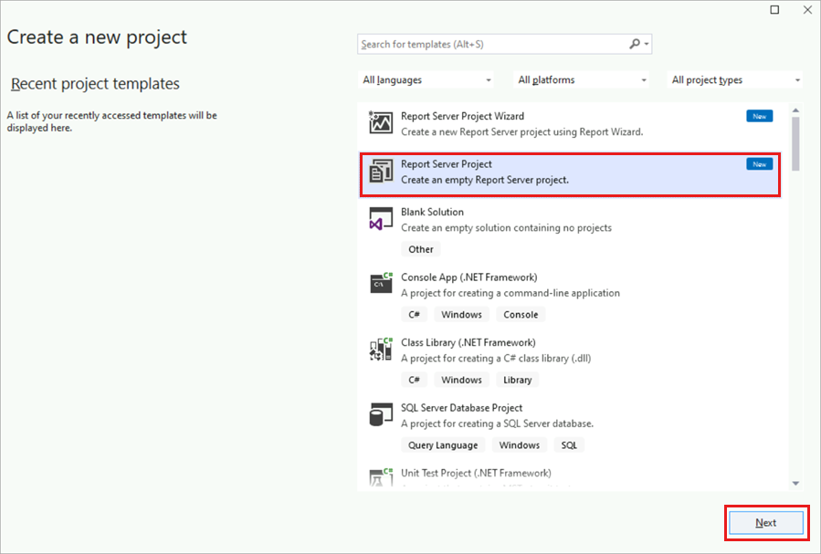
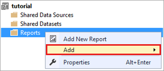
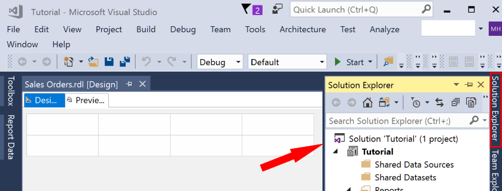
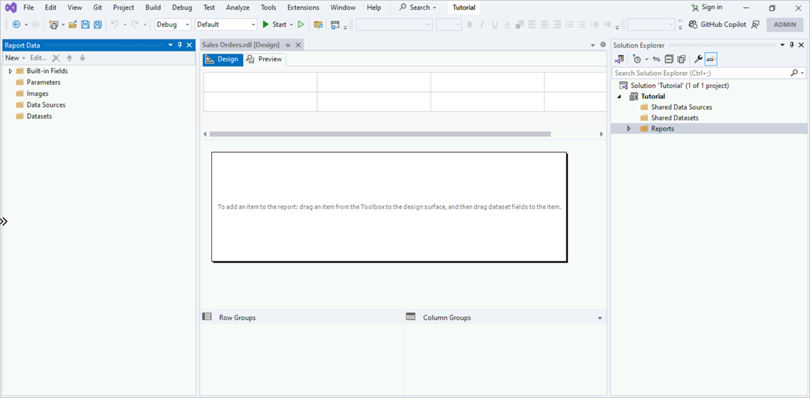

<!-- # Lesson 1: Creating a Report Server Project (Reporting Services) -->

In this lesson, you'll create a *report server project* and a *report definition (.rdl)* file using the Report Designer tool within SQL Server Data Tools (SSDT) / Visual Studio.  

> **Note**: SSDT is a free subset of Visual Studio to create projects for Reporting Services, Integration Services and Analysis Services. More detailed information about SSDT can be found here: [Reporting Services in SQL Server Data Tools (SSDT)](tools/reporting-services-in-sql-server-data-tools-ssdt.md)

When using the Report Designer to create a report, create a Report Server project first to contain the report files and other resource files used by the reports.

## To create a report server project  
  
1. Open Visual Studio or (SSDT).  
  
2. From the **File** menu, select **New** and    then  **Project**.  

    
  
3. In the left column under **Installed**, select **Reporting Services**.

    

   >**Tip**: If you don't see **Reporting Services** in the left column or **Report Services** objects in the center column, you need to add the Report Designer to Visual Studio / SSDT by installing the Reporting Services extensions. See [Download SQL Server Data Tools (SSDT)](../ssdt/download-sql-server-data-tools-ssdt.md) if you are using SSDT, or install the SSDT workload from the Visual Studio installation manager, then the Reporting Services extensions from the Market Place.
  
4. Select the **Report Server Project** icon displayed here (the other one is a Report Project Wizard) &nbsp;&nbsp; &nbsp;&nbsp;in the center template display area.

5. In the **Name** text box, type **Tutorial** for the project name. By default, the **Tutorial** project is created in its own folder in your "Documents\Visual Studio 20xx\"Projects\" folder.

6. Select **OK** to create the project. The Tutorial project is displayed in the Solution Explorer pane on the right.
  
## To create a new report definition file  
  
1. In the **Solution Explorer** pane, right-click on the **Reports**  folder then:
    a. Select **Add** >
    b. Select **New Item**

     

    >**Tip**: If you don't see the **Solution Explorer** pane, on the **View** menu, select the **Solution Explorer** tab on the far right (outlined with a red rectangle).

    

    c. In the **Add New Item** window, select the **Report** icon.  

    d. Type **Sales Orders.rdl** into the **Name** text box.

    e. Select **Add** to complete the process.
  
    Report Designer opens and displays the new report file in Design view.  

    
  
     > **NOTE** Report Designer is a [!INCLUDE[ssRSnoversion](../includes/ssrsnoversion-md.md)] component that runs in [!INCLUDE[ssBIDevStudioFull](../includes/ssbidevstudiofull-md.md)].
  
     The Report Designer has:
    - A **Report Data** pane to define and select data fields.
    - A  **Design** view to define your report layout.
    - A **Preview** view to display the current output of the report as you design it.  
  
## Next lesson

 In this lesson, you created the "Tutorial" report project and the "Sales Orders" report. In the lessons to come, you'll learn how to:

- select a data source for the report
- create a dataset from the data source
- design and format the report layout

 See [Lesson 2: Specifying Connection Information &#40;Reporting Services&#41;](../reporting-services/lesson-2-specifying-connection-information-reporting-services.md).  

>**NOTE**: When running a report, the data is retrieved as defined in the data set from the data source and formatted by the report layout. The report output is then displayed on your screen, where you may view it, print it, export it to another data format, or save it to a file.  

## See Also

[Create a Basic Table Report &#40;SSRS Tutorial&#41;](../reporting-services/create-a-basic-table-report-ssrs-tutorial.md)  
