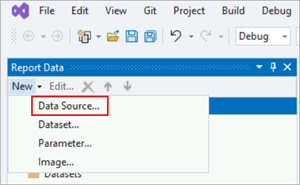
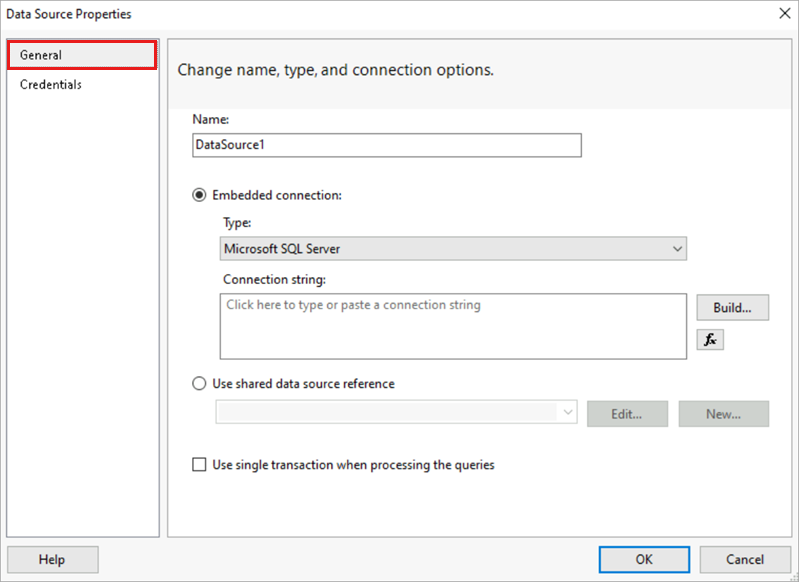

# Lesson 2: Specifying Connection Information (Reporting Services)

In lesson 1, you added a [!INCLUDE[ssrsnoversion-md](../includes/ssrsnoversion-md.md)] paginated report to your tutorial project.
  
In this lesson, you will define a *data source*, which is the connection information the report uses to access data from a relational database, multidimensional database, or another source. For this report, you will add the [!INCLUDE[sssampledbadventureworks2016-md](../includes/sssampledbadventureworks2016-md.md)] sample database as your data source. For simplicity, this tutorial assumes that this database is located in a default instance of [!INCLUDE[ssNoVersion](../includes/ssnoversion-md.md)] [!INCLUDE[ssDE](../includes/ssde-md.md)] installed on your local computer.  

## To set up a connection  

1. In the **Report Data** pane, click **New** > **Data Source**. If the **Report Data** pane is not visible, from the **View** menu, select **Report Data** or type *Ctrl-Alt-D*.

    

    The *Data Source Properties* dialog box opens with the *General* section selected..

    

2. In the **Name:** text box, type *AdventureWorks2016*.

3. Select the **Embedded connection:** radio button.

4. In the **Type:** dropdown, type or select *Microsoft SQL Server*.
  
5. In the **Connection string:** text box, type the following:
  
    `Data source=localhost; initial catalog=AdventureWorks2016`

    >[!NOTE]

     This connection string assumes that [!INCLUDE[ssBIDevStudioFull](../includes/ssbidevstudiofull-md.md)], the report server, and the [!INCLUDE[sssampledbadventureworks2016-md](../includes/sssampledbadventureworks2016-md.md)] database are all installed on the local computer and that you have permission to access the [!INCLUDE[sssampledbadventureworks2016-md](../includes/sssampledbadventureworks2016-md.md)] database. If your *AdventureWorks2016* database is not on the local computer, change the connection string and replace **localhost** with the name of your database server instance. If you are using [!INCLUDE[ssExpress](../includes/ssexpress-md.md)] with Advanced Services or a named instance, the connection string must include instance information:
    >
    `Data source=localhost\SQLEXPRESS; initial catalog=AdventureWorks2016`
    >
    For more information about connection strings, see below under the **See also** section.

6. Select the Credentials tab, and under the section *Change the credentials used to connect to the data source.*, select the **Use Windows Authentication (integrated security)** radio button.

7. Select the **OK** button to complete the process.

The data source **AdventureWorks2016** is added to the **Report Data** pane.

   

## Next lesson

In this lesson, we have successfully defined a connection to the [!INCLUDE[sssampledbadventureworks2016-md](../includes/sssampledbadventureworks2016-md.md)] sample database. Next, you will create the report. Continue with [Lesson 3: Defining a Dataset for the Table Report &#40;Reporting Services&#41;](lesson-3-defining-a-dataset-for-the-table-report-reporting-services.md).  
  
## See also

[Data Connections, Data Sources, and Connection Strings in Reporting Services](report-data/data-connections-data-sources-and-connection-strings-report-builder-and-ssrs.md)
