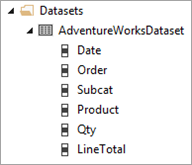

# Lesson 3: Defining a Dataset for the Table Report (Reporting Services)
After you define the data source, you need to define a dataset. In [!INCLUDE[ssRSnoversion](../includes/ssrsnoversion-md.md)], data that you use in reports is contained in a *dataset*. A dataset includes a pointer to a data source and a query to be used by the report, as well as calculated fields and variables.  
  
Use the query designer in Report Designer to design the dataset. For this tutorial, you will create a query that retrieves sales order information from the [!INCLUDE [ssSampleDBAdventureworks2014_md](../includes/sssampledbadventureworks2014-md.md)] database.  
  
### To define a Transact-SQL query for report data  
  
1.  In the **Report Data** pane, click **New**, and then click **Dataset…**. The **Dataset Properties** dialog box opens.  
  
2.  In the **Name** box, type **AdventureWorksDataset**.  
  
3.  Click **Use a dataset embedded in my report**.  
  
4.  Select the data souce you created in the previous lesson, [!INCLUDE [ssSampleDBAdventureworks2014_md](../includes/sssampledbadventureworks2014-md.md)].   
5. Select **Text** for the **Query type**.  
  
6.  Type, or copy and paste, the following Transact-SQL query into the **Query** box.  
  
    ```  
    SELECT   
       soh.OrderDate AS [Date],   
       soh.SalesOrderNumber AS [Order],   
       pps.Name AS Subcat, pp.Name as Product,    
       SUM(sd.OrderQty) AS Qty,  
       SUM(sd.LineTotal) AS LineTotal  
    FROM Sales.SalesPerson sp   
       INNER JOIN Sales.SalesOrderHeader AS soh   
          ON sp.BusinessEntityID = soh.SalesPersonID  
       INNER JOIN Sales.SalesOrderDetail AS sd   
          ON sd.SalesOrderID = soh.SalesOrderID  
       INNER JOIN Production.Product AS pp   
          ON sd.ProductID = pp.ProductID  
       INNER JOIN Production.ProductSubcategory AS pps   
          ON pp.ProductSubcategoryID = pps.ProductSubcategoryID  
       INNER JOIN Production.ProductCategory AS ppc   
          ON ppc.ProductCategoryID = pps.ProductCategoryID  
    GROUP BY ppc.Name, soh.OrderDate, soh.SalesOrderNumber, pps.Name, pp.Name,   
       soh.SalesPersonID  
    HAVING ppc.Name = 'Clothing'  
    ```  
  
7.  (Optional) Click the **Query Designer** button. The query is displayed in the text-based query designer. You can toggle to the graphical query designer by clicking **Edit As Text**. View the results of the query by clicking the run   button on the query designer toolbar.  
  
    You see the data from six fields from four different tables in the [!INCLUDE [ssSampleDBAdventureworks2014_md](../includes/sssampledbadventureworks2014-md.md)] database. The query makes use of Transact-SQL functionality such as aliases. For example, the SalesOrderHeader table is called *soh*.  
  
8.  Click **OK** to exit the query designer.  
  
9.  Click **OK** to exit the **Dataset Properties** dialog box.  
  
    Your **AdventureWorksDataset** dataset and fields appear in the Report Data pane.  
      
  
## Next Task  
You have successfully specified a query that retrieves data for your report. Next, you will create the report layout. See [Lesson 4: Adding a Table to the Report &#40;Reporting Services&#41;](../reporting-services/lesson-4-adding-a-table-to-the-report-reporting-services.md).  
  
## See Also  
[Query Design Tools &#40;SSRS&#41;](../reporting-services/report-data/query-design-tools-ssrs.md)  
[SQL Server Connection Type &#40;SSRS&#41;](../reporting-services/report-data/sql-server-connection-type-ssrs.md)  
[Tutorial: Writing Transact-SQL Statements](../t-sql/tutorial-writing-transact-sql-statements.md)  
  
  
  

