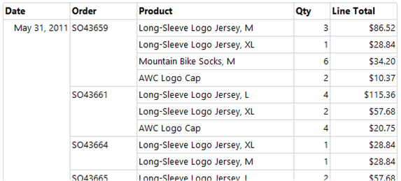
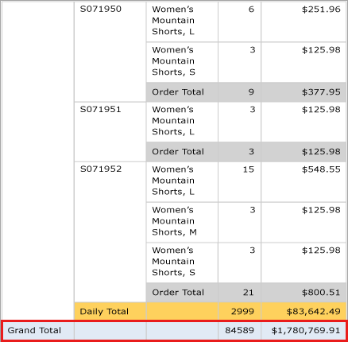
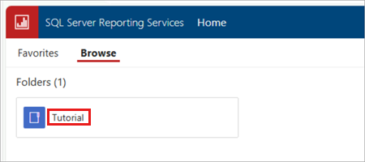

# Lesson 6: Adding Grouping and Totals (Reporting Services)
In this tutorial lesson, you will add grouping and totals to your [!INCLUDE[ssRSnoversion](../includes/ssrsnoversion-md.md)] report to organize and summarize your data.  
  
  
## To group data in a report  
  
1.  Click the **Design** tab.  
  
2.  If you do not see the **Row Groups** pane , right-click the design surface and click **View** and then click **Grouping**.  
  
3.  From the **Report Data** pane, drag the **Date** field to the **Row Groups** pane. Place it above the row called **(Details)**.
  
    Note that the row handle now has a bracket in it, to show a group. The table now also has two Date columns -- one on either side of a vertical dotted line.  
  
      
  
4.  From the **Report Data** pane, drag the **Order** field to the **Row Groups** pane. Place it below Date and above **(Details)**.

   
  
    Note that the row handle now has two brackets in it , to show two groups. The table now has two **Order** columns, too.  
  
5.  Delete the original **Date** and **Order** columns to the **right** of the double line. This removes this individual record values so that only the group value is displayed. Select the column handles for the two columns, right-click and click **Delete Columns**.  
  
      
  
6.  To format the new date column,  Right-click the cell with the `[Date]` field expression and then click **Text Box Properties**.  
  
7.  Click **Number**, and then in the **Category** field, click **Date**.  
  
8.  In the **Type** box, select **January 31, 2000**.  
  
9.  [!INCLUDE[clickOK](../includes/clickok-md.md)].  
  
10.  Switch to the **Preview** tab to preview the report. It should look similar to the following illustration:  
     
  
## To add totals to a report  
  
1.  Switch to Design view.  
  
2.  Right-click the data region cell that contains the field `[LineTotal]`, and click **Add Total**.  
  
    This adds a row with a sum of the dollar amount for each order.  
  
3.  Right-click the cell that contains the field `[Qty]`, and click **Add Total**.  
  
    This adds a sum of the quantity for each order to the totals row.  
  
4.  In the empty cell to the left of `Sum[Qty]`, type the label "**Order Total"**.  
  
5.  You can add a background color to the totals row. Select the two sum cells and the label cell.  
  
6.  On the **Format** menu, click **Background Color**, click **Light Gray**, and click **OK**.  
  
      
  
## To add a daily total to a report  
  
1.  Right-click the **Order** cell, point to **Add Total**, and click **After**.  
  
    This adds a new row containing sums of the quantity and dollar amount for each day, and the label "**Total**" to the bottom of the Order column.  
  
2.  Type the word **Daily** before the word **Total** in the same cell, so it reads **Daily Total**.  
  
3.  Select the **Daily Total** cell, the two **Sum** cells and the empty cell between them.  
  
4.  On the **Format** menu, click **Background Color**, click **Orange**, and click **OK**.  
  
      
  
## To add a grand total to a report  
  
1.  Right-click the Date cell, point to **Add Total**, and click **After**.  
  
    This adds a new row containing sums of the quantity and dollar amount for the entire report, and the **Total** label in the **Date** column.  
  
2.  Type the word **Grand** before the word **Total** in the same cell, so it reads **Grand Total**.  
  
3.  Select the **Grand Total** cell, the two **Sum** cells and the empty cells between them.  
  
4.  On the **Format** menu, click **Background Color**, click **Light Blue**, and click **OK**.  
  
      
  
5.  Click **Preview**.  
  
    The last page should look similar to the following image. In the toolbar, click the Last Page button.   
  
      
  
## To Publish the Report to the Report Server (Optional)  
  
1.  An optional step is to publish the completed report to the native mode report server so you can view the report in the web portal.  
  
2.  Click the **Project** menu and then click **tutorial Properties...**  
  
3.  In the **TargetServerURL** type the name of your report server, for example   
- `http:/<servername>/reportserver`  
   
- `http://localhost/reportserver` works if your designing the report on the report server.  
  
  
4. Note the TargetReportFolder is tutorial, the name of the project.  This is the name of the folder that the report will deploy to in the next steps.  
5. Click **OK**  
  
6.  On click the **Build** menu and then click **Deploy tutorial**.  
  
    If you see a message similar to the following in the output window, it indicates a successful deployment.  
  
    > ------ Build started: Project: tutorial, Configuration: Debug ------  
    > Skipping 'Sales Orders.rdl'. Item is up to date.  
    > Build complete -- 0 errors, 0 warnings  
    > ------ Deploy started: Project: tutorial, Configuration: Debug ------  
    > Deploying to http://[server name]/reportserver  
    > Deploying report '/tutorial/Sales Orders'.  
    > Deploy complete -- 0 errors, 0 warnings  
    > ========== Build: 1 succeeded or up-to-date, 0 failed, 0 skipped ==========  
    > ========== Deploy: 1 succeeded, 0 failed, 0 skipped ==========  
  
    If you see an error message similar to the following, verify you have permissions on the report server and you have started [!INCLUDE[ssBIDevStudio](../includes/ssbidevstudio-md.md)] with administrator privileges.  
  
    > "The permissions granted to user 'XXXXXXXX\\[your user name]' are insufficient for performing this operation"  
  
7.  Browse to the web portal with administrator privileges, for example, right-click the icon for Internet Explorer and click **Run as administrator**.  
  
    Browse to [!INCLUDE[ssRSnoversion_md](../includes/ssrsnoversion-md.md)] web portal URL.   
    **Note:** The *portal* URL is "Reports", not the Report *Server* URL of "Reportserver".  For example:   
    - `http://<server name>/reports`.  
     - `http://localhost/reports` works if your designing the report on the report server.  
  
8.  Browse to the folder that contains the report. The default name is *tutorial*, the name of the project or the name you typed into the TargetReportFolder fiedl in the project properties.   
Click the name of the report **Sales Orders** to view the rendered report in the browser.  
  
      
 
** You have successfully completed the Creating a Basic Table Report tutorial.**  
  
## See Also  
[Filter, Group, and Sort Data &#40;Report Builder and SSRS&#41;](../reporting-services/report-design/filter-group-and-sort-data-report-builder-and-ssrs.md)  
  
  
  

