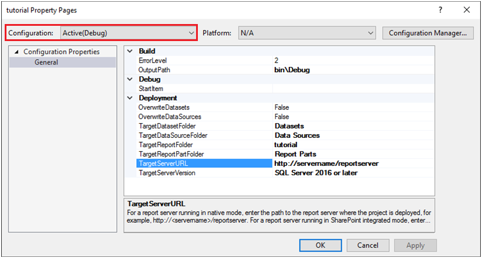

# Publishing Reports to a Report Server
  After you have designed and tested a report or set of reports, you can use the deployment features in [!INCLUDE[ssBIDevStudioFull](../../includes/ssbidevstudiofull-md.md)] to publish the reports to a report server. You can publish individual reports or a Report Server project which can include multiple reports and data sources. Publishing a Report Server project is the easiest way to publish multiple reports. [!INCLUDE[ssBIDevStudioFull](../../includes/ssbidevstudiofull-md.md)] uses the term *deploy*, instead of the term *publish*. The two terms are interchangeable.  
  
 [!INCLUDE[ssBIDevStudioFull](../../includes/ssbidevstudiofull-md.md)] provides project configurations for managing report publication. The configuration specifies the location of the report server, the version of SQL Server Reporting Services installed on the report server, whether the data sources published to the report server are overwritten and so forth. For example, the "Debug" configuration can publish to a different server than the "release" configuration. In addition to using the configurations that [!INCLUDE[ssBIDevStudioFull](../../includes/ssbidevstudiofull-md.md)] provides, you can create additional configurations.  
 
## Requirements to Publish
Permission is determined through role-based security that is defined by your report server administrator. Publishing operations are typically granted through the **Publisher role**.  
  
## Project Configurations  
 Your reporting environment might have multiple report servers and different versions of [!INCLUDE[ssRSnoversion](../../includes/ssrsnoversion-md.md)] installed. You can create multiple configurations and then use a different one depending the deployment scenario. Project configurations include properties for building reports, such as the folder in which to temporarily store the built reports, and how to handle build issues. The configurations also have properties that you use to specify the location and version of the report server, the folders on the report server.  
  
 By default, [!INCLUDE[ssBIDevStudioFull](../../includes/ssbidevstudiofull-md.md)] provides three project configurations: **DebugLocal**, **Debug**, and **Release**. The default configuration is DebugLocal. You typically use the DebugLocal configuration to view reports in a local preview window, the Debug configuration to publish reports to a test server, and the Release configuration to publish reports to a production server. The solution configurations drop-down list on the Standard toolbar shows the active configuration. To use a different configuration, select it from the list.  
  
  
  
 For more information, see the following
 + [Project Property Pages Dialog Box](../../reporting-services/tools/project-property-pages-dialog-box.md)
 + [Deployment and Version Support in SQL Server Data Tools](../../reporting-services/tools/deployment-and-version-support-in-sql-server-data-tools-ssrs.md)
 + [Set Deployment Properties for Reporting Services projects in SSDT](../../reporting-services/tools/set-deployment-properties-reporting-services.md)
  
## To publish all reports in a project  
  
On the **Build** menu, click **Deploy \<report project name>**. Alternatively, in Solution Explorer, right-click the report project and then click **Deploy**. You can view the status of the publishing process in the Output window.  
  
When you deploy a Report Server project, the shared data sources in the report project are also deployed. All reports are deployed using the same project configuration: to the same report server, the same folder on the server, and so on. To publish reports to different servers, either publish them one by one or include only reports you want to in the Report Server project. A solution can include multiple Report Server projects, and using multiple project might make it easier to manage the deployment of reports because you can use a different configuration to deploy different projects. 
  
## To publish a single report  
  
In Solution Explorer, right-click the report and then click **Deploy**. You can view the status of the publishing process in the Output window.  
  
 When you publish a report, you must also deploy the shared data sources that the report uses.   
 If you do not want to publish all reports in a project, you can chose to publish only a single report. To do this, select a configuration that deploys the report (for example, the Release configuration), right-click the report, and then click **Deploy**.  
  
 If a report uses a shared data source, you need to also deploy the shared data source or the deployed report will not run. Right-click the shared data source and then click **Deploy**.  
  
 The target server URL of the report server must be specified and you might want to change the default folders to which reports and shared data sources deploy.  

  
## See Also  
 [Project Property Pages Dialog Box](../../reporting-services/tools/project-property-pages-dialog-box.md)   
 [Report Server Content Management &#40;SSRS Native Mode&#41;](../../reporting-services/report-server/report-server-content-management-ssrs-native-mode.md)   
 [Upgrade Reports](../../reporting-services/install-windows/upgrade-reports.md)  
  
  
