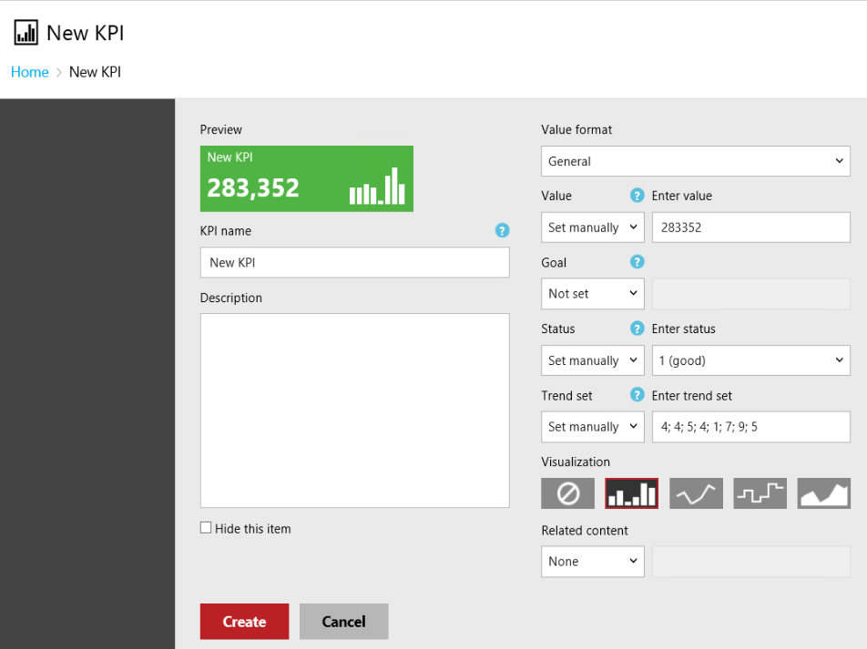

# Working with KPIs in Reporting Services

[!INCLUDE[ssrs-appliesto](../includes/ssrs-appliesto.md)] [!INCLUDE[ssrs-appliesto-2016-and-later](../includes/ssrs-appliesto-2016-and-later.md)] [!INCLUDE[ssrs-appliesto-pbirsi](../includes/ssrs-appliesto-pbirs.md)]

A *Key Performance Indicator (KPI)* is a visual cue that communicates the amount of progress made toward a goal.  Key Performance Indicators are valuable for teams, managers, and businesses to evaluate quickly the progress made against measurable goals.
  
By using KPIs in SQL Server Reporting Services, you can easily visualize answers to the following questions:  
  
- What am I ahead or behind on?  
  
- How far ahead or behind am I?  
  
- What are the minimum amounts I have completed?  
  
## Creating a Dataset

A KPI will only use the first row of data from a shared dataset. Make sure that the data you want to use is located on that first row. To create a shared dataset, you can use either Report Builder or SQL Server Data Tools.  
  
> **Note**: The Dataset does not need to be in the same folder as the KPI.  
  
## Placement of KPIs  
  
KPIs can be created in any folder in your report server.  Before you create a KPI, you will want to think about where is the right location to place it in. You can place it in a folder that is visible to the users, at the same time being relevant to other reports, and KPIs, around it.  
## Adding a KPI
  
After you have determined the location of your KPI, go to that folder and select **New** > **KPI** from the top menu.  
  
  
  
This will present you with the **New KPI** screen.  
  
  
  
You can either assign static values, or use data from a shared dataset. When you create a new KPI, it will be populated with a random set of manual data.  
  
| Field | Description |
|-----------------|--------------------------------------------------------------------------------------------------------------------------------------------------|
| Value format | Used to change the format of the value being displayed. |
| Value | The value to display for the KPI. |
| Goal | Used as a comparison to a numeric value and shown as a percent difference. |
| Status | Numerical value used to determine the KPI Tile color. Valid values are 1 (green), 0 (amber) and -1 (red). |
| Trend set | Comma-separated numeric values used for chart visualization. This can also be set to a column of a dataset with values that represent the trend. |
| Related content | The ability to set a drill-through link. This link can either be a mobile report published on the portal or a custom URL. |
  
> **Warning**: While you can use the word value for the **Status** field at design time, you should use the number value if refreshing a dataset. If you refresh a dataset with the word value, instead of the number, it could corrupt the KPIs on your server.  
>
> **Note**: The **Value**, **Goal** and **Status** fields can only choose a value from the first row of a dataset's result. The **Trend set** field, however, can choose which column reflects the trend.  
  
To use data from a shared dataset, you can do the following steps.
  
1. Change the fields drop down box from **Set manually**, or **Not set**, to **Dataset field**.  
  
      
  
2. Select the **ellipsis (...)** in the data box. This will bring up the **Pick a Dataset** screen.  
  
      
  
3. Select the dataset that has the data you want to display.  
  
4. Choose the field you want to use. Select **OK**.  
  
      
  
5. Change **Value format** to match the format of your value. In this example, the value is a currency.  
  
      
  
6. Select **Apply**.  
  
    

## Configuring Related Content

When you choose **Mobile Report**, you can choose the destination in a dialog.

   

When you now click on the KPI in the portal, a thumbnail of the mobile report shows under the related content dropdown. Clicking on this thumbnail can directly navigate you to this report.

You can also specify a custom URL. This task can be anything: a website, a SharePoint site, a URL to an SSRS report (which would allow you to pass along hardcoded parameters).

When you now click on the KPI, the URL shows under related content.

It's only possible to add one mobile report or one custom URL.
  
## Removing a KPI  
  
To remove a KPI, you can do the following steps.
  
1. Select the **ellipsis (...)** of the KPI you want to remove. Select **Manage**.  
  
      
  
2. Select **Delete**. Select **Delete** again on the confirmation dialog.  
  
      
  
## Refreshing a KPI  
  
To refresh the KPI, you will need to configure a caching for the shared dataset. For more information regarding cache refresh plans, see [Work with Shared Datasets](../reporting-services/work-with-shared-datasets-web-portal.md).  
  
## Next steps
  
[Web portal](../reporting-services/web-portal-ssrs-native-mode.md)  
[Work with Shared Datasets](../reporting-services/work-with-shared-datasets-web-portal.md)

More questions? [Try asking the Reporting Services forum](https://go.microsoft.com/fwlink/?LinkId=620231)