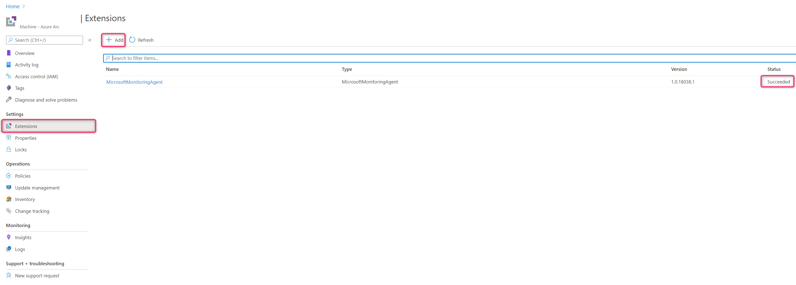
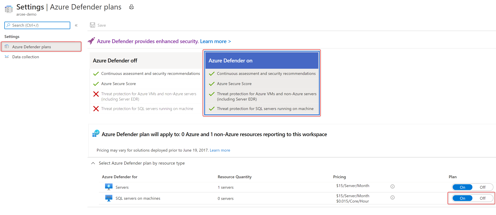
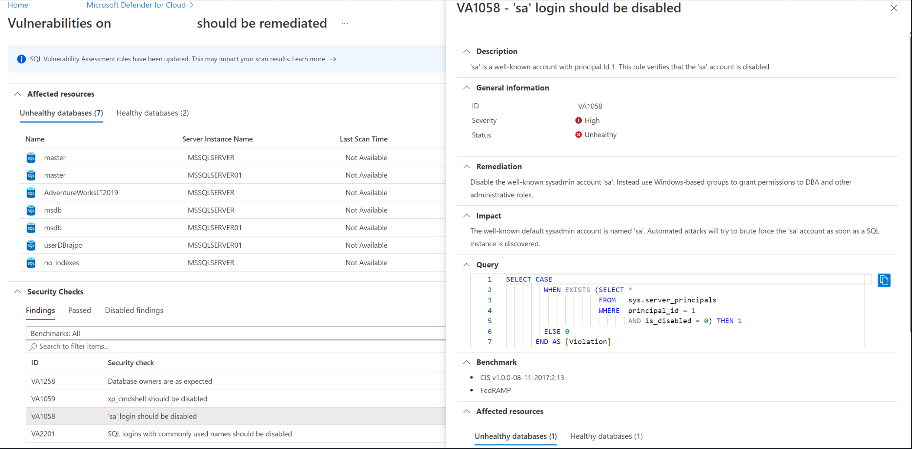
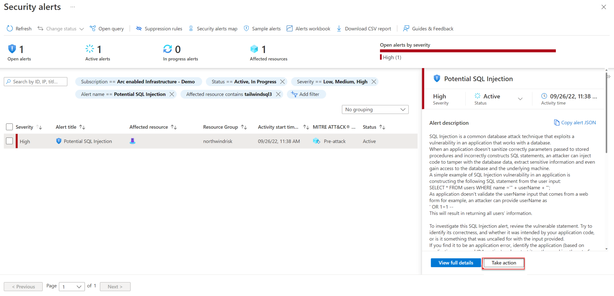
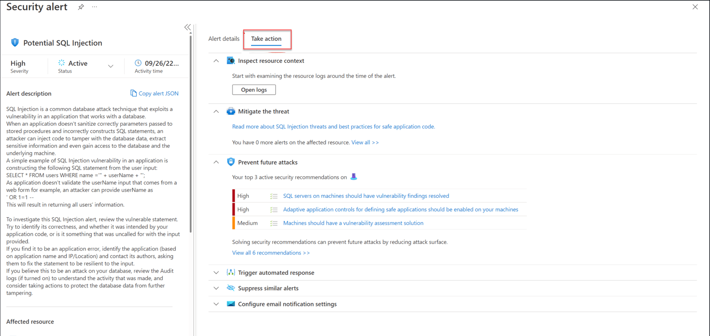

# Configure Azure Defender for SQL Server on Azure Arc-enabled servers

You can enable Azure Defender for your SQL Server instances on-premises by following these steps.

## Prerequisites

* Your Windows-based SQL Server instance is connected to Azure Arc. Follow the instructions to [onboard your SQL Server instance to  Arc-enabled SQL Server](connect.md).

   > [!NOTE]
   > Azure Defender is only supported for SQL Server instances on Windows machines. This will not work for SQL Server on Linux machines.

* Your user account is assigned one of the [Security Center Roles (RBAC)](/azure/security-center/security-center-permissions)

## Create a Log Analytics workspace

1. Search for __Log Analytics workspaces__ resource type and add a new one through the creation blade.

   

   > [!NOTE]
   > You can use a Log Analytics workspace in any region so if you already have one, you can use it. But we recommend creating it in the same region where your __Machine - Azure Arc__ resource is created.

1. Go to the overview page of the Log Analytics workspace resource and select **Windows, Linux, and other sources**. Copy the workspace ID and primary key for later use.

   

## Install Microsoft Monitoring Agent (MMA)

The next step is needed only if you have not yet configured MMA on the remote machine.

1. Select the __Machine - Azure Arc__ resource for the virtual or physical server where the SQL Server instance is installed and add the extension __Microsoft Monitoring Agent - Azure Arc__ using the  **Extensions** feature. When asked to configure the Log Analytics workspace, use the workspace ID and primary you saved in the previous step.

   

1. After validation succeeds, click **Create** to start the MMA Arc Extension deployment workflow. When the deployment completes, the status updates to **Succeeded**.

1. For more information, see [Extension management with Azure Arc](/azure/azure-arc/servers/manage-vm-extensions).

## Enable Azure Defender

Next, you need to enable Azure Defender for SQL Server instance.

1. Go to Security Center and open the **Pricing & settings** page from the sidebar.

1. Select the workspace that you have configured for the MMA extension in the previous step

1. Select **Azure Defender On**. Make sure the option for **SQL servers on machines** is turned on.

   

 > [!NOTE]
   > The first scan to generate the vulnerability assessment happens within 24 hours after enabling Azure Defender for SQL. After that, auto scans are be performed every week on Sunday.

## Explore

Explore security anomalies and threats in Azure Security Center.

1. Open your SQL Server – Azure Arc resource and select **Security** in the left menu. to see the recommendations and alerts for that instance.

   

1. Click on any of the recommendations to see the vulnerability details in __Security Center__ .

   

1. Click on any security alert for full details and further explore the attack in [Azure Sentinel](/azure/sentinel/overview). The following diagram is an example of the brute force alert.

   

1. Click on **Take action** to mitigate the alert.

   

> [!NOTE]
> The general __Security Center__ link at the top of the page does not use the preview portal URL so your __SQL Server - Azure Arc__ resources are not be visible there. Follow the links for the individual recommendations or alerts.

## Next steps

* To configure Azure Defender for SQL Server at scale, see [Enable Azure Defender for SQL servers on machines](/azure/security-center/defender-for-sql-usage.md).
* You can further investigate the security alerts and attacks using [Azure Sentinel](/azure/sentinel/overview). For details,see [on-board Azure Sentinel](/azure/sentinel/connect-data-sources).