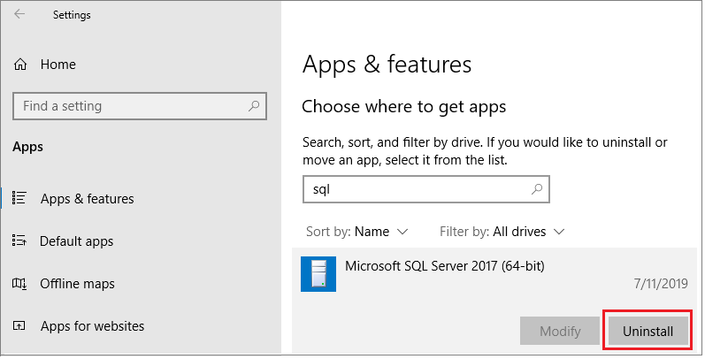
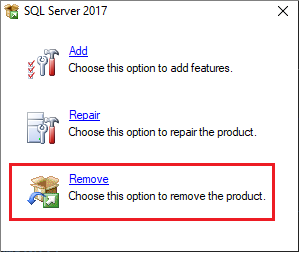
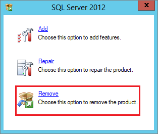

# Uninstall an Existing Instance of SQL Server (Setup)
[!INCLUDE [SQL Server Windows Only - ASDBMI ](../../includes/applies-to-version/sql-windows-only-asdbmi.md)]

  This article describes how to uninstall a stand-alone instance of [!INCLUDE[ssNoVersion](../../includes/ssnoversion-md.md)]. By following the steps in this article, you also prepare the system so that you can reinstall [!INCLUDE[ssNoVersion](../../includes/ssnoversion-md.md)].  
  
 > [!NOTE]
 > To uninstall a [!INCLUDE[ssNoVersion](../../includes/ssnoversion-md.md)] failover cluster, use the Remove Node functionality provided by [!INCLUDE[ssNoVersion](../../includes/ssnoversion-md.md)] Setup to remove each node individually. For more information, see [Add or Remove Nodes in a SQL Server Failover Cluster &#40;Setup&#41;](../../sql-server/failover-clusters/install/add-or-remove-nodes-in-a-sql-server-failover-cluster-setup.md)  

## Considerations

- To uninstall SQL Server, you must be a local administrator with permissions to log on as a service. 
- If your computer has the *minimum* required amount of physical memory, increase the size of the page file to two times the amount of physical memory. Insufficient virtual memory can result in an incomplete removal of SQL Server. 
- On a system with multiple instances of SQL Server, the SQL Server browser service is uninstalled only once the last instance of SQL Server is removed. The SQL Server Browser service can be removed manually from **Programs and Features** in the **Control Panel**. 
- Uninstalling [!INCLUDE[ssNoVersion](../../includes/ssnoversion-md.md)] deletes tempdb data files that were added during the install process. Files with tempdb_mssql_*.ndf name pattern are deleted if they exist in the system database directory. 
  

  
## Prepare  
  
1.  **Back up your data.** Either create [full backups](../../relational-databases/backup-restore/create-a-full-database-backup-sql-server.md) of all databases, including system databases, or manually copy the .mdf and .ldf files to a separate location. The **master** database contains all system level information for the server, such as logins, and schemas. The **msdb** database contains job information such as SQL Server agent jobs, backup history, and maintenance plans. For more information about system databases see [System databases](../../relational-databases/backup-restore/back-up-and-restore-of-system-databases-sql-server.md). 
  
    The files that you must save include the following database files:  

    * master.mdf
    * msdbdata.mdf
    * Tempdb.mdf
    * mastlog.ldf
    * msdblog.ldf
    * Templog.ldf
    * model.mdf
    * Mssqlsystemresource.mdf
    * ReportServer[$InstanceName]
    * modellog.ldf
    * Mssqlsustemresource.ldf
    * ReportServer[$InstanceName]TempDB

    > [!NOTE]
    > The ReportServer databases are included with SQL Server Reporting Services.   

 
1.  **Stop all**  [!INCLUDE[ssNoVersion](../../includes/ssnoversion-md.md)] **services.** We recommend that you stop all [!INCLUDE[ssNoVersion](../../includes/ssnoversion-md.md)] services before you uninstall [!INCLUDE[ssNoVersion](../../includes/ssnoversion-md.md)] components. Active connections can prevent successful uninstallation.  
  
1.  **Use an account that has the appropriate permissions.** Log on to the server by using the [!INCLUDE[ssNoVersion](../../includes/ssnoversion-md.md)] service account or by using an account that has equivalent permissions. For example, you can log on to the server by using an account that is a member of the local Administrators group.  
  
## Uninstall 

# [Windows 10 / 2016 +](#tab/Windows10)

To uninstall SQL Server from Windows 10, Windows Server 2016, Windows Server 2019, and greater, follow these steps: 

1. To begin the removal process navigate to **Settings** from the Start menu and then choose **Apps**. 
1. Search for `sql` in the search box. 
1. Select **Microsoft SQL Server (Version) (Bit)**. For example, `Microsoft SQL Server 2017 (64-bit)`.
1. Select **Uninstall**.
 
    

1. Select **Remove** on the SQL Server dialog pop-up to launch the Microsoft SQL Server installation wizard. 

    
  
1.  On the **Select Instance** page, use the drop-down box to specify an instance of [!INCLUDE[ssNoVersion](../../includes/ssnoversion-md.md)] to remove, or specify the option to remove only the [!INCLUDE[ssNoVersion](../../includes/ssnoversion-md.md)] shared features and management tools. To continue, select **Next**.  
  
1.  On the **Select Features** page, specify the features to remove from the specified instance of [!INCLUDE[ssNoVersion](../../includes/ssnoversion-md.md)].  
  
1.  On the **Ready to Remove** page, review the list of components and features that will be uninstalled. Click **Remove** to begin uninstalling  
 
1. Refresh the **Apps and Features** window to verify the SQL Server instance has been removed successfully, and determine which, if any, SQL Server components still exist. Remove these components from this window as well, if you so choose. 

# [Windows 2008 - 2012 R2](#tab/windows2012)

To uninstall SQL Server from Windows Server 2008, Windows Server 2012 and Windows 2012 R2, follow these steps: 

1. To begin the removal process, navigate to the **Control Panel** and then select **Programs and Features**.
1. Right-click **Microsoft SQL Server (Version) (Bit)** and select **Uninstall**. For example, `Microsoft SQL Server 2012 (64-bit)`.  
  
    

1. Select **Remove** on the SQL Server dialog pop-up to launch the Microsoft SQL Server installation wizard. 

    
  
1.  On the **Select Instance** page, use the drop-down box to specify an instance of [!INCLUDE[ssNoVersion](../../includes/ssnoversion-md.md)] to remove, or specify the option to remove only the [!INCLUDE[ssNoVersion](../../includes/ssnoversion-md.md)] shared features and management tools. To continue, select **Next**.  
  
1.  On the **Select Features** page, specify the features to remove from the specified instance of [!INCLUDE[ssNoVersion](../../includes/ssnoversion-md.md)].  
  
1.  On the **Ready to Remove** page, review the list of components and features that will be uninstalled. Click **Remove** to begin uninstalling  
 
1. Refresh the **Programs and Features** window to verify the SQL Server instance has been removed successfully, and determine which, if any, SQL Server components still exist. Remove these components from this window as well, if you so choose. 

---

  
## In the event of failure  

If the removal process fails, review the [SQL Server setup log files](../../database-engine/install-windows/view-and-read-sql-server-setup-log-files.md) to determine the root cause. 

The KB article [How to identify SQL Server setup issues in the setup log files](https://support.microsoft.com/kb/955396/en-us) can assist in the investigation. Though it is for SQL Server 2008, the methodology described is applicable to every version of SQL Server. 

  
## See Also  
 [View and Read SQL Server Setup Log Files](../../database-engine/install-windows/view-and-read-sql-server-setup-log-files.md)  
  
  
