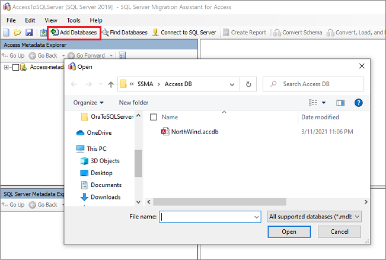
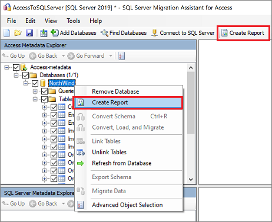
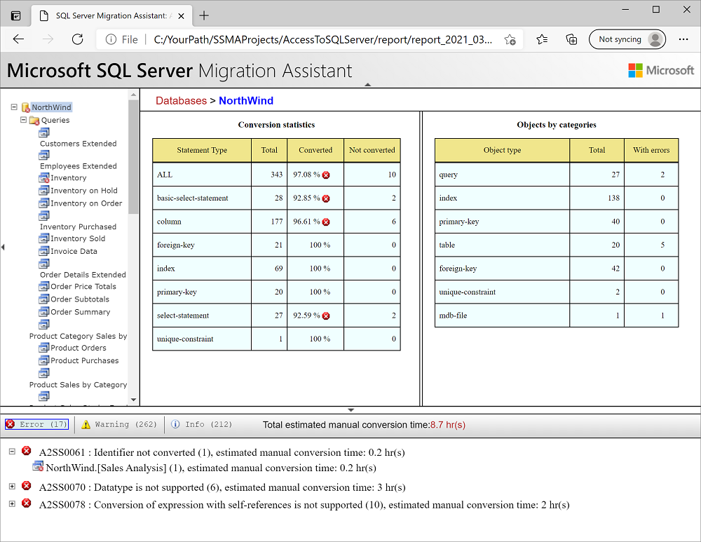
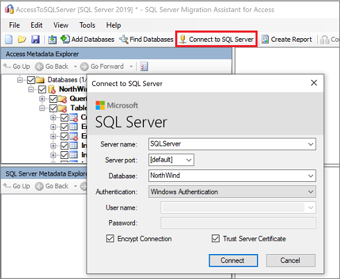
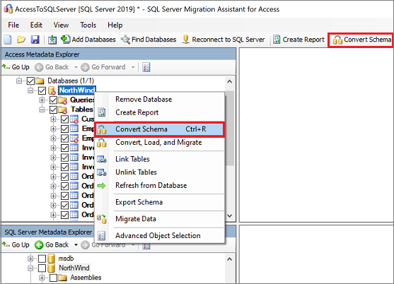
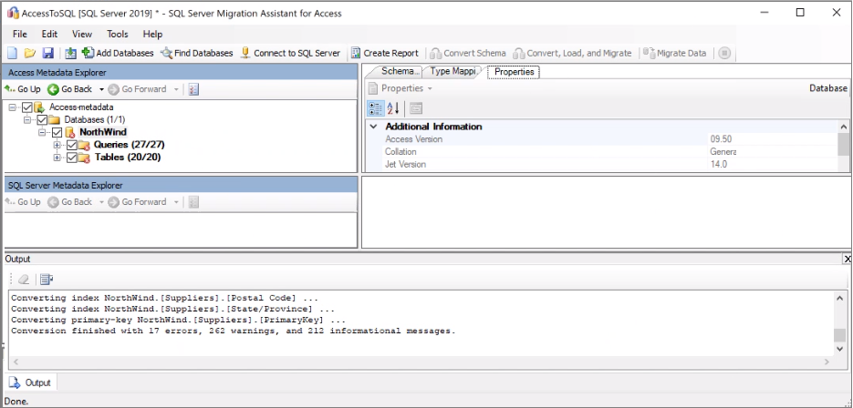
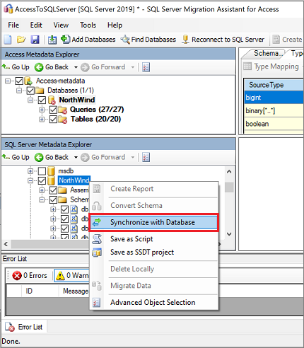
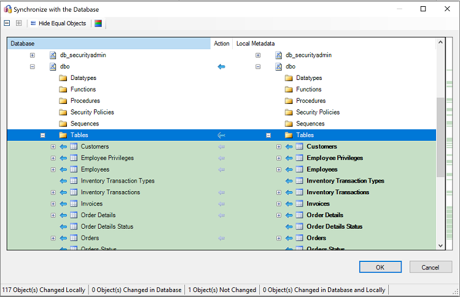
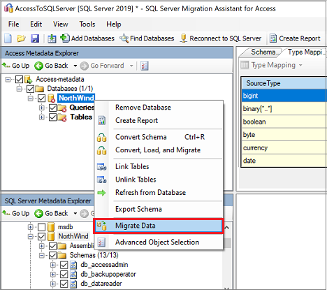
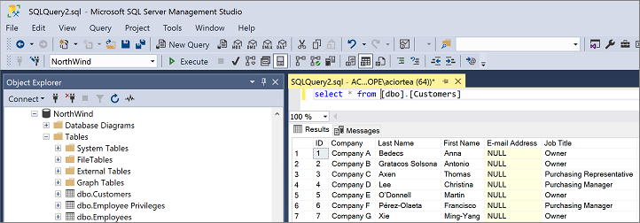

# Migration guide: Access to SQL Server
[!INCLUDE[sqlserver](../../../includes/applies-to-version/sqlserver.md)]

This migration guide teaches you to migrate your Microsoft Access databases to SQL Server by using SQL Server Migration for Access (SSMA for Access). 

For other migration guides, see [Database Migration](https://datamigration.microsoft.com/). 

## Prerequisites 

To migrate your Access database to SQL Server, you need:

- To verify your source environment is supported. 
- [SQL Server Migration Assistant for Access](https://www.microsoft.com/download/details.aspx?id=54255). 

## Pre-migration 

After you have met the prerequisites, you are ready to discover the topology of your environment and assess the feasibility of your migration.

### Assess

By using SQL Server Migration Assistant (SSMA) for Access, you can review database objects and data, and assess databases for migration. To learn more about the tool, see [SQL Server Migration Assistant for Access)](/sql/ssma/access/sql-server-migration-assistant-for-access-accesstosql).

To create an assessment, follow these steps:

1. Open [SQL Server Migration Assistant for Access](https://www.microsoft.com/download/details.aspx?id=54255). 
1. Select **File** and then choose **New Project**. Choose your migration target and provide a name for your migration project. 

   

1. Select **Add Databases** and choose the databases to add to  your project. 

   

1. In **Access Metadata Explorer**, right-click the database you want to assess, and then choose **Create report**. 

   

1. Review the assessment report. For example: 

   

### Validate data types

Validate the default data type mappings and change them based on requirements if necessary. To do so, follow these steps: 

1. Select **Tools** from the menu. 
1. Select **Project Settings**. 
1. Select the **Type mappings** tab. 

   

1. You can change the type mapping for each table by selecting the table in the **Oracle Metadata explorer**. 

### Convert 

To convert database objects, follow these steps: 

1. Select **Connect to SQL Server** and provide connection details. 

   

1. Right-click the database in **Access Metadata Explorer** and choose **Convert schema**. Alternatively, you can choose **Convert schema** from the top line navigation bar after choosing your database. 

   

   Compare converted queries to original queries: 

   

   Compare converted objects to original objects: 

   

1. (Optional) To convert an individual object, right-click the object and choose **Convert schema**. An object that has been converted appears bold in the **Access Metadata Explorer**: 

   
 
1. Select **Review results** in the Output pane, and review errors in the **Error list** pane. 

## Migrate

After you have completed assessing your databases and addressing any discrepancies, the next step is to execute the migration process. Migrating data is a bulk-load operation that moves rows of data into SQL Server in transactions. The number of rows to be loaded into SQL Server in each transaction is configured in the project settings.

To migrate data by using SSMA for Access, follow these steps: 

1. If you haven't already, select **Connect to SQL Server** and provide connection details. 

1. Right-click the database from the **SQL Server Metadata Explorer** and choose **Synchronize with Database**. This action publishes the MySQL schema to SQL Server.

   

   Review the synchronization with the database: 

   

1. Use **Access Metadata Explorer** to check boxes next to the items you want to migrate. If you want to migrate the entire database, check the box next to the database. 
1. Right-click the database or object you want to migrate, and choose **Migrate data**. 
   To migrate data for an entire database, select the check box next to the database name. To migrate data from individual tables, expand the database, expand Tables, and then select the check box next to the table. To omit data from individual tables, clear the check box.

   

   Review the migrated data: 

   

1. Connect to your SQL Server using [SQL Server Management Studio](/sql/ssms/download-sql-server-management-studio-ssms) to review data and schema on your SQL Server instance. 

   

## Post-migration 

After you have successfully completed the **Migration** stage, you need to go through a series of post-migration tasks to ensure that everything is functioning as smoothly and efficiently as possible.

### Remediate applications

After the data is migrated to the target environment, all the applications that formerly consumed the source need to start consuming the target. Accomplishing this will in some cases require changes to the applications.

### Perform tests

The test approach for database migration consists of performing the following activities:

1. **Develop validation tests**. To test database migration, you need to use SQL queries. You must create the validation queries to run against both the source and the target databases. Your validation queries should cover the scope you have defined.

2. **Set up test environment**. The test environment should contain a copy of the source database and the target database. Be sure to isolate the test environment.

3. **Run validation tests**. Run the validation tests against the source and the target, and then analyze the results.

4. **Run performance tests**. Run performance test against the source and the target, and then analyze and compare the results.

### Optimize

The post-migration phase is crucial for reconciling any data accuracy issues and verifying completeness, as well as addressing performance issues with the workload.

> [!Note]
> For additional detail about these issues and specific steps to mitigate them, see the [Post-migration Validation and Optimization Guide](https://docs.microsoft.com/sql/relational-databases/post-migration-validation-and-optimization-guide).

## Migration assets 

For additional assistance with completing this migration scenario, please see the following resources, which were developed in support of a real-world migration project engagement.

| **Title/link** | **Description** |
| -------------- | --------------- |
| [Data Workload Assessment Model and Tool](https://github.com/Microsoft/DataMigrationTeam/tree/master/Data%20Workload%20Assessment%20Model%20and%20Tool) | This tool provides suggested “best fit” target platforms, cloud readiness, and application/database remediation level for a given workload. It offers simple, one-click calculation and report generation that greatly helps to accelerate large estate assessments by providing and automated and uniform target platform decision process. |

These resources were developed as part of the Data SQL Ninja Program, which is sponsored by the Azure Data Group engineering team. The core charter of the Data SQL Ninja program is to unblock and accelerate complex modernization and compete data platform migration opportunities to Microsoft's Azure Data platform. If you think your organization would be interested in participating in the Data SQL Ninja program, please contact your account team and ask them to submit a nomination.

## Next steps

After migration, review the [Post-migration validation and optimization guide](/sql/relational-databases/post-migration-validation-and-optimization-guide). 

For a matrix of the Microsoft and third-party services and tools that are available to assist you with various database and data migration scenarios, as well as specialty tasks, see [Data migration services and tools](/azure/dms/dms-tools-matrix).

For other migration guides, see [Database Migration](https://datamigration.microsoft.com/). 

For video content, see:
- [Overview of the migration journey](https://azure.microsoft.com/resources/videos/overview-of-migration-and-recommended-tools-services/)
