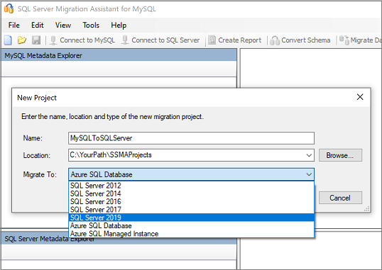
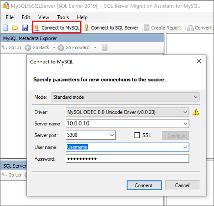
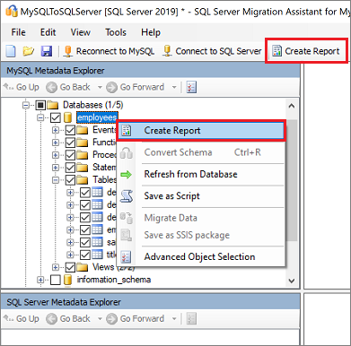
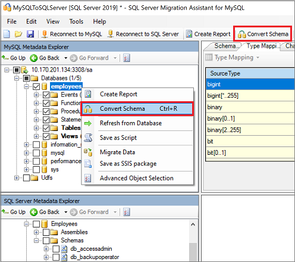
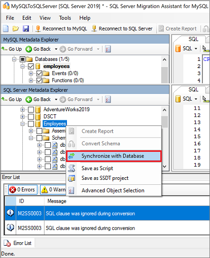
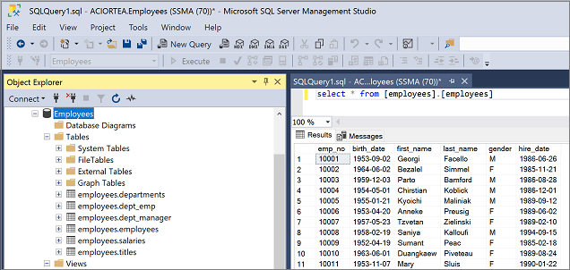

# Migration guide: MySQL to SQL Server

This guide helps you migrate your MySQL databases to SQL Server. 

For other migration guides, see [Database Migration](https://datamigration.microsoft.com/). 

## Prerequisites 

To migrate your MySQL database to SQL Server, you need:

- connectivity to your source MySQL database to run assessment and conversion
- [SQL Server Migration Assistant for MySQL](https://aka.ms/ssmaformysql)

## Pre-migration 

After you have met the prerequisites, you are ready to discover your source MySQL environment and assess the feasibility of your migration.
Before you start the migration using SSMA, you must:

1.  Create a new project.  
2.  Connect to a MySQL database.
3.  After a successful connection, MySQL schemas will appear in MySQL Metadata Explorer. Right-click objects in MySQL Metadata Explorer to perform tasks such as create reports that assess conversions to SQL Server.

### Assess 

To use [SSMA for MySQL](https://aka.ms/ssmaformysql) to create an assessment, follow these steps: 

1. Open SQL Server Migration Assistant for MySQL. 
1. Select **File** and choose **New Project**. Provide the project name, a location to save your project and the migration target.
1. Select **SQL Server** in the **Migrate to** option. 

   

1. Provide connect details in the **Connect to MySQL** dialog box and connect to  your MySQL server. 

   

1. Right-click the MySQL schema in **MySQL Metadata Explorer** and choose **Create Report**. Alternatively, you can select **Create Report** from the top-line navigation bar. 

   

1. Review the HTML report with conversion statistics, errors, and warnings. Analyze this report to understand conversion issues and their resolutions. 

   

   This report can also be accessed from the SSMA projects folder as selected in the first screen. From the example above locate the report.xml file from:

   `drive:\Users\<username>\Documents\SSMAProjects\MySQLMigration\report\report_2016_11_12T02_47_55\`
 
   and open it in Excel to get an inventory of MySQL objects and the effort required to perform schema conversions.

### Validate type mappings

Before you perform schema conversion, validate the default datatype mappings or change them based on requirements. You could do so either by navigating to the **Tools** menu and choosing **Project Settings** or you can change type mapping for each table by selecting the table in the **MySQL Metadata Explorer**.

To learn more about conversion settings in SSMA, see [Project Settings](../../../ssma/mysql/project-settings-conversion-mysqltosql.md)

### Convert schema

Converting database objects takes the object definitions from MySQL, converts them to similar SQL Server objects, and then loads this information into the SSMA metadata. It does not load the information into the instance of SQL Server. You can then view the objects and their properties by using the SQL Server Metadata Explorer.

During the conversion, SSMA prints output messages to the Output pane and error messages to the Error List pane. Use the output and error information to determine whether you have to modify your MySQL databases or your conversion process to obtain the desired conversion results.

To convert the schema, follow these steps:

1. (Optional) To convert dynamic or ad-hoc queries, right-click the node, and choose **Add Statement**. 
1. Select **Connect to SQL Server** in the top-line navigation bar and provide SQL Server details. You can choose to connect to an existing database or provide a new name, in which case a database will be created on the target server.

   

1. Right-click the MySQL schema in **MySQL Metadata Explorer** and choose **Convert schema**. Alternatively, you can select **Convert schema** from the top-line navigation bar. 

   

1. Compare and review the structure of the schema to identify potential problems. 

   

   After schema conversion you can save this project locally for an offline schema remediation exercise. Select **Save Project** from the **File** menu. This gives you an opportunity to evaluate the source and target schemas offline and perform remediation before you can publish the schema to SQL Server.

To learn more, see [Converting MySQL databases](../../../ssma/mysql/converting-mysql-databases-mysqltosql.md)

## Migration 

After you have the necessary prerequisites in place and have completed the tasks associated with the **Pre-migration** stage, you are ready to perform the schema and data migration.

To migrate data, two cases arise:

 1. **Client Side Data Migration:**
	 -   For performing  **Client Side Data Migration**, select the  **Client Side Data Migration Engine**  option in the  **Project Settings**  dialog box.

> [!NOTE]
> When SQL Express edition is used as the target database, only client side data migration is allowed and server side data migration is not supported.

2. **Server Side Data Migration:**
	-   Before performing data migration on the server side, ensure:
	    a. The SSMA for MySQL Extension Pack is installed on the instance of SQL Server.
	    b. The SQL Server Agent service is running on the instance of SQL Server 
	-   For performing  **Server Side Data Migration**, select the  **Server Side Data Migration Engine**  option in the  **Project Settings**  dialog box.

> [!IMPORTANT]  
> If the engine being used is Server Side Data Migration Engine, then, before migrating data, you must install the SSMA for MySQL Extension Pack and the MySQL providers on the computer that is running SSMA. The SQL Server Agent service must also be running. For more information about how to install the extension pack, see [Installing SSMA Components on SQL Server (MySQL to SQL)](../../../ssma/mysql/installing-ssma-components-on-sql-server-mysqltosql.md)  

To publish the schema and migrate the data, follow these steps: 

1. Right-click the database in **SQL Server Metadata Explorer** and choose **Synchronize with Database**.  This action publishes the MySQL schema to the SQL Server instance.

   

1. Right-click the MySQL schema in **MySQL Metadata Explorer** and choose **Migrate Data**.  Alternatively, you can select **Migrate Data** from the top-line navigation bar.  

   

1. After migration completes, view the **Data Migration Report**: 

   

1. Validate the migration by reviewing the data and schema on the SQL Server instance by using SQL Server Management Studio (SSMS).

   

## Post-migration 

After you have successfully completed the **Migration** stage, you need to go through a series of post-migration tasks to ensure that everything is functioning as smoothly and efficiently as possible.

### Remediate applications

After the data is migrated to the target environment, all the applications that formerly consumed the source need to start consuming the target. Accomplishing this will in some cases require changes to the applications.

### Perform tests

The test approach for database migration consists of performing the following activities:

1. **Develop validation tests**. To test database migration, you need to use SQL queries. You must create the validation queries to run against both the source and the target databases. Your validation queries should cover the scope you have defined.

2. **Set up test environment**. The test environment should contain a copy of the source database and the target database. Be sure to isolate the test environment.

3. **Run validation tests**. Run the validation tests against the source and the target, and then analyze the results.

4. **Run performance tests**. Run performance test against the source and the target, and then analyze and compare the results.

> [!NOTE] 
> For assistance with developing and running post-migration validation tests, consider the Data Quality Solution available from the partner [QuerySurge](http://www.querysurge.com/company/partners/microsoft).

### Optimize

The post-migration phase is crucial for reconciling any data accuracy issues and verifying completeness, as well as addressing performance issues with the workload.

> [!NOTE] 
> For additional detail about these issues and specific steps to mitigate them, see the [Post-migration Validation and Optimization Guide](https://docs.microsoft.com/sql/relational-databases/post-migration-validation-and-optimization-guide).

## Migration assets 

For additional assistance with completing this migration scenario, please see the following resources, which were developed in support of a real-world migration project engagement.

| Title/link                    | Description            |
| ----------------------------- | ---------------------- |
| [Data Workload Assessment Model and Tool](https://github.com/Microsoft/DataMigrationTeam/tree/master/Data%20Workload%20Assessment%20Model%20and%20Tool) | This tool provides suggested “best fit” target platforms, cloud readiness, and application/database remediation level for a given workload. It offers simple, one-click calculation and report generation that greatly helps to accelerate large estate assessments by providing and automated and uniform target platform decision process.                |
| [Optimization Guide for Mainframe App/Data recompiled to .NET & SQL Server](https://aka.ms/dmj-wp-mainframe-optimize)         | This guide offers optimization advice for executing point-lookups against SQL Server from .NET as efficiently as possible. Customers wishing to migrate from mainframe databases to SQL Server may desire to migrate existing mainframe-optimized design patterns, especially when using 3rd party tools (such as Raincode Compiler) to automatically migrate mainframe code (COBOL/JCL, etc.) to T-SQL and C# .NET. |

These resources were developed as part of the Data Migration Jumpstart Program (DM Jumpstart), which is sponsored by the Azure Data Group engineering team. The core charter DM Jumpstart is to unblock and accelerate complex modernization and compete data platform migration opportunities to Microsoft’s Azure Data platform. If you think your organization would be interested in participating in the DM Jumpstart program, please contact your account team and ask that they submit a nomination.

## Next steps

- To learn more about migrating MySQL databases to SQL Server, see [SSMA documentation for MySQL](../../../ssma/mysql/sql-server-migration-assistant-for-mysql-mysqltosql.md)

- For a matrix of the Microsoft and third-party services and tools that are available to assist you with various database and data migration scenarios as well as specialty tasks, see the article [Service and tools for data migration](https://docs.microsoft.com/azure/dms/dms-tools-matrix).

- For other migration guides, see [Database Migration](https://datamigration.microsoft.com/). 

