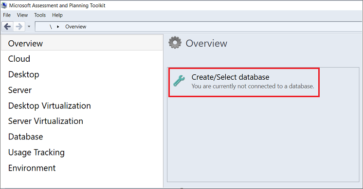
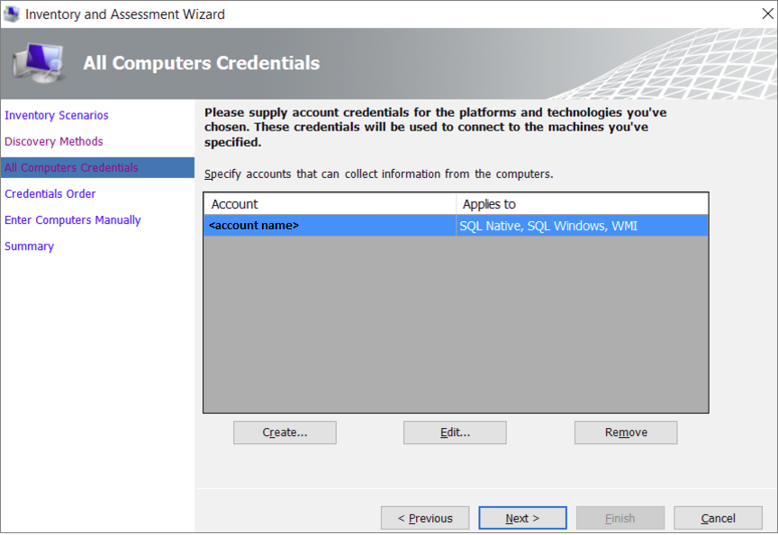
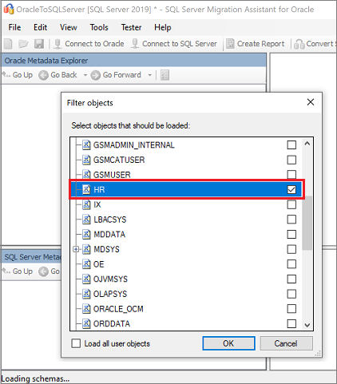
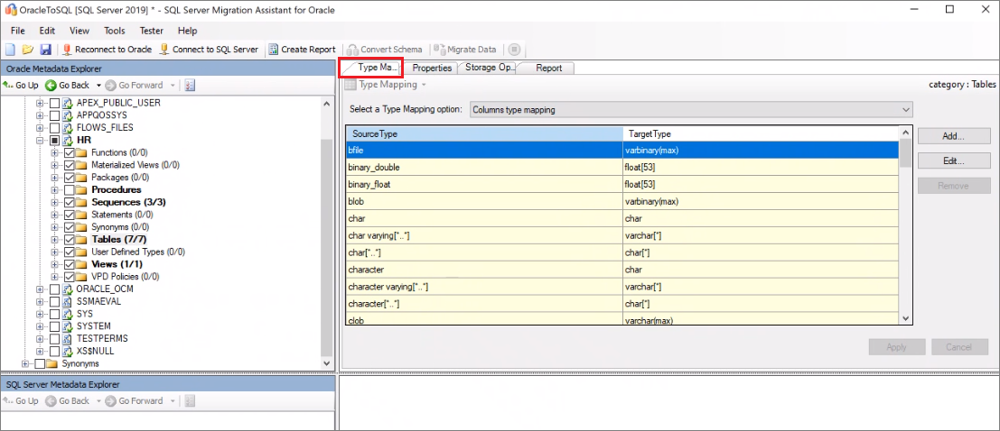
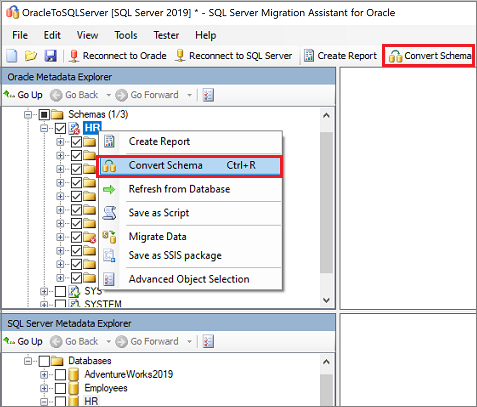
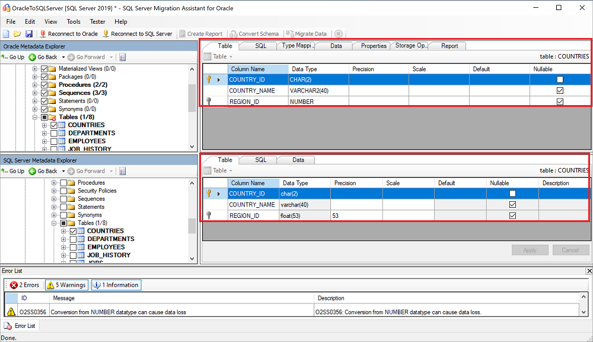
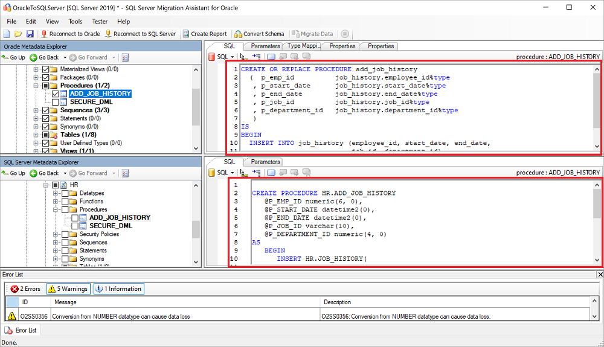
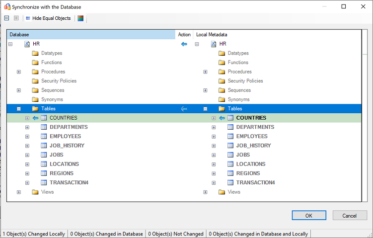

# Migration guide: Oracle to SQL Server
[!INCLUDE[sqlserver](../../../includes/applies-to-version/sqlserver.md)]

In this guide, you learn how to migrate your Oracle databases to SQL Server by using SQL Server Migration Assistant for Oracle (SSMA for Oracle). 

For other migration guides, see [Azure Database Migration Guides](https://docs.microsoft.com/data-migration). 

## Prerequisites 

Before you begin migrating your Oracle database to SQL Server, do the following:

- Verify that your source environment is supported.
- Download and install [SQL Server](https://www.microsoft.com/evalcenter/evaluate-sql-server-2019?filetype=EXE).
- Download and install [SSMA for Oracle](https://www.microsoft.com/download/details.aspx?id=54258).
- Get the [necessary permissions for SSMA for Oracle](/sql/ssma/oracle/connecting-to-oracle-database-oracletosql) and [provider](/sql/ssma/oracle/connect-to-oracle-oracletosql).
- Get connectivity and sufficient permissions to access both source and target. 

## Pre-migration

As you prepare for migrating to the cloud, verify that your source environment is supported and that you've met all other prerequisites. Doing so will help to ensure an efficient and successful migration.

This part of the process involves conducting an inventory of the databases that you need to migrate, assessing them for potential migration issues or blockers, and then resolving any items you might have uncovered. 

### Discover

To better understand and plan for the migration, use the [Microsoft Assessment and Planning (MAP) Toolkit](https://go.microsoft.com/fwlink/?LinkID=316883) to identify existing data sources and details about the features your organizations is using. This process involves scanning the network to identify all your organization's Oracle instances, versions, and features.

To use the MAP Toolkit to perform an inventory scan, do the following: 

1. Open the [MAP Toolkit](https://go.microsoft.com/fwlink/?LinkID=316883).

1. On the **Overview** pane, select **Create/Select database**. 

   

1. Under **Create or select a database**, select **Create an inventory database**, enter a name for the inventory database you're creating, provide a brief description, and then select **OK**.

   :::image type="content" source="media/oracle-to-sql-server/create-inventory-database.png" alt-text="Screenshot of the 'Create an inventory database' option in the MAPS Toolkit.":::

1. Select **Collect inventory data** to open the **Inventory and Assessment Wizard**. 

   :::image type="content" source="media/oracle-to-sql-server/collect-inventory-data.png" alt-text="Screenshot of the 'Collect inventory data' link in the Inventory and Assessment Wizard.":::

1. In the wizard, select **Oracle**, and then select **Next**. 

   

1. Select the computer search option that best suits your organization's needs and environment, and then select **Next**. 

   

1. Either enter credentials or create new credentials for the systems that you want to explore, and then select **Next**.

    

1. Set the order of the credentials, and then select **Next**.

     

1. Specify the credentials for each computer you want to discover. You can use unique credentials for every computer or machine, or you can select them from the **Computers** list.

   

1. Verify your selection summary, and then select **Finish**.

   

1. After the scan is completed, view the **Data Collection** summary report. The scan might take a few minutes, depending on the number of databases. When you're finished, select **Close**.

   

1. Select **Options** to generate a report about the Oracle Assessment and database details. Select both options (one at a time) to generate the report.

### Assess

After you identify the data sources, use the [SSMA for Oracle](https://www.microsoft.com/download/details.aspx?id=54258) to assess the Oracle instance you're migrating to the SQL Server virtual machine so that you understand the gaps between the two. By using the migration assistant, you can review the database objects and data, assess the databases for migration, migrate the database objects to SQL Server, and then migrate the data to SQL Server.

To create an assessment, do the following: 

1. Open [SSMA for Oracle](https://www.microsoft.com/download/details.aspx?id=54258). 
1. Select **File**, and then select **New Project**. 
1. Provide a project name and location and then, in the drop-down list, select a SQL Server migration target. Select **OK**. 

   

1. Select **Connect to Oracle**, and then enter the Oracle connection details.

   

   Select the Oracle schemas you want to migrate, and then select **OK**.

   

1. In **Oracle Metadata Explorer**, select the Oracle schemas you're working with, and then select **Create Report** to generate an HTML report with conversion statistics and errors or warnings, if any. Alternatively, you can select **Create Report** at the upper right.

   

1. Review the HTML report to understand the conversion statistics and any errors or warnings. You can also open the report in Excel to get an inventory of Oracle objects and the effort that's required to perform schema conversions. The default location for the report is in the report folder within SSMAProjects, as shown here:  

   `drive:\<username>\Documents\SSMAProjects\MyOracleMigration\report\report_2016_11_12T02_47_55\`

   

### Validate the data types

Validate the default data-type mappings and change them based on requirements if necessary. To do so: 

1. Select **Tools**, and then select **Project Settings**.  
1. Select the **Type mapping** tab.

   

1. You can change the type mapping for each table by selecting the table name on the **Oracle Metadata Explorer** pane. 

### Convert the schema

To convert the schema, do the following: 

1. (Optional) To convert dynamic or specialized queries, right-click the node, and then select **Add statement**. 

1. Select the **Connect to SQL Server** tab, and then enter the connection details for your SQL Server instance.  

    a. In the **Database** drop-down list, select your target database, or provide a new name to create a database on the target server.   
    b. Provide authentication details.   
    c. Select **Connect**.

   

1. Right-click the schema you're working with, and then select **Convert Schema**. Alternatively, you can select the **Convert Schema** tab at the upper right.

   

1. After the conversion is completed, compare the converted objects to the original objects to identify potential problems, and address them based on the recommendations.

   

   Compare the converted Transact-SQL text to the original code, and review the recommendations.

   

1. On the output pane, select the **Review results** icon, and then review any errors on the **Error list** pane. 
1. For an offline schema remediation exercise, save the project locally by selecting **File** > **Save Project**. Doing so gives you an opportunity to evaluate the source and target schemas offline and remediate them before you publish the schema to your SQL Server instance.

## Migrate the database

After you've satisfied the prerequisites and completed the tasks associated with the *pre-migration* stage, you're ready to perform the schema and database migration. Migration involves two steps: publishing the schema and migrating the database. 

To publish your schema and migrate the database, do the following: 

1. Publish the schema. On the **SQL Server Metadata Explorer** pane, right-click the database, and then select **Synchronize with Database**. This action publishes the Oracle schema to your SQL Server instance.

   

   Review the mapping between your source project and your target, as shown here:

   

1. Migrate the data. On the **Oracle Metadata Explorer** pane, right-click the schema or object you want to migrate, and then select **Migrate Data**. Alternatively, you can select the **Migrate Data** tab at the upper right. 

   To migrate data for an entire database, select the check box next to the database name. To migrate data from individual tables, expand the database, expand **Tables**, and then select the check box next to the table. To omit data from individual tables, clear the check box.

   

1. On the **Migrate Data** pane, enter connection details for both Oracle and the SQL Server instances.

1. After the the migration is completed, view the **Data Migration Report**.

    

1. Connect to your SQL Server instance by using [SQL Server Management Studio](/sql/ssms/download-sql-server-management-studio-ssms), and then validate the migration by reviewing the data and schema.

   

In addition to using SSMA, you can also use SQL Server Integration Services (SSIS) to migrate the data. To learn more, see: 
- [Get started with SQL Server Integration Services](https://docs.microsoft.com//sql/integration-services/sql-server-integration-services) (article)
- [SQL Server Integration Services: SSIS for Azure and Hybrid Data Movement](https://download.microsoft.com/download/D/2/0/D20E1C5F-72EA-4505-9F26-FEF9550EFD44/SSIS%20Hybrid%20and%20Azure.docx) (technical white paper).

## Post-migration 

After you've successfully completed the *migration* stage, you need to complete a series of post-migration tasks to ensure that everything is functioning as smoothly and efficiently as possible.

### Remediate your applications

After you’ve migrated the data to the target environment, all the applications that formerly consumed the source need to start consuming the target. Accomplishing this will in some cases require changes to the applications.

The [Data Access Migration Toolkit](https://marketplace.visualstudio.com/items?itemName=ms-databasemigration.data-access-migration-toolkit) is an extension for Visual Studio Code with which you can analyze your Java source code and detect data-access API calls and queries. The toolkit gives you a single-pane view of the items to be addressed to support the new database back end. To learn more, see the [Migrate our Java application from Oracle](https://techcommunity.microsoft.com/t5/microsoft-data-migration/migrate-your-java-applications-from-oracle-to-sql-server-with/ba-p/368727) blog. 

### Perform tests

The test approach to database migration consists of the following activities:

1. **Develop validation tests**: To test the database migration, you need to use SQL queries. You must create the validation queries to run against both the source and target databases. Your validation queries should cover the scope you've defined.

1. **Set up a test environment**: The test environment should contain a copy of the source database and the target database. Be sure to isolate the test environment.

1. **Run validation tests**: Run validation tests against the source and the target, and then analyze the results.

1. **Run performance tests**: Run performance tests against the source and the target, and then analyze and compare the results.

### Optimize

The post-migration phase is crucial for reconciling any data accuracy issues, verifying completeness, and addressing performance issues with the workload.

For more information about these issues and the steps to mitigate them, see the [Post-migration validation and optimization guide](../../../relational-databases/post-migration-validation-and-optimization-guide.md).

## Migration assets 

For more assistance with completing this migration scenario, see the following resources. They were developed in support of a real-world migration project engagement.

| Title | Description |
| --- | --- |
| [Data workload assessment model and tool](https://github.com/Microsoft/DataMigrationTeam/tree/master/Data%20Workload%20Assessment%20Model%20and%20Tool) | Provides suggested “best fit” target platforms, cloud readiness, and application/database remediation levels for specified workloads. It offers simple, one-click calculation and report generation that helps to accelerate large estate assessments by providing an automated, uniform target-platform decision process. |
| [Oracle inventory script artifacts](https://github.com/Microsoft/DataMigrationTeam/tree/master/Oracle%20Inventory%20Script%20Artifacts) | Includes a PL/SQL query that hits Oracle system tables and provides a count of objects by schema type, object type, and status. It also provides a rough estimate of 'Raw Data' in each schema and the sizing of tables in each schema, with results stored in a CSV format. |
| [Automate SSMA Oracle assessment collection & consolidation](https://github.com/microsoft/DataMigrationTeam/tree/master/IP%20and%20Scripts/Automate%20SSMA%20Oracle%20Assessment%20Collection%20%26%20Consolidation) | A set of resources that uses a .csv file as entry (sources.csv in the project folders) to produce the xml files that are needed to run SSMA assessment in console mode. The source.csv file is provided by the customer based on an inventory of existing Oracle instances. The output files are AssessmentReportGeneration_source_1.xml, ServersConnectionFile.xml, and VariableValueFile.xml. |
| [SSMA for Oracle common errors and how to fix them](https://aka.ms/dmj-wp-ssma-oracle-errors) | Discusses how Oracle enables you to assign a non-scalar condition in the WHERE clause. However, SQL Server doesn’t support this type of condition. As a result, SSMA for Oracle doesn’t convert queries with a non-scalar condition in the WHERE clause, instead generating an error O2SS0001. This white paper provides more details on the issue and ways to resolve it. |
| [Oracle to SQL Server migration handbook](https://github.com/microsoft/DataMigrationTeam/blob/master/Whitepapers/Oracle%20to%20SQL%20Server%20Migration%20Handbook.pdf) | Focuses on the tasks associated with migrating an Oracle schema to the latest version of SQL Server base. If the migration requires changes to features and functionality, the possible impact of each change on the applications that use the database must be considered carefully. |

These resources were developed as part of the Data SQL Ninja Program, which is sponsored by the Azure Data Group engineering team. The core charter of the Data SQL Ninja program is to unblock and accelerate complex modernization and compete data platform migration opportunities to the Microsoft Azure Data platform. If you think your organization would be interested in participating in the Data SQL Ninja program, contact your account team and ask them to submit a nomination.

## Next steps

After the migration, review the [Post-migration validation and optimization guide](../../../relational-databases/post-migration-validation-and-optimization-guide.md). 

For a matrix of Microsoft and third-party services and tools that are available to assist you with various database and data migration scenarios and specialty tasks, see [Services and tools for data migration](/azure/dms/dms-tools-matrix).

For other migration guides, see [Azure Database Migration Guide](https://datamigration.microsoft.com/). 

For migration videos, see [Overview of the migration journey](https://azure.microsoft.com/resources/videos/overview-of-migration-and-recommended-tools-services/).
