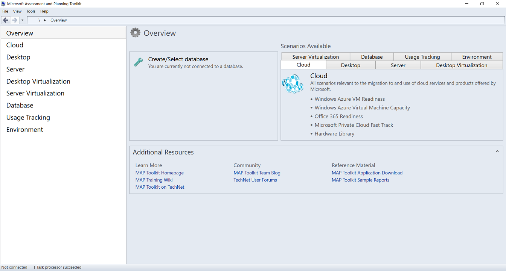
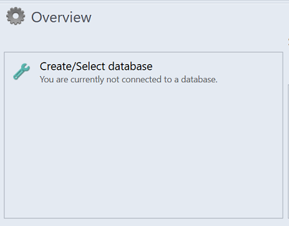
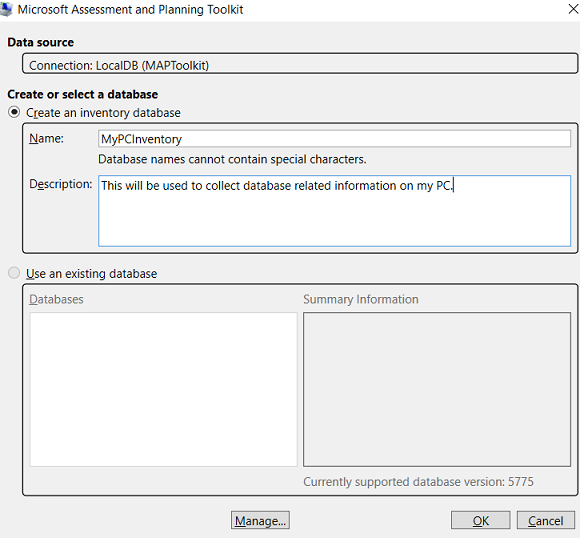
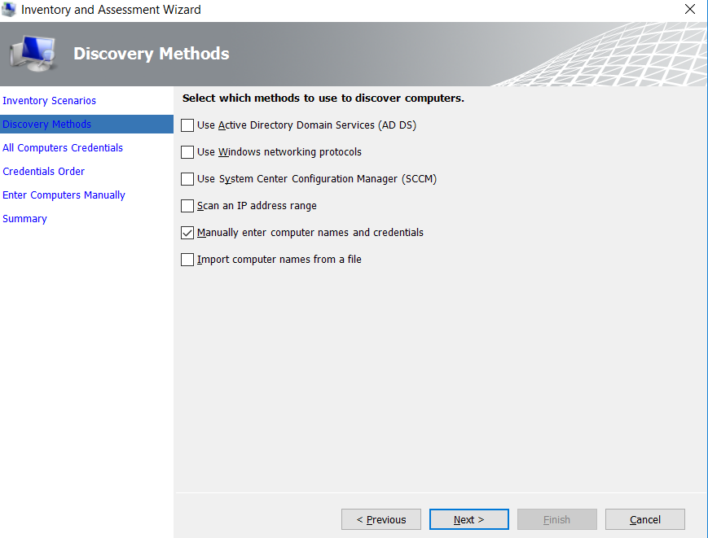
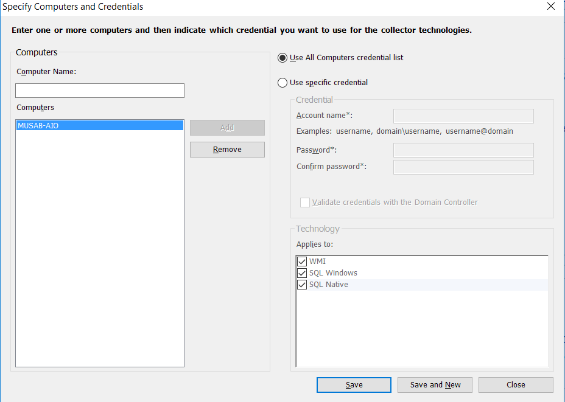
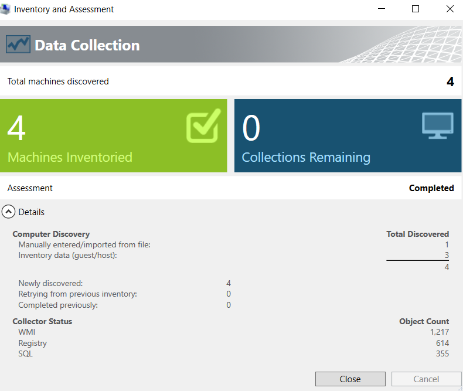
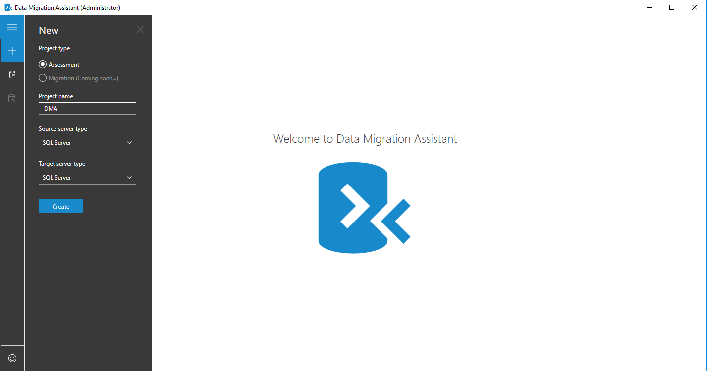
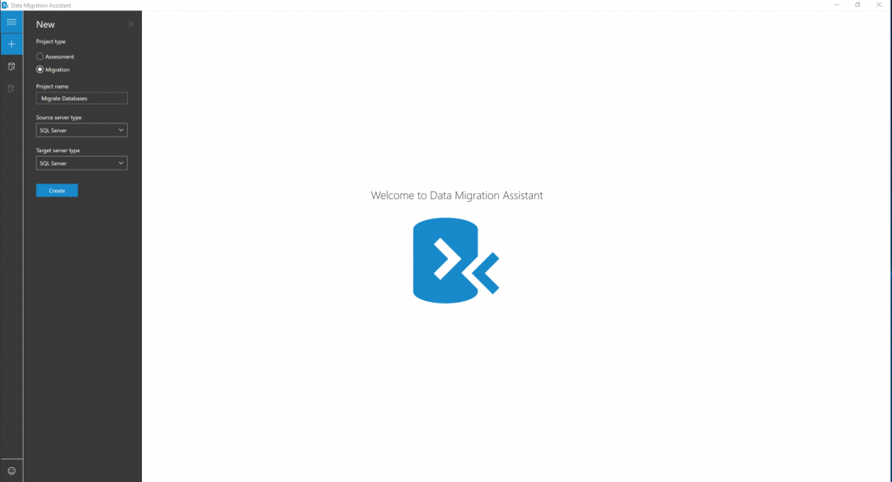
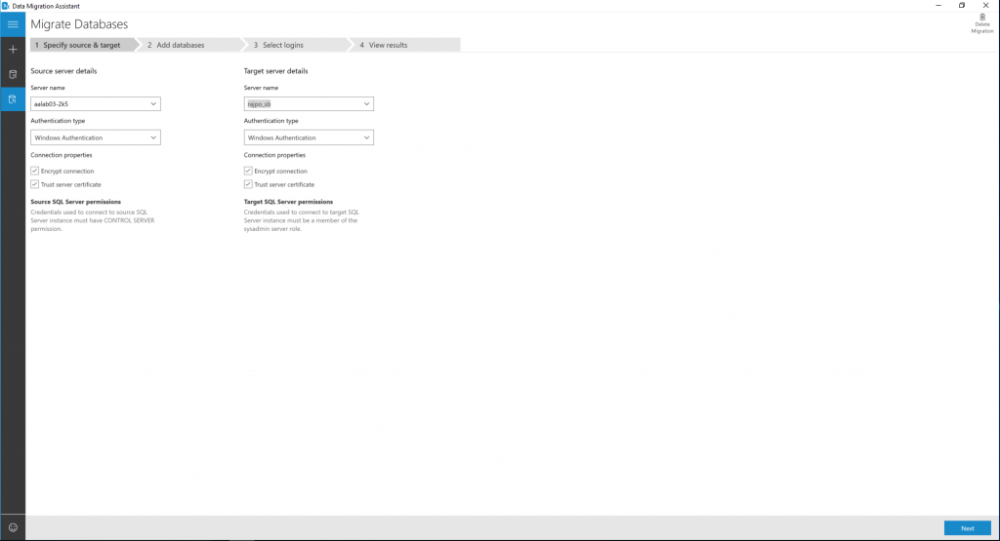
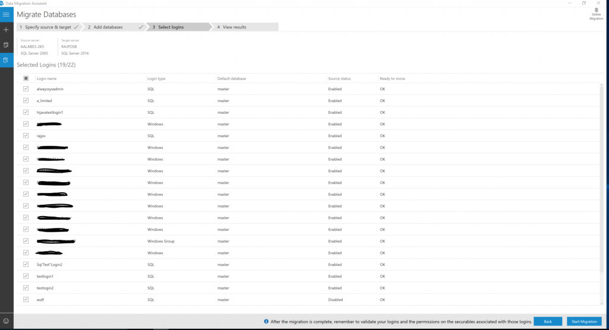

# Upgrade overview: Upgrade SQL Server to SQL Server

In this guide, you learn how to upgrade your user databases from SQL Server to SQL Server 2019 by using the Data Migration Assistant (DMA).

Learn about the options and considerations for [upgrading SQL Server database.](/database-engine/install-windows/upgrade-sql-server.md)

For other migration guides, see [Azure Database Migration](/data-migration/).

## Prerequisites

Before beginning your migration project, it's important to address the associated prerequisites. To prepare for the migration, download and install the:

- Latest version of the [MAP Toolkit](https://go.microsoft.com/fwlink/?LinkID=316883).
- [Data Migration Assistant](https://www.microsoft.com/download/details.aspx?id=53595) v5.3 or later.
- Latest version of the [Database Experimentation Assistant](https://www.microsoft.com/download/details.aspx?id=54090).

## Pre-migration overview

Confirm source environment is support  and you've addressed any prerequisites, you're ready to start the Pre-migration stage. The process involves conducting an inventory of the databases that you need to migrate. Next, assess the databases for potential migration issues or blockers, and then resolving any items you might have uncovered. 

## Discover

The discover stage identifies existing data sources and details about the features that are being used. It's helpful to get a better understanding of and plan for the migration. This process involves scanning the network to identify all your organization’s SQL instances together with the version and features in use.

To use the MAP Toolkit to create an inventory scan, complete the following steps.

#### Discover stage

1. Download the [MAP Toolkit](https://go.microsoft.com/fwlink/?LinkID=316883), and then install it.
1. Run the MAP Toolkit.
   1. Open the MAP Toolkit, and then on the left pane, select **Database**.
      You'll be on the following screen:

      
   1. Select **Create/Select database**.

      
   1. Ensure that **Create an inventory database** is selected, enter a name for the database, a brief description, and then select **OK**.

      

      The next step is to collect data from the database created.

   1. Select **Collect inventory data**.

      
   1. In the Inventory and Assessment Wizard, select **SQL Server** and **SQL Server with Database Details**, and then select **Next**.

      
   1. Select the best method option to search the computers on which Microsoft Products are hosted, and then select **Next**.

      
   1. Enter credentials or create new credentials for the systems that you want to explore, and then select **Next**.

      
   1. Set the order of the credentials, and then select **Next**.

      

      Now, you need to specify the credentials for each computer that you want to discover. You can use unique credentials for each computer/machine, or you can choose to use the **All Computer Credentials** list.

   1. After setting up the credentials, select **Save**, and then select **Next**.

      
   1. Verify your selection summary, and then select **Finish**.

      
   1. Wait for a few minutes (depending on the number of databases) for the Data Collection summary report.

      
   1. Select **Close**.

      The Main window of the tool appears, showing a summary of the Database Discovery completed so far.
1. Report generation and data collection.

  On the top-right corner of the tool, an **Options** page appears, which you can use to generate report about the SQL Server Assessment and the Database Details.

  

   1. Select both options (one by one) to generate the report.
      
      

## Assess and Convert

After identifying the data sources, the next step is to assess the on-premises SQL Server instance(s). Use the Data Migration Assistant (DMA) to assess your source database before upgrading your SQL Server instance.

#### Assess

To use DMA to create an assessment, complete the following steps.

1. Download the [DMA tool](https://www.microsoft.com/download/details.aspx?id=53595), and then install it.
1. Create a **New Assessment** project.
   1. Select the New (+) icon, select the **Assessment** project type, specify a project name, select **SQL Server** as the source and target, and then select **Create**.

      
   1. Select the target SQL Server version that you plan to migrate to and against which you need to run an assessment, select one or both of the assessment report types (**Compatibility Issues** and **New features’ recommendation**), and then select **Next**.

      

   1. In **Connect to a server**, specify the name of the SQL Server instance to connect to, specify the Authentication type and Connection properties, and then select **Connect**.
   1. In the **Add Sources** panel, select the database(s) you that want to assess, and then select **Add**.

      
   1. Select **Start Assessment**.

      Now wait for the assessment results; the duration of the assessment depends on the number of databases added and the schema size of each database. Results will be displayed per database as soon as they're available.
   1. Select the database that has completed assessment, and then switch between **Compatibility issues** and **Feature recommendations** by using the switcher.

      
   1. Review the compatibility issues by analyzing the affected object and its details for every issue identified under **Breaking changes**, **Behavior changes**, and **Deprecated features**.
   1. Review feature recommendations across the **Performance**, **Storage**, and **Security** areas.

      Feature recommendations cover various features such as In-Memory OLTP and Columnstore, Stretch Database, Always Encrypted (AE), Dynamic Data Masking (DDM), and Transparent Data Encryption (TDE).
1. Review assessment results.
   1. After all database assessments are complete, select **Export report** to export the results to either a JSON or CSV file for analyzing the data at your own convenience.

#### Convert

After assessing the source database instance(s) you're migrating, for heterogenous migrations, you need to convert the schema to work in the target environment. Since upgrading to a newer version of SQL Server would be considered a homogeneous migration, the Convert step is unnecessary.

## Migration overview

After you have the necessary prerequisites in place and have completed the tasks associated with the **Pre-migration** stage, you're ready to complete the schema and data migration.

### Other considerations 

To ensure a successful migration and upgrade any issues discovered from pre-migration stage should be addressed promptly.

Review the compatibility issues discovered with DMA tool.

Retain backup logs, maintenance plans, and other automated tasks, including jobs by creating a backup of the system [database msdb.](../../../relational-databases/bacbup-restore/back-up-and-restore-of-system-databases-sql-server.md)

View [linked servers](../../../relational-databases/linked-servers/linked-servers-database-engine.md) by using SQL Server Management Studio. In the Object Explorer, right-click server objects to expand list

[Troubleshoot orphaned users](../../failover-clusters/troubleshoot-orphaned-users-sql-server.md)

[Migrating-triggers](../../..relational-databases/linked-servers/linked-servers-database-engine.md)

## Migrate schema and data

After assessing your databases, the next step is to begin the process of migrating the schema and database by using DMA.

### Migrate schema and data sync

To use DMA to create a migration project, complete the following steps.

1. Create a **New Migration** project
   1. Select the New icon, select the **Migration** project type, select **SQL Server** as source and target types, and then select **Create**.

      
   1. Provide source and target SQL server connection details, and then select **Next**.

      
   1. Select databases from the source to migrate, and then specify the **Shared location accessible by source and target SQL servers for backup operation**.

      > [!NOTE]
      > Be sure that the service account running the source SQL Server instance has write privileges on the shared location and that the target SQL Server service account has read privileges on the shared location.

      
   1. Select **Next**, select the logins that you want to migrate, and then select **Start Migration**.

      
   1. Now, monitor the progress of migration in the **View Results** screen.

      
2. **Review Migration Results**
   1. Select **Export report** to save the migration results to a .csv or .json file.
   1. Review the saved file for details about data and logins migration and verify successful completion of the process.

### Data sync and Cutover

For minimal-downtime migrations, the source you're migrating continues to change after the one-time migration occurs, data and schema may be different from the target.
During this process, you need to ensure every change in the source are captured and applied to the target in near real time. After you verify changes in source have been applied to the target, cutover from the source to the target environment.

Support for minimal-downtime migrations isn't yet available for this scenario, so the Data sync and Cutover plans aren't currently applicable.

## Post-migration overview

After you've successfully completed the **Migration** stage, you need to go through a series of post-migration tasks to ensure that everything is functioning as smoothly and efficiently as possible.

#### Verify applications

After the data is migrated to the target environment, all the applications that formerly consumed the source need to start consuming the target. Accomplishing this will in some cases require changes to the applications. Test against the databases to verify that the applications work as expected after the migration.

> [!NOTE]
> For assistance with developing and running post-migration validation tests, also consider the Data Quality Solution available from [QuerySurge](http://www.querysurge.com/company/partners/microsoft).

### Complete migration testing

To use DEA for database migration testing, complete the following steps.

1. **Download the [DEA tool](https://www.microsoft.com/download/details.aspx?id=54090)**, and then install it.
1. **Run a trace capture**
   1. On the left navigation tree, select the camera icon the go to **All Captures**.

      
   1. To start a new capture, select **New Capture**.
   1. To configure the capture, specify the trace name, duration, SQL Server instance name, database name, and the share location for storing the trace file on the computer running SQL Server.

      
   1. Select **Start** to begin trace capture.
1. **Run a trace replay**
   1. On the left navigation tree, select the play icon the go to **All Replays**.

      
   1. To start a new replay, select **New Replay**.
   1. To configure the replay, specify the replay name, controller machine name, path to source trace file on controller, SQL Server instance name, and the path for storing the target trace file on the computer running SQL Server.
   1. Select **Start** to begin replay of your capture.
1. **Create a new Analysis Report**
   1. On the left navigation tree, select the checklist icon to go to **Analysis Reports**.

      
   1. Connect to the SQL Server on which you'll store your report databases.

      You'll see the list of all reports in the server.
   1. Select **New Report**.
   1. To configure the report, specify the report name, and specify paths to the traces for the source and target SQL Server instances.

      
1. **Review an analysis report**
   1. On the first page of the report, the version and build information for the target servers on which the experiment was run displays.

      Threshold allows you to adjust the sensitivity or tolerance of your A/B Test analysis.

      > [!NOTE]
      > By default, threshold is set to 5%; any performance improvement that is \>= 5% is categorized as ‘Improved’. The drop-down selector allows you to evaluate the report using different performance thresholds.

      
   1. Select the individual slices of the pie chart to view detailed metrics on performance.

      

      On the detail page for a performance change category, you'll see a list of queries in that category.

      
   1. Select an individual query to get performance summary statistics, error information, and query plan information.

      

## Optimize

The post-migration step is crucial for reconciling any data accuracy issues and verifying completeness, and addressing performance issues with the workload.

> [!NOTE]
> For additional detail about these issues and specific steps to mitigate them, see the [Post-migration Validation and Optimization Guide](../../../relational-databases/post-migration-validation-and-optimization-guide.md).
