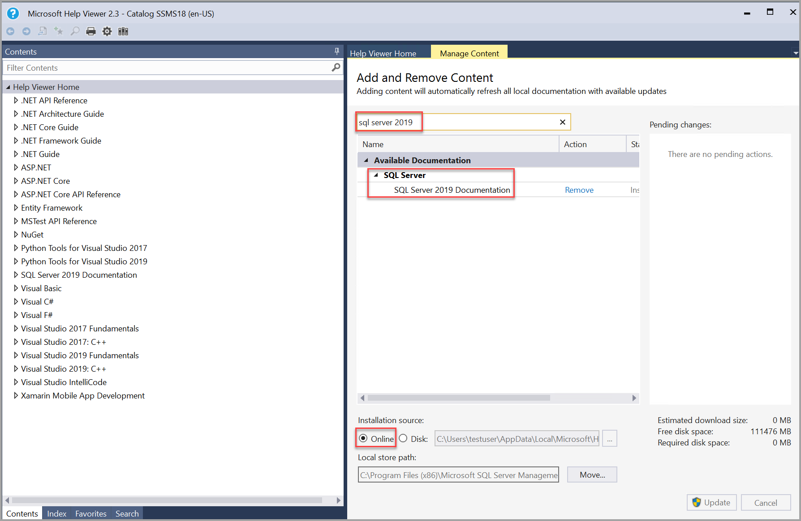
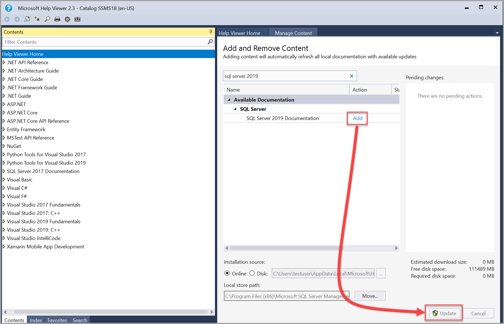
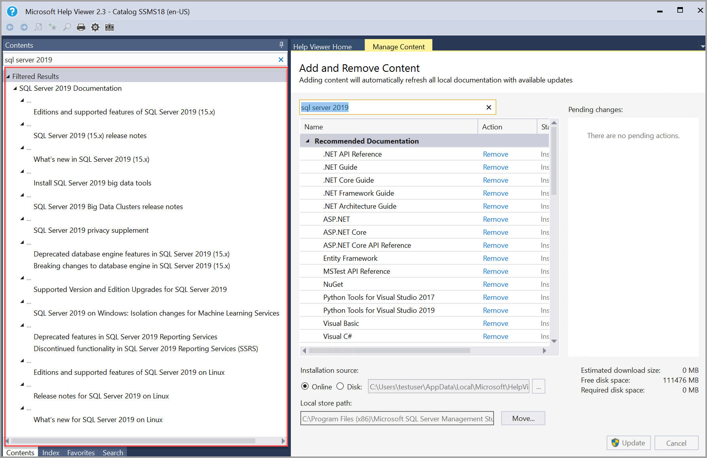
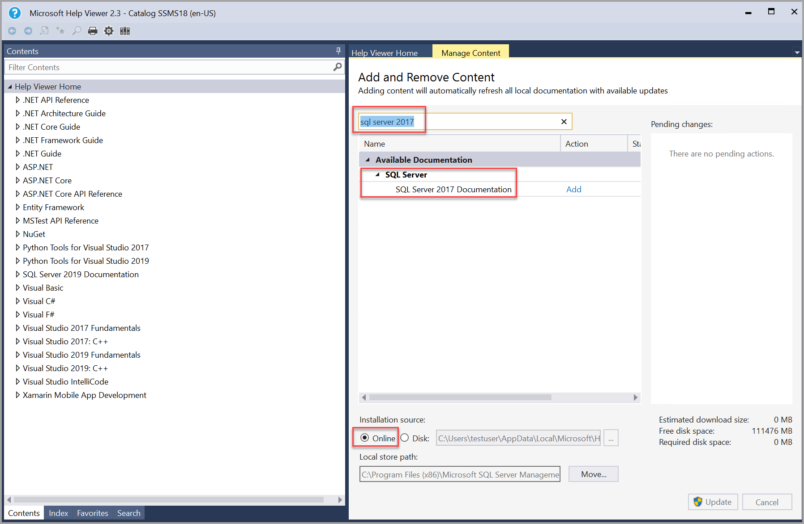
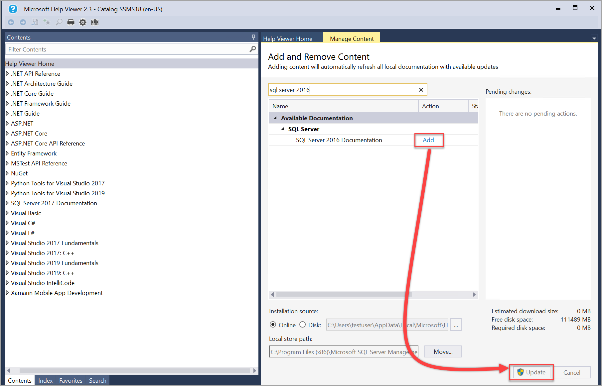
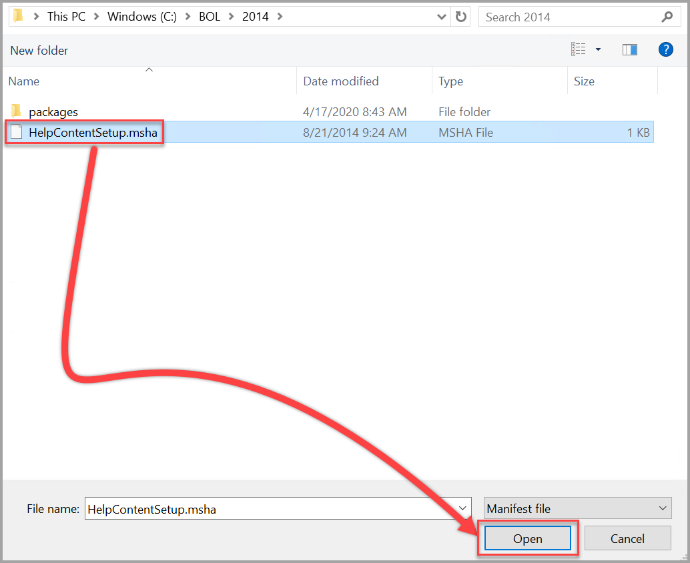

# SQL Server offline help content using Help Viewer

[!INCLUDE[appliesto-ss-xxxx-xxxx-xxx-md](../includes/appliesto-ss-xxxx-xxxx-xxx-md.md)]

You can use the Microsoft Help Viewer to download and install SQL Server help packages from online sources or local disk. You can then view the content offline. The Help Viewer is installed with several different tools. This article describes how to download and view offline SQL Server content with Help Viewer in SSMS.

Internet access is required to download the Help Viewer content. You can then migrate the content to a computer that doesn't have internet access.

>[!NOTE]
> To get local content for the current versions of SQL server, install the current version of SQL Server Management Studio [SQL Server Management Studio 18.x](https://docs.microsoft.com/sql/ssms/download-sql-server-management-studio-ssms).

## Where to get help content for different SQL Server versions

- SQL Server 2019 - Online
- SQL Server 2017 - Online
- SQL Server 2016 - Online
- SQL Server 2014 - [Download center](https://www.microsoft.com/download/details.aspx?id=42557)
- SQL Server 2012 - [Download center](https://www.microsoft.com/download/details.aspx?id=35750)

You can view the SQL Server help content by using the **HELP** menu in the latest version of Help Viewer in [SQL Server Management Studio (SSMS)](../ssms/download-sql-server-management-studio-ssms.md). 

> [!Note]
> You can also view the SQL Server help content by using Help viewer in [Visual Studio](https://visualstudio.microsoft.com/downloads/). To install the Help Viewer with Visual Studio 2019 or 2017, on the **Individual Components** tab in the Visual Studio Installer, select **Code Tools** \> **Help Viewer** \> **Install**.

## How to download and configure offline content

Below are steps on how to load offline content for different versions of SQL Server.

### Configure SQL Server 2019 offline content

For this approach, you use the **Online** Installation source.

1. In SSMS, select **Add and Remove Help Content** on the Help menu.

   

   The Help Viewer opens to the Manage Content tab.

2. To find the latest help content for SQL Server 2019, under the **Manage Content** tab choose **Online** under the Installation source and then type in *sql server 2019* in the search bar.

   

   > [!Note]
   > The Local store path on the Manage Content tab shows where on the local computer the content will be installed. To change the location, select **Move**, enter a different folder path in the **To** field, and then select **OK**. If the help installation fails after changing the Local store path, close and reopen Help Viewer. Ensure the new location appears in the Local store path and then try the installation again.

3. To install the latest help content package for SQL Server 2019, select **Add** next to each content package (book) that you want to install and then select **Update** in the lower right.

   

   > [!NOTE]
   > If the Help Viewer freezes (hangs) while adding content, change the Cache LastRefreshed="\<mm/dd/yyyy> 00:00:00" line in the %LOCALAPPDATA%\Microsoft\HelpViewer2.x\HlpViewer_SSMSx_en-US.settings or HlpViewer_VisualStudiox_en-US.settings file to some date in the future. For more information about this issue, see [Visual Studio Help Viewer freezes](/visualstudio/welcome-to-visual-studio).

4. You can verify that the SQL Server 2019 content is loaded by searching under the content pane on the left for *sql server 2019*.

   

### Configure SQL Server 2017 offline content

For this approach, you use the **Online** Installation source.

1. In SSMS, select **Add and Remove Help Content** on the Help menu.

   

   The Help Viewer opens to the Manage Content tab.

2. To find the latest help content for SQL Server 2017, under the **Manage Content** tab choose **Online** under the Installation source and then type in *sql server 2017* in the search bar.

   

   > [!Note]
   > The Local store path on the Manage Content tab shows where on the local computer the content will be installed. To change the location, select **Move**, enter a different folder path in the **To** field, and then select **OK**. If the help installation fails after changing the Local store path, close and reopen Help Viewer. Ensure the new location appears in the Local store path and then try the installation again.

3. To install the latest help content package for SQL Server 2017, select **Add** next to each content package (book) that you want to install and then select **Update** in the lower right.

   

   > [!NOTE]
   > If the Help Viewer freezes (hangs) while adding content, change the Cache LastRefreshed="\<mm/dd/yyyy> 00:00:00" line in the %LOCALAPPDATA%\Microsoft\HelpViewer2.x\HlpViewer_SSMSx_en-US.settings or HlpViewer_VisualStudiox_en-US.settings file to some date in the future. For more information about this issue, see [Visual Studio Help Viewer freezes](/visualstudio/welcome-to-visual-studio).

4. You can verify that the SQL Server 2017 content is loaded by searching under the content pane on the left for *sql server 2017*.

   

### Configure SQL Server 2016 offline content

For this approach, you use the **Online** Installation source.

1. In SSMS, select **Add and Remove Help Content** on the Help menu.

   

   The Help Viewer opens to the Manage Content tab.

2. To find the latest help content for SQL Server 2016, under the **Manage Content** tab choose **Online** under the Installation source and then type in *sql server 2016* in the search bar.

   

   > [!Note]
   > The Local store path on the Manage Content tab shows where on the local computer the content will be installed. To change the location, select **Move**, enter a different folder path in the **To** field, and then select **OK**. If the help installation fails after changing the Local store path, close and reopen Help Viewer. Ensure the new location appears in the Local store path and then try the installation again.

3. To install the latest help content package for SQL Server 2016, select **Add** next to each content package (book) that you want to install and then select **Update** in the lower right.

   

   > [!NOTE]
   > If the Help Viewer freezes (hangs) while adding content, change the Cache LastRefreshed="\<mm/dd/yyyy> 00:00:00" line in the %LOCALAPPDATA%\Microsoft\HelpViewer2.x\HlpViewer_SSMSx_en-US.settings or HlpViewer_VisualStudiox_en-US.settings file to some date in the future. For more information about this issue, see [Visual Studio Help Viewer freezes](/visualstudio/welcome-to-visual-studio).

4. You can verify that the SQL Server 2016 content is loaded by searching under the content pane on the left for *sql server 2016*.

   

### Configuring SQL Server 2014 offline content

For this approach, you use the **Disk** Installation source.

1. Download the [Product Documentation for Microsoft SQL Server 2014 for firewall and proxy restricted environments](https://www.microsoft.com/en-us/download/details.aspx?id=42557) content from the download center and save it to a folder.

2. You need to unzip the file to view the .msha file.

   

3. In SSMS , select **Add and Remove Help Content** on the Help menu.

   

   The Help Viewer opens to the Manage Content tab.

4. To install the latest help content package, choose **Disk** under Installation source and then the ellipses (...).

   

   > [!NOTE]
   > The Local store path on the Manage Content tab shows where on the local computer the content is located. To change the location, select **Move**, enter a different folder path in the **To** field, and then select **OK**.
   If the help installation fails after changing the Local store path, close and reopen the Help Viewer. Ensure the new location appears in the Local store path and then try the installation again.

5. Locate the folder where you unzipped the content. Select the **HelpContentSetup.msha** file in the folder then select **Open**.

   

6. Type in *sql server 2014* in the search bar. Once you see the 2014 content available, select **Add** next to each content package (book) that you want to install to Help Viewer and then select **Update**.

   

   

    > [!NOTE]
    > If the Help Viewer freezes (hangs) while adding content, change the Cache LastRefreshed="\<mm/dd/yyyy> 00:00:00" line in the %LOCALAPPDATA%\Microsoft\HelpViewer2.x\HlpViewer_SSMSx_en-US.settings or HlpViewer_VisualStudiox_en-US.settings file to some date in the future. For more information about this issue, see [Visual Studio Help Viewer freezes](/visualstudio/welcome-to-visual-studio).

7. You can verify that the SQL Server 2014 content is loaded by searching under the content pane on the left for *sql server 2014*.

   

### Configure SQL Server 2012 offline content

For this approach, you use the **Disk** Installation source.

1. Download the [Product Documentation for Microsoft SQL Server 2014 for firewall and proxy restricted environments](https://www.microsoft.com/en-us/download/details.aspx?id=42557) content from the download center and save it to a folder.

2. You need to unzip the file to view the .msha file.

   

3. In SSMS , select **Add and Remove Help Content** on the Help menu.

   

   The Help Viewer opens to the Manage Content tab.

4. To install the latest help content package, choose **Disk** under Installation source and then the ellipses (...).

   

   > [!NOTE]
   > The Local store path on the Manage Content tab shows where on the local computer the content is located. To change the location, select **Move**, enter a different folder path in the **To** field, and then select **OK**.
   If the help installation fails after changing the Local store path, close and reopen the Help Viewer. Ensure the new location appears in the Local store path and then try the installation again.

5. Locate the folder where you unzipped the content. Select the **HelpContentSetup.msha** file in the folder then select **Open**.

   

6. Type in *sql server 2014* in the search bar. Once you see the 2014 content available, select **Add** next to each content package (book) that you want to install to Help Viewer and then select **Update**.

   

   

    > [!NOTE]
    > If the Help Viewer freezes (hangs) while adding content, change the Cache LastRefreshed="\<mm/dd/yyyy> 00:00:00" line in the %LOCALAPPDATA%\Microsoft\HelpViewer2.x\HlpViewer_SSMSx_en-US.settings or HlpViewer_VisualStudiox_en-US.settings file to some date in the future. For more information about this issue, see [Visual Studio Help Viewer freezes](/visualstudio/welcome-to-visual-studio).

7. You can verify that the SQL Server 2014 content is loaded by searching under the content pane on the left for *sql server 2014*.

   

### View offline help content

#### To view offline help content in SSMS with Help Viewer

To view the installed help in SSMS, press CTRL + ALT + F1, or choose **Add or Remove Content** from the Help menu, to launch the Help Viewer.

     

The Help Viewer opens to the Manage Content tab, with the installed help table of contents in the left pane. select articles in the table of contents to display them in the right pane.
> [!TIP]
> If the contents pane is not visible, select Contents on the left margin. select the pushpin icon to keep the contents pane open.  

   

#### To view offline help content in VS with Help Viewer

To view the installed help in Visual Studio:

1. Point to **Set Help Preference** on the Help menu and choose **Launch in Help Viewer**.

   

2. select **View Help** in the Help menu to display the content in the Help Viewer.

   

   The help table of contents shows on the left, and the selected help article on the right.

## View online help

Online help always shows the most up-to-date content.

### To view SQL Server online help in SSMS

- select **View Help** in the **Help** menu. The latest SQL Server 2016/2017 documentation from [https://docs.microsoft.com/sql/sql-server/](https://docs.microsoft.com/sql/sql-server/) displays in a browser.

   

### To view Visual Studio Online help in Visual Studio

1. Point to **Set Help Preference** on the Help menu and choose either **Launch in Browser** or **Launch in Help Viewer**.
2. select **View Help** in the Help menu. The latest Visual Studio help displays in the chosen environment.

## View F1 help

When you press F1 or select **Help** or **?** icon in a dialog box in SSMS or VS, a context-sensitive online help article appears in the browser or Help Viewer.

### To view F1 help

1. In the Help menu, select **Set Help Preference**, and choose either **Launch in Browser** or **Launch in Help Viewer**.
2. Press F1, or select **Help**, or **?** in dialog boxes where they're available, to see context-sensitive online articles in the chosen environment.

> [!NOTE]
> F1 help only works when you are online. There are no offline sources for F1 help.

## Systems without internet access

After you download offline books on a system that has internet access, you can use the following steps to migrate the content to a system that doesn't have internet access.

  >[!NOTE]
  >Software that supports the Help Viewer, such as SQL Server Management Studio, must be installed on the offline system.

1. Open Help Viewer (Ctrl + Alt + F1).

2. Select the documentation you're interested in. For example, filter by SQL and select the SQL Server Technical Documentation.

3. Identify the physical path of the files on disk, which can be found under **Local store path**.

4. Navigate to this location using your file system explorer.
   1. The default location is: `C:\Program Files (x86)\Microsoft SQL Server\140\Tools\Binn\ManagementStudio\Extensions\Application`

5. Select the three folders, **ContentStore**, **Incoming**, **IndexStore**, and copy them to the same location on your offline system. You may need to use an interim media device such as a USB or CD.

6. Once these files have been moved, launch Help Viewer on the offline system and the SQL Server technical documentation will be available.

## Next steps

[Microsoft Help Viewer - Visual Studio](/visualstudio/ide/microsoft-help-viewer)

[!INCLUDE[get-help-options](../includes/paragraph-content/get-help-options.md)]
