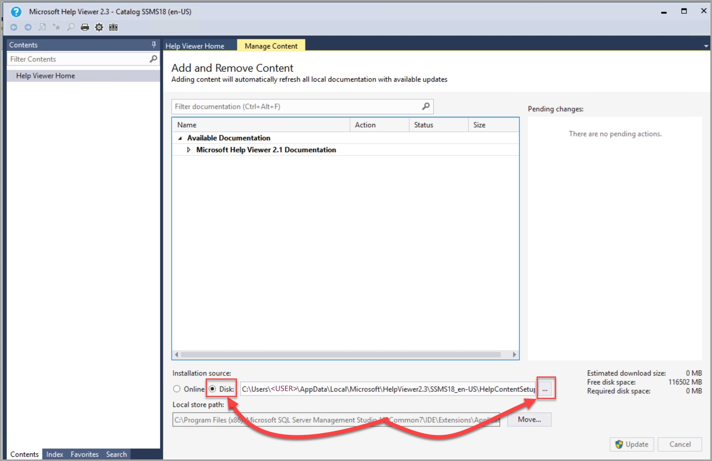
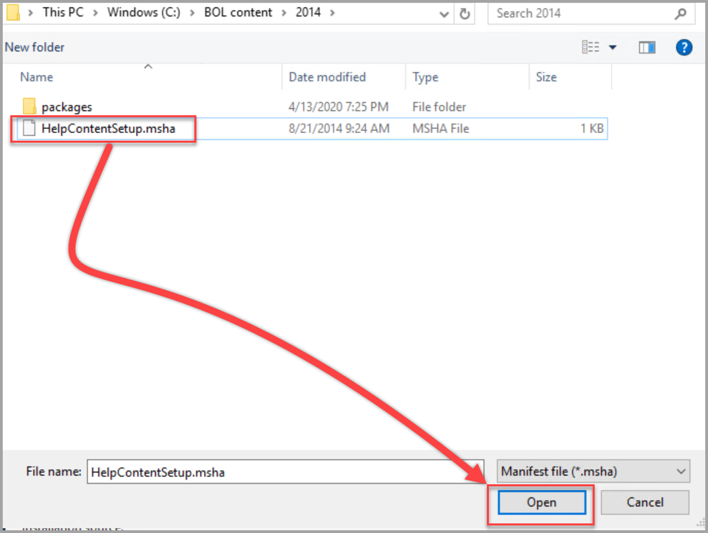
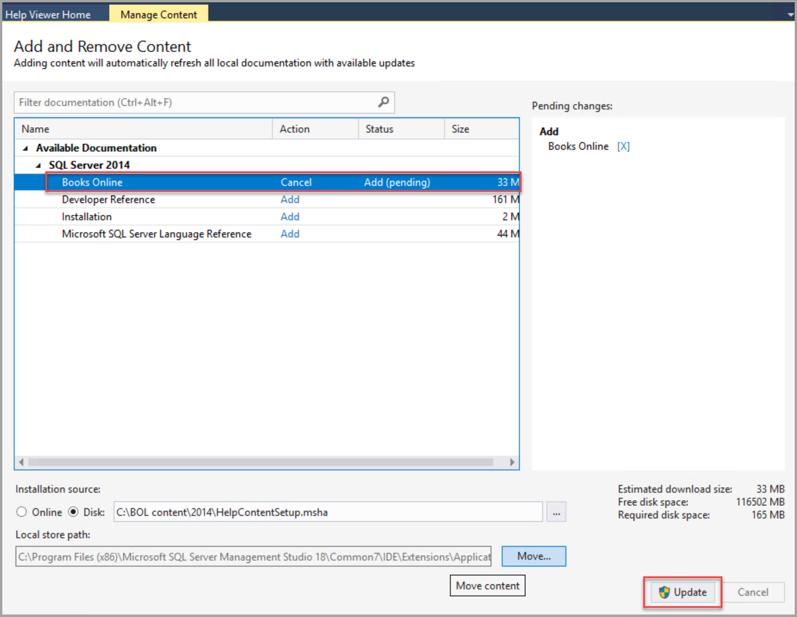

# SQL Server offline help and Help Viewer

[!INCLUDE[appliesto-ss-xxxx-xxxx-xxx-md](../includes/appliesto-ss-xxxx-xxxx-xxx-md.md)]

You can use the Microsoft Help Viewer to download and install SQL Server help packages from online sources or local disk. You can then view the content offline. The Help Viewer is installed with several different tools. This article describes the tools that install the Help Viewer, how to install offline help content, and how to view help.

Internet access is required to download the Help Viewer content. You can then migrate the content to a computer that doesn't have internet access.

>[!NOTE]
> To get local content for the current versions of SQL server, install the current version of SQL Server Management Studio [SQL Server Management Studio 18.x](https://docs.microsoft.com/sql/ssms/download-sql-server-management-studio-ssms).

## What tools Install the Help Viewer versions?

The format of the offline books has changed over time.

| **Content Set** | **Installation source** | **Tools that install Help Viewer** |
|-----------------|-------------------------|------------------------------------|
| SQL Server 2019 | Online | [SQL Server Management Studio (SSMS)](../ssms/download-sql-server-management-studio-ssms.md)   [Visual Studio](https://docs.microsoft.com/visualstudio/install/install-visual-studio) |
| SQL Server 2017 | Online | [SQL Server Management Studio (SSMS)](../ssms/download-sql-server-management-studio-ssms.md)     [Visual Studio](https://docs.microsoft.com/visualstudio/install/install-visual-studio) |
| SQL Server 2016 | Online | [SQL Server Management Studio (SSMS)](../ssms/download-sql-server-management-studio-ssms.md)     [Visual Studio](https://docs.microsoft.com/visualstudio/install/install-visual-studio) |
| SQL Server 2014 | [Disk - download](https://www.microsoft.com/en-us/download/details.aspx?id=42557) | [SQL Server Management Studio (SSMS)](../ssms/download-sql-server-management-studio-ssms.md)     [Visual Studio](https://docs.microsoft.com/visualstudio/install/install-visual-studio) |
| SQL Server 2012 | [Disk - download](https://www.microsoft.com/en-us/download/details.aspx?id=35750) | [SQL Server Management Studio (SSMS)](../ssms/download-sql-server-management-studio-ssms.md)     [Visual Studio](https://docs.microsoft.com/visualstudio/install/install-visual-studio) |

To install the Help Viewer with Visual Studio 2019 or 2017, on the **Individual Components** tab in the Visual Studio Installer, select **Code Tools** \> **Help Viewer** \> **Install**.

>[!NOTE]
> - SQL Server 2016 installs Help Viewer 1.1, which doesn't support SQL Server 2016 help content. To view SQL Server 2016 content you need the v2.x of the help viewer. For more information, see [SQL Server 2016 Release Notes](sql-server-2016-release-notes.md).
> - Starting with SQL Server 2017, the Help Viewer can't be installed from SQL Server Setup.
> - To obtain the latest Help Viewer version is to download the latest version of [SSMS](../ssms/download-sql-server-management-studio-ssms.md) and then use the SSMS **Help** menu.

## Use Help Viewer

### Download and install help content

The **Help** menu in the [latest version of SSMS.exe](../ssms/download-sql-server-management-studio-ssms.md) offers 2.3 or later.

#### To download and install offline help content from Online

For this approach, you use the *Online* Installation source.

1. In SSMS or VS, select **Add and Remove Help Content** on the Help menu.

   

   The Help Viewer opens to the Manage Content tab.  

2. To install the latest help content package, choose **Online** under Installation source.

   

   The Local store path on the Manage Content tab shows where on the local computer the content will be installed. To change the location, select **Move**, enter a different folder path in the **To** field, and then select **OK**.
   If the help installation fails after changing the Local store path, close and reopen the Help Viewer. Ensure the new location appears in the Local store path and then try the installation again.

3. Select **Add** next to each content package (book) that you want to install.
   To install all SQL Server help content, add all 13 books under SQL Server.

4. Select **Update** at lower right.
   The help table of contents on the left automatically updates with the added books.

   

> [!NOTE]
> Not all the top-node titles in the SQL Server table of contents exactly match the names of the corresponding downloadable help books. The TOC titles map to the book names as follows:

(*) Content that is from the first general availability version of SQL Server 2017 content along with older 2016 content. These books will be removed as the separate and complete books for SQL Server 2016 and 2017 contain content edits as of January 2019.  

| Contents pane | SQL Server book |
|---------------|-----------------|
Analysis services language reference | Analysis Services (MDX) language reference |
Data Analysis Expressions (DAX) reference | Data Analysis Expressions (DAX) reference |
Data mining extensions (DMX) reference | Data mining extensions (DMX) reference |
Getting started with Machine learning in SQL Server | Microsoft Machine learning Services |
Power Query M Reference | Power Query M Reference
Developer Guides for SQL Server | SQL Server Developer Reference |
Download SQL Server Management Studio | SQL Server Management Studio |
Homepage for client programming for Microsoft SQL Server | SQL Server Connection Drivers |
SQL Server on Linux | SQL Server on Linux |
SQL Server Technical Documentation | SQL Server Technical Documentation (SSIS, SSRS, DB engine, setup) |
Tools and utilities for Azure SQL Database | SQL Server tools|
Transact-SQL Reference (Database Engine) | Transact-SQL Reference|
XQuery Language Reference (SQL Server) | XQuery Language Reference (SQL Server) |

> [!NOTE]
> If the Help Viewer freezes (hangs) while adding content, change the Cache LastRefreshed="\<mm/dd/yyyy> 00:00:00" line in the %LOCALAPPDATA%\Microsoft\HelpViewer2.x\HlpViewer_SSMSx_en-US.settings or HlpViewer_VisualStudiox_en-US.settings file to some date in the future. For more information about this issue, see [Visual Studio Help Viewer freezes](/visualstudio/welcome-to-visual-studio).

#### To download and install offline help content from Disk

For this approach, you use the *Online* Installation source.

1. Download the [Product Documentation for Microsoft SQL Server 2014 for firewall and proxy restricted environments](https://www.microsoft.com/en-us/download/details.aspx?id=42557) content from the download center and save it to a folder.

   > [!NOTE]
   > Both 2012 and 2014 download content can be found in the [What tools Install the Help Viewer versions](#what-tools-install-the-help-viewer-versions) section.

2. Next step is to unzip the file.

3. In SSMS or VS, select **Add and Remove Help Content** on the Help menu.

   

   The Help Viewer opens to the Manage Content tab.

4. To install the latest help content package, choose **Disk** under Installation source and then the ellipses.

   

   > [!NOTE]
   > The Local store path on the Manage Content tab shows where on the local computer the content is located. To change the location, select **Move**, enter a different folder path in the **To** field, and then select **OK**.
   If the help installation fails after changing the Local store path, close and reopen the Help Viewer. Ensure the new location appears in the Local store path and then try the installation again.

5. Then locate te folder where you unzipped the content. Look for the **HelpContentSetup.msha** file.  then select **Open**.

   

6. Once you see the 2014 content available, select **Add** next to each content package (book) that you want to install to Help Viewer and then select **Update**.

   

> [!NOTE]
> Not all the top-node titles in the SQL Server table of contents exactly match the names of the corresponding downloadable help books. The TOC titles map to the book names as follows:

> [!NOTE]
> If the Help Viewer freezes (hangs) while adding content, change the Cache LastRefreshed="\<mm/dd/yyyy> 00:00:00" line in the %LOCALAPPDATA%\Microsoft\HelpViewer2.x\HlpViewer_SSMSx_en-US.settings or HlpViewer_VisualStudiox_en-US.settings file to some date in the future. For more information about this issue, see [Visual Studio Help Viewer freezes](/visualstudio/welcome-to-visual-studio).

### View offline help content

#### To view offline help content in SSMS with Help Viewer

To view the installed help in SSMS, press CTRL + ALT + F1, or choose **Add or Remove Content** from the Help menu, to launch the Help Viewer.

     

The Help Viewer opens to the Manage Content tab, with the installed help table of contents in the left pane. select articles in the table of contents to display them in the right pane.
> [!TIP]
> If the contents pane is not visible, select Contents on the left margin. select the pushpin icon to keep the contents pane open.  

   

#### To view offline help content in VS with Help Viewer

To view the installed help in Visual Studio:

1. Point to **Set Help Preference** on the Help menu and choose **Launch in Help Viewer**.

   

2. select **View Help** in the Help menu to display the content in the Help Viewer.

   

   The help table of contents shows on the left, and the selected help article on the right.

## View online help

Online help always shows the most up-to-date content.

### To view SQL Server online help in SSMS

- select **View Help** in the **Help** menu. The latest SQL Server 2016/2017 documentation from [https://docs.microsoft.com/sql/sql-server/](https://docs.microsoft.com/sql/sql-server/) displays in a browser.

   

### To view Visual Studio Online help in Visual Studio

1. Point to **Set Help Preference** on the Help menu and choose either **Launch in Browser** or **Launch in Help Viewer**.
2. select **View Help** in the Help menu. The latest Visual Studio help displays in the chosen environment.

## View F1 help

When you press F1 or select **Help** or **?** icon in a dialog box in SSMS or VS, a context-sensitive online help article appears in the browser or Help Viewer.

### To view F1 help

1. In the Help menu, select **Set Help Preference**, and choose either **Launch in Browser** or **Launch in Help Viewer**.
2. Press F1, or select **Help**, or **?** in dialog boxes where they're available, to see context-sensitive online articles in the chosen environment.

> [!NOTE]
> F1 help only works when you are online. There are no offline sources for F1 help.

## Systems without internet access

After you download offline books on a system that has internet access, you can use the following steps to migrate the content to a system that doesn't have internet access.

  >[!NOTE]
  >Software that supports the Help Viewer, such as SQL Server Management Studio, must be installed on the offline system.

1. Open Help Viewer (Ctrl + Alt + F1).

2. Select the documentation you're interested in. For example, filter by SQL and select the SQL Server Technical Documentation.

3. Identify the physical path of the files on disk, which can be found under **Local store path**.

4. Navigate to this location using your file system explorer.
   1. The default location is: `C:\Program Files (x86)\Microsoft SQL Server\140\Tools\Binn\ManagementStudio\Extensions\Application`

5. Select the three folders, **ContentStore**, **Incoming**, **IndexStore**, and copy them to the same location on your offline system. You may need to use an interim media device such as a USB or CD.

6. Once these files have been moved, launch Help Viewer on the offline system and the SQL Server technical documentation will be available.

## Next steps

[Microsoft Help Viewer - Visual Studio](/visualstudio/ide/microsoft-help-viewer)

[!INCLUDE[get-help-options](../includes/paragraph-content/get-help-options.md)]
