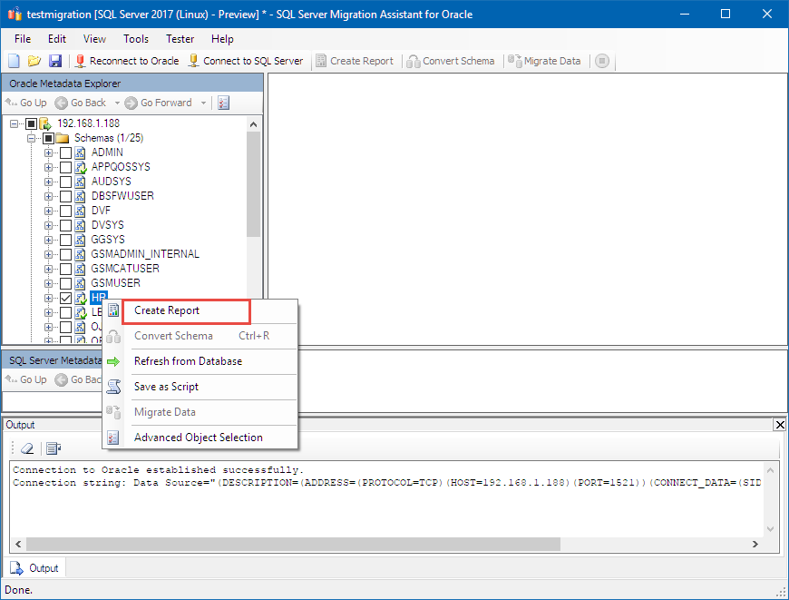
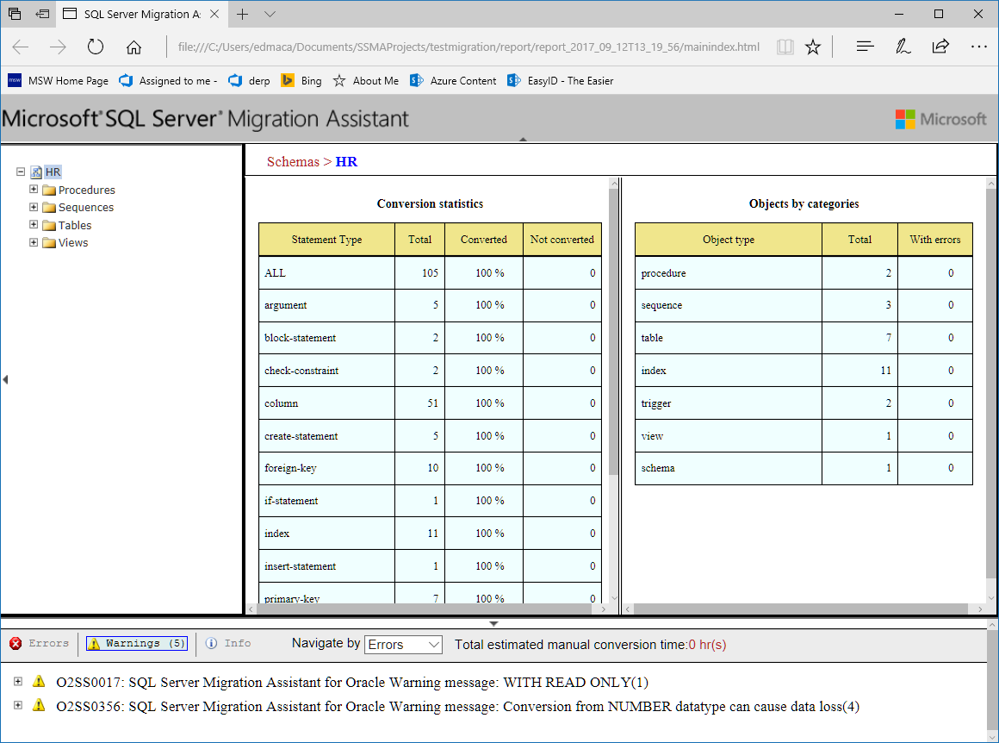
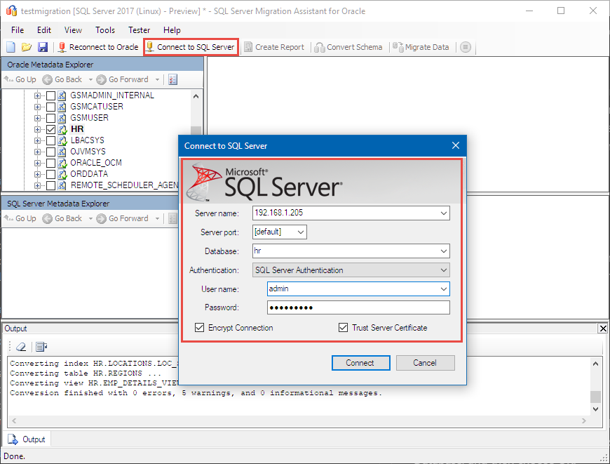

# Migrate an Oracle schema to SQL Server 2017 on Linux with the SQL Server Migration Assistant

This tutorial uses SQL Server Migration Assistant (SSMA) for Oracle on Windows to convert the Oracle sample **HR** schema to [SQL Server 2017 on Linux](../../linux/sql-server-linux-overview.md).

> [!div class="checklist"]
> * Download and install SSMA on Windows
> * Create an SSMA project to manage the migration
> * Connect to Oracle
> * Run a migration report
> * Convert the sample HR schema
> * Migrate the data

## Prerequisites

- An instance of Oracle 12c (12.2.0.1.0) with the **HR** schema installed
- A working instance of SQL Server on Linux

> [!NOTE]
> The same steps can be used to target SQL Server on Windows, but you must select Windows in the **Migrate To** project setting.

## Download and install SSMA for Oracle

There are several editions of SQL Server Migration Assistant available, depending on your source database.  Download the current version of [SQL Server Migration Assistant for Oracle](http://aka.ms/ssmafororacle) and install it using the instructions found on the download page.

> [!NOTE]
> At this time, the **SSMA for Oracle Extension Pack** is not supported on Linux, but it is not necessary for this tutorial.

## Create and set-up project

Use the following steps to create a new SSMA project:

1. Open SSMA for Oracle and choose **New Project** from the **File** menu.

1. Give the project a name.

1. Choose "SQL Server 2017 (Linux) - Preview" in the **Migrate To** field.

SSMA for Oracle does not use the Oracle sample schemas by default. To enable the HR schema, use the following steps:

1. In SSMA, select the **Tools** menu.

1. Select **Default Project Settings**, and then choose **Loading System Objects**.

1. Make sure **HR** is checked, and choose **OK**.

## Connect to Oracle

Next connect SSMA to Oracle.

1. On the toolbar, click **Connect to Oracle**.

1. Enter the server name, port, Oracle SID, user name, and password.

   

1. Then click **Connect**. In a few moments, SSMA for Oracle connects to your database and reads its metadata.

## Create a report

Use the following steps to generate a migration report.

1. In the **Oracle Metadata Explorer**, expand your server's node.

1. Expand **Schemas**, right-click **HR**, and select **Create Report**.

   

1. A new browser window opens with a report that lists all of the warnings and errors associated with the conversion.

   > [!NOTE]
   > You don't need to do anything with that list for this tutorial. If you perform these steps for your own Oracle database, you should review the report to address any important conversion problems for your database.

   

## Connect to SQL Server

Next choose **Connect to SQL Server** and enter the appropriate connection information.  If you use a database name that doesn't already exist, SSMA for Oracle creates it for you.

## Convert Schema

Right-click on **HR** in **Oracle Metadata Explorer**, and choose Convert Schema.

## Synchronize Database

Next, synchronize your database.

1. Once the conversion is finished, use the **SQL Server Metadata Explorer** to go to the database you created in the previous step.

1. Right-click on your database, select **Synchronize with Database**, and then click OK.

   

## Migrate data

The final step is to migrate your data.

1. In the **Oracle Metadata Explorer**, right-click on **HR**, and select **Migrate Data**.

1. The data migration step requires that you reenter your Oracle and SQL Server credentials.

1. When finished, review the data migration report, which should look similar to the following screenshot:

   

## Next steps

For a more complex Orcale schema, the conversion process would involve more time, testing, and possible changes to client applications. The purpose of this tutorial is to show how you can use SSMA for Oracle as a part of your overall migration process.

In this tutorial, you learned how to:
> [!div class="checklist"]
> * Install SSMA on Windows
> * Create a new SSMA project
> * Assess and run a migration from Oracle

Next, explore other ways to use SSMA:

> [!div class="nextstepaction"]
>[SQL Server Migration Assistant documentation](../sql-server-migration-assistant.md)
