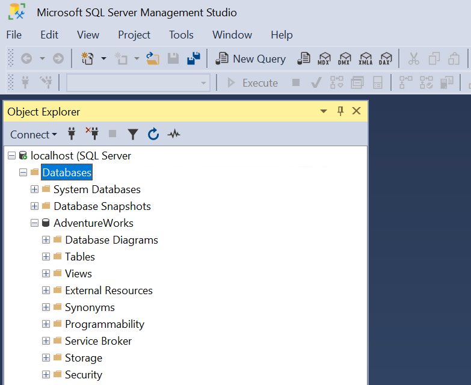

# What is SQL Server Management Studio (SSMS)?

[!INCLUDE [SQL Server ASDB, ASDBMI, ASDW ](../includes/applies-to-version/sql-asdb-asdbmi-asa.md)]

SQL Server Management Studio (SSMS) is an integrated environment for managing any SQL infrastructure. Use SSMS to access, configure, manage, administer, and develop all components of SQL Server, [Azure SQL Database](/azure/azure-sql/database/sql-database-paas-overview) , [Azure SQL Managed Instance](/azure/azure-sql/managed-instance/sql-managed-instance-paas-overview), [SQL Server on Azure VM](/azure/azure-sql/virtual-machines/windows/sql-server-on-azure-vm-iaas-what-is-overview), and [Azure Synapse Analytics](/azure/synapse-analytics/sql-data-warehouse/sql-data-warehouse-overview-what-is/). SSMS provides a single comprehensive utility that combines a broad group of graphical tools with many rich script editors to provide access to SQL Server for developers and database administrators of all skill levels.

- [**Download SQL Server Management Studio (SSMS)**](download-sql-server-management-studio-ssms.md)
- [**Download SQL Server Developer**](https://my.visualstudio.com/Downloads?q=SQL%20Server%20Developer)
- [**Download Visual Studio**](https://www.visualstudio.com/downloads/)

## SQL Server Management Studio components  
  
|Description|Component|  
|---------------|---------|  
|Use **Object Explorer** to view and manage all of the objects in one or more instances of SQL Server.|[Object Explorer](../ssms/object/object-explorer.md)|  
|Use **Template Explorer** to build and manage files of boilerplate text that you use to speed the development of queries and scripts.|[Template Explorer](../ssms/template/template-explorer.md)|  
|Use the deprecated **Solution Explorer** to build projects used to manage administration items such as scripts and queries.|[Solution Explorer](../ssms/solution/solution-explorer.md)|  
|Use the visual design tools included in [!INCLUDE[ssManStudio](../includes/ssmanstudio-md.md)] to build queries, tables, and diagram databases.|[Visual Database Tools](../ssms/visual-db-tools/visual-database-tools.md)|  
|Use the [!INCLUDE[ssManStudio](../includes/ssmanstudio-md.md)] language editors to interactively build and debug queries and scripts.|[Query and Text Editors](./f1-help/database-engine-query-editor-sql-server-management-studio.md)

## SQL Server Management Studio for Business Intelligence

To access, configure, manage, and administer [!INCLUDE[ssASnoversion](../includes/ssasnoversion_md.md)], Integration Services, and Reporting Services, use SQL Server Management Studio. Although all three business intelligence technologies rely on SQL Server Management Studio, the administrative tasks associated with each of these technologies are slightly different.

> [!NOTE]
> To create and modify Analysis Services, Reporting Services, and Integration Services solutions, use [!INCLUDE[ssBIDevStudioFull](../includes/ssbidevstudiofull_md.md)], not SQL Server Management Studio. [!INCLUDE[ssBIDevStudioFull](../includes/ssbidevstudiofull_md.md)] is a development environment that is based on Microsoft[!INCLUDE[vsprvs](../includes/vsprvs-md.md)].

### Manage Analysis Services Solutions using SQL Server Management Studio

SQL Server Management Studio enables you to manage [!INCLUDE[ssASnoversion](../includes/ssasnoversion_md.md)] objects, such as performing back-ups and processing objects.

[!INCLUDE[ssManStudio](../includes/ssmanstudio-md.md)] provides an [!INCLUDE[ssASnoversion](../includes/ssasnoversion_md.md)] Script project in which you develop and save scripts written in Multidimensional Expressions (MDX), Data Mining Extensions (DMX), and XML for Analysis (XMLA). You use [!INCLUDE[ssASnoversion](../includes/ssasnoversion_md.md)] Scripts projects to perform management tasks or re-create objects, such as database and cubes, on [!INCLUDE[ssASnoversion](../includes/ssasnoversion_md.md)] instances. For example, you can develop an XMLA script in an [!INCLUDE[ssASnoversion](../includes/ssasnoversion_md.md)] Script project that creates new objects directly on an existing [!INCLUDE[ssASnoversion](../includes/ssasnoversion_md.md)] instance. The [!INCLUDE[ssASnoversion](../includes/ssasnoversion_md.md)] Scripts projects can be saved as part of a solution and integrated with source code control.
  
For more information about how to use SQL Server Management Studio, see [Developing and Implementing Using SQL Server Management Studio](/analysis-services/instances/analysis-services-scripts-project-in-sql-server-management-studio).
  
### Manage Integration Services Solutions using SQL Server Management Studio

SQL Server Management Studio enables you to use the Integration Services service to manage packages and monitor running packages. You can also use [!INCLUDE[ssManStudio](../includes/ssmanstudio-md.md)] to organize packages into folders, run packages, import and export packages, migrate Data Transformation Services (DTS) packages, and upgrade Integration Services packages.

### Manage Reporting Services Projects using SQL Server Management Studio

Use SQL Server Management Studio to enable Reporting Services features, administer the server and databases, and manage roles and jobs.

You manage shared schedules by using the Shared Schedules folder, and manage report server databases (ReportServer, ReportServerTempdb). You also create a RSExecRole in the Master system database when you move a report server database to a new or different SQL Server Database Engine. For more information about these tasks, see the following articles:  

- [Reporting Services in SSMS](../reporting-services/tools/reporting-services-in-sql-server-management-studio-ssrs.md)
- [Administer a Report Server database](../reporting-services/report-server/administer-a-report-server-database-ssrs-native-mode.md)
- [Create the RSExecRole](../reporting-services/security/create-the-rsexecrole.md)

You also manage the server by enabling and configuring various features, setting server defaults, and managing roles and jobs. For more information about these tasks, see the following articles:

- [Set Report Server properties](../reporting-services/tools/set-report-server-properties-management-studio.md)
- [Create, delete, or modify a role](../reporting-services/security/role-definitions-create-delete-or-modify.md)
- [Enabling and disabling client-side printing for Reporting Services](../reporting-services/report-server/enable-and-disable-client-side-printing-for-reporting-services.md)

## Non-English language versions of SQL Server Management Studio (SSMS)

The block on mixed languages setup has been lifted. You can install SSMS German on a French Windows. If the OS language doesn't match the SSMS language, the user needs to change the language under Tools > Options > International Settings. Otherwise, SSMS shows the English UI.

For more information about different locale with previous versions, reference [Install non-English language versions of SSMS](install-other-languages.md).

## Support Policy for SSMS

- Starting with SSMS 17.0, the SQL Tools team has adopted the [Microsoft Modern Lifecycle Policy](https://support.microsoft.com/help/30881/modern-lifecycle-policy).
- Read the original [Modern Lifecycle Policy announcement](https://support.microsoft.com/help/447912/announcing-microsoft-modern-lifecycle-policy). For more information, see [Modern Policy FAQs](https://support.microsoft.com/help/30882/modern-lifecycle-policy-faq).
- For information on diagnostic data collection and feature usage, see the [SQL Server privacy supplement](../sql-server/sql-server-privacy.md).

## Cross-platform tool

[!INCLUDE[ssms-azure-data-studio-mention](../includes/ssms-azure-data-studio-mention.md)]

[!INCLUDE[get-help-options](../includes/paragraph-content/get-help-options.md)]

## Next steps

For more information about SSMS, common tasks, and related tools, see the following articles:

- [Install non-English language versions of SSMS](install-other-languages.md)
- [Connect to and query a SQL Server instance](./quickstarts/ssms-connect-query-sql-server.md)
- [Writing Transact-SQL Statements](../t-sql/tutorial-writing-transact-sql-statements.md)
- [Azure Data Studio](../azure-data-studio/what-is-azure-data-studio.md)

[!INCLUDE[contribute-to-content](../includes/paragraph-content/contribute-to-content.md)]
