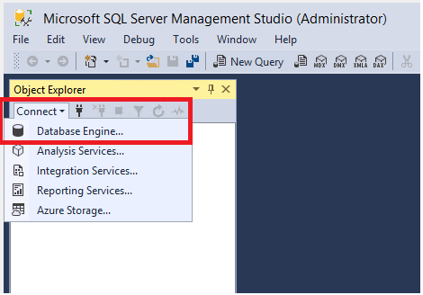
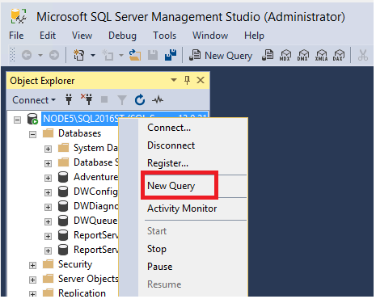
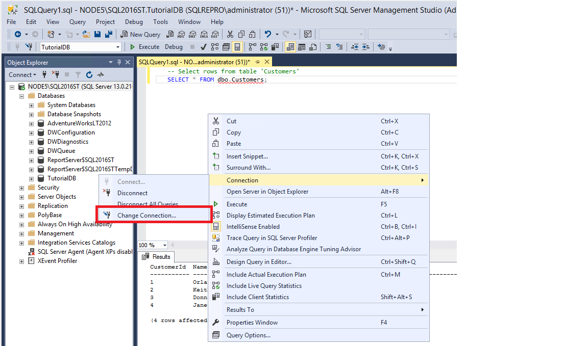

# Tutorial:: Connect and Query SQL Server using SQL Server Management Studio
This Tutorial teaches you how to use SQL Server Management Studio (SSMS) to connect to your SQL Server instance, and run some basic Transact-SQL (T-SQL) commands. This article demonstrates how to do the following:
    - [Connect to a SQL Server](#connect-to-a-sql-server)
    - [Create a new database (**TutorialDB**)](#create-a-database)
    - [Create a table (**Customers**) in your new database](#create-a-table)
    - [Insert rows into your new **Customers** table](#insert-rows)
    - [Query the **Customers** table and view the results](#view-query-results)
    - [Use the query window table to verify your connection properties](#verify-your-query-window-connection-properties)
    - [Change which server your query window is connected to](#change-server-connection-within-query-window)


## Prerequisites
To complete this Tutorial, you need SQL Server Management Studio and access to a SQL Server. 

- Install [SQL Server Management Studio](https://docs.microsoft.com/en-us/sql/ssms/download-sql-server-management-studio-ssms).

If you don't have access to a SQL Server, select your platform from the following links (make sure you remember your SQL Login and Password if you choose SQL Authentication!):
- [Windows - Download SQL Server 2017 Developer Edition](https://www.microsoft.com/en-us/sql-server/sql-server-downloads)
- [macOS - Download SQL Server 2017 on Docker](https://docs.microsoft.com/en-us/sql/linux/quickstart-install-connect-docker)


## Connect to a SQL Server

1. Start SQL Server Management Studio (SSMS).
1. The first time you run SSMS the **Connect to Server** dialog box opens. 
      - If the **Connect to Server** dialog doesn't open, it can be opened manually in  **Object Explorer** > **Connect**  (or icon next to it) > **Database Engine**.

        

1. In the **Connect to Server** dialog box, fill out your connection options: 

    - **Server type**: Database Engine (typically selected by default)
    - **Authentication**: Windows Authentication (this article uses Windows Authentication, but SQL Login is supported and will prompt you for a username / password if selected)

      

        You can also modify additional connection options (such as the database you're connecting to, the connection timeout value, and the network protocol) by clicking the **Options** button. For the purpose of this article, everything was left at the default values. 

1. Once the fields have been filled out, click on **Connect**. 

1. You can verify that your connection succeeded to your SQL Server by exploring the objects in **Object Explorer**: 

   


## Create a database
The following steps create a database named TutorialDB. 

1. Right-click your server in **Object Explorer** and select **New Query**:

   
   
1. Paste the following T-SQL code snippet into the query window: 
   ```sql
   USE master
   GO
   IF NOT EXISTS (
      SELECT name
      FROM sys.databases
      WHERE name = N'TutorialDB'
   )
   CREATE DATABASE [TutorialDB]
   GO
   ```
2. To execute the query, click on **Execute** (or press F5 on your keyboard). 

   
  
 
After the query completes, the new **TutorialDB** appears in the list of databases within **Object Explorer**. If you don’t see it, right-click the Databases node and select **Refresh**.  


## Create a Table
The following steps will now create a table in the newly created **TutorialDB** database. However, the query editor is still in the context of the *master* database, and you want to create a table in the *TutorialDB* database. 

1. Change the connection context of your query from the master database to **TutorialDB** by selecting the database you want from the database drop-down. 

   

1. Paste the following T-SQL code snippet into the query window, highlight it, and click  **Execute** (or press F5 on your keyboard): 
    - You can either replace the existing text in the query window or append it to the end. If you want to execute everything in the query window, click **Execute**. If you want to execute a portion of the text, highlight that portion, and then click **Execute**.  
  
   ```sql
   -- Create a new table called 'Customers' in schema 'dbo'
   -- Drop the table if it already exists
   IF OBJECT_ID('dbo.Customers', 'U') IS NOT NULL
   DROP TABLE dbo.Customers
   GO
   -- Create the table in the specified schema
   CREATE TABLE dbo.Customers
   (
      CustomerId        INT    NOT NULL   PRIMARY KEY, -- primary key column
      Name      [NVARCHAR](50)  NOT NULL,
      Location  [NVARCHAR](50)  NOT NULL,
      Email     [NVARCHAR](50)  NOT NULL
   );
   GO
   ```
After the query completes, the new **Customers** table appears in the list of tables in **Object Explorer**. If the table is not visible, right-click the **TutorialDB > Tables** node in **Object Explorer** and select **Refresh**.

## Insert rows
The following step will insert some rows into the **Customers** table that was previously created. 

Paste the following T-SQL code snippet into the query window and click **Execute**: 


   ```sql
   -- Insert rows into table 'Customers'
   INSERT INTO dbo.Customers
      ([CustomerId],[Name],[Location],[Email])
   VALUES
      ( 1, N'Orlando', N'Australia', N''),
      ( 2, N'Keith', N'India', N'keith0@adventure-works.com'),
      ( 3, N'Donna', N'Germany', N'donna0@adventure-works.com'),
      ( 4, N'Janet', N'United States', N'janet1@adventure-works.com')
   GO
   ```

## View Query Results
The results of a query are visible underneath the query text window. The below steps will allow you to query the **Customers** table and view the rows that were previously inserted.  

1. Paste the following T-SQL code snippet into the query window and click **Execute**: 

   ```sql
   -- Select rows from table 'Customers'
   SELECT * FROM dbo.Customers;
   ```
1. The results of the query are displayed under the area where text was entered: 

   


1.  You can modify the way results are presented by selecting one of these options:

     

    - By default, the results will be in **Grid View**, which is the middle button and shows the results in a table. 
    - The first button will display your results in **Text View**, as shown in the image in the next section.
    - The third button will allow you to save your results to a file, a file ending in *.rpt by default.

## Verify your query window connection properties
You can find information about the connection properties under the results of your query. 
- After running the aforementioned query from the previous step, review the connection properties at the bottom of the query window.
    - You can determine which server and database you're connected to, and the user  you're logged in with.
    - You can also see the query duration and the number of rows returned by the query executed earlier.
    
      
    In this image, the results are displayed in **Text View**.  

## Change server connection within Query Window
You can change which server your current query window is connected to by following these steps.
1. Right click within the query window > Connection > Change connection.
2. This will open the **Connect to Server** dialog box again, allowing you to change which server your query is connected to. 
 
   
   - Note that this does not change which server your **Object Explorer** is connected to, just the current query window. 


