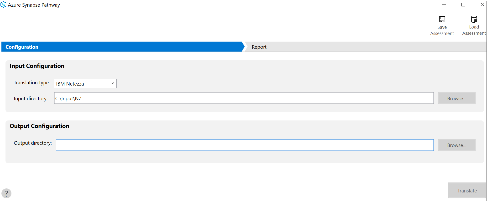
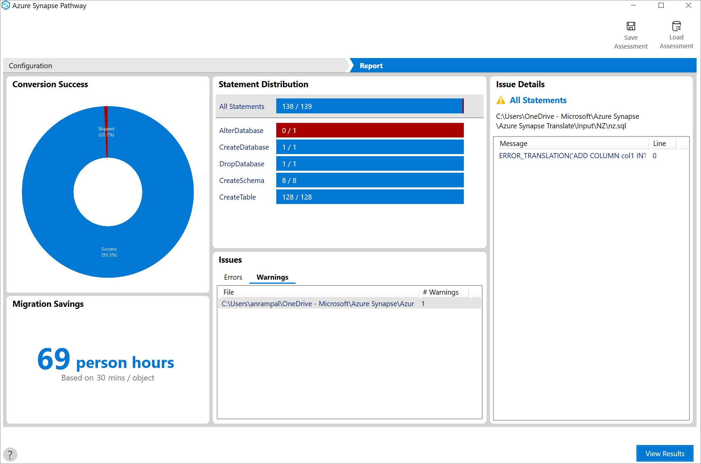
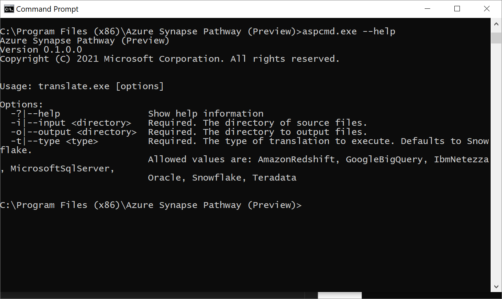
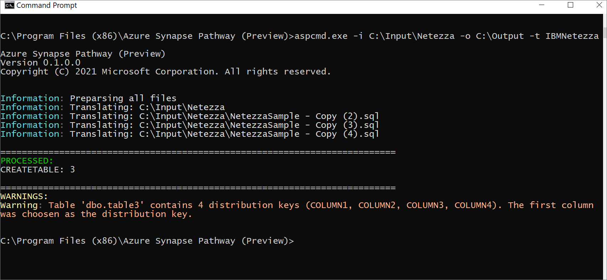

# Tutorial to perform your first code translation with Azure Synapse Pathway
[!INCLUDE [Azure Synapse Analytics](../../includes/applies-to-version/asa.md)]

Azure Synapse Pathway introduces support for translating schemas, tables, views, functions, etc. from **IBM Netezza**, **Microsoft SQL Server** and **Snowflake** into T-SQL complaint code that automates migration to Azure Synapse Analytics.

For more information, see [Azure Synapse Pathway overview](azure-synapse-pathway-overview.md).

In this tutorial, you learn how to:

> [!div class="checklist"]
> * Run your first translation of the SQL scripts in from your existing data warehouse to T-SQL scripts for Azure Synpase SQL 
> * Choose from one of the available sources
> * View the errors and warnings about objects that didn't get translated

## Prerequisites

To complete this tutorial, make sure you've installed [Azure Synapse Pathway](synapse-pathway-download.md). If you need an introduction, see [Azure Synapse Pathway overview](azure-synapse-pathway-overview.md).

## Run the translation

1. Launch the Azure Synapse Pathway MSI. 

1. Select from one of the available sources, the ones that will be added soon are grayed out.
1. In the Input directory folder, select browse and point the tool to the folder location of the **DDL** and **DML** scripts that need to be translated.

    > [!Note]
    > Only files with .sql extension can be provided as an input source. If the user provides DDL, DML scripts in .txt file, tool will not perform any translation.

1. When translating the Netezza code to Azure Synapse Analytics, choose IBM Netezza in the Translation Type drop down.
  

1. To select the output directory, select browse to specify the location where the output will be generated.
 

1. Select **Translate** to start the translation

## View Results

1. The duration of the assessment depends on the number of databases added and the schema size of each database. Results are displayed for each database as soon as they're available.
 

1. When you select view results, it will take you to the output directory specified in the previous step and you'll see the translated script file(s) based on your input directory structure.

1. It includes the project structure that can be easily committed to your GitHub repo.
  
1. A results file, which will have a list of errors and warnings, will be uploaded in the same output directory.

## Run the translation using command line
1. On installation, AspCmd.exe will be available in C:\Program Files (x86)\Azure Synapse Pathway
1. Launch the command prompt and go to the file location 
1. Type aspcmd.exe --help for a list of commands

  

4. You can start running the translations using the command line

 

## Next steps

[Learn how to save and load the assessment](tutorial-save-load-assessment.md)
